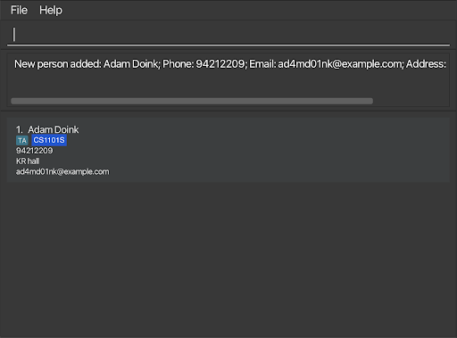

ProfNUS is a **desktop application which helps SOC Professors who have many modules with many students/TAs to manage.** It is optimized for users who prefer CLI over GUI so that frequent tasks can be done faster by typing in commands.

* Table of Contents
{:toc}

--------------------------------------------------------------------------------------------------------------------

## Quick start

1. Ensure you have Java `11` or above installed in your Computer.

1. Download the latest `ProfNUS.jar` from [here](https://github.com/AY2223S1-CS2103T-W11-2/tp/releases).

1. Copy the file to the folder you want to use as the _home folder_ for your ProfNUS application.

1. Double-click the file to start the app. The GUI similar to the below should appear in a few seconds. Note how the app contains some sample data. 
   

1. Type the command in the command box and press Enter to execute it. e.g. typing **`help`** and pressing Enter will open the help window. 
   Some example commands you can try:

   * **`list`** : Lists all contacts.

   * **`add`**`n/John Doe p/98765432 e/johnd@example.com a/John street, block 123, #01-01` : Adds a contact named `John Doe` to the ProfNUS application.

   * **`delete`**`3` : Deletes the 3rd contact shown in the current list.

   * **`clear`** : Deletes all contacts.

   * **`exit`** : Exits the app.

1. Refer to the [Features](#features) below for details of each command.

--------------------------------------------------------------------------------------------------------------------

## Features

**:information_source: Notes about the command format:** 

* Words in `UPPER_CASE` are the parameters to be supplied by the user. 
  e.g. in `add n/NAME`, `NAME` is a parameter which can be used as `add n/John Doe`.

* Items in square brackets are optional. 
  e.g `n/NAME [t/TAG]` can be used as `n/John Doe t/friend` or as `n/John Doe`.

* Items with `…`​ after them can be used multiple times including zero times. 
  e.g. `[t/TAG]…​` can be used as ` ` (i.e. 0 times), `t/friend`, `t/friend t/family` etc.

* Parameters can be in any order. 
  e.g. if the command specifies `n/NAME p/PHONE_NUMBER`, `p/PHONE_NUMBER n/NAME` is also acceptable.

* If a parameter is expected only once in the command but you specified it multiple times, only the last occurrence of the parameter will be taken. 
  e.g. if you specify `p/12341234 p/56785678`, only `p/56785678` will be taken.

* Extraneous parameters for commands that do not take in parameters (such as `help`, `list`, `exit` and `clear`) will be ignored. 
  e.g. if the command specifies `help 123`, it will be interpreted as `help`.

### Viewing help : `help`

Shows a message explaning how to access the help page.

Format: `help`

### Adding a person: `addstu`

Adds a person to the module.

Format: `add n/NAME p/PHONE_NUMBER e/EMAIL a/ADDRESS [t/TAG]…​ [m/MODULE]…​`

:bulb: **Tip:**
A person can have any number of tags or modules(including 0)

Examples:
* `add n/John Doe p/98765432 e/johnd@example.com a/John street, block 123, #01-01`
* `add n/Adam Doink t/TA e/ad4md01nk@example.com a/Kent Ridge Hall p/1234567 m/CS1101S`

### Adding a module: `madd`

Adds a module to the address book.

Format: `madd n/MODULE NAME c/MODULE CODE d/MODULE DESCRIPTION [t/TAG]…​ `

:bulb: **Tip:**
A person can have any number of tags or modules(including 0)

Examples:
* `madd n/Introduction to SWE c/CS2103T d/Teach students SWE principles and practices t/ModuleCoordinator`
* `madd n/Introduction to Cybersecurity c/CS2107 d/Cryptography practices t/IMPT t/URGENT`

### Listing all students : `list`

Shows a list of all the students in the module with their contact information in the application.

Format: `list MODULE_NAME [MORE_MODULE_NAMES]`
- The module name is case-insensitive. e.g CS1101S will match cs1101s
- Students matching at least one module will be returned
- Only exact module matches will be returned. e.g. CS1231 will not match CS1231S

Examples:
- `list CS1101S returns` Alex Yeoh and Bernice Yu
- `list CS1101S CS1231S` returns Bernice Yu only`

### Viewing list of modules : `mlist`

Shows a list of all modules in the ProfNUS application.

Format: `mlist`

### Editing a person : `edit`

Edits an existing person in the ProfNUS application.

Format: `edit INDEX [n/NAME] [p/PHONE] [e/EMAIL] [a/ADDRESS] [t/TAG]…​`

* Edits the person at the specified `INDEX`. The index refers to the index number shown in the displayed person list. The index **must be a positive integer** 1, 2, 3, …​
* At least one of the optional fields must be provided.
* Existing values will be updated to the input values.
* When editing tags, the existing tags of the person will be removed i.e adding of tags is not cumulative.
* You can remove all the person’s tags by typing `t/` without
    specifying any tags after it.

Examples:
*  `edit 1 p/91234567 e/johndoe@example.com` Edits the phone number and email address of the 1st person to be `91234567` and `johndoe@example.com` respectively.
*  `edit 2 n/Betsy Crower t/` Edits the name of the 2nd person to be `Betsy Crower` and clears all existing tags.

### Locating persons by name: `find`

Finds persons whose names contain any of the given keywords.

Format: `find KEYWORD [MORE_KEYWORDS]`

* The search is case-insensitive. e.g `hans` will match `Hans`
* The order of the keywords does not matter. e.g. `Hans Bo` will match `Bo Hans`
* Only the name is searched.
* Only full words will be matched e.g. `Han` will not match `Hans`
* Persons matching at least one keyword will be returned (i.e. `OR` search).
  e.g. `Hans Bo` will return `Hans Gruber`, `Bo Yang`

Examples:
* `find John` returns `john` and `John Doe`
* `find alex david` returns `Alex Yeoh`, `David Li` 
  

### Deleting a person : `delete`

Deletes the specified person from the ProfNUS application.

Format: `delete INDEX`

* Deletes the person at the specified `INDEX`.
* The index refers to the index number shown in the displayed person list.
* The index **must be a positive integer** 1, 2, 3, …​

Examples:
* `list` followed by `delete 2` deletes the 2nd person in the list of students.
* `find Betsy` followed by `delete 1` deletes the 1st person in the results of the `find` command.

### Deleting a module: `mdel`

Deletes a module stored in the address book.

Format: `mdel c/MODULE CODE`

Examples:
* `mdel c/CS2103T`

### Clearing all entries : `clear`

Clears all entries from the ProfNUS application.

Format: `clear`

### Exiting the program : `exit`

Exits the program.

Format: `exit`

### Saving the data

ProfNUS data are saved in the hard disk automatically after any command that changes the data. There is no need to save manually.

### Viewing your teaching schedule
ProfNUS data are saved as a JSON file `[JAR file location]/data/profnus.json`. Advanced users are welcome to update data directly by editing that data file.

:exclamation: **Caution:**
If your changes to the data file makes its format invalid, ProfNUS will discard all data and start with an empty data file at the next run.

### Add a teaching schedule `sadd`

Adds a schedule of a module in the adressbook. 

**Format**: `sadd m/MODULE_CODE w/WEEKDAY ct/PERIOD cc/CLASS_TYPE cv/VENUE `

- Adds a schedule with the module it belongs to, the weekday, the time period, the type of the class, and the venue.
- `MODULE_CODE` needs to abide by the [Module Code Format of NUS ](https://www.nus.edu.sg/registrar/docs/info/nusbulletin/AY201213_GeneralInformation.pdf) 
- The `WEEKDAY` should be one of `Monday`, `Tuesday`, `Wednesday`, `Thursday`, `Friday`, `Saturday` and `Sunday`.
- The `PERIOD` includes the start time and the end time which are both in the format of the *modern 24-hour clock*.
- The `CLASS_TYPE` should be one of `lec`, `tut`, `lab`, and `rec`, which represent lecture, tutorial, laborartory, and reflection respectively.

:exclamation: **Caution:**
Please make sure you have added the module with `MODULE_CODE` before you add any schedules with `MODULE_CODE`. Otherwise, address book will consider the command to be invalid.

:exclamation: **Caution:**
If the schedule to be added conflicts with any existing schedule, the address book will not perform any operation.

**Example**: `sadd m/CS2103T w/Wednesday ct/11:00-12:00 cc/tut cv/Zoom`

### Edit a schedule `sedit`

Edits a schedule in the adressbook. 

**Format**: `sedit INDEX [m/MODULE_CODE] [w/WEEKDAY] [ct/PERIOD] [cc/CLASS_TYPE] [cv/VENUE] `

- The `INDEX` needs to be a positive integer and refers to the index number shown in the displayed schedule list.
- At least one of the optional fields must be provided.
- All optional fileds must abide by the requirements given in the feature ***Add a schedule `sadd`***, if any.

**Example**: `sedit 3 w/Wednesday ct/09:00-10:00 cv/COM2-0218`

### Delete a schedule `sdelete`

Deletes a schedule from the address book.

**Format**: `sdelete INDEX`

- The `INDEX` needs to be a positive integer and refers to the index number shown in the displayed schedule list.

**Example**: `sdelete 2`

### View your teaching schedule: `view schedule`

**Syntax**: `view schedule [-w WEEKDAY] [-m MODULE_CODE] [-d DATE] [-h] [-v]`

- `-w WEEKDAY` option shows your schedule on the `WEEKDAY`. `WEEKDAY` should be one of `Monday`, `Tuesday`, `Wednesday`, `Thursday`, `Friday`, `Saturday` and `Sunday`.
- `-m MODULE_NAME` option shows your weekly schedule of `MODULE_CODE`.
- `-d DATE` option shows your schedule on the `DATE`. `DATE` should comply with the format `yyyy-mm-dd`
- `-h` option shows your schedule table in a horizontal mode (time will be columns and weekdays will be rows).
- `-v` options shows your schedule table in a vertical mode (weekdays will be columns and time will be rows).
- The result will be a timetable in vertical mode by default if no option is specified.

**Notes about the syntax**:

- `-w WEEKDAY` option and `-d DATE` option cannot be used at the same time.
- If either `-w WEEKDAY`, `-m MODULE_NAME` or `-d DATE` is used, the result won't be a timetable. Instead, it will be shown as a list of slots.
- `-h` and `-v` options can only be used when the result is shown as a timetable.
- `-h` option and `-v` option cannot be used at the same time.

**Examples**:

- `view schedule -w Monday -m CS2103T`

  

- `view schedule -d 2022-09-12`

  

- `view schedule -h` 

  

### Finding a student

Finds a student based on some keywords, with all information showing up.

Format: `find keyword`

**Tip:** Keyword  person can have any number of tags or modules (including 0).

**Tip:** The result is a list of persons which keywords matching with their name, phone number or email.

**Example** 

- `find Adam Do`

  

### Archiving data files `[coming in v2.0]`

_Details coming soon ..._

--------------------------------------------------------------------------------------------------------------------

## FAQ

**Q**: How do I transfer my data to another Computer? 
**A**: Install the app in the other computer and overwrite the empty data file it creates with the file that contains the data of your previous ProfNUS home folder.

--------------------------------------------------------------------------------------------------------------------

## Command summary

| Action                     | Format                                                               | Example                                                                                                                                                                     |
|----------------------------|----------------------------------------------------------------------|-----------------------------------------------------------------------------------------------------------------------------------------------------------------------------|
| add a person               | `add n/NAME p/PHONE_NUMBER e/EMAIL a/ADDRESS [t/TAG]…​ [m/MODULE]…​` | `add n/John Doe p/98765432 e/johnd@example.com a/John street, block 123, #01-01`   `add n/Adam Doink t/TA e/ad4md01nk@example.com a/Kent Ridge Hall p/1234567 m/CS1101S` |
| edit a person              | `edit INDEX [n/NAME] [p/PHONE] [e/EMAIL] [a/ADDRESS] [t/TAG]…​`      | `edit 1 p/91234567 e/johndoe@example.com`   `edit 2 n/Betsy Crower t/`                                                                                                   |
| delete a person            | `delete INDEX`                                                       | `delete 1`                                                                                                                                                                  |
| clear                      | `clear`                                                              | `clear`                                                                                                                                                                     |
| add a module               | `madd`                                                               | `madd CS2100`                                                                                                                                                               |
| list modules               | `list MODULE_NAME [MORE_MODULE_NAMES]`                               | `list CS1101S`  `list CS1101S CS1231S`                                                                                                                                   |
| list all modules           | `mlist`                                                              | `mlist`                                                                                                                                                                     |
| view the teaching schedule | `view schedule [-w WEEKDAY] [-m MODULE_CODE] [-d DATE] [-h] [-v]`    | `view schedule -w Monday -m CS2103T`  `view schedule -d 2022-09-12`   `view schedule -h`                                                                              |
| find a person              | `find KEYWORD [MORE_KEYWORD]`                                        | `find Adam Do`                                                                                                                                                              |
| help                       | `help`                                                               | `help`                                                                                                                                                                      | 
| exit                       | `exit`                                                               | `exit`                                                                                                                                                                      | 

