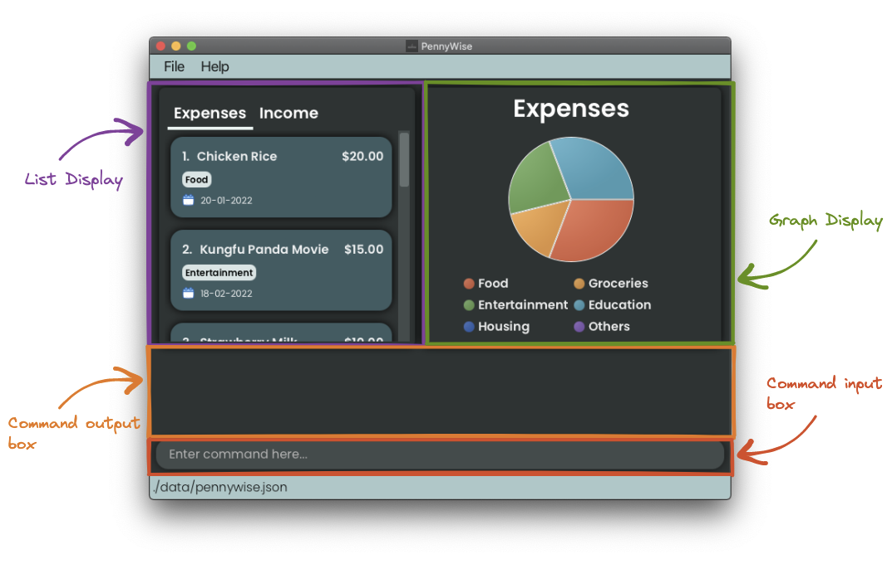
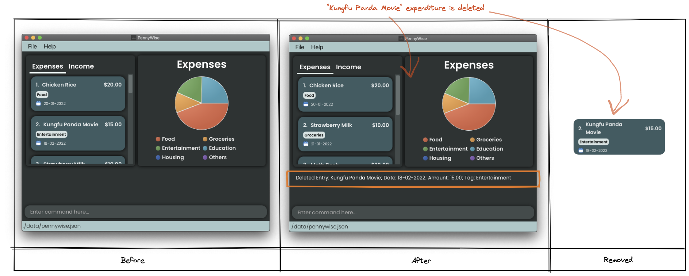
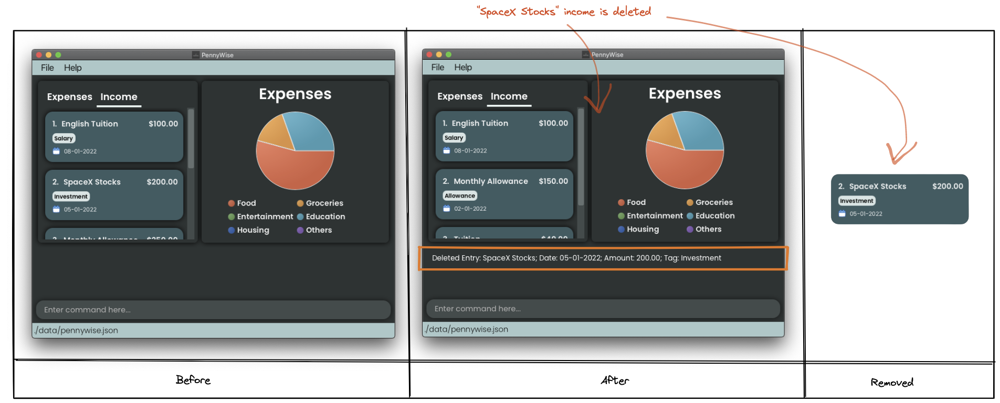
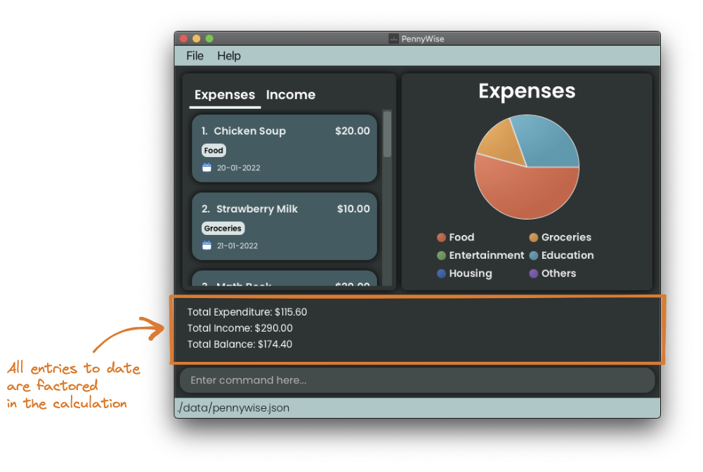

# PennyWise User Guide
Well, hello there! Welcome to your personal budgeting assistant, PennyWise.
After this guide, you will understand how to use PennyWise, and spend every penny wisely. 🤑

## Introduction

PennyWise is a desktop application that **empowers students with the ability to make informed financial decisions**,
by providing a **graphical analysis of their financial activities**.
It provides a clean Graphical User Interface (GUI) for easy comprehension of expenditure and savings.
_Interested?_ Head over to [Quick Start](#quick-start) to get started. Enjoy!

:information_source: **Info:**
Already an expert? Jump right straight to the [features](#features) section to see how you can get the most out of PennyWise!

# Table of Contents

<!-- TOC -->
* [Purpose of Guide](#purpose-of-guide)
* [How to use this User Guide](#how-to-use-this-user-guide)
  * [Information Box](#information-box)
  * [Tip Box](#tip-box)
  * [Danger Box](#danger-box)
  * [Formatting](#formatting)
* [Quick start](#quick-start)
* [Before Using PennyWise](#before-using-pennywise)
  * [What is an Entry](#what-is-an-entry)
  * [Familiarising yourself with the interface](#familiarising-yourself-with-the-interface)
* [Understanding the command formats](#understanding-the-command-formats)
  * [Categorising your expenses and income](#categorising-your-expenses-and-income)
  * [Guidelines on organising your expenses and income](#guidelines-on-organising-your-expenses-and-income)
* [Features](#features)
  * [Adding entries:](#adding-entries)
    * [Add an expense entry to the expenditure list](#add-an-expense-entry-to-the-expenditure-list)
    * [Add an income entry to the income list](#add-an-income-entry-to-the-income-list)
  * [Editing entries:](#editing-entries)
    * [Edits expenditure with specified fields](#edits-expenditure-with-specified-fields)
    * [Edits income with specified fields](#edits-income-with-specified-fields)
  * [Deleting entries:](#deleting-entries)
    * [Delete an expense from the expenditure list](#delete-an-expense-from-the-expenditure-list)
    * [Delete an income from the income list](#delete-an-income-from-the-income-list)
  * [Summary of entries:](#summary-of-entries)
    * [Summary of all entries in the currently shown list](#summary-of-all-entries-in-the-currently-shown-list)
    * [Summary of all entries the specified month](#summary-of-all-entries-the-specified-month)
  * [View entries by category:](#view-entries-by-category)
  * [View entries by month:](#view-entries-by-month)
  * [Clearing all entries:](#clearing-all-entries)
  * [Exiting the program:`](#exiting-the-program)
  * [Saving the data](#saving-the-data)
  * [Editing the data file](#editing-the-data-file)
* [FAQ](#faq)
* [Command summary](#command-summary)
<!-- TOC -->

## Purpose of Guide
This guide aims to teach those entirely new to PennyWise how to navigate and utilise the application. It can also 
provide experienced users or users familiar with similar command-line applications tips on how to maximise efficiency
when using PennyWise. 

## How to use this User Guide
These are some icons you may see throughout our user guide.

### Information Box

:information_source: **Info:**
This provides some additional information that users are recommended to know.

### Tip Box

:bulb: **Tip:**
This provides some quick and convenient hacks that you can use to optimize your experience with PennyWise.

### Danger Box

:exclamation: **Warning**
Danger zone! Do pay attention to the information here carefully.

### Formatting

- `Highlights` are used to denote commands or output from the application.

    <a href="#top">Back to Top </a>

## Quick start
If you are unfamiliar with using command prompt, head to this [link](https://www.freecodecamp.org/news/command-line-for-beginners/).
1. Ensure you have Java 11 or above installed in your Computer. You can check whether Java 11 is installed by following
   the instructions below:
    1. Open your terminal / command prompt window in your computer.
    2. Run the following command: `java -version`
    3. If Java 11 is not installed, please download Java 11 from [Oracle](https://www.oracle.com/java/technologies/downloads/#java11).
       For Mac users, you may use the [Azul build of
       OpenJDK 11 (JDK FX) version](https://www.azul.com/downloads/?version=java-11-lts&os=macos&architecture=arm-64-bit&package=jdk-fx).
2. Download the latest [pennywise.jar](https://github.com/AY2223S1-CS2103T-W17-2/tp/releases) application file.
3. Copy the file to the folder you want to use as the home folder for PennyWise.
4. Double-click the file to start the app. You should see a user interface similar to what is shown below in a few seconds.
   - The application contains some sample data that provides some examples on how you can use the application.

   
5. Type the command in the [command box](#familiarising-yourself-with-the-interface) and press Enter to execute it. e.g. typing **`help`** and pressing Enter will
   open the help window. 
   Some example commands you can try:

    - **`add`**`t/i d/Tution Teaching a/45.00 da/13-10-2022 c/Salary`: Adds an income entry
      with the description `Tuition Teaching` to the PennyWise application.

    - **`delete`**`3 t/e`: Deletes the 3rd entry shown in the expenditure list.

    - **`view`**`t/e`: View a Pie Chart of all expenses.

    - **`view`**`t/e mo/2022-08`: View a Line Graph of all expenses on August 2022.

    - **`clear`**: :exclamation: Deletes all entries.

    - **`exit`** : Exits the app.

6. Congrats! You are now ready to get started on your first steps in supercharging your financial management flow!

:information_source: **Info:**
Curious about the various commands? Refer to the [Features](#features) below to find out more about each command.

    <a href="#top">Back to Top </a>

---

## Before Using PennyWise

### What is an Entry

Think of PennyWise as a budgeting diary that has infinite number of pages. You can write as much data as you want 
to track your expenditure or income, PennyWise will keep track of them. An entry is what PennyWise terms as a 
particular expenditure or income logged into the application. PennyWise defines an expenditure and income as things that
you spend money on, and things that make you money respectively!

An entry is defined by the following items:

* Type: whether it is an expenditure or income
* Description: what is this particular entry about
* Amount: what was the amount associated with this particular entry
* Date: when was this entry logged in PennyWise
* Category: how this entry is classified

### Familiarising yourself with the interface

To familiarise yourself with our user interface, please refer to the following diagram and table to get comfortable with the application.

|                                       `Component`                                        |                                                       `Explanation`                                                        |
|:----------------------------------------------------------------------------------------:|:--------------------------------------------------------------------------------------------------------------------------:|
|          |            where you view your entry lists (Expenditure or Income)   - can be modified by the `view` command            |
|         | where you view your entries in a graphical overview (Pie Chart or Line Graph)   - can be modified by the `view` command |
|   |                                       where you enter your commands to use PennyWise                                       |
|  |                                  where you see the output of your commands from PennyWise                                  |

:exclamation: **Warning**
If the application is resized to a smaller screen, certain graphical components will no longer be visible. This is to ensure that
that you are still able to get an overview of your finances. If these details are important, use PennyWise in fullscreen!

1. Pie Chart Legend  
- The Pie Chart Legend would not be visible should the application be of a smaller size. This ensures your categorical overview
  can still be seen at a glance!
  

2. Line Graph Dates
- Certain Line Graph dates would not be visible should the application be of a smaller size. This ensures you are still
  able to view the linear trend of your entries can still be seen.
  

## Understanding the command formats
All commands follow this format except: [`delete`](#deleting-entries--delete-index_of_entry-tentry_type), 
[`clear`](#clearing-all-entries--clear), [`exit`](#exiting-the-program--exit) and `help`. 
<pre>
    command | entry identifier | input | [optional inputs]
</pre>

For example, given the command `add t/e d/Lunch a/15.60 da/15-08-2022 c/Food`, let us decompose the command format step-by-step!

|      Format      |                Example                 |
|:----------------:|:--------------------------------------:|
|     Command      |                 `add`                  |
| Entry Identifier |                 `t/e`                  |
|      Input       | `d/Lunch a/15.60 da/15-08-2022 c/Food` |
|  Optional Input  |                  NIL                   |

- Letters followed by a forward slash is called a prefix and will be used to specify a specific parameter 
  e.g `t/ ` refers to the entry type parameter.

- Words in `UPPER_CASE` are the parameters that you must supply 
  e.g. In `delete INDEX_OF_ENTRY t/ENTRY_TYPE`, `INDEX_OF_ENTRY` is a parameter which can be used as `delete 10 t/e`.

- Items in square brackets are optional. 
  e.g. `view t/ENTRY_TYPE [MONTH]` can be used as `view t/e mo/2022-05` or as `view t/e`.

- **ALL** identifiers are <ins>case-sensitive</ins>.
  e.g `d/Lunch` as a descriptor for "Lunch" is accepted by PennyWise, however `D/Lunch` would not be accepted.

### Categorising your expenses and income

For **ALL** entries, categories are <ins>COMPULSORY</ins> and every entry can only contain <ins>one</ins> category.
  The following table shows the`Expenditure` and `Income` entries categories. The category names are <ins>case-insensitive</ins>.

|   `Expenditure`   |    `Income`     |
|:-----------------:|:---------------:|
|     **Food**      |   **Salary**    |
|   **Groceries**   |  **Allowance**  |
| **Entertainment** |   **Profit**    |
|   **Education**   | **Investments** |
|    **Housing**    |    **Gifts**    |
|    **Others**     |   **Others**    |

For example, an expense entry can be tagged with `Food`, but not `Salary`.

### Guidelines on organising your expenses and income

For **ALL** entries, 2 entries are considered duplicates <ins>IF</ins> both entries have exactly the same:
`description`, `date` `amount` and `category`. We do not want PennyWise to be managing entries which are a repeat,
of one another, as it would be easier to simply use the [edit](#editing-entries-edit-index_of_entry-tentry_type-dedited_description-aedited_amount-daedited_date-cedited_category)
command to alter the original entry's specifications.

In addition `description` and  `food` are case-insensitive, this means that `FOOD` will be equivalent to `food`

For example, when executing the following [add commands](#adding-entries-add-tentry_type-ddescription-aamount-dadate-ccategory) one after another,
PennyWise will recognise (2), which is the second `Teh Beng` added as a duplicate entry.

<pre>
    <code>
        1. add t/e d/Teh Beng a/1.50 da/22-10-2022 c/food
        2. add t/e d/teh beng a/1.50 da/22-10-2022 c/Food
    </code>
</pre>

To add similar entries, vary the description/amount/date/category to let PennyWise know they are not duplicates!

<pre>
    <code>
        1. add t/e d/Teh Beng 11am a/1.50 da/22-10-2022 c/Food
        2. add t/e d/Teh Beng 4pm a/1.50 da/22-10-2022 c/Food
    </code>
</pre>

OR we could even [edit](#editing-entries-edit-index_of_entry-tentry_type-dedited_description-aedited_amount-daedited_date-cedited_category) the original entry directly to reflect 2 cups of `Teh Beng` consumed.

<pre>
    <code>
        1. edit 1 t/e d/2 Teh Beng 11am a/3.00 da/22-10-2022 c/Food
    </code>
</pre>

:information_source: **Info:**
Having multiple duplicate entries will make it difficult for you to track your expenses later on, and could clutter the list.
Having them differentiated will make it easier for you to recall what you spent your money on!

    <a href="#top">Back to Top </a>

## Features

### Adding entries
Format: `add t/ENTRY_TYPE d/DESCRIPTION a/AMOUNT da/DATE c/CATEGORY`  
Adds an entry to the specified list.

| Input               | Explanation                                                                                  |
|---------------------|----------------------------------------------------------------------------------------------|
| **`t/ENTRY_TYPE`**  | An entry type refers to either `e` for "Expenditure" or `i` for "Income"                     |
| **`d/DESCRIPTION`** | Description for the entry that you are adding                                                |
| **`a/AMOUNT`**      | Amount of the entry, formatted to 2 decimal places                                           |
| **`da/DATE`**       | Date where the entry is added in `dd-mm-YYYY` format, e.g. `01-01-2022` for 1st January 2022 |
| **`c/CATEGORY`**    | [Category](#categorising-your-expenses-and-income) that the entry belongs to                 |

#### Add an expense entry to the expenditure list
- Example: `add t/e d/Lunch a/15.60 da/10-10-2022 c/Food`
  - Here, we record our $15.60 `Lunch` expenses on 10th October 2022, and tag the entry under `Food`.
- Expected: `New entry added: Lunch; Date: 10-10-2022; Amount: 15.60; Tag: Food`

#### Add an income entry to the income list
- Example: `add t/i d/Tuition a/40.00 da/10-10-2022 c/Salary`
  - Here, we record our $40.00 income from `Tuition` on 10th October 2022 and tag the entry under `Salary`.
- Expected: `New entry added: Tuition; Date: 10-10-2022; Amount: 40.00; Tag: Salary`

### Editing entries
Format: `edit INDEX_OF_ENTRY t/ENTRY_TYPE [d/EDITED_DESCRIPTION a/EDITED_AMOUNT da/EDITED_DATE c/EDITED_CATEGORY]`  
Edits an entry, where at least **1** of the optional fields description/amount/date/category must be present.

| Input                        | Explanation                                                                                          |
|------------------------------|------------------------------------------------------------------------------------------------------|
| **`t/ENTRY_TYPE`**           | An entry type refers to either `e` for "Expenditure" or `i` for "Income"                             |
| **`[d/EDITED_DESCRIPTION]`** | Updated description for the entry that you are editing                                               |
| **`[a/EDITED_AMOUNT]`**      | Updated amount of the entry, formatted to 2 decimal places                                           |
| **`[da/EDITED_DATE]`**       | Updated date where the entry is added in `dd-mm-YYYY` format, e.g. `01-01-2022` for 1st January 2022 |
| **`[c/EDITED_CATEGORY]`**    | Updated [category](#categorising-your-expenses-and-income) that the entry belongs to                 |

#### Edits expenditure with specified fields
- Example: `edit 1 t/e d/Chicken Soup`
    - The expenditure at the 1st position will have its description edited from `Chicken Rice` to `Chicken Soup`.
- Expected: `Edited Entry: Chicken Soup; Date: 20-01-2022; Amount: 20.00; Tag: Food`

#### Edits income with specified fields
- Example: `edit 2 t/i a/150.00 da/22-10-2022`
    - The income at the 2nd position will have its amount and date edited
- Expected: `Edited Entry: Monthly Allowance; Date: 02-01-2022; Amount: 150.00; Tag: Allowance`

### Deleting entries
Format:  `delete INDEX_OF_ENTRY t/ENTRY_TYPE`  
Deletes an entry from the specified list.

| Input                | Explanation                                                                                                   |
|----------------------|---------------------------------------------------------------------------------------------------------------|
| **`INDEX_OF_ENTRY`** | Position of the entry that you wish to delete from the specified list, where the first entry is at position 1 |
| **`t/ENTRY_TYPE`**   | An entry type refers to either `e` for "Expenditure" or `i` for "Income"                                      |

#### Delete an expense from the expenditure list

- Example: `delete 2 t/e` deletes the 2nd item on the expenditure list.
  - Here, we want to delete the `Kungfu Panda Movie` expenditure entry, which is the 2nd entry in the expenditure list.
- Expected: `Deleted Entry: Kungfu Panda Movie; Date: 18-02-2022; Amount: 15.00; Tag: Entertainment`

#### Delete an income from the income list

- Example: `delete 2 t/i` deletes the 2nd item on the income list.
  - Here, we want to delete the `SpaceX Stocks` income entry, which is the 2nd entry in the income list.
- Expected: `Deleted Entry: Allowance; Date: 12-09-2022; Amount: 100.00 Tag: Allowance`

### Summary of entries
Format: `summary [mo/MONTH]`  
To summarise the entries in PennyWise, we compute 3 simple statistic to let you have a quick overview of your expenditure and income.

| Statistic             | Explanation                                                 |
|-----------------------|-------------------------------------------------------------|
| **Total Expenditure** | Sums up all the expenditure amounts                         |
| **Total Income**      | Sums up all the income amounts                              |
| **Total Balance**     | Amount of income left after deducting the total expenditure |

The command format is provided below:

| Input            | Explanation                                                                                                                     |
|------------------|---------------------------------------------------------------------------------------------------------------------------------|
| **`[mo/MONTH]`** | Allows you to customize the summary statistic to only consider entries in a specified month in `YYYY-mm` format, e.g. `2022-01` |

#### Summary of all entries in the currently shown list

- Example: `summary`
- Expected:
    <pre>
       Total Expenditure: $154.49
       Total Income: $250.00
       Total Balance: $95.51
    </pre>

#### Summary of all entries the specified month

- Examples: `summary mo/2022-10`
- Expected:
    <pre>
          Financials Summarized
          Total Expenditure: $4.20
          Total Income: $250.00
          Total Balance: $245.80
    </pre>

- Provides a financial summary recorded by the user in a month. The month refers to the month that is displayed to the user.
- The `MONTH` field is optional, if no month is specified, the application displays the summary for all entries.

### View entries by category
Format: `view t/ENTRY_TYPE`

| Input              | Explanation                                                              |
|--------------------|--------------------------------------------------------------------------|
| **`t/ENTRY_TYPE`** | An entry type refers to either `e` for "Expenditure" or `i` for "Income" |

1. View a Pie Chart of all expenditures by categories
   - Examples: `view t/e`
   - Expected: `Show graphically all expenditure by category` and a Pie Chart on the right of the application.

   

2. View a Pie Chart of all incomes by categories
   - Examples: `view t/i`
   - Expected: `Show graphically all income by category` and a Pie Chart on the right of the application

### View entries by month
Format: `view t/ENTRY_TYPE mo/MONTH`

| Input              | Explanation                                                                              |
|--------------------|------------------------------------------------------------------------------------------|
| **`t/ENTRY_TYPE`** | An entry type refers to either `e` for "Expenditure" or `i` for "Income"                 |
| **`mo/MONTH`**     | Allows you to view only entries in a specified month in `YYYY-mm` format, e.g. `2022-01` |

1. View a Line Graph of all expenditures in a specified month
   - Examples: `view t/e mo/2022-01` where we specify the month to be January 2022.
   - Expected: `Show graphically all expenditure by month` and a Line Graph on the right of the application

   

2. View a Line Graph of all incomes in a specified month
   - Examples: `view t/i mo/2022-01`
   - Expected: `Show graphically all income by month` and a Line Graph on the right of the application

- The `MONTH` field is optional. If a month is specified, the entry details for the corresponding month is shown, accompanied by a Line Graph on the right of the application. If no month is specified, the application displays an error.

### Clearing all entries
Format: `clear`  
Clears all entries in PennyWise.

:exclamation: **Caution:**
Danger zone! This command is irreversible- it is not possible to retrieve entries that are cleared.

### Exiting the program
Format: `exit`  
Exits the program.

### Saving the data

PennyWise data are saved in the hard disk automatically after any command that changes the data. There is no need to save manually.

### Editing the data file

PennyWise data are saved as a file `[JAR file location]/data/pennywise.json`.
Advanced users with knowledge about JSON file format are welcome to update data directly by editing that data file.

:exclamation: **Caution:**
If your changes to the data file makes its format invalid, PennyWise will discard all data and start with an empty data file at the next run.

    <a href="#top">Back to Top </a>

---

## FAQ
**Q**: Can I use PennyWise without internet?  
**A**: Absolutely! In fact, PennyWise is meant to be used as a offline application. This means that your personal data will be even more secure as well!

**Q**: How do I transfer my data to another Computer?  
**A**: Install the app in the other computer and overwrite the empty data file it creates with the file that contains
the data of your previous PennyWise home folder.

**Q**: Why is my edit and delete command invalid? I am sure i included all the required parameters.  
**A**: Make sure that your `INDEX_OF_ENTRY` is the first parameter after the command word

**Q**: I want to have a `Medical` category to log my expenses. Is there anyway I can do it?  
**A**: The categories for income and expenses entries are fixed.
However we are exploring the possibilities of user added categories so do look out for our software updates!

**Q**: Why are there missing dates on my Line Graph?  
**A**: PennyWise automatically removes certain elements to ensure you can still get an overview of your finances!
If you want to view all the dates enlarge your application!

**Q**: I prefer a date format like 4 Apr 2022. Why can't I pick the date format I want to use ?  
**A**: Unfortunately PennyWise current only accepts one type of format which is `04-04-2022`.
However, we are exploring the possibilities of allowing more types of date formats
without compromising on quality and user experience so do look out for our future software updates!

    <a href="#top">Back to Top </a>

---

## Command summary

| Action              | Format, Examples                                                                                                                                        |
|---------------------|---------------------------------------------------------------------------------------------------------------------------------------------------------|
| **Add**             | `add t/ENTRY_TYPE d/DESCRIPTION a/AMOUNT da/DATE c/CATEGORY`   e.g. `add t/e d/Lunch a/15.60 da/10-10-2022 c/Food`                                   |
| **Delete**          | `delete INDEX_OF_ENTRY t/ENTRY_TYPE`   e.g. `delete 2 t/e`                                                                                           |
| **Edit**            | `edit INDEX_OF_ENTRY t/ENTRY_TYPE [d/EDITED_DESCRIPTION a/EDITED_AMOUNT da/EDITED_DATE c/EDITED_CATEGORY]`  e.g. `edit 2 t/i a/150.00 da/22-10-2022` |
| **Summary**         | `summary [mo/MONTH]`  e.g. `summary mo/2022-09`                                                                                                      |
| **View (Category)** | `view t/ENTRY_TYPE`   e.g. `view t/e`                                                                                                                |
| **View (Month)**    | `view t/ENTRY_TYPE mo/MONTH`   e.g. `view t/i mo/2022-10`                                                                                            |
| **Clear**           | `clear`                                                                                                                                                 |
| **Exit**            | `exit`                                                                                                                                                  |

    <a href="#top">Back to Top </a>

