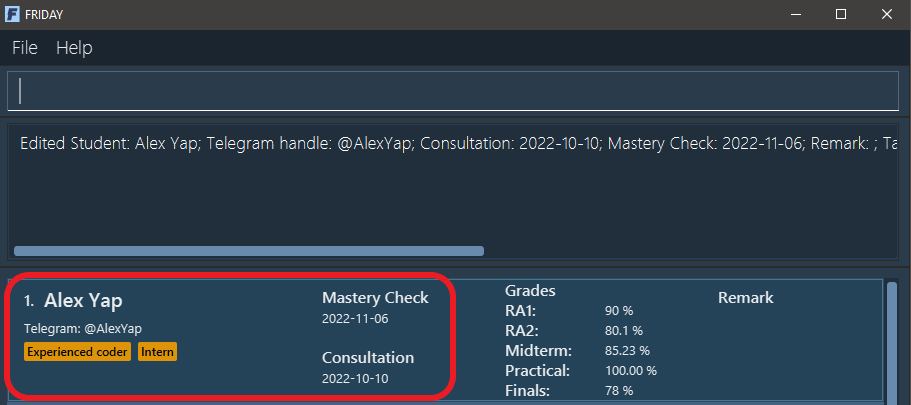
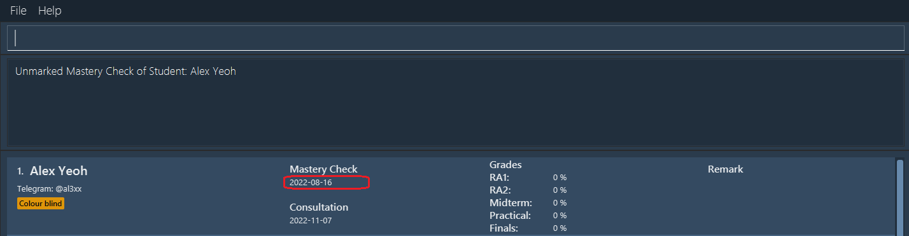
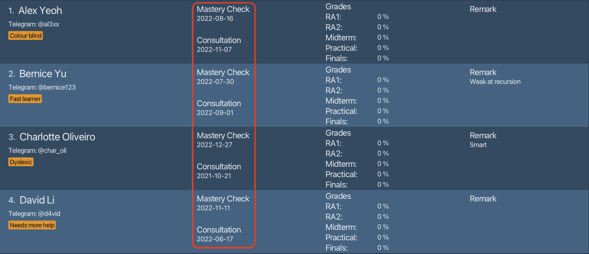
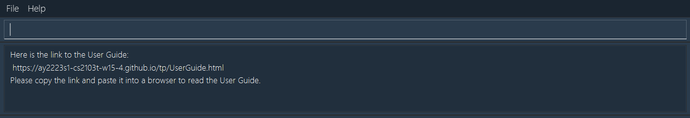
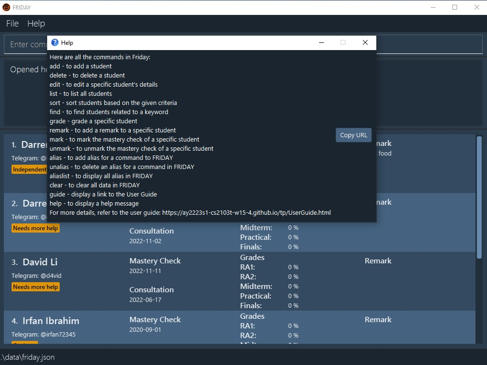
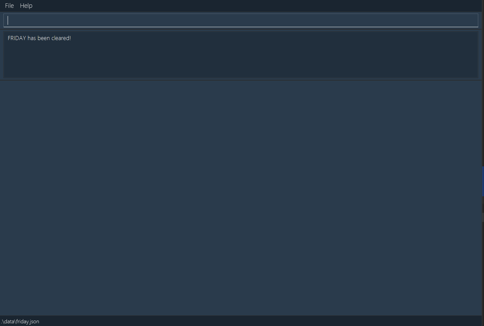

## Table of Contents
* Table of Contents
{:toc}

--------------------------------------------------------------------------------------------------------------------

## Introduction

Welcome to the User Guide of **FRIDAY**!

As a [CS1101S teaching assistant](#glossary), do you find yourself scrambling between your notes, students' contacts, 
and calendar to consolidate and manage of all your students' information? Do you spend hours consolidating your students'
work, keeping track of their progress and ensuring that they are coping well in the module?

Worry no more! Our application, **FRIDAY**, will reduce the hassle of managing your students and save you valuable time
and effort by alleviating your workload. You can spend more time focusing on your own studies, improving your 
teaching methods, and provide a better learning experience for your students!

**FRIDAY** is an intuitive and easy-to-use application that helps CS1101S teaching assistants consolidate
their students' information - such as contact details, grades, consultation dates, and assignments - into a single 
application.

The application is optimised for use via a [Command Line Interface (CLI)](#glossary), while having the benefits of a 
[Graphical User Interface (GUI)](#glossary). This means that you can operate the application by typing and inputting 
commands into a Command Box. If you are fast at typing, **FRIDAY** can get your student management tasks done faster 
than other GUI applications. As a GUI application, it also allows users to interact with the application through 
interactive graphical icons such as buttons.

If you are interested to try, jump to [Quick Start](#quick-start) to learn how to start using **FRIDAY**!

--------------------------------------------------------------------------------------------------------------------

## Quick start

This section guides you along the process of downloading and opening FRIDAY.

1. Ensure you have [Java](#glossary) 11 or above installed in your computer.

2. Download the latest [JAR](#glossary) file `friday.jar` from [here](https://github.com/AY2223S1-CS2103T-W15-4/tp/releases).

3. Copy the file to the folder you want to use as the *[home folder](#glossary)* for FRIDAY.

4. Double-click the file to start the app. The GUI similar to the one below should appear in a few seconds. Note how the app contains some sample data. 

5. Type the [command](#glossary) in the command box and press Enter to execute it. e.g. typing **`help`** and pressing Enter will open the help window. 
   Some example commands you can try:
    * **`add n/Alex Yeoh t/al3xx c/2022-10-25`** : Adds a student named `Alex Yeoh` to FRIDAY.

    * **`list`** : Lists all students.

    * **`delete 2`** : Deletes the 2nd student shown in the current list.

    * **`clear`** : Deletes all students.

    * **`exit`** : Exits FRIDAY.

6. Refer to the [Features](#features) below for details of each command.

[Back to top](#table-of-contents)

--------------------------------------------------------------------------------------------------------------------

## About
### Document Structure
This User Guide has been structured in a way to help you find information easily and quickly. In the next subsection,
 you can find a multitude of tips on how to use this User Guide. The following sections documents the main features of FRIDAY.

1. [Student Management](#student-management)
2. [Grading Students](#grading-students)
3. [Organizing Students](#organizing-students)
4. [Advanced Features](#advanced-features)
5. [Miscellaneous Features](#miscellaneous-features)

### Reading This Document
This section on reading the document will introduce you to some technical terms and formats that will be used throughout the guide.
Please make yourself familiar with the content here before moving to other sections in this user guide.

#### Understanding The GUI

Below depicts the [GUI](#glossary) of FRIDAY which is annotated with a description of each GUI component

<i> GUI Layout</i>

#### Understanding Symbols And Syntax

The table explains the general syntax and common occurrences throughout the user guide

| Syntax                         | Meaning and usage                                                                                                   |
|--------------------------------|---------------------------------------------------------------------------------------------------------------------|
| `Sample command`               | A white color highlighted box specifying an executable command that can be entered in the command box               |
| CAPITALIZED TEXT               | Indicates a parameter that follows the first word of a command                                                      |
| *italics*                      | Indicates that the text has a definition specific to FRIDAY, or it is a caption for a Figure in the guide           |
| **:information_source: Info:** | The icon indicates a section of increased importance and provides essential information to the smooth use of FRIDAY |
| **:bulb: Tip:**                | A quick memorable form of advice to the user to make their friday experience enjoyable                              |
| **:exclamation: Caution:**     | A warning sign indicating that the following text is important                                                      |

#### Understanding Command Terms And General Information

Some terms that you may encounter along the way may confuse you. To help you understand all these terms this user guide has a dedicated [glossary](#glossary) section with all the key terms 
and hyperlinks to the first occurrence of the word in each section of the User guide.

**:information_source: Notes about CLI:** 

  <i> GUI Layout</i> 
In this image above we have a labelled box in red called the command box.
You can type commands into the command box at the top of the screen, and press `Enter` on your keyboard to execute it. 
e.g. Typing `help` and pressing `Enter` will open a help window.

**:information_source: Notes about the command format:** 

* Words in `UPPER_CASE` are the [parameters](#glossary) to be supplied by the user. 

  e.g. in `add n/NAME`, `NAME` is a parameter which can be used as `add n/John Doe`.

* Items in square brackets are optional. 

  e.g. `n/NAME [t/TELEGRAM_HANDLE]` can be used as `n/John Doe t/johndoe` or as `n/John Doe`.

* Items with `…`​ after them can be used multiple times including zero times. 

  e.g. `[tag/TAG]…​` can be used as ` ` (i.e. 0 times), `tag/fast learner`, `tag/fast learner tag/good at recursion` etc.

* Parameters can be in any order. 

  e.g. if the command specifies `n/NAME t/TELEGRAM_HANDLE`, `t/TELEGRAM_HANDLE n/NAME` is also acceptable.

* If a parameter is expected only once in the command, but you specified it multiple times, only the last occurrence of the parameter will be taken. 
  e.g. if you specify `t/johndoe t/johndoe123`, only `t/johndoe123` will be taken.
  However, for commands that require the `INDEX` parameter, you must enter exactly one `INDEX`.

* For commands that do not take in parameters, irrelevant parameters will be ignored. 

  e.g. if you enter `help 123`, it will be interpreted as `help`.

* `INDEX` is used in commands to refer to a specific student by their index number on the currently displayed list,
  so it **must be a positive integer** such as 1, 2, 3, …​

[Back to top](#table-of-contents)

--------------------------------------------------------------------------------------------------------------------

## Features

This section contains all the information and details of each feature of **FRIDAY**. These features are split into 5 sections based on their purpose and function:
1. [Student Management](#student-management)
2. [Grading Students](#grading-students)
3. [Organizing Students](#organizing-students)
4. [Advanced Features](#advanced-features)
5. [Miscellaneous Features](#miscellaneous-features)

### Student Management

These features allow you to add and delete students, and edit their details.

#### Command Parameters
Before you dive into using the features, you may want to have a look at the common [parameters](#glossary) used.
The table below shows a list of [command](#glossary) parameters that will be used.

| Parameter Name       | Description                                                                                                                                                                             | Example                                                                                                                   |
|----------------------|-----------------------------------------------------------------------------------------------------------------------------------------------------------------------------------------|---------------------------------------------------------------------------------------------------------------------------|
| `NAME`               | The name of the student.    It must be an alphanumeric word.                                                                                                                      | E.g. Typing `John Doe` would represent the name of the student saved in the list.                                         |
| `TELEGRAM_HANDLE`    | The Telegram handle of the student.     The Telegram handle can only contain alphanumeric characters and underscores.     It must also be between 5 and 32 characters long. | `johndoe_123`                                                                                                             |
| `CONSULTATION_DATE`  | The consultation date of the student.     It must be a valid date in the `YYYY-MM-DD` format, where the year is between 1900 and 2999.                                            | E.g. `2022-08-30` would represent the student's consultation date of 30 August 2022.                                      |
| `MASTERY_CHECK_DATE` | The Mastery Check date of the student.     It must be a valid date in the `YYYY-MM-DD` format, where the year is between 1900 and 2999.                                           | E.g. `2022-09-27` would represent the student's Mastery Check date of 27 September 2022.                                  |
| `TAG`                | The additional information you want to attach to the student.                                                                                                                           | E.g. Typing `cool guy` would mean that "cool guy" is an additional information associated with the student.               |
| `REMARK`             | The remark you want to add for the student.                                                                                                                                             | E.g. Typing `Needs more help` would mean that "Needs more help" is an additional information associated with the student. |
| `INDEX`              | The index of the student in the displayed list.     It must be a valid and positive index number.                                                                                 | E.g. Typing `2` would mean the student at the second position in the displayed list.                                      |

#### Adding a student: `add`

You can add a student to FRIDAY, with the given name, [Telegram handle](#glossary), consultation date, [Mastery Check](#glossary) date, and tags.

Format: `add n/NAME [t/TELEGRAM_HANDLE] [c/CONSULTATION_DATE] [m/MASTERY_CHECK_DATE] [tag/TAG]...`

* The student details and their associated [prefixes](#glossary) are:
    * Name - `n`
    * Telegram Handle - `t`
    * Consultation date - `c`
    * Mastery Check date - `m`
    * Tags - `tag`

**:information_source: Notes:**  
* All student names and Telegram handles in FRIDAY must be unique.
* Names and Telegram handles are case-insensitive.

**:bulb: Tip:**  
* A student can have any number of tags (including 0).

Example: 

Let's say you want to add a student named Alex Yeoh, with Telegram handle as "@al3xx", consultation date on 2022-10-25,
Mastery Check date on 2022-08-16, and the tags "cool guy" and "quiet". You can follow the steps below. 

Steps: 
1. Type `add n/Alex Yeoh t/al3xx c/2022-10-25 m/2022-08-16 tag/cool guy tag/quiet` in the *Command Box*.
2. Press `Enter` to execute.

Outcome:
1. FRIDAY will add a student named Alex Yeoh.
2. The *Result Display* will show a success message.
 

<i> Outcome of add command</i>

#### Deleting a student: `delete`

You may need to delete students from your list, such as when they decide to drop the module. The `delete` function allows you to do this and deletes the student at the given index from FRIDAY.

Format: `delete INDEX`

**:information_source: Note:**  
* The index of the student must be specified and there should be exactly one INDEX parameter.

Example:

Let's say you want to delete the 3rd student in the list. You can follow the steps below. 

Steps:
1. Type `delete 3` in the *Command Box*.
2. Press `Enter` to execute. 

Outcome:
1. FRIDAY will delete the 3rd student in the list. 
2. The *Result Display* will show a success message.

#### Editing a student: `edit`

You can edit a student's details using the `edit` command. This allows you to make changes to your recorded students'
details in FRIDAY to correctly update their information.

Format: `edit INDEX [n/NAME] [t/TELEGRAM_HANDLE] [c/CONSULTATION] [m/MASTERY_CHECK] [tag/TAG]...`

**:information_source: Notes:**  
* The index of the student must be specified and there should be exactly one INDEX parameter.
* You can choose which field to edit for the student. Name, Telegram handle, consultation, Mastery Check, and tag(s) are
optional fields, but there should be at least one field specified for the `edit` command to be valid. 

**:bulb: Tip:**  
* A student can have any number of tags (including 0).

Example: 

Let's say you have incorrect and missing details for a student, and you wish to update them accordingly. For 
instance, you wish to change the name, [Telegram handle](#glossary), consultation date, [Mastery Check](#glossary) date and tags of the student 
to "Alex Yap", "@AlexYap", "2022-10-10", "2022-11-06" and the tags "Experienced coder" and "Intern" respectively. You can follow the steps below to edit the student.

Steps:
1. Type `edit 1 n/Alex Yap t/AlexYap tag/Experienced coder tag/Intern m/2022-11-06 c/2022-10-10` in the *Command Box*.
2. Press `Enter` to execute.

Initial: A student with name "Alex Yeoh", with the following details: Telegram handle as "@al3xx", Mastery Check date
on 2022-08-16, consultation date on 2022-11-11, and a tag "Colour blind".

<i> Before edit command</i>

Outcome: 
1. Student's name changed to "Alex Yap", along with the following details: Telegram handle as "@AlexYap",
Mastery Check date as 2022-11-06, consultation date as 2022-10-10, and tags as "Experienced coder" and "Intern".
2. The *Result Display* will show a success message.

<i> Outcome of edit command</i>

#### Editing a remark for a student: `remark`

You can add a remark for a specified student using the `remark` command. This allows you to record important and useful
notes and information about your student.

Format: `remark INDEX [r/REMARK]`

**:information_source: Note:**  
* The index of the student must be specified and there should be exactly one INDEX parameter.

**:bulb: Tip:**  
* The remark is optional. If you do not include the remark (i.e. input `remark INDEX` as your command), FRIDAY will 
remove any existing remark for the specified student. 

Example:

Let's say you wish to add a remark "Aspiring to be a CS1101S TA for next year" for a student (Alex Yap) to take
note and remind yourself that Alex Yap is interested in applying for the CS1101S TA position. You can follow the steps below to add the remark for the student.

Steps:
1. Type `remark 1 r/Aspiring to be a CS1101S TA for next year` into the *Command Box*.
2. Press `Enter` to execute.

Outcome: 
1. Alex Yap will have the remark "Aspiring to be a CS1101S TA for next year".
2. The *Result Display* will show a success message.

<i> Outcome of remark command</i>

[Back to top](#table-of-contents)

### Grading Students

These features allow you to record your students grades.

#### Command Parameters
Before you dive into using the features, you may want to have a look at the [parameters](#glossary) used.
The table below shows a list of command parameters that will be used.

| Parameter Name    | Description                                                                                                                                                                                                              | Example                                                                             |
|-------------------|--------------------------------------------------------------------------------------------------------------------------------------------------------------------------------------------------------------------------|-------------------------------------------------------------------------------------|
| `RA1_SCORE`       | The student's score for the first Reading Assessment.    The following applies to all `SCORE` parameters:   They must be numerical (up to two decimal places), and represent percentages ranging from 0 to 100. | E.g. Typing `70` would mean a score of 70% for the first Reading Assessment.        |
| `RA2_SCORE`       | The student's score for the second Reading Assessment.                                                                                                                                                                   | `100`                                                                               |
| `PRACTICAL_SCORE` | The student's score for the Practical Assessment.                                                                                                                                                                        | `69.5`                                                                              |
| `MIDTERM_SCORE`   | The student's score for the Midterm Test.                                                                                                                                                                                | `40.37`                                                                             |
| `FINALS_SCORE`    | The student's score for the Final Test.                                                                                                                                                                                  | `80.1`                                                                              |
| `INDEX`           | The index of the student in the displayed list.                                                                                                                                                                          | E.g. Typing `1` would mean the student at the first position in the displayed list. |

#### Recording grades for a student: `grade`

You can record examination grades obtained by a specified student using the `grade` command. This allows you to keep track
of your students' progress to see how well they are performing in the module.

Format: `grade INDEX [ra1/RA1_SCORE] [ra2/RA2_SCORE] [pa/PRACTICAL_SCORE] [mt/MIDTERM_SCORE] [ft/FINALS_SCORE]`

* The examinations and their associated prefixes are:
  * [Reading Assessment 1](#glossary) - `ra1`
  * [Reading Assessment 2](#glossary) - `ra2`
  * [Practical Assessment](#glossary) - `pa`
  * [Midterm Test](#glossary) - `mt`
  * [Final Test](#glossary) `ft`

**:information_source: Note:**  
* The index of the student must be specified and there should be exactly one `INDEX` parameter.

**:bulb: Tip:**  
* The scores are optional, but there should be at least one score specified for `grade` command to be valid.

Example: 

Let's say you wish to enter the grades of a student (Alex Yap) into FRIDAY, with the scores of "90" for 
Reading Assessment 1, "80.1" for Reading Assessment 2, "100.0" for Practical Assessment, "85.23" for Midterm Test, and 
"78" for Final Test. You can follow the steps below to record the grades of the student.

Steps:
1. Type `grade 1 ra1/90 ra2/80.1 pa/100.00 mt/85.23 ft/78` in the *Command Box*.
2. Press `Enter` to execute.

Outcome:
1. Alex Yap will have their grades updated.
2. The *Result Display* will show a success message.

<i> Outcome of grade command</i>

#### Marking a student's Mastery Check as passed: `mark`

You can mark a student's [Mastery Check](#glossary) as passed.

Format: `mark INDEX`

**:information_source: Note:**  
* The index of the student must be specified and there should be exactly one `INDEX` parameter.
* The Mastery Check of a student can only be marked as passed if:
1. It has not already been marked as passed.
2. The student has a scheduled Mastery Check date (i.e. the student's Mastery Check field is not empty).
3. The scheduled date of the Mastery Check is not beyond the current date.

Example:

Let's say your student (Alex Yeoh) has passed their Mastery Check. You can follow the steps below to mark their Mastery Check as passed.

Steps:
1. Type `mark 1` in the *Command Box*.
2. Press `Enter` to execute.

Initial: The first student in the list, Alex Yeoh, does not have their Mastery Check marked as passed.

<i>Before mark command</i>

Outcome: 

1. FRIDAY will mark the Mastery Check of the first student as passed and update the list of students with the status of the specified student's Mastery Check by adding a "(Passed)" status to their Mastery Check.
2. The *Result Display* will show a success message.

<i>Outcome of mark command</i>

#### Un-marking a student's Mastery Check: `unmark`

You can un-mark the [Mastery Check](#glossary) of a specified student.

Format: `unmark INDEX`

**:information_source: Notes:**  
* The index of the student must be specified and there should be exactly one `INDEX` parameter.
* The Mastery Check of a student can only be unmarked if:
1. It has already been marked as passed.
2. The student has a scheduled Mastery Check date (i.e. the student's Mastery Check field is not empty).

Example:

Let's say you have accidentally marked the Mastery Check of a student (Alex Yeoh) as passed, even though that is not the case. You can follow the steps below to un-mark this student's Mastery Check.

Steps:
1. Type `unmark 1` in the *Command Box*.
2. Press `Enter` to execute.

Initial: The first student in the list, Alex Yeoh, has their Mastery Check marked as passed.

<i>Before unmark command</i>

Outcome: 

1. FRIDAY will un-mark the Mastery Check of the first student and update the list of students with the status of the specified student's Mastery Check by removing the "(Passed)" status from their Mastery Check.
2. The *Result Display* will show a success message.

<i>Outcome of unmark command</i>

As you can see, the "(Passed)" status has been removed from student 1's Mastery Check after the `unmark` command is run.

### Organizing Students

These features allow you to organize your list of students to suit your needs.

#### Command Parameters
Before you dive into using the features, you may want to have a look at the [parameters](#glossary) used.
The table below shows a list of command parameters that will be used.

| Parameter Name | Description                                                | Example                                                                                                       |
|----------------|------------------------------------------------------------|---------------------------------------------------------------------------------------------------------------|
| `CRITERIA`     | The criteria the displayed student list is sorted by.      | E.g. Typing `n` would mean the displayed student list is sorted by students' names.                           |
| `ORDER`        | The order the displayed student list is sorted in.         | E.g. Typing `a` would mean the displayed student list is sorted in ascending order.                           |
| `KEYWORDS`     | The keywords to search with to find students' information. | E.g. Typing `cool guy` would represent finding students with the information "cool guy" associated with them. |

#### Sorting students: `sort`

You can sort students in FRIDAY with a given criteria, in ascending or descending order. This helps you to organize your list of students and view relevant information easily.

Format: `sort CRITERIA/ORDER`

* `CRITERIA` can be
    * Name - `n`
    * [Telegram Handle](#glossary) - `t`
    * Consultation date - `c`
    * [Mastery Check](#glossary) date - `m`
    * [Reading Assessment 1](#glossary) - `ra1`
    * [Reading Assessment 2](#glossary) - `ra2`
    * [Practical Assessment](#glossary) - `pa`
    * [Midterm Test](#glossary) - `mt`
    * [Final Examination](#glossary) - `ft`
* `ORDER` can be
    * Ascending - `a`
    * Descending - `d`

**:information_source: Notes:** 
* Criteria are sorted in the following order: 
    * Names and Telegram handles - alphabetical order
    * Consultations and Mastery Checks - chronological order
    * Grades - numerical order
* If the `find` command was run before `sort`, using `sort` will undo the result of `find` and all students will be sorted.
* Students with missing information will be sorted first in descending order, e.g. students with no Telegram handles
  will be shown before students with Telegram handles.

Example:

Let's say you want to see which students have Mastery Checks closest to the current date.
To achieve that, you can sort the list according to the students' Mastery Check dates, by following the steps below.

Steps:
1. Type `sort m/a` in the *Command Box*.
2. Press `Enter` to execute.
    

<i> Before sort command</i>

Outcome:
1. FRIDAY will sort the students by Mastery Check date, from earliest to latest.
2. The *Result Display* will show a success message.
    

<i> Outcome of sort command</i>

#### Finding individual student details: `find`

You can search for keywords using the `find` command and FRIDAY will show you the students whose details match these keywords. This helps you to easily find a student with specific information.

Format: `find KEYWORDS`

**:information_source: Notes:**  
* You can search for a particular student by their name, Telegram handle, consultation date, Mastery check date or remark.
* Multiple keywords can be entered and each keyword is separated by a space.
* When searching by grades, use the format `find [exam_name:EXAM_SCORE]`.

Example:
Let's say you need to access a student alex to view his final examination grades. You can do so by following the steps below to find the student.

Steps:
1. Type `find alex` in the *Command Box*.
2. Press `Enter` to execute.

<i> Before find command</i>

Outcome:
1. FRIDAY will display a list of students whose details match the keyword "alex".
2. The *Result Display* will show a success message.

<i> Outcome of find command</i>

#### Viewing all students: `list`

You can list all students in FRIDAY. This helps you to reset the sorting and finding done by the `sort` and `find` commands respectively.

Format: `list`

Example:

Let's say you just used the `find` command to find students named alex. Now, you want to view all your students again. You can follow the steps below to do so.

Steps:

1. Type `list` in the *Command Box*.
2. Press `Enter` to execute.

Outcome:

1. FRIDAY will display all students you have.
2. The *Result Display* will show a success message.

[Back to top](#table-of-contents)

### Advanced Features

These features help you personalize your FRIDAY experience and improve your productivity when using FRIDAY.

#### Command Parameters
Before you dive into using the features, you may want to have a look at the parameters used.
The table below shows a list of command parameters that will be used.

| Parameter Name    | Description                                           | Example |
|-------------------|-------------------------------------------------------|---------|
| `ALIAS`           | An [alias](#glossary) that you can set for a command. | `ls`    |
| `COMMAND_KEYWORD` | The command keyword of the original command.          | `list`  |

#### Adding aliases: `alias`

You can add an [alias](#glossary) for a command into FRIDAY, which you can use in place of the default command keywords. 
This allows you to be more efficient in using FRIDAY.

Format: `alias a/ALIAS k/COMMAND_KEYWORD`

**:information_source: Note:**  

* An alias is valid if:
1. It is not a default command keyword.
2. It contains exactly one word.

Example: 

Let's say you find yourself using the `list` command very often and would like to type a shorter word, like `ls`, to use this command. You can follow the steps below to add the alias.

Steps:

1. Type `alias a/ls k/list` in the *Command Box*.
2. Press `Enter` to execute.

<i>Before alias command</i>

Outcome: 

1. FRIDAY will add the alias `ls` for the viewing all students command `list`.
2. The *Result Display* will show a success message.
3. Now you can use `ls` in place of `list`.

<i>Outcome of alias command</i>

Example:

Now you have an alias `ls` for the `list` command. You can follow the steps below to use the alias.

Steps:

1. Type `ls` into the *Command Box*.
2. Press `Enter` to execute.

<i>Before using alias</i>

Outcome:

1. FRIDAY will execute the `list` command.
2. FRIDAY will display all students you have.
3. The *Result Display* will show a success message.

<i>Outcome of using alias</i>

#### Deleting aliases: `unalias`

You can delete an existing [alias](#glossary) in FRIDAY.

Format: `unalias a/ALIAS`

Example: 

Let's say you had previously added an alias `ls`. You find yourself not using this alias and want to remove it. You can follow the steps below to remove the alias.

Steps:

1. Type `unalias a/ls` in the *Command Box*.
2. Press `Enter` to execute.

<i>Before unalias command</i>

Outcome:

1. FRIDAY will remove the alias `ls`.
2. The *Result Display* will show a success message.

<i>Outcome of unalias command</i>

#### Viewing aliases: `aliaslist`

You can view all [aliases](#glossary) in FRIDAY, so that you know what aliases you have created and the commands they are for.

Example:

Let's say you forgot the aliases you have in FRIDAY and wish to view all your aliases. You can follow the steps below to do so. 

Format: `aliaslist`

Steps:

1. Type `aliaslist` in the *Command Box*.
2. Press `Enter` to execute.

Outcome:

1. The *Result Display* will display all aliases you have.

### Miscellaneous Features

Other features that aid you in using FRIDAY.

#### Getting User Guide link: `guide`

You can get a link to FRIDAY's User Guide.

Format: `guide`

Example:

If you ever need to refer to our User Guide while using FRIDAY, you can follow the steps below to get a link to this User Guide.

Steps:

1. Type `guide` in the *Command Box*.
2. Press `Enter` to execute.

Outcome:
1. The link to this User Guide will be shown in the *Result Display*, which you can copy and paste into your browser in order to access this User Guide.

<i>Outcome of guide command</i>

#### Getting help: `help`

You can get help in using FRIDAY in the form of a summary of commands along with their command word. 
It also includes a link to this User Guide if needed.

Format: `help`

Example:

Let's say you have forgotten what commands are available in FRIDAY. You can follow the steps below to see a command summary and get the link to this User Guide.

Steps:

1. Type `help` in the *Command Box*.
2. Press `Enter` to execute.

Outcome:
1. A new window with the command summary and a button to copy the link to this User Guide to your clipboard will be opened.
2. The *Result Display* will show a success message.

<i>Outcome of help command</i>

#### Clearing all existing data: `clear`

You can clear all existing data in FRIDAY.

Format: `clear`

Example:

On your first launch of FRIDAY, the application will open a sample list of students for you to try the commands on. Let's say you are done with this and are ready to start making your own list of students. You can follow the steps below to clear the existing list of students in FRIDAY.

Steps:

1. Type `clear` in the *Command Box*.
2. Press `Enter` to execute.

Outcome:

1. FRIDAY clears all existing students in the list.
2. The *Result Display* will show a success message.

<i>Outcome of clear command</i>

#### Exiting FRIDAY : `exit`

You can exit FRIDAY and close the application.

Format: `exit`

Example:

Now that you are done using FRIDAY for now, you can follow the steps below to close the application.

Steps:

1. Type `exit` in the *Command Box*.
2. Press `Enter` to execute.

Outcome:
1. FRIDAY is closed.

#### Saving the data

FRIDAY's data is saved in the hard disk automatically after any command that changes the data. There is no need for you to save manually.

#### Editing the data file

FRIDAY's student and alias data is saved as a file in the data folder of the *home folder*. 
Advanced users are welcome to update data directly by editing the data file.

:exclamation: **Caution:**
If your changes to the data file makes its format invalid, FRIDAY will ignore all data and start with an empty file in the next run. 

[Back to top](#table-of-contents)

--------------------------------------------------------------------------------------------------------------------

## FAQ

Some Frequently Asked Questions:

**Q**: How do I transfer my data to another computer? 
**A**: By default, FRIDAY saves all your data in a folder named `data` in the same directory as the application. You may follow the steps below to transfer your data to another computer:
1. Install FRIDAY in the other computer as per the steps given in the [Quick Start section](#quick-start).
2. Make a copy of the `data` folder from the original computer you used to run FRIDAY.
3. Place this copy in the *home folder* of FRIDAY in the other computer. If there already exists a `data` folder in this other computer, simply replace the folder with this copy.
4. Run FRIDAY.

**Q**: I accidentally made the data file invalid and now my old data does not show in FRIDAY. How do I fix this? 
**A**: To retrieve the old data, revert all invalid changes in the data file before running any commands in FRIDAY.

**Q**: What if I am not good at typing? Is FRIDAY for me? 
**A**: Yes Friday is still for you. Why you may ask? The commands are still very short and even if you are a slow typist,
       you will be saving time as compared to using pen and paper or a spreadsheet such as Microsoft Excel.

**Q**: What are the additional features coming to FRIDAY? 
**A**: FRIDAY is always expanding to serve you better. In the near future you can expect to see:

1. Shared databases
2. Larger storage limits
3. Cloud compatibility
4. Easy import and export of data
5. Undoing previous actions

[Back to top](#table-of-contents)

--------------------------------------------------------------------------------------------------------------------

## Command Summary

### Commands for Student Management

| Action                           | Format                                                                                     |
|----------------------------------|--------------------------------------------------------------------------------------------|
| **Adding a student**             | `add n/NAME [t/TELEGRAM_HANDLE] [c/CONSULTATION_DATE] [m/MASTERY_CHECK_DATE] [tag/TAG]...` |
| **Deleting a student**           | `delete INDEX`                                                                             |
| **Editing a student's details**  | `edit INDEX [n/NAME] [t/TELEGRAM_HANDLE] [c/CONSULTATION] [m/MASTERY_CHECK] [tag/TAG]...`  |
| **Adding remarks for a student** | `remark INDEX [r/REMARK]`                                                                  |

### Commands for Grading Students

| Action                                          | Format                                                                                                  |
|-------------------------------------------------|---------------------------------------------------------------------------------------------------------|
| **Recording the grades for a student**          | `grade INDEX [ra1/RA1_SCORE] [ra2/RA2_SCORE] [pa/PRACTICAL_SCORE] [mt/MIDTERM_SCORE] [ft/FINALS_SCORE]` |
| **Marking a student's Mastery Check as passed** | `mark INDEX`                                                                                            |
| **Un-marking a student's Mastery Check**        | `unmark INDEX`                                                                                          |

### Commands for Organizing Students

| Action                          | Format                |
|---------------------------------|-----------------------|
| **Sorting students**            | `sort CRITERIA/ORDER` |
| **Finding a student's details** | `find KEYWORDS`       |
| **Viewing all students**        | `list`                |

### Commands for Advanced Features

| Action                | Format                                                                                                  |
|-----------------------|---------------------------------------------------------------------------------------------------------|
| **Adding alias**      | `alias a/ALIAS k/COMMAND_KEYWORD`                                                                       |
| **Deleting alias**    | `unalias a/ALIAS`                                                                                       |
| **Viewing all alias** | `aliaslist`                                                                                             |

### Commands for Miscellaneous Features

| Action                               | Format  |
|--------------------------------------|---------|
| **Getting a link to the User Guide** | `guide` |
| **Getting help**                     | `help`  |
| **Clearing all existing data**       | `clear` |
| **Exiting FRIDAY**                   | `exit`  |

[Back to top](#table-of-contents)

---------------------------------------------------------------------------------------------------------------------

## Glossary
1. **CS1101S:** CS1101S Programming Methodology is a Computer Science module in National University of Singapore (NUS), School of Computing. This module introduces the concepts of programming and computational problem-solving, and is the first and foremost introductory module to computing, hence it is usually taken by first year Computer Science undergraduate students.

2. **Teaching Assistant:** Teaching assistants (TA) are people who help and support teachers or lecturers to provide and coordinate effective classroom instruction. For CS1101S, teaching assistants are undergraduate students who have completed the module. The role of a CS1101S TA involves planning, preparing and delivering weekly tutorial sessions, marking assignments and monitoring their students' progress and engagement levels.

3. **CLI:** CLI stands for command line interface. It is a system wherein the user enters textual one line inputs into an input box and the program responds with a textual or graphical output.

4. **GUI:** GUI stands for graphical user interface, where the user interacts with icons and items on the screen to communicate with the program. Outputs are also displayed in graphical form.

5. **Java:** Java is a programming language introduced in the 90's. It is used to create many applications that you use today.

6. **JAR:** The file format of FRIDAY.

7. **Home folder:** The folder in which you want to store all FRIDAY-related files.

8. **Command:** The instruction to be given to FRIDAY to execute certain tasks. This refers to the text that you enter into the *Command Box*.

9. **Parameter:** Parameters are the details associated with the commands. This text comes after the command word of your command.

10. **Prefix:** A word or letter used in commands to specify the parameters of the command.

11. **Mastery Check:** A pass/fail assessment on students to assess their understanding of the concepts taught. There are 2 Mastery checks per semester.

12. **Telegram Handle:** The username in the widely-used messaging application Telegram.

13. **Reading Assessment (RA1/RA2):** Assessments in the form of online quiz with Multiple-Choice Questions (MCQ). There are a total of two reading assessments, namely RA1 and RA2, throughout the semester.

14. **Midterm Test:** Midterm Test is a major assessment that occurs halfway through the CS1101S module.

15. **Practical Assessment:** Practical Assessment is a major assessment that occurs at the end of the CS1101S module.

16. **Final Test:** Final Test is a major assessment that occurs at the end of the CS1101S module.

17. **Alias:** An alternate name that you can set for a command.

[Back to top](#table-of-contents)
