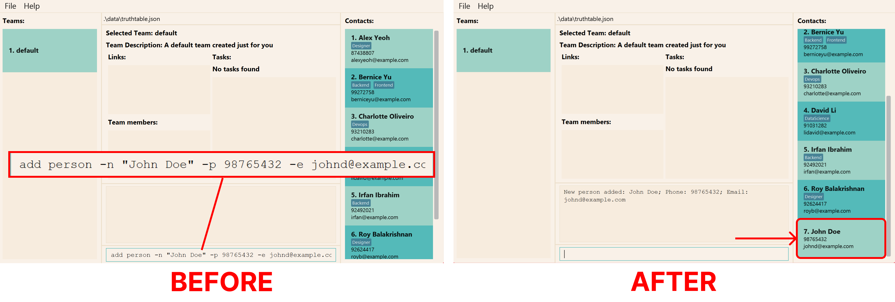
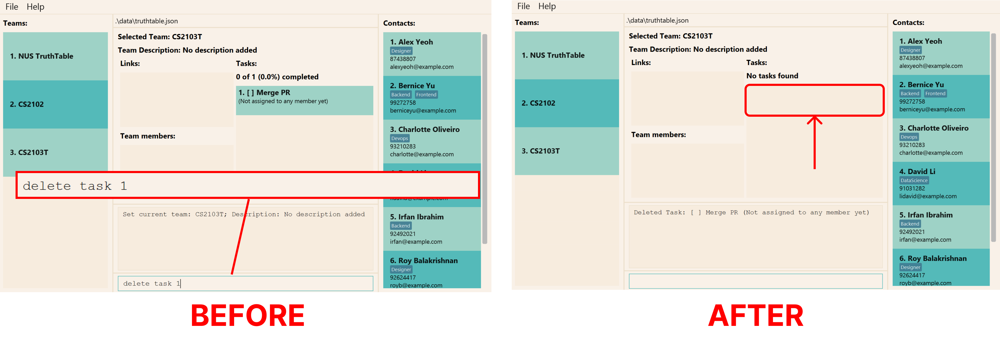
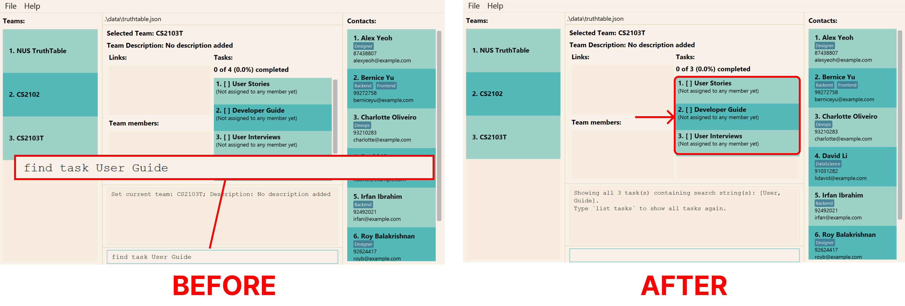

Welcome to the User Guide for TruthTable!

If you're a student team leader for a software engineering project, and you're struggling to keep track of your team's 
tasks, links, and overall progress, you've come to the right place!

## About TruthTable
TruthTable is a desktop application that enables **student team leaders** to manage their **software engineering 
teams**, including **tasks, links and team members' information** - all in a single application!

TruthTable is **optimized for use via a [Command Line Interface (CLI)](#command-line-interface)** while still having the
benefits of a [Graphical User Interface (GUI)](#graphical-user-interface). 
This means that if you can type fast, TruthTable can get your
task and team management done _blazingly fast_, faster than traditional GUI applications.

**:information_source: Unsure what CLI or GUI means?**
Head over to [this section](#understanding-truthtables-cli) to learn more!

This guide will help you understand how the various features of TruthTable can help you manage your teams more 
efficiently.

Feel free to read on, or if you can't wait to get started, skip ahead to our [Getting Started Guide](#getting-started) 
to start using TruthTable now!

## Using This Guide

This document will guide you on how to get familiar with all of TruthTable's [features](#key-features-of-truthtable).
If you are an experienced user of TruthTable, this guide also contains valuable tips on how you can maximize your
productivity while using TruthTable.

While this guide can be quite long, feel free to jump ahead to any section in 
the [Table of Contents](#table-of-contents) below.

Here are the alerts to look out for while using this guide:

**:information_source: Important alert**:
Important information for all users to take note

**:bulb: Tip for all users**:
Useful information to help you use TruthTable more effectively

**:star: Tip for advanced users**:
Useful information for more experienced users

**:exclamation: Warning alert**:
Important information to be cautious of

Throughout this guide, we use different text styles for different purposes. Here is what each one means: 

| Text Style Example         | Meaning                                              |
|----------------------------|------------------------------------------------------|
| [Glossary link](#glossary) | Clickable link to navigate to a section in the guide |
| `text with background`     | Text relevant to commands or file names              |
| <kbd>Esc</kbd>             | Keyboard button                                      |

## Table of Contents

* Table of Contents
{:toc}

--------------------------------------------------------------------------------------------------------------------

## Key Features of TruthTable

### Organize All Your Information In One Place

We understand that managing project documents and information is a difficult task. Aside from the large number of links 
and slides created by your team, you may be using task management applications like
<a href="https://www.notion.so/" target="_blank">Notion</a> to track your team's progress as well. 

This is why TruthTable allows you to collate and organize your **tasks, links, and team members' information** in a 
single application!

### Track Progress And Delegate Work

We know that it is often difficult to visualize and communicate your team's progress to various stakeholders 
(e.g. professors, tutors, etc.). 

Well, you never have to worry about tracking your team's progress anymore! Using TruthTable, you can see the 
**number of tasks completed by your team** as well as **which members have been assigned to which tasks** - all in 
one glance!

This can also help you to delegate future tasks more fairly, by considering the workload of all your members.

### Convenient And Fast

We all know that context switching is a productivity killer.

Having to switch back and forth between project management and coding usually means switching between 
[GUI](#graphical-user-interface)-based applications (for project management) [CLI](#command-line-interface) code editors 
(for coding). 

To solve this issue, TruthTable allows you to use a **single CLI for all your project management needs**, reducing 
the impact of context switching. You never have to use a mouse again!

**:star: For experienced CLI users**:
  
TruthTable's command syntax is actually very similar to other command line applications like
[Git](https://git-scm.com/) and [Docker](https://docs.docker.com/engine/reference/commandline/cli/)!

So, fret not, you will become familiar with TruthTable's commands in no time.

## Getting Started

1. Ensure you have **Java 11** or above installed on your computer. If not, follow the
   <a href="https://docs.oracle.com/en/java/javase/11/install/overview-jdk-installation.html" target="_blank">Java Installation Guide</a>
   for further instructions on how to download and install **Java 11**.

2. Download the latest version of `truthtable.jar` from 
   [our "Releases" page](https://github.com/AY2223S1-CS2103T-W13-4/tp/releases).
   The file can be located under the "Assets" section of the page as seen in the image below.
   

3. Double-click on `truthtable.jar` to start the application. A window which looks similar to the screenshot below
   should appear in a few seconds. 
     
   
**:bulb: Sample data**:
   We have also added some sample data for you to play around with and get familiar with TruthTable's 
   [commands](#commands)!
   

4. That's it! You can now follow our guide below on how to 
   [navigate the application](#navigating-truthtables-interfaceuser-interface).

[Back to Table of Contents](#table-of-contents)

---

## Navigating TruthTable's [Interface](#user-interface)

After opening TruthTable for the first time, you should see the following screen.

Each section contains several [components](#component), which will be labelled in their respective sections below. These
components are numbered, and their names and descriptions will be displayed in a tabular format.

### Teams Section

This section displays the names of all the teams that you have created in TruthTable. Only the names of each team is
listed.

**:information_source: Note:**
There will always be one team in TruthTable named "default" (if you do not specify any name).

| Number                                      | Component                                                 | Description                                                                                 |
|---------------------------------------------|-----------------------------------------------------------|---------------------------------------------------------------------------------------------|
| 1 | [Index](#index) | The position of the team in the list of all teams |  
| 2 | Name            | The name of the team at the specified index       |

### Current Team Section

This section contains information about your current team. It displays the currently selected team, along with the team
description, links, tasks, and members related to this team.

| Number                                        | Component                                                         | Description                                                                                                                                                               |
|-----------------------------------------------|-------------------------------------------------------------------|---------------------------------------------------------------------------------------------------------------------------------------------------------------------------|
| 1  | Team Name              | The name of the selected team                                                                                                  |  
| 2  | Team Description       | The description of the selected team                                                                                           |
| 3  | Link Index             | The name of a link related to the selected team                                                                                |
| 4  | Link Name              | The name of a link related to the selected team                                                                                |
| 5  | Member [Index](#index) | The position of a member in the team's list of members                                                                         |
| 6  | Member Name            | The name of a member at the specified member index                                                                             |
| 7  | Task [Index](#index)   | The position of a task in the team's list of tasks                                                                             |
| 8  | Task Name              | The name of a task at the specified task index                                                                                 |
| 9  | Task Assignee          | The name(s) of the member(s) assigned to the task                                                                              |
| 10 | Task Completion Status | The completion status of a task. `[X]` is displayed if task is completed, whereas `[ ]` is displayed if the task is incomplete |
| 11 | Task Completion Rate   | The number (and percentage) of tasks that have been completed by the selected team                                             |

### Persons Section

This section displays the names, phone number, email, address, and tags of all persons that you have created in
TruthTable. This section is also known as the "Contacts" section.

| Number                                        | Component                                                   | Description                                                                                       |
|-----------------------------------------------|-------------------------------------------------------------|---------------------------------------------------------------------------------------------------|
| 1 | [Index](#index) | The position of a person in TruthTable's contact list |
| 2 | Name            | The name of the person at a specific index            |
| 3 | Tags            | The attributes associated with a person               |
| 4 | Phone Number    | The phone number of a person                          |
| 5 | Email           | The email address of a person                         |

### Command Section

This section contains an input box where you can enter [commands](#command) for the actions that you want to perform. 
Try typing `help` in the input box and press <kbd>Enter</kbd> to see what happens!

| Number                                      | Component                                                   | Description                                                                                                                            |
|---------------------------------------------|-------------------------------------------------------------|----------------------------------------------------------------------------------------------------------------------------------------|
| 1 | Command Result    | The result of executing a command in the Command Input Box                                   |
| 2 | Command Input Box | The input box for commands to be entered, which can be executed by pressing <kbd>Enter</kbd> |

[Back to Table of Contents](#table-of-contents)

Congratulations! You've successfully understood the entire TruthTable [User Interface](#user-interface)! Continue 
reading on to find out more about how TruthTable makes use of a [Command Line Interface](#command-line-interface).

---

## Understanding TruthTable's CLI

[Command Line Interface (CLI)](#command-line-interface) applications like TruthTable requires you to type specific words 
(called [commands](#command)) to make use of the application's features. On the other hand,
[Graphical User Interface (GUI)](#graphical-user-interface) programs usually require you to use a mouse to click on 
the screen and perform certain actions.

If you are not an experienced CLI user, terms like "commands", "flags", and "parameters" may appear daunting.

But fret not! This section will cover what all these terms actually mean. By the end of it, you'll be able to 
confidently explain it to your friends too!

### Commands, flags, and parameters

All instructions in TruthTable are executed through **[commands](#command)**. Each command can have **[flags](#flag) 
specified after the command**, which modifies how the instruction should be carried out.

For each of these flags, there may be **[parameters](#parameter)** specified after it. But, **not all commands
require parameters**.

Note that flags and parameters always come **after** the command.

**:information_source: Do I need to memorize all these commands, 
parameters, and flags?**
Nope!
  
While you're going through this section, don't worry too much about memorizing the details of every command, as they all
have their own help messages that you can refer to at any time.
  
Also, the commands in TruthTable are designed to be **easy to remember** and **intuitive**, so you will get familiar
with them in no time!

Let's use an example to break down what we've talked about.

#### Example Command: `add person`

Here's a summary of what each highlighted section represents.

| Number                                       | Name                                                          | Meaning                                                                                                                           |
|----------------------------------------------|---------------------------------------------------------------|-----------------------------------------------------------------------------------------------------------------------------------|
| 1   | Command              | The name of an instruction                                                               |
| 2  | Flag/Option         | Text that is used to modify the operation of a command, often starting with `-` or `--` |
| 3 | Parameter/Argument | Information specified for a command to operate, often used after flags                 |

**:information_source: Important note for flags**

- Specifying an "equal" sign (`=`) after the flag is optional, and it has no effect on the command.
- Optional flags are wrapped with square brackets (`[]`)
- Flags can be specified in any order
    - For e.g. `-n name -p 98765432` is the same as `-p 98765432 -n name`

**:information_source: Important note for parameters**

Use of quotation marks around parameters (`""` and `''`) is optional.
  
**However**, if you are specifying a parameter with multiple words, you will need to wrap the words in quotes.
Otherwise, TruthTable will not carry out the command properly.

For instance,

- `add person -n "full name" ...` will recognize "full name" as the name being specified for the new person
- `add person -n full name ...` will recognize "full" as the name being specified for the new person, however, this
  command will not execute successfully as `name` will be treated as a **flag** (and this flag does not exist for
  the `add person` command)

Also, if your quotes are not closed properly (i.e. some open quotation mark does not have a corresponding close
quotation mark), the command will not be executed. If the parameter specified contains quotation marks, they will be
rejected as well.

For instance,

- `'word` is invalid as the open quotation mark `'` does not have a corresponding close quotation mark.
- `"'"` is invalid as `'` will be passed as a parameter, which is invalid.

**:bulb: Flags with multiple parameters**
If a flag is displayed with `...` behind it, this means that the flag accepts more than 1 parameter.
  
For instance, in the `assign task` command, we can specify more than 1 assignee (provided they are valid).
A valid command is `assign task 1 -a 1 2 3` where `1 2 3` are recognized as the assignees to the task with index `1`.

### Understanding the help message

While using TruthTable, you might have entered the command in an incorrect format - perhaps you forgot to specify a 
flag or a parameter. Will the application crash? Will all your precious data be lost? Absolutely not! 

Rather, we understand that it is possible for anyone to forget the correct format or command name, and we want to help 
you as much as possible! This is why **every command in TruthTable has its own help message**.

Each command allows you to specify the `-h` or `--help` flag, which will show you all the available flags and 
parameters for the command. Alternatively, you can also refer to this user guide to find out the details of any command.

So, you never have to worry about typing a wrong command since there's always help available _at your fingertips_.

Let's dive a little deeper into what a help message looks like and how to interpret it. 

#### Example Command Help Message: `assign task --help`

Here's a summary of what each highlighted section represents.

| Number                                       | Name                                                                       | Special Syntax                                                    | Remarks                                                                                                                  |
|----------------------------------------------|----------------------------------------------------------------------------|-------------------------------------------------------------------|--------------------------------------------------------------------------------------------------------------------------|
| 1   | Command                           | -                        | Only alphabets and spaces (all commands can be found [here](#commands))         |
| 2 | Optional Flag with no Parameter | `[-flag]`              | -                                                                             |
| 3 | Optional Flag with Parameters   | `[-flag=<parameters>]` | An ellipsis `...` is present only if more than 1 parameter is **allowed**     |
| 4  | Required Flag with Parameters    | `flag=<parameters>`     | An ellipsis `...` is present only if more than 1 parameter is **allowed**      |
| 5  | Required Parameter               | `<parameter>`           | All parameters are required by default                                         |
| 6  | Flag/Parameter Name and Alias    | -                       | All aliases of a flag/parameter will be listed and separated with commas (`,`) |
| 7  | Flag/Parameter Description       | -                       | Brief description of flag/parameter                                            |

### Aliases

To help you use our program even faster, we have introduced short forms for our commands and flags!

We call these short forms "aliases", and they allow you to execute instructions _blazingly fast_ by minimizing
the number of characters you need to type.

For instance, the [`add person`](#creating-a-new-person-add-person) command has the following command aliases,

- `add p`
- `a person`
- `a p`

The `add person` command also has the following flags and their corresponding aliases,

- aliases for `-h`: `--help`
- aliases for `-e`: `--email`
- aliases for `-n`: `--name`
- aliases for `-p`: `--phone`
- aliases for `-t`: `--tags`

You can find out more about these flags [here](#creating-a-new-person-add-person).

Feel free head over to the [command summary section](#command-aliases)
to find out more about each command and its corresponding aliases.

[Back to Table of Contents](#table-of-contents)

Congrats! You've successfully understood how TruthTable makes use of [Command Line Interface](#command-line-interface) to improve your productivity. 

You're about halfway through this User Guide already! Continue reading to find out about important commands that you can use to solve your project management problems :smile:

---

## Commands

**:exclamation: Make sure you have 
[read the section on TruthTable's CLI](#understanding-truthtables-cli) before continuing!**

**:exclamation: This section contains important information that requires you to pay close attention.** 
  
If you don't understand something, don't worry! You can always read it again or refer to the help messages in our application.

TruthTable allows you to manage members, tasks, links, and members through the use of commands.

**:information_source: Persons vs Members**

Some persons in TruthTable (as seen in the [persons section](#persons-section)) may not be in a team. However, any
member of a team must be a person in TruthTable.

The commands are split into **5** main sections:

1. [Person commands](#commands-to-manage-persons) and [member commands](#commands-to-manage-members)
2. [Team commands](#commands-to-manage-teams)
3. [Task commands](#commands-to-manage-tasks)
4. [Link commands](#commands-to-manage-links)
5. [General commands](#general-commands)

**:information_source: Command Format**

The format for each command adheres to the structure laid out in the
[help command section](#example-command-help-message-assign-task---help).

**:information_source: Parameters and Constraints**

Parameters are written in uppercase and wrapped with angle brackets (e.g. `<PARAMETER>`) in this guide.
  

Each parameter has its own constraints, which can be found [here](#flag-and-parameter-constraints).

**:information_source: Flags and Parameters**

- Every command has a `-h` and `--help` flag available to see their help message
- Flags wrapped with brackets (`()`) indicates that at least 1 flag inside the brackets must be specified
    - For `([-n <NAME>] [-p <PHONE>] [-e <EMAIL>] [-t [<TAGS>]]...)`, the following examples are valid
        1. `-n name`
        2. `-p 98765432`
        3. `-e new@email.com`
        4. `-t developer`
- Flags wrapped with brackets (`()`) and separated with `|` indicates that you must specify only 1 flag inside the
  brackets
    - For `(-n=<NAME_KEYWORDS> | -e=<EMAIL_KEYWORDS>)`, the following examples are valid
        1. `-n one two`
        2. `-e three four`
    - However, the following are invalid
        1. `-n one two -e three four`
        2. when both flags are empty
- Flags/Parameters with ellipsis (`...`) behind them means that more than 1 parameter can be specified
    - For `[-t [TAGS...]]...`, the following examples are valid
        1. `-t`
        2. `-t one`
        3. `-t one two`
        4. `-t one -t two`
- Flags can be combined if they all begin with `-`, where the flags are clustered. Find out more
  <a href="https://pubs.opengroup.org/onlinepubs/9699919799/basedefs/V1_chap12.html#tag_12_02" target="_blank">here</a>
    - For `[-h] [-c] [-i]`, the following examples are valid
        1. `-h`
        2. `-hc`
        3. `-ci`
        4. `-hci`
- If an extra parameter is specified, the command will not execute and an error message will be displayed
    - For e.g. `help with extra words` will display an error message

**:bulb: Letter casing for parameters**  
Note that the parameters in this user guide are all upper-cased, which differs from the lower-cased parameters in 
the help message that TruthTable displays whenever you run a command with `-h`.

### Commands to Manage Persons

If you're looking for a quick summary of the commands to manage persons, you can find 
it [here](#summary-of-person-commands).

If you want to understand how each command can be used, we have provided some examples and illustrations on how to use
them, so continue reading on!

#### Creating a new person: `add person`

It's the start of a new semester, and you are excited to work with your new classmates on software engineering 
projects. You meet a person that seems like a really fun person to work with, and you can't wait to know more about 
them. After getting their name, email, and phone number, you can save their contact details on TruthTable with this 
`add person` command! Now you can contact them easily when you are forming your project teams. You may optionally 
specify some tags for any interesting qualities about the person!

This `add person` command allows you to add a new person to TruthTable. The new person is added to the 
[persons section](#persons-section). 

Here, let us take walk through an example on how to add a person.

Let's try to add a new person called John Doe to our application. 

We can do so by entering the command `add person -n "John Doe" -p 98765432 -e johnd@example.com`.

If done successfully, you should see a new person show up in the [persons section](#persons-section) as seen below.

**Format:** `add person [-h] -e=<EMAIL> -n=<NAME> -p=<PHONE> [-t[=<TAGS>...]]...`

| Flags           | Required           | Remarks                                                                |
|-----------------|--------------------|------------------------------------------------------------------------|
| `-h`, `--help`  | :x:                | Shows [help message](#understanding-the-help-message) for this command |
| `-e`, `--email` | :heavy_check_mark: | Email of person (e.g. johndoe@gmail.com)                               |
| `-n`, `--name`  | :heavy_check_mark: | Name of person (e.g. "John Doe")                                       |
| `-p`,`--phone`  | :heavy_check_mark: | Phone of person (e.g. 98765432)                                        |
| `-t`,`--tags`   | :x:                | Tags of person (e.g. Frontend, Backend)                                |

:bulb: **Tip:**
A person can have any number of tags (including 0).

**Command Aliases:**

- `a person`
- `add p`
- `a p`

**Examples:**

* `add person -n "John Doe" -p 98765432 -e johnd@example.com` adds a person named "John Doe", with phone number
  "98765432" and email "johnd@example.com".
* `a p -n "Betsy Crowe" -e betsycrowe@example.com -p 12345678 -t criminal friend` adds a person named "Betsy Crowe",
  with phone number "12345678" and tags "designer" and "friend".

#### Editing a person: `edit person`

Oops! Seems like another classmate, Alex Yeoh, might have provided his school email instead of his personal email. You 
can edit their contact details easily with `edit person`! 

The `edit person` command allows you to edit an existing person in TruthTable. The edited person's details will be 
shown in the [persons section](#persons-section). As always, don't panic if you see an 
error message. Let us run through an example on how to edit the details of a person.

Suppose your classmate, Alex Yeoh, has provided you with the wrong phone and email. Identify the index number of
`Alex Yeoh` in the application (1 in the image below). If you are not able to find their name, refer to
[find person command](#finding-a-person-find-person) on how you can find them.

Then, enter the command `edit person 1 -p 91234567 -e johndoe@example.com`.

If done successfully, you should see the new details show up under in the [persons section](#persons-section)
under `Alex Yeoh` as seen below. 

Unable to find a person you are looking for? Please check that you have added the person into TruthTable! Refer to the 
above [add person command](#creating-a-new-person-add-person) to add a new person into TruthTable.

**Format:** `edit person [-h] ([-n=<PERSON_NAME>] [-p=<PERSON_PHONE>] [-e=<PERSON_EMAIL>] 
[-t[=\<PERSON_TAGS\>...]]...) <PERSON_INDEX>`

| Flags           | Required   | Remarks                                                                |
|-----------------|------------|------------------------------------------------------------------------|
| `-h`, `--help`  | :x:        | Shows [help message](#understanding-the-help-message) for this command |
| `-e`, `--email` | :asterisk: | Email of person (e.g. johndoe@example.com)                             |
| `-n`, `--name`  | :asterisk: | Name of person (e.g. "John Doe")                                       |
| `-p`,`--phone`  | :asterisk: | Phone of person (e.g. 98765432)                                        |
| `-t`,`--tags`   | :asterisk: | Tags of person (e.g. Frontend, Backend)                                |

:asterisk: - at least one of the flags for email, name, phone, and tags must be specified

Please take note that:

* The command edits the person at the specified `PERSON_INDEX`, which refers to the index number shown in the
  [persons section](#persons-section)
* `PERSON_INDEX` **must be a positive integer:** 1, 2, 3,...
* Each field only updates if the flag for that field is specified.
* When editing tags, the existing tags of the person will be **completely replaced** by the new tags specified.

**:bulb: Tip**:
To remove all tags of a person, you can use `-t` without specifying any tags.

**Command Aliases:**

- `edit p`
- `e person`
- `e p`

**Examples:**

* `edit person 1 -p 91234567 -e johndoe@example.com` edits the phone number and email address of the 1st person to be
  "91234567" and "johndoe@example.com" respectively.
* `edit person 2 -n Betsy Crowe -t` edits the name of the 2nd person to be "Betsy Crowe" and clears all existing tags.

#### Deleting a person: `delete person`

Alas, you are done with the project and will no longer be working with this classmate. You
can delete their contact details easily with `delete person`! 

The `delete person` command allows you to delete the specified person from TruthTable. The person deleted will be
removed from the [persons section](#persons-section). Let us run through an example on how you can delete a person in TruthTable.

Suppose you want to delete Alex Yeoh from your application. Identify the index number of `Alex Yeoh` in the
application (1 in the image below). First, identify the index number of your classmate in the
[persons section](#persons-section). If you are not able to find their name, refer to
[find command](#finding-a-person-find-person) on how you can find them.

Then, enter the command `delete person 1`.

If done successfully, you should see that the person `Alex Yeoh` has been removed under the 
[persons section](#persons-section).

Unable to find a person you are looking for? Please check that you have added the person into TruthTable! Refer to the
above [add person command](#creating-a-new-person-add-person) to add a new person into TruthTable.

**Format:** `delete person [-h] <PERSON_INDEX>`

| Flags          | Required | Remarks                                                                |
|----------------|----------|------------------------------------------------------------------------|
| `-h`, `--help` | :x:      | Shows [help message](#understanding-the-help-message) for this command |

Please take note that: 

* The command deletes the person at the specified `PERSON_INDEX`, which refers to the index number shown in the
  [persons section](#persons-section)
* `PERSON_INDEX` **must be a positive integer:** 1, 2, 3,...

**Command Aliases:**

- `delete p`
- `d person`
- `d p`

**Examples:**

* [`list persons`](#listing-all-persons-list-persons) followed by `delete person 2` deletes the 2nd person in
  TruthTable.
* [`find person Betsy`](#finding-a-person-find-person) followed by `delete person 1` deletes the 1st person in the
  results of the `find person` command.

#### Finding a person: `find person`

You recall talking to someone in your class, but you can't seem to remember his full name. Or, you are
having trouble finding someone in the [persons section](#persons-section). With the `find person` command, you can now retrieve their details easily! 

The `find person` command allows you to find all persons whose names contain any of the keywords you specify. 
The persons with matching names will be shown in the [persons section](#persons-section).

Let us run through how you can find a person.

Suppose that you remember that this person has the words Alex or David in their name. Then, to find all persons
with Alex and David in their names, enter the command `find person alex david`.

If done successfully, you should the see all persons named Alex and David show up under in the
[persons section](#persons-section).

Unable to find a person you are looking for? Please check that you have added the person into TruthTable! Refer to the
above [add person command](#creating-a-new-person-add-person) to add a new person into TruthTable.

To show everyone in the person list again, see the [list persons command](#listing-all-persons-list-persons).

**Format:** `find person [-h] <PERSON_NAME_KEYWORDS>`

| Flags          | Required | Remarks                                                                |
|----------------|----------|------------------------------------------------------------------------|
| `-h`, `--help` | :x:      | Shows [help message](#understanding-the-help-message) for this command |

Please take note that:

* Only the name is searched.
* The search is case-insensitive, e.g. `alex` will match `Alex`.
* The order of the keywords does not matter, e.g. `Yeoh Alex` will match `Alex Yeoh`.
* Persons with names partially matching the keywords will be returned, e.g. `ale` will match `Alex`.
* Persons with names matching at least one keyword will be returned, e.g. `alex yu` will match 
  `Alex Yeoh`, `Bernice Yu`.

**Command Aliases:**

- `find p`
- `f person`
- `f p`

**Examples:**

* `find person John` returns `john` and `John Doe`.
* `find person alex david` returns `Alex Yeoh`, `David Li`.

#### Listing all persons: `list persons`

If you want to see all the persons you have added to TruthTable, key in `list persons`, and they will all
appear in the [persons section](#persons-section). This is especially helpful if you have previously run the
[`find person`](#finding-a-person-find-person) command previously.

The `list persons` command shows the list of all persons in TruthTable. 

Unable to find a person you are looking for? Please check that you have added the person into TruthTable! Refer to the
above [add person command](#creating-a-new-person-add-person) to add a new person into TruthTable.

**Format:** `list persons [-h]`

| Flags          | Required | Remarks                                                                |
|----------------|----------|------------------------------------------------------------------------|
| `-h`, `--help` | :x:      | Shows [help message](#understanding-the-help-message) for this command |

**Command Aliases:**

- `list p`
- `l persons`
- `l p`

### Commands to Manage Members

Summary of the commands to manage members can be found [here](#summary-of-member-commands).

#### Adding a new member to the team: `add member`

You have made up your mind on whom you want to work with for your group projects, and now you want to
add them to your team. You can add persons to your team with the `add member` command! You can finally begin to work 
on some exciting software engineering projects with them!

The `add member` command allows you to add a new team member in your currently selected team. The new member is added
to the member list in the [current team section](#current-team-section) as seen in the image below.

Unsure of which team you are currently on? Please refer to the [current team section](#current-team-section) 

Here, let us take a quick walk-through on how to add a person.

Let us try to add a new person called Alex Yeoh to our team. Identify the index number of `Alex Yeoh` in the 
application (1 in the image below). If you are not able to see their name in the list of persons, refer to [find person command](#finding-a-person-find-person) on how to
find a person.

Then, enter the command `add member 1`.

If done successfully, you should see a new member `Alex Yeoh` show up in the member list in the 
[current team section](#current-team-section) as seen below. 

**Format:** `add member [-h] <PERSON_INDEX>`

| Flags          | Required | Remarks                                                                |
|----------------|----------|------------------------------------------------------------------------|
| `-h`, `--help` | :x:      | Shows [help message](#understanding-the-help-message) for this command |

* `PERSON_INDEX` **must be a positive integer:** 1, 2, 3,...

**Command Aliases:**

- `add m`
- `a member`
- `a m`

**Examples:**

- `add member 1` will add the first person in the [persons sections](#persons-section) as a new member to the
  [currently selected team](#current-team-section).

#### Delete a member from team: `delete member`

Due to unfortunate circumstances, one of your teammates needs to be shuffled to another group, and he will no longer
be on your team! You can delete members from your team using the `delete member` command.

The `delete member` command allows you to delete an existing team member in your currently selected team. 
The corresponding team member will be removed from the [current team section](#current-team-section) as seen in the 
image below. 

Unsure of what team you are currently on? Please refer to the [currently selected team](#current-team-section) 

Here, let us take a quick walk-through on how to delete a member.

Let us delete Alex Yeoh from our team. Firstly, identify the index number of `Alex Yeoh` in the
member list (1 in the image below). If you are not able to see their name on the list, 
refer to[find member command](#finding-a-member-find-member)

Then, enter the command `delete member 1`.

If done successfully, `Alex Yeoh` should be removed from the [current team section](#current-team-section) as seen below.

Unable to delete an existing team member? Please check that you have added the team member into your team as shown in 
the [current team section](#current-team-section). Refer to the above 
[add member command](#adding-a-new-member-to-the-team-add-member) on how to add a new team member.

**Format:** `delete member [-h] <MEMBER_INDEX>`

| Flags          | Required | Remarks                                                                |
|----------------|----------|------------------------------------------------------------------------|
| `-h`, `--help` | :x:      | Shows [help message](#understanding-the-help-message) for this command |

* `MEMBER_INDEX` **must be a positive integer:** 1, 2, 3,...

**Command Aliases:**

- `delete m`
- `d member`
- `d m`

**Examples:**

- `delete member 2` will delete the second member of the current team.

#### Finding a member: `find member`

As your software project is growing and your team is getting bigger, you are no longer able to find specific team
members. You can find your team members easily with the `find member` command.  

The `find member` command allows you to find all team members whose names or emails contain any of the given keywords.
The members with matching names will be shown in the member list in the [current team section](#current-team-section)
as seen in the image below. 

Let us run through the steps to find a team member.

Suppose you want to find all team members named Alex or David. 

Enter the command `find member -n alex david`.

If done successfully, you should the see all team members named Alex and David show up under in the member list in the
[current team section](#current-team-section). You can also find your team members by their email using the `-e` flag.

Unable to find an existing team member? Please check that you have added the team member into your team as shown in the
[current team section](#current-team-section). Refer to the above
[add member command](#adding-a-new-member-to-the-team-add-member) on how to add a new team member.

To reset the member list, see the [list members command](#listing-all-members-of-the-team-list-members).

:information_source: **Note**   You can find members using **either** emails or names. This means that you 
should **not** use both `-n` and `-e` in the `find member` command. 

**Format:** `find member [-h] (-n=<MEMBER_NAME_KEYWORDS> | -e=<MEMBER_EMAIL_KEYWORDS>)`

| Flags           | Required | Remarks                                                                |
|-----------------|----------|------------------------------------------------------------------------|
| `-h`, `--help`  | :x:      | Shows [help message](#understanding-the-help-message) for this command |
| `-n`, `--name`  | :hash:   | Keywords to filter the name by                                         |
| `-e`, `--email` | :hash:   | Keywords to filter the email by                                        |

:hash: - exactly one of the flags for name or email must be specified

Please take note that:

* Only the name or email is searched.
* The search is case-insensitive, e.g. `alex` will match `Alex`.
* The order of the keywords does not matter, e.g. `Yeoh Alex` will match `Alex Yeoh`.
* Persons with names partially matching the keywords will be returned, e.g. `ale` will match `Alex`.
* Persons with names matching at least one keyword will be returned, e.g. `alex yu` will match
  `Alex Yeoh`, `Bernice Yu`.

**Command Aliases:**

- `find m`
- `f member`
- `f m`

**Examples:**

* `find member -n Alex` finds team members with **names** containing the word "Alex".
* `find member -n Alex Beatrice` finds team members with **names** containing **either** "Alex" or "Beatrice".
* `find member -e alex@gmail.com`  finds team members with **emails** containing "alex@gmail.com".

#### Listing all members of the team: `list members`

TruthTable allows you to see a list of all your team members with the `list members` command. After running the
[find member command](#finding-a-member-find-member), you may wish to view all team members again. 

To do so, enter `list members` and the member list in the [current team section](#current-team-section) will be 
updated.

Unable to find an existing team member? Please check that you have added the team member into your team as shown in the
[current team section](#current-team-section). Refer to the above
[add member command](#adding-a-new-member-to-the-team-add-member) on how to add a new team member.

View all the members currently in the team, in the form of a list.

**Format:** `list members [-h]`

| Flags          | Required | Remarks                                                                |
|----------------|----------|------------------------------------------------------------------------|
| `-h`, `--help` | :x:      | Shows [help message](#understanding-the-help-message) for this command |

**Command Aliases:**

- `list m`
- `l members`
- `l m`

#### Sort members: `sort members`

Your team size is getting larger, and it is getting confusing for you to track the members in your team. You can sort your team members by name with our `sort members` command! 

The `sort members` command allows you to sort your team members in alphabetical order. The sorted team members will
be shown in member list the [current team section](#current-team-section)  as seen in the image below.

Let us run through an example on how to sort your team members.

Suppose you want to check whether there is team member called `Caroline`, but you are unsure of how to spell it.

Enter the command `sort members asc`.

If done successfully, the sorted team members will be shown in the member list in
[current team section](#current-team-section)

You can now verify if `Caroline` indeed  exists in your team by scrolling to all names that begin with `c`. You may 
sort your team members in descending order with `sort members dsc` or reset to the original list order with 
`sort members res`.

Unable to find an existing team member? Please check that you have added the team member into your team as shown in the
[current team section](#current-team-section). Refer to the above
[add member command](#adding-a-new-member-to-the-team-add-member) on how to add a new team member.

**Format:** `sort members [-h] <ORDER>`

| Flags          | Required | Remarks                                                                |
|----------------|----------|------------------------------------------------------------------------|
| `-h`, `--help` | :x:      | Shows [help message](#understanding-the-help-message) for this command |

| Order Value | Description                                                                 |
|-------------|-----------------------------------------------------------------------------|
| `asc`       | Sorts team members in **alphabetical** order (based on their names)         |
| `dsc`       | Sorts team members in **reverse alphabetical** order (based on their names) |
| `res`       | **Resets** the order of the team members shown back to default (unsorted)   |

**Command Aliases:**

- `sort m`
- `so members`
- `so m`

**Examples:**

* `sort members asc` sorts team members in **ascending** order.
* `sort members dsc` sorts team members in **descending** order.
* `sort members res` **resets** the order of team members shown.

### Commands to Manage Teams

Summary of the commands to manage teams can be found [here](#summary-of-team-commands).

#### Creating a new team: `add team`

You have formed your group for the project and are ready to work on your software engineering project! After deciding on a team name and a description, you are now ready to create a new team. 

The `add team` command allows you to add a new team to your list of teams. The new team is added to the 
[teams section](#teams-section) as seen in the image below.

Here, let us take a quick walk-through on how to add a team.

Let us try to add a new team named `CS2103T`, with a description called `Software Engineering`. 

Enter the command `add team CS2103T -d "Software Engineering"`.

If done successfully, you should see a new team show up in the [teams section](#teams-section) as shown below.

Combine this with [set team command](#set-a-new-team-set-team) to directly switch to the team you just created.

**Format:** `add team [-h] [-d=TEAM_DESCRIPTION] <TEAM_NAME>`

| Flags                 | Required | Remarks                                                                |
|-----------------------|----------|------------------------------------------------------------------------|
| `-h`, `--help`        | :x:      | Shows [help message](#understanding-the-help-message) for this command |
| `-d`, `--description` | :x:      | Description of team (e.g. "A team to manage CS2103T")                  | 

**Command Aliases:**

- `add te`
- `a team`
- `a te`

**Examples:**

- `add team CS2103T` will create a new team by the name of "CS2103T"
- `add team CS2102 -d "Database Systems"` will create a new team with the name "CS2102" and description "Database Systems"

#### Edit current team: `edit team`

After a while, your group decides to change its team name. You are able to edit both, the name and the description, of a team with the `edit team` command.

The `edit team` command allows you to edit the details your currently selected team. The edited team details will be 
shown in the [currently selected team](#current-team-section). 

Here, let us take a quick walk-through on how to edit your currently selected team.

Supposed you have decided on better team name `NUS TruthTable` 

Enter the command `edit team -n "NUS TruthTable"`.

If done successfully, the details that you specified will be shown in the
[currently selected team](#current-team-section) as shown below. You can also edit the team description directly 
using the `-d` flag.

**Format:** `edit team [-h] ([-n=<TEAM_NAME>] [-d=<TEAM_DESCRIPTION>])`

| Flags                 | Required   | Remarks                                                                |
|-----------------------|------------|------------------------------------------------------------------------|
| `-h`, `--help`        | :x:        | Shows [help message](#understanding-the-help-message) for this command |
| `-n`, `--name`        | :asterisk: | Name of team (e.g. "CS2103T")                                          |
| `-d`, `--description` | :asterisk: | Description of team (e.g. "A team to manage CS2103T")                  | 

:asterisk: - at least one of the flags for name and description must be specified

**Command Aliases:**

- `edit te`
- `e team`
- `e te`

**Examples:**

- `edit team -n CS2103T -d "Software Engineering"` will edit the name of the
  [currently selected team](#current-team-section) to CS2103T and description to "Software Engineering"

#### Delete an existing team: `delete team`

The semester is coming to an end, and the group project is finally completed. You can delete a team once it is no longer
needed with the `delete team` command.

The `delete team` command allows you to delete an existing team. The team deleted will be removed from the
[teams section](#teams-section). Let us show you an example of deleting a team.

Suppose you have an existing team called `CS2103T` and want to remove it. 

Enter the command `delete team CS2103T`.

If done successfully, you should see the team `CS2103T` removed under the [teams section](#teams-section).

Unable to find the team that you want to delete? Please check that you have added the team into TruthTable as shown in the
[teams section](#teams-section). Refer to the above [add team command](#creating-a-new-team-add-team) 
on how to add a new team.

**Format:** `delete team [-h] <TEAM_NAME>`

| Flags          | Required | Remarks                                                                |
|----------------|----------|------------------------------------------------------------------------|
| `-h`, `--help` | :x:      | Shows [help message](#understanding-the-help-message) for this command |

**Command Aliases:**

- `delete te`
- `d team`
- `d te`

**Examples:**

- `delete team CS2103T` will delete the team with the name "CS2103T"

#### Set a new team: `set team`

It is a busy semester, and you have multiple teams that you need to manage. You can change the team you 
are managing using the `set team` command. 

The `set team` command allows you to change the [currently selected team](#current-team-section) to a new team from
the list of teams in the [teams section](#teams-section). Let us show you an example of how to use this command.

Suppose you have finished the tasks in your current team `CS2103T` and have an existing team called `CS2102`. 

Enter the command `set team CS2102`.

If done successfully, your [currently selected team](#current-team-section) will change to the team `CS2102` along 
with all of its team information, as shown below.

Unable to find the team that you want to check? Please check that you have added the team into TruthTable as shown in 
the [teams section](#teams-section). Refer to the above [add team command](#creating-a-new-team-add-team)
on how to add a new team.

**Format:** `set team [-h] <TEAM_NAME>`

| Flags          | Required | Remarks                                                                |
|----------------|----------|------------------------------------------------------------------------|
| `-h`, `--help` | :x:      | Shows [help message](#understanding-the-help-message) for this command |

**Command Aliases:**

- `set te`
- `s team`
- `s te`

**Examples:**

- `set team CS2103T` will change the currently selected team to be the "CS2103T" team.

### Commands to Manage Tasks

Summary of the commands to manage tasks can be found [here](#summary-of-task-commands).

#### Add task to team: `add task`

Your professor has just announced a list of submissions that you need to complete for the project. You want to record
the list of tasks that needs to be done in order to complete the submission on time. You can use the `add task` command for this!

The `add task` allow you to add a new task to your current team. Each task can have a deadline and multiple assignees.
The new task will be displayed in the task list of your [current team section](#current-team-section). Here, let's take a quick walk-through on how to add a new task.

Here, let us take a quick walk-through on how to add a new task.

Suppose we have a new task called `Create PR`. 

Enter the command `add task "Create PR"`.

If done successfully, a new task with the name `Create PR` will be added to the task list in
[current team section](#current-team-section) as shown below.

You may optionally specify a deadline and assignees for this command using `-d <TASK_DEADLINE>` and
`-a <TASK_ASSIGNEES>` respectively. Please refer to the respective commands on how to
[set deadlines](#set-deadline-for-task-set-deadline) and [set assignees](#assign-a-task-to-team-member-assign-task)!

Please refer to the respective commands on how to 
[set deadlines](#set-deadline-for-task-set-deadline) and [set assignees](#assign-a-task-to-team-member-assign-task) after a task has been created.

**Format:** `add task [-h] [-d=<TASK_DEADLINE>] [-a[=<TASK_ASSIGNEES>...]]... <TASK_NAME>`

| Flags              | Required | Remarks                                                                |
|--------------------|----------|------------------------------------------------------------------------|
| `-h`, `--help`     | :x:      | Shows [help message](#understanding-the-help-message) for this command |
| `-d`, `--deadline` | :x:      | Deadline of task (e.g. 2023-02-25 23:59)                               |  
| `-a`, `--assignee` | :x:      | Index of members in [members section](#current-team-section)           |

* `TASK_DEADLINE` contains both the date and time in `YYYY-MM-DD HH:MM` format, and it **does not have quotation marks
  (`""`)
  around the parameter**.
* `TASK_ASSIGNEES` **must be positive integers:** 1, 2, 3,...

**Command Aliases:**

- `add ta`
- `a task`
- `a ta`

**Examples:**

* `add task "Create PR"` will add a task with the name "Create PR", to the current team's task list.
* `add task "Merge PR" -a 1 -d 2022-12-02 23:59` will add a task with the name "Merge PR", assigned to the first member
  of your team's members list, and a deadline of 2nd Dec 2022 23:59, to the current team's task list.
* `add task "Review PR" -a 1 3 -d 2022-12-02 23:59` will add a task with the name "Review PR", assigned to the first and
  third members of your team's members list, and a deadline of 2nd Dec 2022 23:59, to the current team's task list.

#### Edit task in team: `edit task`

Accidentally spelt the name of a task incorrectly? You can edit the details of the  task easily with the `edit task` command!

The `edit task` command allows you to edit an existing task in your team. The edited task's details will be shown in the
task list of the [current team section](#current-team-section). Let
us run through how to edit the details of a task.

Suppose you want to change the task name from `Create PR` to `Merge PR`. Identify the index number of
`Create PR` in the application (1 in the image below). If you are not able to find the task visibly, refer to
[find task command](#finding-a-task-find-task) on how you can find your task easily.

Then, enter the command `edit task 1 -n "Merge PR"`.

If done successfully, you should see the new details show up under in the task list of the
[current team section](#current-team-section), with the task name of `Merge PR` as shown below. You can edit other
information such as deadline and assignees as well. Please refer to the respective commands on how to
[set deadlines](#set-deadline-for-task-set-deadline) and [set assignees](#assign-a-task-to-team-member-assign-task)!

Please refer to the respective commands on how to
[set deadlines](#set-deadline-for-task-set-deadline) and [set assignees](#assign-a-task-to-team-member-assign-task).

Unable to find a task you are looking for? Please check that you have added the task into TruthTable! Refer to the
above [add task command](#add-task-to-team-add-task) to add a new task into TruthTable.

**Format:** `edit task [-h] ([-n=<NAME>] [-d=<DEADLINE>] [-a[=<ASSIGNEES>...]]...) <TASK_INDEX>`

:exclamation: **Command Format**  
Ensure that `TASK_INDEX` is entered before entering any `ASSIGNEES`, as they both take in positive integers. 
Passing `TASK_INDEX` after `ASSIGNEES` makes it impossible to distinguish which number is actually the `TASK_INDEX`.

| Flags              | Required   | Remarks                                                                |
|--------------------|------------|------------------------------------------------------------------------|
| `-h`, `--help`     | :x:        | Shows [help message](#understanding-the-help-message) for this command |
| `-n`, `--name`     | :asterisk: | Name of task (e.g. "merge PR#12")                                      |
| `-d`, `--deadline` | :asterisk: | Deadline of task (e.g. 2023-02-25 23:59)                               |
| `-a`, `--assignee` | :asterisk: | Index of members in [members section](#current-team-section)           |

:asterisk: - at least one of the flags for name, deadline, and assignees must be specified

Please take note that:

* The command edits the person at the specified `TASK_INDEX`, which refers to the index number shown in the
  [team members section](#current-team-section)
* `DEADLINE` contains both the date and time in `YYYY-MM-DD HH:MM` format, and it **does not have quotation marks (`""`)
  around the parameter**.
* `TASK_INDEX` and `ASSIGNEES` **must be positive integers:** 1, 2, 3,...
* Each field only updates if the flag for that field is specified.
* When editing assignees, the existing assignees of the task will be **completely replaced** by the new assignees
  specified.
* So, you can remove all the assignees of the task by typing `-a` without specifying any assignees after it.

**Command Aliases:**

- `edit ta`
- `e task`
- `e ta`

**Examples:**

* `edit task 1 "Merge PR" -a 1 -d 2022-12-02 23:59` will edit the first task in the current team's task list, setting
  the name as "Merge PR", assignees as the first member in the team list, and deadline as 2nd Dec 2022 23:59.
* `edit task 1 "Update UG" -d 2022-12-02 23:59` will edit the first task in the current team's task list, setting the
  name as "Update UG" and deadline as 2nd Dec 2022 23:59. The assignees are not modified in this example.
* `edit task 1 -a` will edit the first task in the current team's task list, removing all assignees from the task. The
  name and deadline are not modified in this example.

#### Delete task from team: `delete task`

You realise that the task that you created is actually not very important, and you'd like to remove it. You can delete the tasks easily with `delete task`! 

The `delete task` command allows you to delete the specified task from TruthTable. The task deleted will be
removed from the task list of the [current team section](#current-team-section). Let us run through an example on how to delete a
task.

Suppose you want to delete a task called `Merge PR`. Identify the index number of `Merge PR` in the
application (1 in the image below). If you are not able to find the task visibly, refer to
[find task command](#finding-a-task-find-task).

Then, enter the command `delete task 1`.

If done successfully, you should the task `Merge PR` removed under the task list of
[current team section](#current-team-section) as shown below.

Unable to find a task you are looking for? Please check that you have added the task into TruthTable! Refer to the
above [add task command](#add-task-to-team-add-task) to add a new task into TruthTable.

**Format:** `delete task [-h] <TASK_INDEX>`

| Flags          | Required | Remarks                                                                |
|----------------|----------|------------------------------------------------------------------------|
| `-h`, `--help` | :x:      | Shows [help message](#understanding-the-help-message) for this command |

* `TASK_INDEX` **must be a positive integer:** 1, 2, 3,...

**Command Aliases:**

- `delete ta`
- `d task`
- `d ta`

**Examples:**

- `delete task 1` will delete the first task of the current team.

#### Finding a task: `find task`
 
The final deadline is coming up, and there so many tasks yet to complete. You recall adding a task called "merge", but you are not sure
of the full name of the task. You can find the task easily with the `find task` command! 

The `find task` command allows you to finds all tasks whose names contain any of the given keywords.
The tasks with matching names will be shown in the task list of [current team section](#current-team-section).

Let us run through an example on how to find a task.

Suppose you want to find all tasks containing the keywords "User" or "Guide". Enter the command

Enter the command `find task User Guide`.

If done successfully, you should the see all tasks whose name contain "User" or "Guide" show up under in the
task list of [current team section](#current-team-section).

Unable to find a task you are looking for? Please check that you have added the task into TruthTable! Refer to the
above [add task command](#add-task-to-team-add-task) to add a new task into TruthTable.

To reset the task list, see the [list tasks command](#list-tasks-in-team-list-tasks).

**Format:** `find task [-h] <TASK_NAME_KEYWORDS>`

| Flags          | Required | Remarks                                                                |
|----------------|----------|------------------------------------------------------------------------|
| `-h`, `--help` | :x:      | Shows [help message](#understanding-the-help-message) for this command |

Please take note that:

* Only the task name is searched.
* The search is case-insensitive. e.g. `user guide` will match `User Guide`
* The order of the keywords does not matter. e.g. `User Guide` will match `guide user`
* Tasks with names partially matching the keywords will be returned, e.g. `user` will match `userguide`.
* Tasks with names matching at least one keyword will be returned, e.g. `guide case` will match `use case`, 
  `user guide`.

**Command Aliases:**

- `find ta`
- `f task`
- `f ta`

**Examples:**

* `find task User Guide` finds tasks with **names** containing **either** the word "User" or "Guide".

#### Mark tasks as done: `mark`

Seems like the task is finally completed. Hooray! You can mark the task as done easily with the `mark task` command!

The `mark task` command allows you to mark an existing task as done. The marked task will be shown in the
task list of the [current team section](#current-team-section).

Let us run through an example on how to mark an existing task.

Suppose you want to mark the task of `Create PR` as done. Identify the index number of
`Create PR` in the application (1 in the image below). If you are not able to find the task visibly, refer to [find task command](#finding-a-task-find-task) on how you can
find your task easily.

Then, enter the command `mark task 1`.

If done successfully, you should see a cross appear beside the task named of `Merge PR`, under in the task list of the
[current team section](#current-team-section) as shown below.

Unable to find a task you are looking for? Please check that you have added the task into TruthTable! Refer to the
above [add task command](#add-task-to-team-add-task) to add a new task into TruthTable.

To undo this command, please see the [unmark command](#unmark-tasks-as-done-unmark)

**Format:** `mark [-h] <TASK_INDEX>`

| Flags          | Required | Remarks                                                                |
|----------------|----------|------------------------------------------------------------------------|
| `-h`, `--help` | :x:      | Shows [help message](#understanding-the-help-message) for this command |

* `TASK_INDEX` **must be a positive integer:** 1, 2, 3,...

**Command Aliases:**

- `m`

**Examples:**

- `mark 1` will mark the first task in the team as done.

#### Unmark tasks as done: `unmark`

Oops, a small portion of the task was still incomplete. You can mark the task as incomplete easily with the 
`unmark task` command! 

The `unmark task` command allows you to mark an existing task as incomplete. The unmarked task will be shown in the
task list of the [current team section](#current-team-section).

Let us run through how to mark an existing task.

Suppose the task of `Create PR` was originally complete and you want to mark the task of `Create PR` as incomplete.
Identify the index number of `Create PR` in the application (1 in the image below). If you are not able to find the 
task visibly, refer to [find task command](#finding-a-task-find-task) on how you can find your task easily.

Then, enter the command `unmark task 1`.

If done successfully, you should the cross beside the task named of `Merge PR` disappear, under in the task list of the
[current team section](#current-team-section) as shown below.

Unable to find a task you are looking for? Please check that you have added the task into TruthTable! Refer to the
above [add task command](#add-task-to-team-add-task) to add a new task into TruthTable.

To undo this command, please see the [mark command](#mark-tasks-as-done-mark).

**Format:** `unmark [-h] <TASK_INDEX>`

| Flags          | Required | Remarks                                                                |
|----------------|----------|------------------------------------------------------------------------|
| `-h`, `--help` | :x:      | Shows [help message](#understanding-the-help-message) for this command |

* `TASK_INDEX` **must be a positive integer:** 1, 2, 3,...

**Command Aliases:**

- `u`

**Examples:**

- `unmark 1` will mark the first task in the team as incomplete.

#### Set Deadline for task: `set deadline`

You realise that this task needs to be done more urgently than expected and need to change its deadline. Look no further, 
you can set deadlines for your tasks using the `set deadline` command! 

The `set deadline` command allows you to set a deadline for an existing task, and the deadline must be in
`YYYY-MM-DD HH:MM` format. The task with the new deadline will be shown in the task list of the
[current team section](#current-team-section).

Let us run through an example on how to set deadlines.

Suppose you have task called `Create PR`, and you need it to be completed by 11 November 2022, 2359hrs.
Identify the index number of `Create PR` in the application (1 in the image below). If you are not able to find the 
task visibly, refer to [find task command](#finding-a-task-find-task) on how you can find your task easily.

Then, enter the command `set deadline 1 2022-11-11 23:59`.

If done successfully, you should see the `Create PR` task with the new deadline show up in the task list of the
[current team section](#current-team-section).

Unable to find a task you are looking for? Please check that you have added the task into TruthTable! Refer to the
above [add task command](#add-task-to-team-add-task) to add a new task into TruthTable.

**Format:** `set deadline [-h] <TASK_INDEX> <TASK_DEADLINE>`

| Flags          | Required | Remarks                                                                |
|----------------|----------|------------------------------------------------------------------------|
| `-h`, `--help` | :x:      | Shows [help message](#understanding-the-help-message) for this command |

Please take note that:

* `TASK_INDEX` **must be a positive integer:** 1, 2, 3,...
* `TASK_DEADLINE` contains both the date and time in `YYYY-MM-DD HH:MM` format, and it **does not have quotation marks
  (`""`)
  around the parameter**.

**Command Aliases:**

- `set d`
- `s deadline`
- `s d`

**Examples:**

- `set deadline 1 2023-12-25 23:59` will set the deadline for the first task on the task list as 25 Dec 2023 23:59

#### Assign a task to team member: `assign task`

You have tasks that you need to assign people to work on. You can do this  
using the `assign task` command. 

The `assign task` command allows you to assign tasks to members in your team.
The task with the new assignees will be shown in the task list of the [current team section](#current-team-section).

Let us run through an example on how to assign tasks to your team members.

Suppose you have task called `Create PR`, and you want to assign it to Alex Yeoh.

Identify the index number of `Create PR` in the application (1 in the image below). If you are not able to find the 
task visibly, refer to [find task command](#finding-a-task-find-task) on how you can find your task easily.

Identify the index number of `Alex Yeoh` in the application (1 in the image below). If you are not able to find the 
member  visibly, refer to [find member command](#finding-a-member-find-member) on how you can find your team member easily.

Then, enter the command `assign task 1 -a 1`.

If done successfully, you should see the `Create PR` task being assigned to `Alex Yeoh` show up under in the task list
of the [current team section](#current-team-section) as shown below. You can also specify multiple members to assign
a task to multiple team members.

**Format:** `assign task [-h] -a[=<TASK_ASSIGNEES>...] [-a[=<TASK_ASSIGNEES>...]]... <TASK_INDEX>`

**:bulb: Note**:

The format for the `-a` flag indicates that you must specify at least 1 `-a` flag in your command,

- the first instance of `-a` indicates that you must specify the `-a` flag, and
- the second instance of `-a` indicates that you can specify 0 or more `-a` flags.
   
  This results in requiring at least 1 `-a` flag.

| Flags              | Required           | Remarks                                                                |
|--------------------|--------------------|------------------------------------------------------------------------|
| `-h`, `--help`     | :x:                | Shows [help message](#understanding-the-help-message) for this command |
| `-a`, `--assignee` | :heavy_check_mark: | Index of members in [members section](#current-team-section)           |

Please take note that:

* `TASK_INDEX` and `TASK_ASSIGNEES` **must be positive integers:** 1, 2, 3,...
* The original assignees of the task will not be replaced with this command. Tnstead, only new assignees can be added.
* To remove assignees from a task, you can use the [`edit task` command](#edit-task-in-team-edit-task)

**Command Aliases:**

- `assign ta`
- `as task`
- `as ta`

**Examples:**

- `assign task 1 -a` will not do anything.
- `assign task 1 -a 1` will assign the first task on the task list to the first member in the team.
- `assign task 2 -a 1 2` will assign the second task on the task list to the first and second member in the team.

#### Assign a task to random team member: `assign random`

You have tasks and are looking to assign them to different people to work on. Since everyone is capable of 
doing all of the tasks, you are not sure whom to assign the tasks to. You can assign tasks to people randomly using the `assign random` command. 

The `assign random` command allows you to assign tasks randomly to members in your team. The task with the new
assignees will be shown in the task list of the [current team section](#current-team-section). Let us run through an
example on how to assign tasks randomly to your team members.

Suppose you have task called `Create PR`, and you want to assign it randomly to your team members.

Identify the index number of `Create PR` in the application (1 in the image below). If you are not able to find the task visibly, refer to
[find task command](#finding-a-task-find-task) on how you can find your task easily.

Then, enter the command `assign random 1`.

If done successfully, you should see the `Create PR` task being assigned to a random member. It should show up under 
in the task list of the [current team section](#current-team-section) as shown below.

**Format:** `assign random [-h] <TASK_INDEX>`

| Flags          | Required | Remarks                                                                |
|----------------|----------|------------------------------------------------------------------------|
| `-h`, `--help` | :x:      | Shows [help message](#understanding-the-help-message) for this command |

* `TASK_INDEX` **must be a positive integer:** 1, 2, 3,...

**Command Aliases:**

- `assign r`
- `as random`
- `as r`

**Examples:**

- `assign random 1` will assign the first task on the task list to a random team member.

#### Filter tasks by team member: `tasksof`

Your team member privately tells you that he has been assigned too many tasks in this team project. Fortunately, you can
see how many tasks each team member is assigned in your teams with `tasksof` command.

The `tasksof` command allows you to view the specific tasks assigned to a specified member. The tasks that are assigned
to that member will be shown in the task list of the [current team section](#current-team-section).

Let us run through an example on how to assign tasks to your team members.

Suppose you want to check the tasks being assigned to `Alex Yeoh`.

Firstly, identify the index number of `Alex Yeoh` in the application (1 in the image below). If you are not able to 
find the member visibly, refer to [find member command](#finding-a-member-find-member) on how you can find that member
easily.

Then, enter the command `tasksof 1`.

If done successfully, you should see the all tasks that `Alex Yeoh` is assigned. It should show up under
in the task list of the [current team section](#current-team-section) as shown below.

**Format:** `tasksof [-h] <MEMBER_INDEX>`

| Flags          | Required | Remarks                                                                |
|----------------|----------|------------------------------------------------------------------------|
| `-h`, `--help` | :x:      | Shows [help message](#understanding-the-help-message) for this command |

* `MEMBER_INDEX` **must be a positive integer:** 1, 2, 3,...

**Command Aliases:**

- `to`

**Examples:**

* `tasksof 1` will show all tasks assigned to the first member in your current team's member list.

#### List tasks in team: `list tasks`

The final deadline is approaching and you want to view all the tasks for your team. You can use the 
`list tasks` command to see a list of all your tasks in your team.

The `list tasks` command shows a list of all tasks in your team. After running the 
[find task command](#finding-a-task-find-task), you may wish to view all tasks again.

To do so, enter `list tasks`. 

If done successfully, you should the see all tasks show up under in the member list in the
[current team section](#current-team-section) as shown below. You can also view all incomplete and complete tasks by 
supplying the `-i` flag or the `-c` flag respectively.

You can also view all incomplete and complete tasks by adding the `-i` flag or the `-c` flag respectively.

Unable to find an existing task? Please check that you have added the task into your team as shown in the
[current team section](#current-team-section). Refer to the above
[add task command](#add-task-to-team-add-task) on how to add a new task.

**Format:** `list tasks [-h] [-c] [-i]`

| Flags                | Required | Remarks                                                                |
|----------------------|----------|------------------------------------------------------------------------|
| `-h`, `--help`       | :x:      | Shows [help message](#understanding-the-help-message) for this command |
| `-c`, `--complete`   | :x:      | Filter for completed tasks                                             |
| `-i`, `--incomplete` | :x:      | Filter for incomplete tasks                                            |

**Command Aliases:**

- `list ta`
- `l tasks`
- `l ta`

**Examples:**

- `list tasks` will list all the tasks of the current team.
- `list tasks -i` will list all the incomplete tasks of the current team.
- `list tasks -c` will list all the completed tasks of the current team.
- `list tasks -ic` will list all tasks of the current team.

#### Sort tasks: `sort tasks`

The number of tasks is increasing, and it is confusing for you to find tasks in the list. You can sort your team tasks by name with our `sort tasks` command! 

The `sort tasks` command allows you to sort your tasks in alphabetical order. The sorted tasks will
be displayed in task list the [current team section](#current-team-section) as seen in the image below.

Let us run through an example on how to sort your tasks.

Suppose you want to see whether there is task called `Create PR`, but you are unsure of how to spell it. 

Enter the command `sort tasks asc`.

If done successfully, the sorted tasks will be shown in the task list in [current team section](#current-team-section) 
as shown below.

You can now verify if `Create PR` indeed exists in your team by scrolling to all names that begin with `c`. 
You may sort your tasks in descending order with `sort tasks dsc` or reset to the original list order with `sort tasks res`.

**Format:** `sort tasks [-h] <ORDER>`

| Flags          | Required | Remarks                                                                |
|----------------|----------|------------------------------------------------------------------------|
| `-h`, `--help` | :x:      | Shows [help message](#understanding-the-help-message) for this command |

| Order Value | Description                                                          |
|-------------|----------------------------------------------------------------------|
| `asc`       | Sorts tasks in **alphabetical** order (based on their names)         |
| `dsc`       | Sorts tasks in **reverse alphabetical** order (based on their names) |
| `res`       | **Resets** the order of the tasks shown back to default (unsorted)   |

**Command Aliases:**

- `sort ta`
- `so tasks`
- `so ta`

**Examples:**

* `sort tasks asc` sorts tasks in **ascending** order.
* `sort tasks dsc` sorts tasks in **descending** order.
* `sort tasks res` **resets** the order of the tasks shown.

#### View summary of task assignments in team: `summary`

As always, the number of tasks keep increasing and you want to assign task equally to everyone. How do you check the 
number of tasks each person is assigned? You can use the `summary` function to gain an overview of the
number of tasks each person is assigned in your team! Now you can make better decisions on who to assign the new
tasks to.

To do so, simply enter `summary` and the number of tasks each person is assigned will be displayed in the 
[result panel](#command-section) as shown below.

**Format:** `summary [-h]`

| Flags          | Required | Remarks                                                                |
|----------------|----------|------------------------------------------------------------------------|
| `-h`, `--help` | :x:      | Shows [help message](#understanding-the-help-message) for this command |

**Command Aliases:**

- `sum`
- `su`

### Commands to Manage Links

Summary of the commands to manage links can be found [here](#summary-of-link-commands).

#### Add a new link: `add link`

Your project has started and you're now having weekly meetings. As the meeting link is always the same, wouldn't it be nice 
if it is recorded down permanently somewhere? TruthTable helps you do that with the `add link` command! 

The `add link` command allows you to add a new link you wish to keep track of. The new link is added to the list of links in 
the [currently selected team](#current-team-section) as seen in the image below. Here, let us take a quick walk-through on how to add a link.

Let us try to add a new weekly meeting link, with a name `Meeting Link`, with the meeting link [URL](#url) of 
`https://nus-sg.zoom.us/j/87390425930?pwd=aUZNZ1NJdW5hUjcxSGxXZyt0NjdLQT09`. Enter the command

Enter the command `add link -n "Meeting Link" -l https://nus-sg.zoom.us/j/87390425930?pwd=aUZNZ1NJdW5hUjcxSGxXZyt0NjdLQT09`.

If done successfully, you should see a new link show up in the list of links in the
[currently selected team](#current-team-section) as shown below.

**Format:** `add link [-h] -l=<LINK_URL> -n=<LINK_NAME>`

| Flags          | Required           | Remarks                                                                |
|----------------|--------------------|------------------------------------------------------------------------|
| `-h`, `--help` | :x:                | Shows [help message](#understanding-the-help-message) for this command |
| `-l`, `--link` | :heavy_check_mark: | URL of link (e.g. https://google.com)                                  |
| `-n`, `--name` | :heavy_check_mark: | Name of link (e.g. "Meeting #1")                                       |

**Command Aliases:**

- `add l`
- `a link`
- `a l`

**Examples:**

- `add link -n google -l https://google.com` will add a link named "google" with the [URL](#url) "https://google.com".

#### Edit an existing link: `edit link`

Oops! Seems like meeting link for the weekly meeting has changed. You can edit the link [URL](#url) easily with the `edit link` command!

The `edit link` command allows you to edit an existing link in TruthTable. The edited link will be shown in the list of 
links in the [currently selected team](#current-team-section) as seen in the image below. Let us run through an example on how to edit the details of a link. 

Suppose the [URL](#url) of your `weekly meeting` has changed to
`https://zoom.us/j/94669589458?pwd=bTQvWTlWbzR5T29Ja0w2d0J1R1R4QT09#success`. 
Identify the index number of the link with a name `weekly meeting` in the application (1 in the image below).

Then, enter the command `edit link 1 -n "monthly meeting" -l https://zoom.us/j/94669589458?pwd=bTQvWTlWbzR5T29Ja0w2d0J1R1R4QT09#success`

If done successfully, the edited `monthly meeting` link will appear up under in the list of links in the
[currently selected team](#current-team-section) as shown below. You can edit the name of
the link directly as well by supplying the `-n` tag.

**Format:** `edit link [-h] ([-n=<LINK_NAME>] [-l=<LINK_URL>]) <LINK_INDEX>`

| Flags          | Required   | Remarks                                                                |
|----------------|------------|------------------------------------------------------------------------|
| `-h`, `--help` | :x:        | Shows [help message](#understanding-the-help-message) for this command |
| `-l`, `--link` | :asterisk: | URL of link (e.g. https://google.com)                                  |
| `-n`, `--name` | :asterisk: | Name of link (e.g. "Meeting #1")                                       |

:asterisk: - at least one of the flags for link and name must be specified

* `LINK_INDEX` **must be a positive integer:** 1, 2, 3,...

**Command Aliases:**

- `edit l`
- `e link`
- `e l`

**Examples:**

- `edit link 1 -n facebook -l https://facebook.com` will update the 1st link to have the name "facebook" with the [URL](#url)
  of "https://facebook.com".
- `edit link 1 -n google` will update the 1st link to have the name "google".

#### Delete an existing link: `delete link`

As the deadline approaches, your weekly meetings have become physical and you no longer need to keep track of the meeting link. You can delete links easily with the `delete link` command!

The `delete link` command allows you to delete the specified link from TruthTable. The deleted link will be
removed from the list of links in the [currently selected team](#current-team-section). 

Let us run through an example on how you can delete a link in TruthTable.

Suppose you want to delete the `weekly meeting` link from your application. Identify the index number of 
`weekly meeting` in the application (1 in the image below). 

Then, enter the command `delete link 1`.

If done successfully, you should see that the link `weekly meeting` has been removed under the
list of links in the [currently selected team](#current-team-section).

**Format:** `delete link [-h] <LINK_INDEX>`

| Flags          | Required | Remarks                                                                |
|----------------|----------|------------------------------------------------------------------------|
| `-h`, `--help` | :x:      | Shows [help message](#understanding-the-help-message) for this command |

* `LINK_INDEX` **must be a positive integer:** 1, 2, 3,...

**Command Aliases:**

- `delete l`
- `d link`
- `d l`

**Examples:**

- `delete link 1` will delete the 1st link

### General Commands

Summary of the general commands can be found [here](#summary-of-general-commands).

#### Clearing all entries: `clear`

Want to start from a blank application and try again! Not a problem! Use our `clear` command to clear all existing data
in TruthTable! Enter `clear command` and if done successfully, all data will be cleared except for a `default` team, 
for you to start again.

Be warned you can no longer recover the deleted data! Think twice before doing it.

:exclamation: **Caution: This action is irreversible!**

**Format:** `clear [-h]`

| Flags          | Required | Remarks                                                                |
|----------------|----------|------------------------------------------------------------------------|
| `-h`, `--help` | :x:      | Shows [help message](#understanding-the-help-message) for this command |

#### Switching between light and dark theme: `theme`

Whether you're someone that likes a light theme or dark theme, we've got you covered!

This command allows you to toggle between light theme and dark theme. Enter `theme` and your application will enter 
the light theme from the dark theme, or dark theme from the light theme.

**Format:** `theme [-h]`

| Flags          | Required | Remarks                                                                |
|----------------|----------|------------------------------------------------------------------------|
| `-h`, `--help` | :x:      | Shows [help message](#understanding-the-help-message) for this command |

**Command Aliases:**

- `th`

#### Exiting the program: `exit`

Enough work for today! Get some rest and recharge for tomorrow. See you again soon! 

Enter `exit` and the program closes after 3 seconds.

**Format:** `exit [-h]`

| Flags          | Required | Remarks                                                                |
|----------------|----------|------------------------------------------------------------------------|
| `-h`, `--help` | :x:      | Shows [help message](#understanding-the-help-message) for this command |

**Command Aliases:**

- `quit`
- `bye`
- `ex`

#### Viewing help: `help`

Help! You are not sure what to do? You have come to the right place. Enter `help` and the list of commands available 
will be shown as well as URL to this help page at the bottom as shown below.

You can seek help in the application by supplying the `-h` flag in any of our commands.

Suppose you are not sure on how to use the [`add person` command](#creating-a-new-person-add-person). 

Enter `add person -h`.

If successful, clear instructions on how to use the `add person` command will be provided in the
[command section](#command-section).

**Format:** `help [-h]`

| Flags          | Required | Remarks                                                                |
|----------------|----------|------------------------------------------------------------------------|
| `-h`, `--help` | :x:      | Shows [help message](#understanding-the-help-message) for this command |

**Command Aliases:**

- `h`

---

## Saving the data

TruthTable's data is saved in the hard disk automatically after running any command that changes data. There is no need
to save manually.

[Back to Table of Contents](#table-of-contents)

## Editing the data file

TruthTable data is saved as a [JSON file](#json-file), which can be found in the location where `truthtable.jar`
is opened from (let's call it `TRUTHTABLE_LOCATION`) and going to `TRUTHTABLE_LOCATION/data/truthtable.json`.

Advanced users are welcomed to update data directly by editing that data file.

:exclamation: **Caution:**
If your changes to the data file makes its format invalid, TruthTable will discard all data and start with an empty
data file on the next run.

[Back to Table of Contents](#table-of-contents)

---

## FAQ

**Q**: How do I transfer my data to another Computer? 
**A**: Install the app in the other computer and overwrite the empty data file it creates with the file that contains
the data of your previous TruthTable home folder.

**Q**: Do I need to save my data manually? 
**A**: No. TruthTable saves your data for you automatically after running any command that changes data. For more information, 
you can head to the [saving your data](https://ay2223s1-cs2103t-w13-4.github.io/tp/UserGuide.html#saving-the-data) section.

**Q**: Do I need to be connected to the internet to use TruthTable? 
**A**: No, you do not need to be connected to the internet to use our application. However, to open the 
[team links](https://ay2223s1-cs2103t-w13-4.github.io/tp/UserGuide.html#commands-to-manage-links--urls) saved on TruthTable
on your browser, you might need to be connected to the internet for the webpage to load.

**Q**: Why is the list empty when I use the feature `list members`? 
**A**: It is likely that you have not added the relevant contacts as members onto your current team. You can add your
members into the team using the [`add member`](https://ay2223s1-cs2103t-w13-4.github.io/tp/UserGuide.html#adding-a-new-member-to-the-team-add-member) command.

**Q**: Why am I seeing `You must have at least one team!` when trying to delete a team? 
**A**: You can only delete a team if you have more than one team created. You can use the `add team` command to add a new team
before deleting the team that you wish to delete.

**Q**: Why am I unable to use a command? 
**A**: Don't panic! Head to the [Command Summary](https://ay2223s1-cs2103t-w13-4.github.io/tp/UserGuide.html#command-summary) section to
make sure that you are using the correct command formats.

[Back to Table of Contents](#table-of-contents)

---

## Command Summary

### Command Aliases

| Action                                                                                        | Command         | Aliases                         |
|-----------------------------------------------------------------------------------------------|-----------------|---------------------------------|
| [Creating a new person](#creating-a-new-person-add-person)                                    | `add person`    | `a p`, `add p`, `a person`      |
| [Editing a person](#editing-a-person-edit-person)                                             | `edit person`   | `e p`, `edit p`, `e person`     |
| [Deleting a person](#deleting-a-person-delete-person)                                         | `delete person` | `d p`, `delete p`, `d person`   |
| [Finding a person](#finding-a-person-find-person)                                             | `find person`   | `f p`, `find p`, `f person`     |
| [Listing all persons](#listing-all-persons-list-persons)                                      | `list persons`  | `l p`, `list p`, `l persons`    |
| [Adding a new member to the team](#adding-a-new-member-to-the-team-add-member)                | `add member`    | `a m`, `add m`, `a member`      |
| [Delete a member from team](#delete-a-member-from-team-delete-member)                         | `delete member` | `d m`, `delete m`, `d member`   |
| [Finding a member](#finding-a-member-find-member)                                             | `find member`   | `f m`, `find m`, `f member`     |
| [Listing all members of the team](#listing-all-members-of-the-team-list-members)              | `list members`  | `l m`, `list m`, `l members`    |
| [Sort members](#sort-members-sort-members)                                                    | `sort members`  | `so m`, `sort m`, `so members`  |
| [Creating a new team](#creating-a-new-team-add-team)                                          | `add team`      | `a te`, `add te`, `a team`      |
| [Edit current team](#edit-current-team-edit-team)                                             | `edit team`     | `e te`, `edit te`, `e team`     |
| [Delete an existing team](#delete-an-existing-team-delete-team)                               | `delete team`   | `d te`, `delete te`, `d team`   |
| [Set a new team](#set-a-new-team-set-team)                                                    | `set team`      | `s te`, `set te`, `s team`      |
| [Add task to team](#add-task-to-team-add-task)                                                | `add task`      | `a ta`, `add ta`, `a task`      |
| [Edit task in team](#edit-task-in-team-edit-task)                                             | `edit task`     | `e ta`, `edit ta`, `e task`     |
| [Delete task from team](#delete-task-from-team-delete-task)                                   | `delete task`   | `d ta`, `delete ta`, `d task`   |
| [Finding a task](#finding-a-task-find-task)                                                   | `find task`     | `f ta`, `find ta`, `f task`     |
| [Mark tasks as done](#mark-tasks-as-done-mark)                                                | `mark`          | `m`                             |
| [Unmark tasks as done](#unmark-tasks-as-done-unmark)                                          | `unmark`        | `u`                             |
| [Set Deadline for task](#set-deadline-for-task-set-deadline)                                  | `set deadline`  | `s d`, `set d`, `s deadline`    |
| [Assign a task to team member](#assign-a-task-to-team-member-assign-task)                     | `assign task`   | `as ta`, `assign ta`, `as task` |
| [Assign a task to random team member](#assign-a-task-to-random-team-member-assign-random)     | `assign random` | `as r`, `assign r`, `as random` |
| [Filter tasks by team member](#filter-tasks-by-team-member-tasksof)                           | `tasksof`       | `to`                            |
| [List tasks in team](#list-tasks-in-team-list-tasks)                                          | `list tasks`    | `l ta`, `list ta`, `l tasks`    |
| [Sort tasks](#sort-tasks-sort-tasks)                                                          | `sort tasks`    | `so ta`, `sort ta`, `so tasks`  |
| [View summary of task assignments in team](#view-summary-of-task-assignments-in-team-summary) | `summary`       | `su`, `sum`                     |
| [Add a new link](#add-a-new-link-add-link)                                                    | `add link`      | `a l`, `add l`, `a link`        |
| [Edit an existing link](#edit-an-existing-link-edit-link)                                     | `edit link`     | `e l`, `edit l`, `e link`       |
| [Delete an existing link](#delete-an-existing-link-delete-link)                               | `delete link`   | `d l`, `delete l`, `d link`     |
| [Clearing all entries](#clearing-all-entries-clear)                                           | `clear`         |                                 |
| [Switching between light and dark theme](#switching-between-light-and-dark-theme-theme)       | `theme`         | `th`                            |
| [Exiting the program](#exiting-the-program-exit)                                              | `exit`          | `ex`, `bye`, `quit`             |
| [Viewing help](#viewing-help-help)                                                            | `help`          | `h`                             |

[Back to Table of Contents](#table-of-contents)

### Flag And Parameter Constraints

| Parameter Name          | Flags                 | Constraints                                                                                                                    |
|-------------------------|-----------------------|--------------------------------------------------------------------------------------------------------------------------------|
| `PERSON_EMAIL`          | `-e`, `--email`       | - Only valid emails allowed  - Click <a href="https://regex101.com/r/0huBLM/1" target="_blank">here to test your input</a> |
| `PERSON_NAME`           | `-n`,` --name`        | - Only alphabets, numbers, and spaces allowed, and should not be blank                                                         |
| `PERSON_PHONE`          | `-p`, `--phone`       | - Only numbers allowed  - Minimum of 3 numbers                                                                             |
| `PERSON_TAGS`           | `-t`, `--tags`        | - Only alphabets and numbers are allowed, and should not be blank                                                              |
| `PERSON_INDEX`          |                       | - Only positive integers are allowed  - Must be less than total number of persons in TruthTable                            |
| `MEMBER_INDEX`          |                       | - Only positive integers are allowed  - Must be less than total number of members in TruthTable                            |
| `MEMBER_NAME_KEYWORDS`  | `-n`, `--name`        | - Only alphabets and numbers are allowed, and should not be blank                                                              |
| `MEMBER_EMAIL_KEYWORDS` | `-e`, `--email`       | - Only valid emails allowed  - Click <a href="https://regex101.com/r/0huBLM/1" target="_blank">here to test your input</a> |
| `MEMBER_DESCRIPTION`    | `-d`, `--description` | - Only alphabets, numbers, and spaces are allowed, and should not be blank                                                     |
| `TEAM_NAME`             | `-n`, `--name`        | - Only alphabets and numbers are allowed, and should not be blank                                                              |
| `TASK_NAME`             | `-n`, `--name`        | - Any characters allowed, except quotes (`'` and `"`) and should not be blank                                                  |
| `TASK_INDEX`            |                       | - Only positive integers are allowed  - Must be less than total number of tasks in selected team                           |
| `TASK_ASSIGNEES`        | `-a`, `--assignee`    | - Only positive integers are allowed  - Must be less than total number of members in selected team                         |
| `TASK_DEADLINE`         | `-d`, `--deadline`    | - Must be in `YYYY-MM-DD HH:MM` format and cannot be blank  - Date and time must be separated with a space                 |
| `TASK_NAME_KEYWORDS`    |                       | - Any characters allowed, except quotes (`'` and `"`) and spaces, and should not be blank                                      |
| `LINK_URL`              | `-l`, `--link`        | - Only valid [URLs](#url) allowed  - Click <a href="https://regex101.com/r/oW3Q3v/1" target="_blank">here to test your input</a>   |
| `LINK_NAME`             | `-n`, `--name`        | - Only alphabets, numbers, and spaces are allowed, and should not be blank                                                     |
| `LINK_INDEX`            |                       | - Only positive integers are allowed  - Must be less than total number of links in selected team                           |
| `ORDER`                 |                       | - Only `asc`, `dsc`, and `res` allowed  - Corresponds to ascending, descending, and reset respectively.                    |

[Back to Table of Contents](#table-of-contents)

### Summary of Person Commands

| Action                                                     | Format                                                                                                                    | Examples                                                                |
|------------------------------------------------------------|---------------------------------------------------------------------------------------------------------------------------|:------------------------------------------------------------------------|
| [Creating a new person](#creating-a-new-person-add-person) | `add person [-h] -e=<EMAIL> -n=<NAME> -p=<PHONE> [-t[=<TAGS>...]]...`                                                     | `add person -n "John Doe" -p 98765432 -e johnd@example.com -t frontend` |
| [Editing a person](#editing-a-person-edit-person)          | `edit person [-h] ([-n=<PERSON_NAME>] [-p=<PERSON_PHONE>] [-e=<PERSON_EMAIL>] [-t[=<PERSON_TAGS>...]]...) <PERSON_INDEX>` | `edit person 1 -p 91234567 -e johndoe@example.com`                      |
| [Deleting a person](#deleting-a-person-delete-person)      | `delete person [-h] <PERSON_INDEX>`                                                                                       | `delete person 2`                                                       |
| [Finding a person](#finding-a-person-find-person)          | `find person [-h] <PERSON_NAME_KEYWORDS>`                                                                                 | `find person Alex`                                                      |
| [Listing all persons](#listing-all-persons-list-persons)   | `list persons [-h]`                                                                                                       | `list persons`                                                          |

[View detailed command descriptions](#commands-to-manage-persons)

[Back to Table of Contents](#table-of-contents)

### Summary of Member Commands

| Action                                                                           | Format                                                                                      | Examples                                                           |
|----------------------------------------------------------------------------------|---------------------------------------------------------------------------------------------|:-------------------------------------------------------------------|
| [Adding a new member to the team](#adding-a-new-member-to-the-team-add-member)   | `add member [-h] <PERSON_INDEX>`                                                            | `add member 1`                                                     |
| [Delete a member from team](#delete-a-member-from-team-delete-member)            | `delete member [-h] <MEMBER_INDEX>`                                                         | `delete member 2`                                                  |
| [Finding a member](#finding-a-member-find-member)                                | <code>find member [-h] (-n=<MEMBER_NAME_KEYWORDS> &#124; -e=<MEMBER_EMAIL_KEYWORDS>)</code> | - `find member -n Alex` - `find member -e alexyeoh@example.com` |                                                                                             |                             |
| [Listing all members of the team](#listing-all-members-of-the-team-list-members) | `list members [-h]`                                                                         | `list members`                                                     |
| [Sort members](#sort-members-sort-members)                                       | `sort members [-h] <ORDER>`                                                                 | `sort members asc`                                                 |

[Back to Table of Contents](#table-of-contents)

### Summary of Team Commands

| Action                                                          | Format                                                      | Examples                                         |
|-----------------------------------------------------------------|-------------------------------------------------------------|:-------------------------------------------------|
| [Creating a new team](#creating-a-new-team-add-team)            | `add team [-h] [-d=TEAM_DESCRIPTION] <TEAM_NAME>`           | `add team CS2102 -d "Database Systems"`          |
| [Edit current team](#edit-current-team-edit-team)               | `edit team [-h] ([-n=<TEAM_NAME>] [-d=<TEAM_DESCRIPTION>])` | `edit team -n CS2103T -d "Software Engineering"` |
| [Delete an existing team](#delete-an-existing-team-delete-team) | `delete team [-h] <TEAM_NAME>`                              | `delete team CS2103T`                            |
| [Set a new team](#set-a-new-team-set-team)                      | `set team [-h] <TEAM_NAME>`                                 | `set team CS2103T`                               |

[Back to Table of Contents](#table-of-contents)

### Summary of Task Commands

| Action                                                                                        | Format                                                                                 | Examples                                          |
|-----------------------------------------------------------------------------------------------|----------------------------------------------------------------------------------------|:--------------------------------------------------|
| [Add task to team](#add-task-to-team-add-task)                                                | `add task [-h] [-d=<TASK_DEADLINE>] [-a[=<TASK_ASSIGNEES>...]]... <TASK_NAME>`         | `add task "Merge PR" -a 1 -d 2022-12-02 23:59`    |
| [Edit task in team](#edit-task-in-team-edit-task)                                             | `edit task [-h] ([-n=<NAME>] [-d=<DEADLINE>] [-a[=<ASSIGNEES>...]]...) <TASK_INDEX>`   | `edit task 1 "Merge PR" -a 1 -d 2022-12-02 23:59` |
| [Delete task from team](#delete-task-from-team-delete-task)                                   | `delete task [-h] <TASK_INDEX>`                                                        | `delete task 1`                                   |
| [Finding a task](#finding-a-task-find-task)                                                   | `find task [-h] <TASK_NAME_KEYWORDS>`                                                  | `find task User Guide`                            |
| [Mark tasks as done](#mark-tasks-as-done-mark)                                                | `mark [-h] <TASK_INDEX>`                                                               | `mark 1`                                          |
| [Unmark tasks as done](#unmark-tasks-as-done-unmark)                                          | `unmark [-h] <TASK_INDEX>`                                                             | `unmark 1`                                        |
| [Set Deadline for task](#set-deadline-for-task-set-deadline)                                  | `set deadline [-h] <TASK_INDEX> <TASK_DEADLINE>`                                       | `set deadline 1 2023-12-25 23:59`                 |
| [Assign a task to team member](#assign-a-task-to-team-member-assign-task)                     | `assign task [-h] -a[=<TASK_ASSIGNEES>...] [-a[=<TASK_ASSIGNEES>...]]... <TASK_INDEX>` | `assign task 1 -a 1`                              |
| [Assign a task to random team member](#assign-a-task-to-random-team-member-assign-random)     | `assign random [-h] <TASK_INDEX>`                                                      | `assign random 1`                                 |
| [Filter tasks by team member](#filter-tasks-by-team-member-tasksof)                           | `tasksof [-h] <MEMBER_INDEX>`                                                          | `tasksof 1`                                       |
| [List tasks in team](#list-tasks-in-team-list-tasks)                                          | `list tasks [-h] [-c] [-i]`                                                            | `list tasks -i`                                   |
| [Sort tasks](#sort-tasks-sort-tasks)                                                          | `sort tasks [-h] <ORDER>`                                                              | `sort tasks asc`                                  |
| [View summary of task assignments in team](#view-summary-of-task-assignments-in-team-summary) | `summary [-h]`                                                                         | `summary`                                         |

[Back to Table of Contents](#table-of-contents)

### Summary of Link Commands

| Action                                                          | Format                                                           | Examples                                          |
|-----------------------------------------------------------------|------------------------------------------------------------------|:--------------------------------------------------|
| [Add a new link](#add-a-new-link-add-link)                      | `add link [-h] -l=<LINK_URL> -n=<LINK_NAME>`                     | `add link -n google -l https://google.com`        |
| [Edit an existing link](#edit-an-existing-link-edit-link)       | `edit link [-h] ([-n=<LINK_NAME>] [-l=<LINK_URL>]) <LINK_INDEX>` | `edit link 1 -n facebook -l https://facebook.com` |
| [Delete an existing link](#delete-an-existing-link-delete-link) | `delete link [-h] <LINK_INDEX>`                                  | `delete link 1`                                   |

[Back to Table of Contents](#table-of-contents)

### Summary of General Commands

| Action                                                                                  | Format       | Examples |
|-----------------------------------------------------------------------------------------|--------------|:---------|
| [Clearing all entries](#clearing-all-entries-clear)                                     | `clear [-h]` | `clear`  | 
| [Switching between light and dark theme](#switching-between-light-and-dark-theme-theme) | `theme [-h]` | `theme`  | 
| [Exiting the program](#exiting-the-program-exit)                                        | `exit [-h]`  | `exit`   | 
| [Viewing help](#viewing-help-help)                                                      | `help [-h]`  | `help`   | 

[Back to Table of Contents](#table-of-contents)

## Glossary

### Command

An instruction that is used to perform some feature.

Find out more in the [Understanding TruthTable's CLI section](#understanding-truthtables-cli).

### Parameter

Information that is used to modify [commands](#command), often used with [flags](#flag).

For instance, in the `edit person 1 -n Name` example command,

- `1` is the parameter for the `edit person` command (in this case, `1` refers to the index of a person).
- `Name` is the parameter for the flag `-n` (in this case, `Name` is the new name to be assigned to the person at
  index `1`).

Find out more in the [understanding TruthTable's CLI section](#understanding-truthtables-cli).

### Flag

Specific characters that are used to modify [commands](#command), often used with [flags](#flag).

For instance, in the `edit person 1 -n Name` example command,

- `-n` is a flag for the `edit person` command (in this case, `-n` is used to update the person's name)

Find out more in the [understanding TruthTable's CLI section](#understanding-truthtables-cli).

### Index

Refers to the position of an item in some collection.

Indexes must be positive integers, so they can only be 1, 2, 3, ...

For instance, in a list of 3 alphabets containing ("a", "b", "c") in that order,

- index 1 would refer to "a"
- index 2 would refer to "b"
- index 3 would refer to "c"

### Alias

An alias is used to indicate that a named item is also known as another specified name.

For instance,

- `e` is an alias for the `edit` command in TruthTable.

### Command Line Interface

A text-based [user interface](#user-interface) which allows the user to perform some action through the use of
[commands](#command).

Find out more in the [understanding TruthTable's CLI section](#understanding-truthtables-cli).

Examples include

- <a href="https://en.wikipedia.org/wiki/Unix_shell" target="_blank">Unix shells</a> like `sh`, `zsh`, `Bash`
- <a href="https://en.wikipedia.org/wiki/Cmd.exe" target="_blank">Command Prompt</a> in the Windows Operating System

### Graphical User Interface

A visual [user interface](#user-interface) which allows the user to interact with a program using visual elements such
as shapes, diagrams, and buttons.

Examples include

- Operating systems like Microsoft Windows, Apple's macOS, Apple's IOS, Linux

### User Interface

User Interface is the point of contact between the user and a device, application, or website.

Examples include

- Monitors
- Keyboards

### Component

A component refers to a part of the user interface.

For instance, the input box in the [command section](#command-section) is a component of that section.

### JSON File

A file which is used to store data, which adheres to a format called
<a href="https://en.wikipedia.org/wiki/JSON" target="_blank">JavaScript Object Notation (JSON)</a>.

### URL

A URL (Uniform Resource Locator) is a unique identifier used to locate any resource (e.g. websites) on the Internet. It is also referred to as a web address.

[Back to Table of Contents](#table-of-contents)

