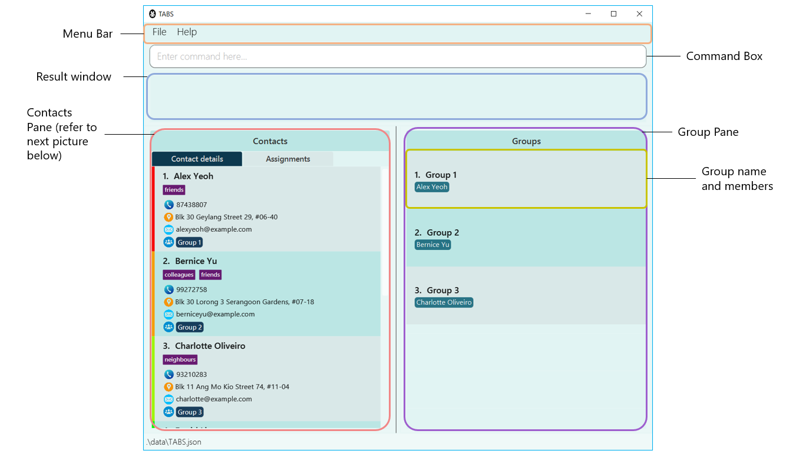

## Overview 

TABS is a project centric desktop application specially designed to manage contacts, groups and tasks within members of the group. TABS's target users are student project team leaders who are facing issues with **group management** and **task allocation**.

TABS aims to help project team leaders by
1. Simplifying the **group management** process.
2. Providing an **overview** of tasks assigned to members.

Individuals with a fast typing speed will benefit more because TABS optimized for use via a **Command-Line Interface** (CLI) while still having the benefits of a Graphical User Interface (GUI).

### Feature Overview

The features of TABS are as such:
1. Person management features - covering how to manage **Persons** in TABS.
2. Group management features - covering how to manage **Groups**, which consists of **Members** in TABS.
3. Task management features - covering how to manage **Tasks** amongst **Members**.
4. Miscellaneous features - other features for convenience.

Difference between _member_ and _person_:
* The terms _member_ and _person_ are different. A _person_ is someone who is registered in TABS. A _member_ is a _person_ who is part of a specific _group_.
  * i.e Alex is a person, but he is not a member of Group 1. He is however a member of Group 2.
* In order to add **Members**, the persons have to be present in TABS under **Contacts**.
* On deletion of **Members** in **Groups**, the corresponding **Contacts** of the person will still remain.

## Structure of this Document
This document is structured chronologically so that you can follow through with this guide while using the product.

Please refer to the Table of Contents if you are lost at any point of time.

## Table of Contents
- [1. Quick start](#1-quick-start)
- [2. Reading the Document](#2-reading-the-document)
  - [2.1 Text Style](#21-text-style)
  - [2.2 Special Boxes](#22-special-boxes)
  - [2.3 GUI Interface](#23-gui-interface)
  - [2.4 Command Format](#24-command-format)
  - [2.5 Prefixes](#25-prefixes)
- [3. Features](#3-features)
  - [3.1 Contact Features](#31-contact-features)
    - [3.1.1 Adding a person: `addperson`](#311-adding-a-person-addperson)
    - [3.1.2 Deleting a person : `deleteperson`](#312-deleting-a-person-deleteperson)
    - [3.1.3 Editing a person: `editperson`](#313-editing-a-person-editperson)
    - [3.1.4 Locating persons by name: `findperson`](#314-locating-persons-by-name-findperson)
    - [3.1.5 Listing all persons: `listpersons`](#315-listing-all-persons-listpersons)
  - [3.2 Group Features](#32-group-features)
    - [3.2.1 Adding a group: `addgroup`](#321-adding-a-group-addgroup)
    - [3.2.2 Deleting a group: `deletegroup`](#322-deleting-a-group-deletegroup)
    - [3.2.3 Adding a member to a group: `addmember`](#323-adding-a-member-to-a-group-addmember)
    - [3.2.4 Deleting a member from a group: `deletemember`](#324-deleting-a-member-from-a-group-deletemember)
    - [3.2.5 Display a group: `displaygroup`](#325-display-a-group-displaygroup)
    - [3.2.6 Listing all groups: `listgroups`](#326-listing-all-groups-listgroups)
  - [3.3 Task Features](#33-task-features)
    - [3.3.1 Assigning a task to a member: `assigntask`](#331-assigning-a-task-to-a-member-assigntask)
    - [3.3.2 Deleting a task from a member: `deletetask`](#332-deleting-a-task-from-a-member-deletetask)
    - [3.3.3 Assigning a task to all members: `assigntaskall`](#333-assigning-a-task-to-all-members-assigntaskall)
    - [3.3.4 Deleting a task from all members: `deletetaskall`](#334-deleting-a-task-from-all-members-deletetaskall)
  - [3.4 Miscellaneous Features](#34-miscellaneous-features)
    - [3.4.1 Viewing help: `help`](#341-viewing-help-help)
    - [3.4.2 Clearing existing data: `clear`](#342-clearing-all-entries-clear)
    - [3.4.3 Exiting the program : `exit`](#343-exiting-the-program-exit)
- [4. Glossary](#4-glossary)
- [5. Command summary](#5-command-summary)
  - [5.1 Contact Commands](#51-contact-commands)
  - [5.2 Group Commands](#52-group-commands)
  - [5.3 Task Commands](#53-task-commands)
  - [5.4 Miscellaneous Commands](#54-miscellaneous-commands)

## 1. Quick start
1. Ensure you have Java 11 or above installed in your Computer.
2. Download the latest TABS.jar from [here](https://github.com/AY2223S1-CS2103T-W10-1/tp/releases).
3. Copy the file to the folder you want to use as the home folder for your TABS.
4. Double-click the file to start the app. The GUI similar to the one below should appear in a few seconds.
Note how the app contains some sample data.
  

  
5. Refer to the [Features](#3-features) below for details of each command.

## 2. Reading the Document
This section will introduce you to the different symbols and syntax used throughout the guide, as well
as provide an overview of the features and GUI interface of TABS.

### 2.1 Text Style
Text that appear as `this` form refers to special terms related to TABS.

### 2.2 Special Boxes
**Additional Information**

Text that appears in an information box indicates additional information that is good to know.

  :information_source: <b>Note</b>: Sample information.

 

**Tip**

Text that appears in a tip box is useful information that can be used to improve your experience with TABS.

:bulb:
<b>Tip:</b> Sample Tip

### 2.3 GUI Interface
The images below show the sections of the TABS user interface.

Overview of the sections in the main window:

| Section       | Role                                 |
|---------------|--------------------------------------|
| Menu Bar      | Display menu items File and Help     |
| Command Box   | To type the commands                 |
| Result Window | Displays the result of user input    |
| Contacts Pane | Contains the list of persons in TABS |
| Group Pane    | Contains the list of groups in TABS  |

Overview of the sections in the contacts pane:

| Section            | Role                                                              |
|--------------------|-------------------------------------------------------------------|
| Tab Buttons        | Switch between Contact details and Assignments                    |
| Assignments        | Contains the assignment allocated to the person sorted by group   |
| Contact details    | Contains the person's information                                 |
| Workload indicator | Calculated workload of the person's assignments based on priority |

* Use the `TAB` key to navigate between command box, person pane, and group pane in TABS.

* Use arrow keys to switch between *Contact details* and *Assignments*.

### 2.4 Command Format
* Words in `UPPER_CASE` are the parameters to be supplied by the user. 
  e.g. in `addperson n/NAME`, `NAME` is a parameter which can be used as `addperson n/John Doe`.

* Items in square brackets are optional. 
  e.g `n/NAME [t/TAG]` can be used as `n/John Doe t/friend` or as `n/John Doe`.

* Items with `…`​ after them can be used multiple times including zero times. 
  e.g. `[t/TAG]…​` can be used as ` ` (i.e. 0 times), `t/friend`, `t/friend t/family` etc.

* Parameters can be in any order. 
  e.g. if the command specifies `n/NAME p/PHONE_NUMBER`, `p/PHONE_NUMBER n/NAME` is also acceptable.

* If a parameter is expected only once in the command but you specified it multiple times, only the last occurrence of the parameter will be taken. 
  e.g. if you specify `p/12341234 p/56785678`, only `p/56785678` will be taken.

* Extraneous parameters for commands that do not take in parameters (such as `listpersons`, `exit` and `clear`) will be ignored. 
  e.g. if the command specifies `listpersons 123`, it will be interpreted as `listpersons`.

* Commands involving the parameter `NAME` is case-sensitive, the `NAME` specified must be exactly the same as the one stored in TABS.

### 2.5 Prefixes

| Prefix | Field    |
|--------|----------|
| n/     | NAME     |
| p/     | PHONE    |
| e/     | EMAIL    |
| a/     | ADDRESS  |
| t/     | TAG      |
| g/     | GROUP    |
| task/  | TASK     |
| w/     | WORKLOAD |
| d/     | DEADLINE |

## 3. Features

### 3.1 Contact Features

This section covers commands related to Contacts.

#### 3.1.1 Adding a person: `addperson`

Adds a person to TABS.

Format: `addperson n/NAME p/PHONE_NUMBER e/EMAIL a/ADDRESS [t/TAG]…​`

:bulb:
<b>Tip:</b> A person can have any number of tags (including 0)

 

:information_source: <b>Extra note</b>:

A person's email must be in the form of `local-part@domain`, where the `domain`
specified must be at least 2 characters long.

Examples:
* `addperson n/John Doe p/98765432 e/johnd@example.com a/John street, block 123, #01-01`
* `addperson n/Betsy Crowe t/friend e/betsycrowe@example a/Newgate Prison p/1234567 t/criminal`

#### 3.1.2 Deleting a person: `deleteperson`

Deletes the specified person from TABS.

Format: `deleteperson NAME`
* Deletes the person with the specified `NAME`. The person with this `NAME` must already exist in the app.

Examples:
* `deleteperson Betsy` deletes the person with the username `Betsy`.
* `deleteperson Betsy Hoover` deletes the person with the username `Betsy Hoover`.

#### 3.1.3 Editing a person: `editperson`

Edits an existing person in TABS.

Format: `editperson NAME [n/NAME] [p/PHONE] [e/EMAIL] [a/ADDRESS] [t/TAG]…​`
* Edits the person with the specified `NAME`. The person with this `NAME` must already exist in the app.
* At least one of the optional fields must be provided.
* Existing values will be updated to the input values.
* When editing tags, the existing tags of the person will be removed i.e adding of tags is not cumulative.
* You can remove all the person’s tags by typing `t/` without
    specifying any tags after it.

Examples:
*  `editperson John Doe p/91234567 e/johndoe@example.com` Edits the phone number and email address of `John Doe` to be `91234567` and `johndoe@example.com` respectively.
*  `editperson BetsyCrower n/Betsy Crower t/` Edits the name of `BetsyCrower` to be `Betsy Crower` and clears all existing tags.

#### 3.1.4 Locating persons by name: `findperson`

Finds persons whose names contain any of the given keywords.

Format: `findperson KEYWORD [MORE_KEYWORDS]`
* The search is case-insensitive. e.g `hans` will match `Hans`
* The order of the keywords does not matter. e.g. `Hans Bo` will match `Bo Hans`
* Only the name is searched.
* Only full words will be matched e.g. `Han` will not match `Hans`
* Persons matching at least one keyword will be returned (i.e. `OR` search).
  e.g. `Hans Bo` will return `Hans Gruber`, `Bo Yang`

Examples:
* `findperson John` returns `john` and `John Doe`
* `findperson alex david` returns `Alex Yeoh`, `David Li`
 
 
  

#### 3.1.5 Listing all persons: `listpersons`

Shows a list of all persons in TABS.

Format: `listpersons`

### 3.2 Group Features

This section covers commands related to Groups.

#### 3.2.1 Adding a group: `addgroup`

Adds an empty group with the specified `GROUP` to TABS.

Format: `addgroup g/GROUP`

Examples:
* `addgroup g/CS2103T` will create an empty group with the group name `CS2103T`.

#### 3.2.2 Deleting a group: `deletegroup`

Deletes the specified group with the group name `GROUP` from TABS.

Format: `deletegroup g/GROUP`

Examples:
* `deletegroup g/CS2103T` deletes the group `CS2103T` from TABS.

#### 3.2.3 Adding a member to a group: `addmember`

Adds a member to a specified group.

Format: `addmember g/GROUP n/NAME`

Examples:
* `addmember g/CS2103T n/John Doe` will add `John Doe` to the group `CS2103T`.
* `addmember g/CS2101 n/Alice` will add `Alice` to the group `CS2101`.

#### 3.2.4 Deleting a member from a group: `deletemember`

Deletes an existing person from an existing group in TABS.

Format: `deletemember g/GROUP n/NAME`

Examples:
* `deletemember g/CS2103T n/John Doe` will delete member `John Doe` from the group `CS2103T`.
* `deletemember g/CS2101 n/Alice` will delete member `Alice` from the group `CS2103T`.

#### 3.2.5 Display a group: `displaygroup`

Displays the group members allocated to the specified `GROUP`.

Format: `displaygroup GROUP`
* Displays the members associated with the `GROUP`.

Examples:
* `displaygroup CS2103T` displays the members associated with `CS2103T`.

#### 3.2.6 Listing all groups: `listgroups`

Lists all existing groups in TABS.

Format: `listgroups`

### 3.3 Task Features

This section covers commands related to Tasks.

#### 3.3.1 Assigning a task to a member: `assigntask`

Assigns a task to a member with the given name in a group in TABS.

Format: `assigntask NAME g/GROUP task/TASK w/WORKLOAD [d/DEADLINE]`
* Assigns a `TASK` to a person with the specified `NAME`, `GROUP`, `WORKLOAD` and `DEADLINE`.
* `WORKLOAD` specified must be `low`, `medium` or `high` and is case-insensitive.
* `DEADLINE` must be in `yyyy-MM-dd` or `yyyy-MM-dd HH:mm` format.

Examples:
* `assigntask John g/CS2103T task/TeamProject w/High`
assigns `John` in group `CS2103T` with a `High` workload task `TeamProject`.
* `assigntask Alice g/Group Alpha task/Coursework 0 w/Low d/2022-01-01 23:59`
assigns `Alice` in group `Group Alpha` with a `Low` workload task `Coursework 0` and the deadline of the task is `2022-01-01 23:59`.

  :information_source: <b>Extra note</b>:

A workload indicator is shown beside each person in TABS.
When the workload of the person increases, the workload indicator will gradually change from green to red.
 

#### 3.3.2 Deleting a task from a member: `deletetask`

Deletes a task from a member with the given name in a group.

Format: `deletetask NAME g/GROUP task/TASK`
* Deletes a `TASK` from a person with the specified `NAME` and specified `GROUP`.

Examples:
* `deletetask John g/CS2103T task/TeamProject` deletes task `TeamProject` from person `John` in group `CS2103T`.
* `deletetask Billy g/Team Delta task/Delta Project` deletes `Delta Project` from person `Billy` within group `Team Delta`.

#### 3.3.3 Assigning a task to all members: `assigntaskall`

Assigns a task to all members in a group. Members with the same task are ignored.

Format: `assigntaskall g/GROUP task/TASK w/WORKLOAD [d/DEADLINE]`
* Assigns a `TASK` to all members with the specified `GROUP`, `WORKLOAD` and `DEADLINE`.
* `WORKLOAD` specified must be `low`, `medium` or `high` and is case-insensitive.
* `DEADLINE` must be in `yyyy-MM-dd` or `yyyy-MM-dd HH:mm` format.

  :information_source: <b>Extra note</b>:

`assigntaskall` will not add the specified `TASK` to members of the group if they have a task with the same name as the one being assigned, 
even if the `WORKLOAD` and `DEADLINE` of the new task is different.

Examples:
* `assigntaskall g/CS2103T task/TeamProject w/High`
assigns all members in group `CS2103T` with a `High` workload task `TeamProject`.
* `assigntaskall g/Group Alpha task/Coursework 0 w/Low d/2022-01-01 23:59`
assigns all members in group `Group Alpha` with a `Low` workload task `Coursework 0` and the deadline of the task is `2022-01-01 23:59`.

#### 3.3.4 Deleting a task from all members: `deletetaskall`

Deletes a task from all members in a group. Members without this task are ignored.

Format: `deletetaskall g/GROUP task/TASK`
* Deletes a `TASK` from all members with the specified `GROUP`.

  :information_source: <b>Extra note</b>:

`deletetaskall` will remove the specified `TASK` from all members of the group as long as the `TASK` in question has
the same name as the one initially assigned to the members, even if the `WORKLOAD` and `DEADLINE` of the tasks to be deleted may be different.

Examples:
* `deletetaskall g/CS2103T task/TeamProject` deletes task `TeamProject` from all members in group `CS2103T`.
* `deletetaskall g/Team Delta task/Delta Project` deletes task `Delta Project` from all members with in `Team Delta`.

### 3.4 Miscellaneous Features

This section covers other miscellaneous commands.

#### 3.4.1 Viewing help: `help`

Shows a list of commands explaining how to use TABS and a message to the TABS' user guide.

Format: `help`

#### 3.4.2 Clearing all entries: `clear`

Clears all entries from TABS.

Format: `clear`

#### 3.4.3 Exiting the program: `exit`

Exits the program.

Format: `exit`

## 4. Glossary

| Term                              | Meaning                                                                                 |
|-----------------------------------|-----------------------------------------------------------------------------------------|
| **Command-line interface(CLI)**   | `An interface where the user interacts with the program with lines of text as commands` |
| **Graphical user interface(GUI)** | `An interface where the user interacts with the program through graphical icons`        |
| **Persons**                       | `People that are stored in TABS, uniquely identified by their full name`                |
| **Contacts**                      | `List of Persons with their personal details`                                           |
| **Members**                       | `Copies of contacts that are added to groups`                                           |
| **Groups**                        | `Consists of members`                                                                   |
| **Tasks**                         | `Tasks that are assigned to members, consisting of workload and optional deadline`      |
| **Workload**                      | `The estimated amount of work to be done by a member, gauged by low, medium or high`    |
| **Deadline**                      | `The specified date the task has to be completed by`                                    |

## 5. Command summary

### 5.1 Contact Commands

| Action                    | Format, Examples                                                                                                                                            |
|---------------------------|-------------------------------------------------------------------------------------------------------------------------------------------------------------|
| **Add Person**            | `addperson n/NAME p/PHONE_NUMBER e/EMAIL a/ADDRESS [t/TAG]`  e.g. `addperson n/Betsy Crowe t/friend e/betsycrowe@example.com a/Newgate Prison p/1234567` |
| **Delete Person**         | `deleteperson NAME`  e.g. `deleteperson Betsy`                                                                                                           |
| **Edit Person**           | `editperson NAME [n/NAME] [p/PHONE_NUMBER] [e/EMAIL] [a/ADDRESS] [t/TAG]`  e.g. `editperson Alex Yeoh n/James Lee e/jameslee@example.com`                |
| **Find Person**           | `findperson KEYWORD [MORE_KEYWORDS]`  e.g. `findperson James Jake`                                                                                       |
| **List Persons**          | `listpersons`                                                                                                                                               |

### 5.2 Group Commands

| Action                    | Format, Examples                                                                                                                                            |
|---------------------------|-------------------------------------------------------------------------------------------------------------------------------------------------------------|
| **Add Group**             | `addgroup g/GROUP`   e.g. `addgroup g/CS2103T`                                                                                                           |
| **Delete Group**          | `deletegroup g/GROUP`   e.g. `deletegroup g/CS2103T`                                                                                                    |
| **Add Member**            | `addmember g/GROUP n/NAME`   e.g. `addmember g/CS2101 n/Alice`                                                                                          |
| **Delete Member**         | `deletemember g/GROUP n/NAME`   e.g. `deletemember g/CS2101 n/Alice`                                                                                    |
| **Display Group**         | `displaygroup GROUP`   e.g. `displaygroup CS2103T`                                                                                                      |
| **List Groups**           | `listgroups`                                                                                                                                                |

### 5.3 Task Commands

| Action                    | Format, Examples                                                                                                                                       |
|---------------------------|--------------------------------------------------------------------------------------------------------------------------------------------------------|
| **Assign Task**           | `assigntask NAME g/GROUP task/TASK w/WORKLOAD [d/DEADLINE]`   e.g. `assigntask Alice g/Group Alpha task/Coursework 0 w/Low  d/2022-01-01 23:59`    |
| **Delete Task**           | `deletetask NAME g/GROUP task/TASK`   e.g. `deletetask John g/CS2103T task/TeamProject`                                                            |
| **Assign Task   All** | `assigntaskall g/GROUP task/TASK w/WORKLOAD [d/DEADLINE]`   e.g. `assigntaskall g/Group Alpha task/Coursework 0 w/Low  d/2022-01-01 23:59`         |
| **Delete Task   All** | `deletetaskall g/GROUP task/TASK`   e.g. `deletetaskall g/CS2103T task/TeamProject`                                                                |

### 5.4 Miscellaneous Commands

| Action    | Format, Examples |
|-----------|------------------|
| **Help**  | `help`           |
| **Clear** | `clear`          |
| **Exit**  | `exit`           |
