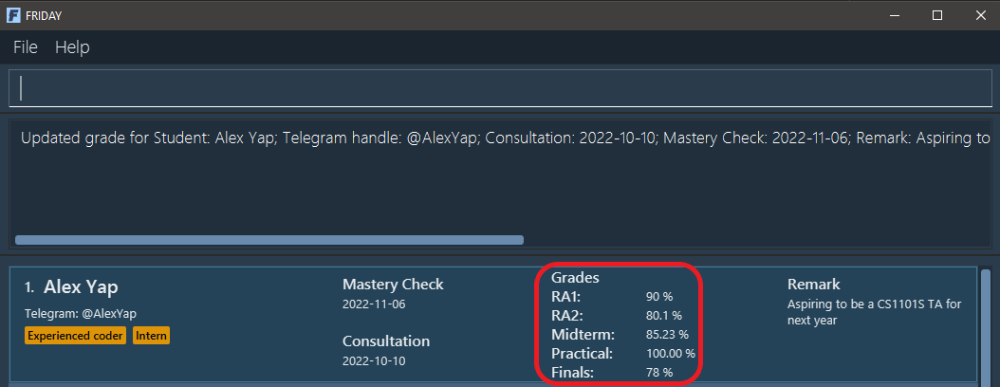
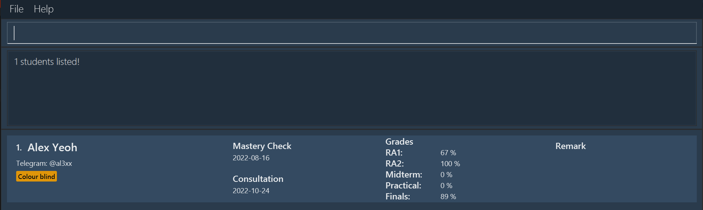
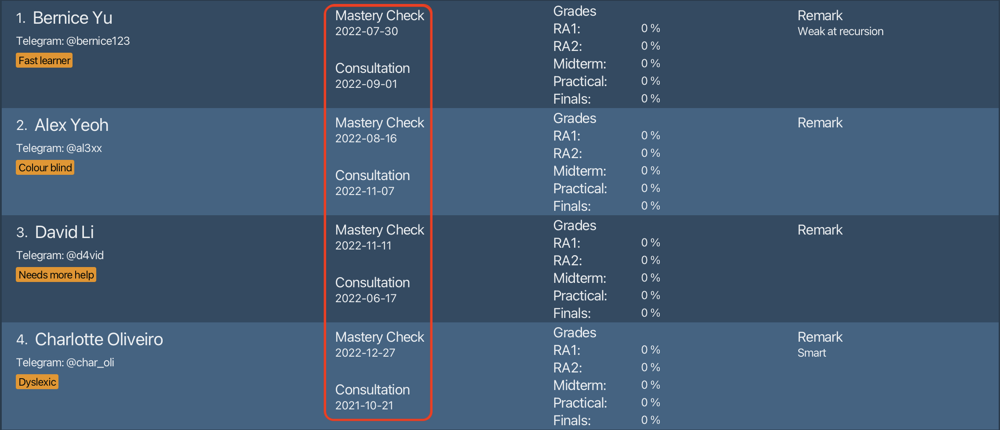

FRIDAY is a **desktop app for CS1101S Teaching Assistants to organize and track their students’ information and progress, 
optimized for use via a Command Line Interface** (CLI) while still having the benefits of a Graphical User Interface (GUI). 
If you can type fast, FRIDAY can get your student management tasks done faster than traditional GUI apps.

* Table of Contents
{:toc}

--------------------------------------------------------------------------------------------------------------------
## Quickstart

1. Ensure you have Java `11` or above installed in your computer.

2. Download the latest `friday.jar` from [here](https://github.com/AY2223S1-CS2103T-W15-4/tp/releases).

3. Copy the file to the folder you want to use as the *home folder* for your FRIDAY.

4. Double-click the file to start the app. The GUI similar to the one below should appear in a few seconds. Note how the app contains some sample data. 
   

5. Type the command in the command box and press Enter to execute it. e.g. typing **`help`** and pressing Enter will open the help window. 
   Some example commands you can try:
    * **`add n/Alex Yeoh t/al3xx c/2022-10-25`** : Adds a student named `Alex Yeoh` to FRIDAY.

    * **`list`** : Lists all students.
    
    * **`delete 2`** : Deletes the 2nd student shown in the current list.

    * **`clear`** : Deletes all students.

    * **`exit`** : Exits FRIDAY.
   
6. Refer to the [Features](#features) below for details of each command.

--------------------------------------------------------------------------------------------------------------------

## Features

**:information_source: Notes about the command format:** 

* Words in `UPPER_CASE` are the parameters to be supplied by the user. 

  e.g. in `add n/NAME`, `NAME` is a parameter which can be used as `add n/John Doe`.

* Items in square brackets are optional. 

  e.g `n/NAME [t/TELEGRAM_HANDLE]` can be used as `n/John Doe t/johndoe` or as `n/John Doe`.

* Items with `…`​ after them can be used multiple times including zero times. 

  e.g. `[tag/TAG]…​` can be used as ` ` (i.e. 0 times), `tag/fast learner`, `tag/fast learner tag/good at recursion` etc.

* Parameters can be in any order. 

  e.g. if the command specifies `n/NAME t/TELEGRAM_HANDLE`, `t/TELEGRAM_HANDLE n/NAME` is also acceptable.

* If a parameter is expected only once in the command, but you specified it multiple times, only the last occurrence of the parameter will be taken. Note that this does not apply to the `INDEX` parameter in commands that have it, namely the `delete`, `edit`, `remark`, `grade`, `mark` and `unmark` commands, as they expect exactly one `INDEX` parameter. 

  e.g. if you specify `t/johndoe t/johndoe123`, only `t/johndoe123` will be taken.

* Extraneous parameters for commands that do not take in parameters (such as `help`, `list`, `exit` and `clear`) will be ignored. 

  e.g. if the command specifies `help 123`, it will be interpreted as `help`.

* `INDEX` is used in commands to refer to a specific student by their index number on the currently displayed list, 
   so it ` **must be a positive integer** 1, 2, 3, …​

### Clearing all existing data: `clear`

Clears all existing data in FRIDAY, resulting in an empty Student list.

Format: `clear`

### Adding a student: `add`

Adds a student to FRIDAY, with the given name, Telegram handle, consultation date, Mastery Check date, and tags.

Format: `add n/NAME [t/TELEGRAM_HANDLE] [c/CONSULTATION_DATE] [m/MASTERY_CHECK_DATE] [tag/TAG]...`

**:information_source: Note:** 
All student names and Telegram handles in FRIDAY must be unique.

:bulb: **Tip:**
A student can have any number of tags (including 0).

Example: `add n/Alex Yeoh t/al3xx c/2022-10-25 m/2022-08-16 tag/cool guy tag/quiet`

Outcome: a student named Alex Yeoh is added.

### Deleting a student: `delete`

Deletes the student at the given index from FRIDAY. 

Format: `delete INDEX`

**:information_source: Note:** 
The index of the student must be specified and there should be exactly one INDEX parameter.

:bulb: **Tip:**
The index of the student can be seen from the student list.

### Editing a student: `edit`

Edits a student's details in FRIDAY.

Format: `edit INDEX [n/NAME] [t/TELEGRAM_HANDLE] [c/CONSULTATION] [m/MASTERY_CHECK] [tag/TAG]`

:bulb: **Tip:**
The index of the student must be specified and there should be exactly one INDEX parameter. 
The index of the student can be seen from the student list. 
The name, Telegram handle, consultation, mastery check, and tag(s) are optional, but there should be at least one parameter. 
A student can have any number of tags (including 0).

### Editing a remark for a student: `remark`

Adds a remark for a specified student.

Format: `remark INDEX [r/REMARK]`

:bulb: **Tip:**
The index of the student must be specified and there should be exactly one INDEX parameter. 
The index of the student can be seen from the student list. 
The remark is optional. Not including the remark (i.e. `remark INDEX`) will remove any existing remark from the student. 

### Recording grades for a student: `grade`

Records the grades of the assessments and examinations for a specified student.

Format: `grade INDEX [ra1/RA1_SCORE] [ra2/RA2_SCORE] [pa/PRACTICAL_SCORE] [mt/MID_TERM_SCORE] [ft/FINALS_SCORE]`

:bulb: **Tip:**
The index of the student must be specified and there should be exactly one INDEX parameter. 
The index of the student can be seen from the student list. 
The scores of the assessments, Reading Assessment 1 (RA1), Reading Assessment 2 (RA2), Practical Assessment (PA), Midterm Test, and Final Examination, are in percentages between 0% to 100% inclusive, with up to 2 decimals allowed. 
The scores are optional, but there should be at least one parameter.

Example after entering `grade 1 ra1/90 ra2/80 pa/100 mt/85 ft/78`:

### Finding individual student details: `find`

View a particular student's details.

Format: `find KEYWORDS`

:bulb: **Tip:**
Use student name/telegram handle/consultation/mastery check date/remark to search up a particular student.
Note: Multiple keywords can be entered and each keyword is separated by a space.
Note: when searching for exam grade use format `find [exam_name:EXAM_SCORE]`

Example:

Outcome:

### Viewing all students: `list`

Lists all students in FRIDAY. This command helps you to reset the sorting and finding done by the `sort` and `find` command respectively.

Format: `list`

### Sorting students: `sort`

Sorts all students in FRIDAY with the given criteria, in ascending or descending order.

Format: `sort CRITERIA/ORDER`

* `CRITERIA` can be `n` (name), `t` (Telegram handle), `c` (consultation), `m` (Mastery Check), or the following grades: `ra1`, `ra2`, `mt`, `pa`, `mt`, and `ft`
* `ORDER` can be `a` (ascending) or `d` (descending)

How criteria are sorted:
* Names and Telegram handles are sorted in alphabetical order
* Consultations and Mastery Checks are sorted by time
* Grades are sorted in numerical order

**:information_source: Note:** 
* If the `find` command was run before `sort`, using `sort` will undo the result of `find` and all students will be sorted.
* Students with missing information will be sorted first in descending order, e.g. students with no Telegram handles
  will be shown before students with Telegram handles.

Example: enter `sort m/a` with an unsorted list of students.

Outcome: students are sorted by Mastery Check date, from earliest to latest.

### Marking a student's Mastery Check as passed: `mark`

Marks the Mastery Check of a specified student as passed.

Format: `mark INDEX`

:bulb: **Tip:**
The index of the student must be specified and there should be exactly one INDEX parameter. 
The index of the student can be seen from the student list. 

Example after entering `mark 1`:

### Unmarking a student's Mastery Check: `unmark`

Unmarks the Mastery Check of a specified student.

Format: `unmark INDEX`

:bulb: **Tip:**
The index of the student must be specified and there should be exactly one INDEX parameter. 
The index of the student can be seen from the student list. 

Example after entering `unmark 1` (Assuming student 1's Mastery Check has previously been marked as passed):

### Adding aliases: `alias`

Adds an alias for a command into FRIDAY, which you can use in place of the default command keywords. 
This allows you to be more efficient in using FRIDAY.

Format: `alias a/ALIAS k/COMMAND_KEYWORD`

* `COMMAND_KEYWORD` must be a default command keyword (e.g `add` in Adding students)
* `ALIAS` must not be a default command keyword and contain exactly one word

Example:
* `alias a/ls k/list` adds an alias `ls` for the viewing all students command `list`. 
Now, typing `ls` into the command box will execute the `list` command.
* `alias a/a k/add` adds an alias `a` for the adding a student command `add`. 
Now, typing `a n/John Doe` will add a student named John Doe into FRIDAY.

### Deleting aliases: `unalias`

Deletes an existing alias, which is no longer needed, in FRIDAY.

Format: `unalias a/ALIAS`

Example:
* `unalias a/ls` will delete the alias `ls` if it exists in FRIDAY.

### Viewing aliases: `aliaslist`

Views all aliases in FRIDAY, so that you know what aliases you have created and the commands they are for.

Format: `aliaslist`

### Getting User Guide link: `guide`

Returns a link to FRIDAY's User Guide.

Format: `guide`

### Getting help: `help`

Shows a summary of commands along with their command word used in FRIDAY. This allows you to have an easily accessible summary when using FRIDAY. 
It also includes a link to this User Guide if needed.

Format: `help`

### Exiting FRIDAY : `exit`

Exits FRIDAY.

Format: `exit`

### Saving the data

FRIDAY's data is saved in the hard disk automatically after any command that changes the data. There is no need to save manually.

### Editing the data file

FRIDAY's student and alias data is saved as a JSON file at `[JAR file location]/data/friday.json`. 
Advanced users are welcome to update data directly by editing the data file.

:exclamation: **Caution:**
If your changes to the data file makes its format invalid, FRIDAY will ignore all data and start with an empty file in the next run. 

--------------------------------------------------------------------------------------------------------------------

## FAQ

**Q**: How do I transfer my data to another computer? 
**A**: Install FRIDAY in the other computer and overwrite the empty data file it creates with the file that contains the data of your previous FRIDAY home folder.

**Q**: I accidentally made the data file invalid and now my old data does not show in FRIDAY. How do I fix this? 
**A**: To retrieve the old data, revert all invalid changes in the data file **before running any commands** in FRIDAY.

--------------------------------------------------------------------------------------------------------------------

## Command Summary

| Action                                       | Format                                                                                                   |
|----------------------------------------------|----------------------------------------------------------------------------------------------------------|
| **Add a student**                            | `add n/NAME [t/TELEGRAM_HANDLE] [c/CONSULTATION_DATE] [m/MASTERY_CHECK_DATE] [tag/TAG]...`               |
| **Delete a student**                         | `delete INDEX`                                                                                           |
| **Edit a student's details**                 | `edit INDEX [n/NAME] [t/TELEGRAM_HANDLE] [c/CONSULTATION] [m/MASTERY_CHECK] [tag/TAG]...`                |
| **Add remarks for a student**                | `remark INDEX [r/REMARK]`                                                                                |
| **Record the grades for a student**          | `grade INDEX [ra1/RA1_SCORE] [ra2/RA2_SCORE] [pa/PRACTICAL_SCORE] [mt/MID_TERM_SCORE] [ft/FINALS_SCORE]` |
| **Find a student's details**                 | `find KEYWORDS`                                                                                          |
| **Mark a student's Mastery Check as passed** | `mark INDEX`                                                                                             |
| **Unmark a student's Mastery Check**         | `unmark INDEX`                                                                                           |
| **View all students**                        | `list`                                                                                                   |
| **Sort students**                            | `sort CRITERIA/ORDER`                                                                                    |
| **Add Alias**                                | `alias a/ALIAS k/COMMAND_KEYWORD`                                                                        |
| **Delete Alias**                             | `unalias a/ALIAS`                                                                                        |
| **View all alias**                           | `aliaslist`                                                                                              |
| **Get a link to the User Guide**             | `guide`                                                                                                  |
| **Getting Help**                             | `help`                                                                                                   |
| **Exiting FRIDAY**                           | `exit`                                                                                                   |
