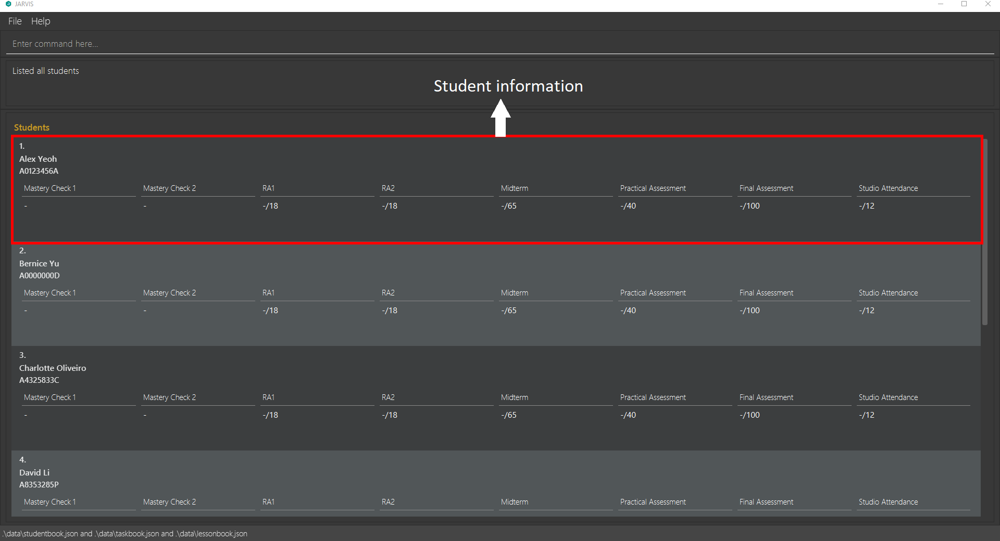
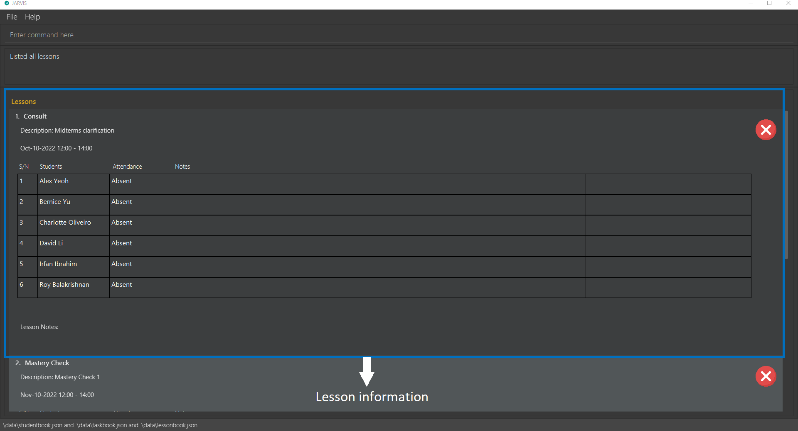
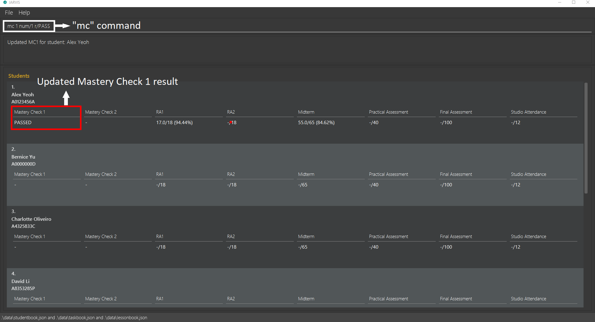
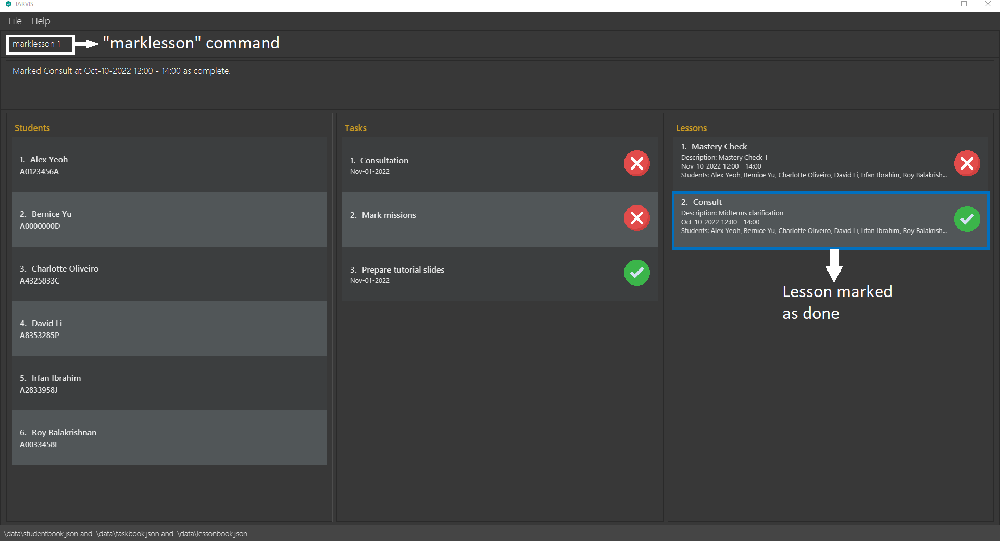
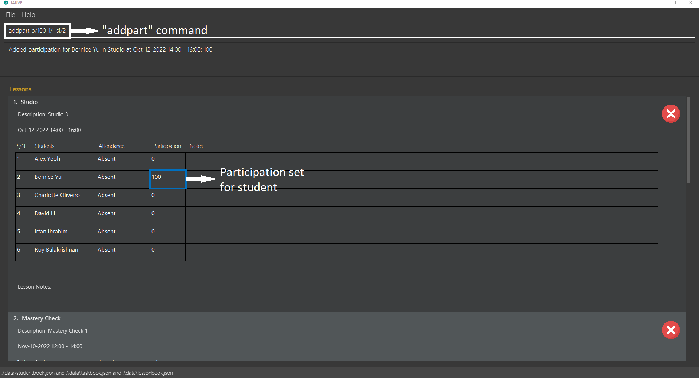

This guide provides everything a CS1101S Teaching Assistant (TA) needs to know to get the most out of JARVIS!

To use this guide, simply click on the items you would like to learn more about in the table of contents, or scroll down to the relevant sections.

## Table of Contents

* [What is JARVIS?](#what-is-jarvis)
* [Using this guide](#using-this-guide)
* [The Basics](#the-basics)
* [Quick start](#quick-start)
* [Basic commands](#basic-commands)
  * [Viewing help : `help`](#viewing-help--help)
  * [Listing all students : `liststudent`](#listing-all-students--liststudent)
  * [Listing all tasks : `listtask`](#listing-all-tasks--listtask)
  * [Listing all lessons : `listlesson`](#listing-all-lessons--listlesson)
  * [Listing all students, tasks and lessons : `listall`](#listing-all-students-tasks-and-lessons--listall)
  * [Clearing all entries : `clear`](#clearing-all-entries--clear)
  * [Exiting the program : `exit`](#exiting-the-program--exit)
* [Student commands](#student-commands)
  * [Adding a student : `addstudent`](#adding-a-student--addstudent)
  * [Deleting a student : `deletestudent`](#deleting-a-student--deletestudent)
  * [Editing a student : `editstudent`](#editing-a-student--editstudent)
  * [Locating students by name : `findstudent`](#locating-students-by-name--findstudent)
  * [Adding grades to a student : `grade`](#adding-grades-to-a-student--grade)
  * [Setting mastery check result for a student : `mc`](#setting-mastery-check-result-for-a-student--mc)
* [Task commands](#task-commands)
  * [Adding a task : `addtask`](#adding-a-task--addtask)
  * [Deleting a task : `deletetask`](#deleting-a-task--deletetask)
  * [Marking a task as done : `marktask`](#marking-a-task-as-done--marktask)
  * [Marking a task as not done : `unmarktask`](#marking-a-task-as-not-done--unmarktask)
* [Lesson commands](#lesson-commands)
  * [Adding a studio lesson : `addstudio`](#adding-a-studio-lesson--addstudio)
  * [Adding a consult lesson : `addconsult`](#adding-a-consult-lesson--addconsult)
  * [Adding a mastery check lesson : `addmc`](#adding-a-mastery-check-lesson--addmc)
  * [Deleting a lesson : `deletelesson`](#deleting-a-lesson--deletelesson)
  * [Marking a lesson as completed : `marklesson`](#marking-a-lesson-as-completed--marklesson)
  * [Marking a lesson as not completed : `unmarklesson`](#marking-a-lesson-as-not-completed--unmarklesson)
  * [Marking a student as present for a lesson : `markstudent`](#marking-a-student-as-present-for-a-lesson--markstudent)
  * [Marking a student as absent for a lesson : `unmarkstudent`](#marking-a-student-as-absent-for-a-lesson--unmarkstudent)
  * [Adding a note to a lesson : `addnote`](#adding-a-note-to-a-lesson--addnote)
  * [Deleting a note from a lesson : `deletenote`](#deleting-a-note-from-a-lesson--deletenote)
  * [Adding participation for a student in a lesson : `addpart`](#adding-participation-for-a-student-in-a-lesson--addpart)
* [Saving the data](#saving-the-data)
* [Editing the data file](#editing-the-data-file)
* [FAQ](#faq)
* [Command summary](#command-summary)

--------------------------------------------------------------------------------------------------------------------
## What is JARVIS?

JARVIS is a **desktop app for a CS1101S Teaching Assistant to manage students, tasks and lessons, optimized for use via a Command Line Interface** (CLI) while still having the benefits of a Graphical User Interface (GUI).

Using JARVIS, the TA can
* keep track of their students' grades for each graded assignment
* see the tasks that they have do and their respective deadlines
* plan for upcoming tutorial classes and consultations

If you are a CS1101S TA who is familiar with Command Line Interface and can type fast, JARVIS will allow you to efficiently manage your students, tasks and lessons.

[🠕 Back To Top](#table-of-contents)

--------------------------------------------------------------------------------------------------------------------
## Using this guide

Before reading the rest of this guide, you might find it helpful to know the meanings of icons and syntax used!

| Icons/Syntax         | Meaning                                    |
|----------------------|--------------------------------------------|
| :information_source: | Information that you should take note of   |
| :bulb:               | Useful advice                              |
| :exclamation:        | Warnings you should read before proceeding |
| `markdown`           | Commands or examples                       |    

[🠕 Back To Top](#table-of-contents)

--------------------------------------------------------------------------------------------------------------------
## The Basics

There are 3 main entities in JARVIS - Students, Tasks and Lessons. 

- Student entity: Represents a student of the TA
- Task entity: Represents a task (to be) completed by the TA
- Lesson entity: Represents a lesson (to be) conducted by the TA

JARVIS takes in user input via Command Line Interface (CLI) commands. These CLI commands can be categorised into 4 main types - Basic, Student, Task and Lesson commands. 

- Basic commands: General-purpose commands that are not tied to a single entity (e.g. a command used to exit the app)
- Student commands: Used for managing Student entities (e.g. adding/deleting students)
- Task commands: Used for managing Task entities (e.g. marking tasks as completed)
- Lesson commands: Used for managing Lesson entities (e.g. recording attendance for a lesson)

To execute a command, type it into the command box and press Enter. Refer to [Quick start](#quick-start) for an illustration of this.

Commands have to be written in the correct format to be used. The format for each command is specified using the convention below.

**:information_source: Notes about the command format:** 

* Words in `UPPER_CASE` are the parameters to be supplied by the user. 
  e.g. in `addstudent s/STUDENT_NAME m/MATRIC_NUM`, `STUDENT_NAME` and `MATRIC_NUM` are parameters which can be used as `addstudent s/John Doe m/A0123459G`.

* Items in square brackets are optional. 
  e.g. `t/TASK_DESC [d/DEADLINE]` can be used as `t/Mark quest 2 d/2022-11-01` or as `t/Mark quest 2`.

* Parameters can be in any order. 
  e.g. if the command specifies `t/TASK_DESC d/DEADLINE`, `d/DEADLINE t/TASK_DESC` is also acceptable.

* If a parameter is expected multiple times in the command such as student index in adding a consult lesson, all occurrences of the parameter will be considered.  
  e.g. if you specify `si/1 si/2` in a command expecting multiple `si/` parameters, both `si/1` and `si/2` will be considered.

* If a parameter is expected only once in the command, but you specified it multiple times, only the last occurrence of the parameter will be taken. 
  e.g. if you specify `s/John Tan s/Sally Yeoh`, only `s/Sally Yeoh` will be taken.

* Extraneous parameters for commands that do not take in parameters (such as `help`, `listall`, `exit` and `clear`) will be ignored. 
  e.g. if you input `help 123`, it will be interpreted as `help`.

[🠕 Back To Top](#table-of-contents)

## Quick start

1. Ensure you have Java `11` or above installed in your computer. 

    - If you already have Java installed, you may follow [these instructions](https://appuals.com/check-java-version-win-mac/) on how to check which version you have installed.
    - If you have not installed, you may download Java for your OS from [this website](https://www.oracle.com/sg/java/technologies/javase/jdk11-archive-downloads.html). 

   
:information_source: **Note:** JARVIS is supported on Windows, Linux, and OS-X platforms.
   

3. Download the latest `jarvis.jar` from [here](https://github.com/AY2223S1-CS2103T-T11-3/tp/releases).

4. Copy the file to the folder you want to use as the _home folder_ for JARVIS.

5. Double-click the file to start the app. The GUI should appear in a few seconds. Set the app to fullscreen for a better view of the sample data.

   

6. Type the command in the Command Box and press Enter to execute it. e.g. typing **`help`** and pressing Enter will open the help window.

   

   :bulb: **Tip:** The following diagram shows the different components of the GUI.  
       
   

   Some example commands you can try:

   * **`liststudent`** : Shows an expanded list of all students.

   * **`addstudent s/John Doe m/A0123459G`** : Adds a student named `John Doe` with matriculation (matric) number `A0123459G` to JARVIS.

   * **`deletestudent 3`** : Deletes the 3rd student shown in the student list.

   * **`clear`** : Deletes all students, tasks and lessons. Use this command to delete the sample data in JARVIS before adding your own data.

   * **`exit`** : Exits the app.

7. Refer to the [Basic commands](#basic-commands) below to get started with the basic commands.

[🠕 Back To Top](#table-of-contents)

--------------------------------------------------------------------------------------------------------------------

## Basic commands
This section contains the basic commands of JARVIS.

### Viewing help : `help`

Shows a message explaining how to access our user guide, which provides detailed information on how to use JARVIS.

Format: `help`

### Listing all students : `liststudent`

Shows an expanded list of all your students, so that you can see all the student details.

Format: `liststudent`

**:information_source: Note:** 

* Additional information such as grades for each student will be displayed.

### Listing all tasks : `listtask`

Shows an expanded list of all your tasks, so that you can see all the task details.

Format: `listtask`

### Listing all lessons : `listlesson`

Shows an expanded list of all your lessons, so that you can see all the lesson details.

Format: `listlesson`

**:information_source: Note:** 

* Additional information such as student participation and notes for each lesson will be displayed.

### Listing all students, tasks and lessons : `listall`

Shows an overview of your student, task and lesson lists.

Format: `listall`

**:information_source: Note:** 

* The three lists will be arranged in the order: students, tasks, lessons.
* Additional information will be hidden to provide an overview of all three lists.
* Students in the student list are sorted in ascending order according to the lexicographical order of their names. Students with the same name are sorted similarly according to their matric number.
* Tasks that are not done are grouped at the top of the list while tasks that are done are grouped at the bottom. In the group of tasks that are not done, the tasks are sorted with the earliest deadline tasks at the top. In the group of tasks that are done, the tasks are sorted with the latest deadline tasks at the top. Tasks without deadlines are placed below tasks with deadlines.
* Lessons that are not completed are grouped at the top of the list while lessons that are completed are grouped at the bottom. In the group of lessons that are not completed, the lessons are sorted with the earliest lessons at the top. In the group of lessons that are completed, the lessons are sorted with the latest lessons at the top.

### Clearing all entries : `clear`

Clears all students, tasks and lessons from JARVIS.

Format: `clear`

:exclamation: **Caution:**
This action is irreversible! Please think twice before you use this command!

### Exiting the program : `exit`

Exits the program. Your changes will be saved automatically.

Format: `exit`

[🠕 Back To Top](#table-of-contents)

--------------------------------------------------------------------------------------------------------------------

## Student commands
This section contains commands for managing students.

### Adding a student : `addstudent`

Adds a student with name and matric number to your student list.

Format: `addstudent s/NAME m/MATRIC_NUM`

* `m/MATRIC_NUM` must start with 'A', followed by 7 digits and a capital letter.
* A maximum of 10 students can exist in your student list at any point in time. You will not be allowed to add more students after reaching the limit of 10 students.
* `MATRIC_NUM` provided must not already exist in your student list. 

Examples:
* `addstudent s/John Doe m/A0123459G` adds a student named `John Doe` with matric number `A0123459G` to your student list.
* `addstudent s/Alex Yeoh m/A0123456A` adds a student named `Alex Yeoh` with matric number `A0123456A` to your student list. 

### Deleting a student : `deletestudent`

Deletes a student from your student list based on the student index.

Format: `deletestudent STUDENT_INDEX`

* `STUDENT_INDEX` refer to the index number shown in your student list.
* `STUDENT_INDEX` **must be a positive integer** 1, 2, 3, …​

Examples:
* `deletestudent 2` deletes the 2nd student shown in your student list.

### Editing a student : `editstudent`

Edits the details of an existing student in your student list based on the student index. You have to provide the new name and/or matric number to be edited.

Format: `editstudent STUDENT_INDEX [s/NAME] [m/MATRIC_NUM]`

* Edits the student at the specified `STUDENT_INDEX`. The index refers to the index number shown in the displayed student list.
* `STUDENT_INDEX` **must be a positive integer** 1, 2, 3, …​
* At least one of the optional fields must be provided.
* Existing values will be updated to the input values.

Examples:
* `editstudent 1 s/John Do` edits the name of the 1st student in your student list to be `John Do`. The matric number of the 1st student will remain the same.
* `editstudent 2 s/Alex Li m/A1234567Z` edits the name of the 2nd student in your student list to be `Alex Li` and matric number to be `A1234567Z`.

**:bulb:Tip:** 
If you have two or more students with similar names, you can use the `editstudent` command to change the name(s) of the students so that you can differentiate them easily.

### Locating students by name : `findstudent`

Finds students whose names contain any of the given keywords, so that you can search for students easily.

Format: `findstudent KEYWORD [MORE_KEYWORDS]`

* The search is case-insensitive. e.g. `hans` will match `Hans`.
* The order of the keywords does not matter. e.g. `Hans Bo` will match `Bo Hans`.
* Only the name is searched.
* Only full words will be matched e.g. `Han` will not match `Hans`.
* Students with names matching at least one keyword will be returned (i.e. `OR` search)
  e.g. `Hans Bo` will return `Hans Gruber`, `Bo Yang`

Examples:
* `findstudent yeoh` on the sample data you start with filters the student list to contain only `Alex Yeoh`. 

### Adding grades to a student : `grade`

Records grades for a student's assessments, so that you can keep track of their grades.

Format: `grade STUDENT_INDEX [ra1/MARKS] [ra2/MARKS] [mt/MARKS] [pa/MARKS] [fn/MARKS]`

* Add grades to the student at the specified `STUDENT_INDEX`. The index refers to the index number shown in the displayed student list.
* `STUDENT_INDEX` **must be a positive integer** 1, 2, 3, …​
* `ra1/MARKS` is optional, if specified will record a grade for RA1 (Reading Assessment 1).
* `ra2/MARKS` is optional, if specified will record a grade for RA2 (Reading Assessment 2).
* `mt/MARKS` is optional, if specified will record a grade for Midterm.
* `pa/MARKS` is optional, if specified will record a grade for Practical Assessment.
* `fn/MARKS` is optional, if specified will record a grade for Final Assessment.
* At least one of the optional fields must be provided.

Examples:

* `grade 1 ra1/17 mt/55` records the grades for the 1st student in your student list: 17 marks for RA1 and 55 marks for midterms. 

### Setting mastery check result for a student : `mc`

Sets mastery check result for a student, so that you can keep track of which students have completed or need to complete this assessment.

Format: `mc STUDENT_INDEX num/MC_NUM r/MC_RESULT`

* Sets mastery check result for the student at the specified `STUDENT_INDEX`. The index refers to the index number shown in the displayed student list.
* `STUDENT_INDEX` **must be a positive integer** 1, 2, 3, …​
* `MC_NUM` must be 1 or 2, referring to Mastery Check 1 or 2.
* `MC_RESULT` must be "pass" or "fail".
* `MC_RESULT` is not case-sensitive.

Examples:
* `mc 1 num/1 r/pass` sets the mastery check result for the 1st student in your student list to `PASS`.

[🠕 Back To Top](#table-of-contents)

--------------------------------------------------------------------------------------------------------------------

## Task commands
This section contains commands for managing tasks.

### Adding a task : `addtask`

Adds a task with description and optional deadline to your task list.

Format: `addtask t/TASK_DESC [d/DEADLINE]`

* `d/DEADLINE` is optional, if specified will indicate a deadline for the task.
* `d/DEADLINE` should be in the format `yyyy-MM-dd`.
* Task to be added must not already exist in the task list. 

Examples:
* `addtask t/Prepare tutorial slides d/2022-11-01` adds a task with description `Prepare tutorial slides` and deadline of `Nov-11-2022` to your task list.
* `addtask t/Mark missions` adds a task with description `Mark missions` and no deadline to your task list.

### Deleting a task : `deletetask`

Deletes a task from your task list based on the task index.

Format: `deletetask TASK_INDEX`

* `TASK_INDEX` refer to the index number shown in your task list.
* `TASK_INDEX` **must be a positive integer** 1, 2, 3, …​

Examples:
* `deletetask 2` deletes the 2nd task in your task list.

### Marking a task as done : `marktask`

Marks a task as done based on the task index.

Format: `marktask TASK_INDEX`

* `TASK_INDEX` refers to the index number shown in the displayed list of tasks.
* `TASK_INDEX` **must be a positive integer** 1, 2, 3, …​

Example:
* `marktask 2` marks the 2nd task in your task list as done.

:bulb: **Tip:** Tasks that have been marked as done will get shifted below tasks that are not done.

### Marking a task as not done : `unmarktask`

Marks a task as not done based on the task index.

Format: `unmarktask TASK_INDEX`

* `TASK_INDEX` refers to the index number shown in the displayed list of tasks.
* `TASK_INDEX` **must be a positive integer** 1, 2, 3, …​

Example:
* `unmarktask 2` marks the 2nd task in your task list as not done.

[🠕 Back To Top](#table-of-contents)

--------------------------------------------------------------------------------------------------------------------

## Lesson commands
This section contains commands for managing lessons.

### Adding a studio lesson : `addstudio`

Adds a studio lesson to your lesson list. 

Format: `addstudio [l/LESSON_DESC] sd/START_DATE st/START_TIME [ed/END_DATE] et/END_TIME`

* `l/LESSON_DESC` is optional.
* `sd/START_DATE` and `ed/END_DATE` should be in the format `yyyy-MM-dd`.
* `st/START_TIME` and `et/END_TIME` should be in the format `hh:mm`.
* `ed/END_DATE` is optional, if unspecified `END_DATE` will be assumed to be the same as `START_DATE`.
* Studio to be added must not already exist in your lesson list.
* Studio to be added must not clash in timing with other lessons in your lesson list.

Examples:
* `addstudio l/Studio 3 sd/2022-10-12 st/14:00 et/16:00` adds a studio lesson with description `Studio 3` on `Oct-12-2022` from `14:00` to `16:00`.

### Adding a consult lesson : `addconsult`

Adds a consult lesson to your lesson list.

Format: `addconsult [l/LESSON_DESC] sd/START_DATE st/START_TIME [ed/END_DATE] et/END_TIME si/STUDENT_INDEX...`

* `l/LESSON_DESC` is optional.
* `sd/START_DATE` and `ed/END_DATE` should be in the format `yyyy-MM-dd`.
* `st/START_TIME` and `et/END_TIME` should be in the format `hh:mm`.
* `ed/END_DATE` is optional, if unspecified `END_DATE` will be assumed to be the same as `START_DATE`.
* `si/STUDENT_INDEX` can be specified one or more times according to the number of attending students.
* Consult to be added must not already exist in your lesson list.
* Consult to be added must not clash in timing with other lessons in your lesson list.

Examples:
* `addconsult l/Consultation on recursion sd/2022-10-14 st/12:00 et/14:00 si/3 si/4` adds a consult lesson with description `Consultation on recursion` on `Oct-14-2022` from `12:00` to `14:00` with the 3rd and 4th student in your student list.
* `addconsult sd/2022-10-15 st/23:00 ed/2022-10-16 et/00:00 si/1` adds a consult lesson from `Oct-15-22 23:00` to `Oct-16-22 00:00` with the 1st student in your student list.

### Adding a mastery check lesson : `addmc`

Adds a mastery check lesson to your lesson list.

Format: `addmc [l/LESSON_DESC] sd/START_DATE st/START_TIME [ed/END_DATE] et/END_TIME si/STUDENT_INDEX...`

* `l/LESSON_DESC` is optional.
* `sd/START_DATE` and `ed/END_DATE` should be in the format `yyyy-MM-dd`.
* `st/START_TIME` and `et/END_TIME` should be in the format `hh:mm`.
* `ed/END_DATE` is optional, if unspecified `END_DATE` will be assumed to be the same as `START_DATE`.
* `si/STUDENT_INDEX` can be specified one or more times according to the number of attending students.
* Mastery Check to be added must not already exist in your lesson list.
* Mastery Check to be added must not clash in timing with other lessons in your lesson list.

Examples:
* `addmc l/Mastery check 1 sd/2022-10-12 st/12:00 et/14:00 si/1 si/2` adds a mastery check lesson with description `Mastery check 1` on `Oct-20-2022` from `12:00` to `14:00` with the 1st and 2nd student in your student list.
* `addmc sd/2022-11-13 st/23:00 ed/2022-11-14 et/00:00 si/1` adds a mastery check lesson from `Nov-13-2022 23:00` to `Nov-14-2022 00:00` with the 1st student in your student list.

### Deleting a lesson : `deletelesson`

Deletes a lesson from your lesson list based on the lesson index.

Format: `deletelesson LESSON_INDEX`

* `LESSON_INDEX` refer to the index number shown in your lesson list.
* `LESSON_INDEX` **must be a positive integer** 1, 2, 3, …​

Examples:
* `deletelesson 2` deletes the 2nd lesson in your lesson list.

### Marking a lesson as completed : `marklesson`

Marks a lesson as completed based on the lesson index.

Format: `marklesson LESSON_INDEX`

* `LESSON_INDEX` refer to the index number shown in your lesson list.
* `LESSON_INDEX` **must be a positive integer** 1, 2, 3, …​

Example:
* `marklesson 2` marks the 2nd lesson in your lesson list as completed.

:bulb: **Tip:** Lessons that have been marked as completed will get shifted below lessons that are not completed.

### Marking a lesson as not completed : `unmarklesson`

Marks a lesson as not completed based on the lesson index.

Format: `unmarklesson LESSON_INDEX`

* `LESSON_INDEX` refer to the index number shown in your lesson list.
* `LESSON_INDEX` **must be a positive integer** 1, 2, 3, …​

Example:
* `unmarklesson 2` marks the 2nd lesson in your lesson list as not completed.

### Marking a student as present for a lesson : `markstudent`

Marks a student as present for a lesson, so that you can take attendance easily.

Format: `markstudent li/LESSON_INDEX si/STUDENT_INDEX`

* `LESSON_INDEX` refers to the index number shown in the displayed list of lessons.
* `STUDENT_INDEX` refers to the index number shown in the student list for the specified lesson. (use `listlesson` to view the student list for lessons)
* `LESSON_INDEX` and `STUDENT_INDEX` **must be a positive integer** 1, 2, 3, …​

Example:
* `markstudent li/2 si/3` marks the 3rd student in the 2nd lesson in your lesson list as present.

### Marking a student as absent for a lesson : `unmarkstudent`

Marks a student as absent for a lesson, so that you can take attendance easily.

Format: `unmarkstudent li/LESSON_INDEX si/STUDENT_INDEX`

* `LESSON_INDEX` refers to the index number shown in the displayed list of lessons.
* `STUDENT_INDEX` refers to the index number shown in the student list for the specified lesson. (use `listlesson` to view the student list for lessons)
* `LESSON_INDEX` and `STUDENT_INDEX` **must be a positive integer** 1, 2, 3, …​

Example:
* `unmarkstudent li/2 si/3` marks the 3rd student in the 2nd lesson in your lesson list as absent.

### Adding a note to a lesson : `addnote`

Adds a note for a lesson or for a specific student in a lesson, so that you can take down notes in an organised manner.

Format: `addnote n/NOTE li/LESSON_INDEX [si/STUDENT_INDEX]`

* `si/STUDENT_INDEX` is optional, if specified the command will add to corresponding student notes.
* `LESSON_INDEX` refers to the index number shown in the displayed list of lessons.
* `STUDENT_INDEX` refers to the index number shown in the student list for the specified lesson. (use `listlesson` to view the student list for lessons)
* `LESSON_INDEX` and `STUDENT_INDEX` **must be a positive integer** 1, 2, 3, …​

Example:
* `addnote n/Get back to jeff on streams li/1 si/2` adds a note for the 2nd student in the 1st lesson in your lesson list.
* `addnote n/Get back to the class on streams li/2` adds a note for the 2nd lesson in your lesson list.

### Deleting a note from a lesson : `deletenote`

Deletes a note for a lesson or for a specific student in a lesson.

Format: `deletenote ni/NOTE_INDEX li/LESSON_INDEX [si/STUDENT_INDEX]`

* `si/STUDENT_INDEX` is optional, if specified the command will delete from the corresponding student notes.
* `NOTE_INDEX` refers to the index number shown in the displayed list of notes for a lesson or for a specific student in a lesson. (use `listlesson` to view the note lists for lessons)
* `LESSON_INDEX` refers to the index number shown in the displayed list of lessons.
* `STUDENT_INDEX` refers to the index number shown in the student list for the specified lesson. (use `listlesson` to view the student list for lessons)
* `NOTE_INDEX`, `LESSON_INDEX` and `STUDENT_INDEX` **must be a positive integer** 1, 2, 3, …​

Example:
* `deletenote ni/1 li/1 si/2` deletes the 1st note for the 2nd student in the 1st lesson in your lesson list.
* `deletenote ni/2 li/1` deletes the 2nd note from the 1st lesson in your lesson list.

### Adding participation for a student in a lesson : `addpart`

Adds participation for a student in a lesson, so that you can track class participation easily.

Format: `addpart p/PARTICIPATION li/LESSON_INDEX si/STUDENT_INDEX`

* `PARTICIPATION` **must be a non-negative integer** from 0 to 500.
* `LESSON_INDEX` refers to the index number shown in the displayed list of lessons.
* `LESSON_INDEX` must refer to a studio (not a consult or mastery check lesson).
* `STUDENT_INDEX` refers to the index number shown in the student list for the specified lesson. (use `listlesson` to view the student list for lessons)
* `LESSON_INDEX` and `STUDENT_INDEX` **must be a positive integer** 1, 2, 3, …​

Example:
* `addpart p/100 li/1 si/2` sets participation for the 2nd student in the 1st lesson in your lesson list to be 100.

[🠕 Back To Top](#table-of-contents)

--------------------------------------------------------------------------------------------------------------------

## Saving the data

JARVIS data is saved in your hard disk automatically after any command that changes the data. There is no need to save manually.

[🠕 Back To Top](#table-of-contents)

--------------------------------------------------------------------------------------------------------------------

## Editing the data file

JARVIS data is saved in 3 JSON files:
1. `[JAR file location]/data/studentbook.json` for student data
2. `[JAR file location]/data/taskbook.json` for task data
3. `[JAR file location]/data/lessonbook.json` for lesson data

If you are an advanced user, you may update data directly by editing the data files, but do heed the advisory below.

:exclamation: **Caution:**
If your changes to the data file makes its format invalid, JARVIS will discard all data and start with empty data files the next time you open the app.

[🠕 Back To Top](#table-of-contents)

--------------------------------------------------------------------------------------------------------------------

## FAQ

**Q**: How do I transfer my data to another Computer? 
**A**: Install the app in the other computer and overwrite the empty data files it creates with the files that contains the data of your previous JARVIS home folder.

**Q**: Can I import my timetable into JARVIS to manage my other lessons? 
**A**: This functionality is currently not supported by JARVIS but could be implemented in the future.

[🠕 Back To Top](#table-of-contents)

--------------------------------------------------------------------------------------------------------------------

## Command summary

| Action                       | Format                                                                                                 | Examples                                                                           |
|------------------------------|--------------------------------------------------------------------------------------------------------|------------------------------------------------------------------------------------|
| **Help**                     | `help`                                                                                                 |                                                                                    |
| **List students**            | `liststudent`                                                                                          |                                                                                    |
| **List tasks**               | `listtask`                                                                                             |                                                                                    |
| **List lessons**             | `listlesson`                                                                                           |                                                                                    |
| **List all**                 | `listall`                                                                                              |                                                                                    |
| **Clear**                    | `clear`                                                                                                |                                                                                    |
| **Add student**              | `addstudent s/NAME m/MATRIC_NUM`                                                                       | `addstudent s/John Doe m/A0123459G`                                                |
| **Delete student**           | `deletestudent STUDENT_INDEX`                                                                          | `deletestudent 2`                                                                  |
| **Edit student**             | `editstudent STUDENT_INDEX [s/NAME] [m/MATRIC_NUM]`                                                    | `editstudent 1 s/John Do`                                                          |
| **Find student**             | `findstudent KEYWORD [MORE_KEYWORDS]`                                                                  | `findstudent John`                                                                 |
| **Add grade**                | `grade STUDENT_INDEX [ra1/MARKS] [ra2/MARKS] [mt/MARKS] [pa/MARKS] [fn/MARKS]`                         | `grade 1 ra1/17 mt/55`                                                             |
| **Set mastery check result** | `mc STUDENT_INDEX num/MC_NUM r/MC_RESULT`                                                              | `mc 1 num/1 r/PASS`                                                                |
| **Add task**                 | `addtask t/TASK_DESC [d/DEADLINE]`                                                                     | `addtask t/Prepare tutorial slides d/2022-11-01`                                   |
| **Delete task**              | `deletetask TASK_INDEX`                                                                                | `deletetask 2`                                                                     |
| **Mark task**                | `marktask TASK_INDEX`                                                                                  | `marktask 2`                                                                       |
| **Unmark task**              | `unmarktask TASK_INDEX`                                                                                | `unmarktask 2`                                                                     |
| **Add studio**               | `addstudio [l/LESSON_DESC] sd/START_DATE st/START_TIME [ed/END_DATE] et/END_TIME`                      | `addstudio l/Studio 3 sd/2022-10-12 st/14:00 et/16:00`                             |
| **Add consult**              | `addconsult [l/LESSON_DESC] sd/START_DATE st/START_TIME [ed/END_DATE] et/END_TIME si/STUDENT_INDEX...` | `addconsult l/Consultation on recursion sd/2022-10-14 st/12:00 et/14:00 si/3 si/4` |
| **Add mastery check**        | `addmc [l/LESSON_DESC] sd/START_DATE st/START_TIME [ed/END_DATE] et/END_TIME si/STUDENT_INDEX...`      | `addmc l/Mastery check 1 sd/2022-10-12 st/12:00 et/14:00 si/1 si/2`                |
| **Delete lesson**            | `deletelesson LESSON_INDEX`                                                                            | `deletelesson 2`                                                                   |
| **Mark lesson**              | `marklesson LESSON_INDEX`                                                                              | `marklesson 2`                                                                     |
| **Unmark lesson**            | `unmarklesson LESSON_INDEX`                                                                            | `unmarklesson 2`                                                                   |
| **Mark student**             | `markstudent li/LESSON_INDEX si/STUDENT_INDEX`                                                         | `markstudent li/2 si/3`                                                            |
| **Unmark student**           | `unmarkstudent li/LESSON_INDEX si/STUDENT_INDEX`                                                       | `unmarkstudent li/2 si/3`                                                          |
| **Add note**                 | `addnote n/NOTE li/LESSON_INDEX [si/STUDENT_INDEX]`                                                    | `addnote n/Get back to jeff on streams li/1 si/2`                                  |
| **Delete note**              | `deletenote ni/NOTE_INDEX li/LESSON_INDEX [si/STUDENT_INDEX]`                                          | `deletenote ni/1 li/1 si/2`                                                        |
| **Add participation**        | `addpart p/PARTICIPATION li/LESSON_INDEX si/STUDENT_INDEX`                                             | `addpart p/100 li/1 si/2`                                                          |

[🠕 Back To Top](#table-of-contents)
