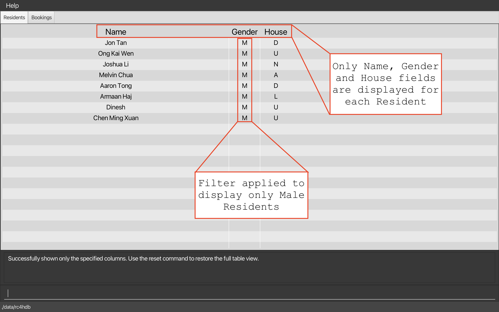
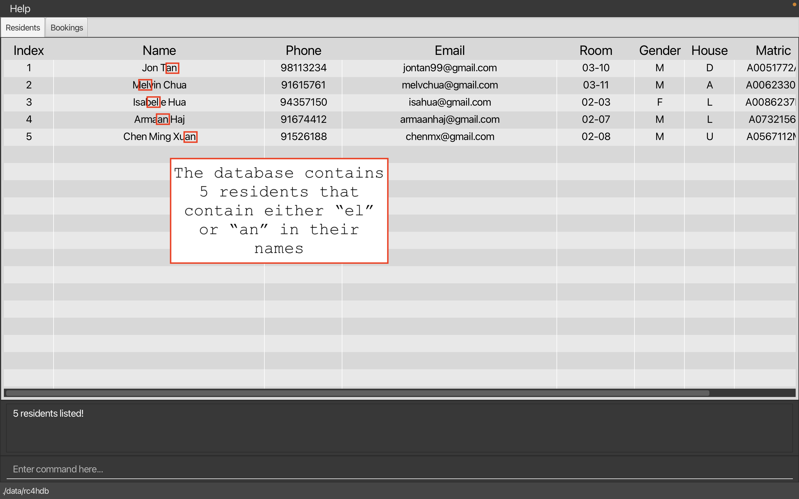

# **Welcome to RC4HDB User Guide!**

If you are a **Residential College 4 (RC4)** Housing Management staff, or someone who wants to find out more
about what **Residential College 4 Housing Database (RC4HDB)** can do for you, you are at the right place!

In this user guide, you will find step-by-step instructions on how you can install **RC4HDB**, as well as how you
can use **RC4HDB** to its fullest potential.

If you are looking to expand on our project, check out our [Developer Guide](DeveloperGuide.md) too!

---

## **Table of Contents**

* [**Introduction to RC4HDB**](#introduction-to-rc4hdb)
* [**Using this guide**](#using-this-guide)
* [**Quick start**](#quick-start)
* [**Command guide**](#command-guide)
  * [**Getting help**](#getting-help)
  * [**Modifying resident data**](#modifying-resident-data)
    * [Adding a resident `add`](#adding-a-resident--add)
    * [Editing an existing resident `edit`](#editing-an-existing-resident--edit)
    * [Deleting an existing resident `delete`](#deleting-a-resident--delete)
    * [Deleting multiple residents `remove`](#deleting-multiple-residents--remove)
    * [Clearing all residents `clear`](#clearing-all-entries--clear)
    * [Resident field format](#format-for-resident-fields)
  * [**Viewing residents**](#viewing-residents)
    * [Listing all residents `list`](#listing-all-residents--list)
    * [Showing resident fields `showonly`](#showing-only-some-columns--showonly)
    * [Hiding resident fields `hideonly`](#hiding-only-some-columns--hideonly)
    * [Resetting hidden resident fields `reset`](#resetting-hidden-columns--reset)
    * [Finding residents `find`](#locating-residents-by-name--find)
    * [Filtering residents `filter`](#filtering-residents-by-field--filter)
  * [**File management**](#file-management)
    * [Finding your data](#finding-your-data)
    * [Saving your data](#saving-your-data)
    * [Creating a new data folder `file create`](#creating-a-new-data-folder--file-create)
    * [Deleting an existing data folder `file delete`](#deleting-an-existing-data-folder--file-delete)
    * [Switching to a different data folder `file switch`](#switching-to-a-different-data-folder--file-switch)
    * [Importing resident data from CSV file `file import`](#importing-resident-data-from-csv-file--file-import)
    * [CSV file format](#csv-file-format)
  * [**Venue management**](#venue-management)
    * [Viewing the bookings](#viewing-the-bookings)
    * [Adding a venue `venue add`](#adding-a-venue--venue-add)
    * [Deleting a venue `venue delete`](#deleting-a-venue--venue-delete)
    * [Viewing a venue `venue view`](#viewing-a-venue--venue-view)
    * [Adding a booking `venue book`](#adding-a-booking-venue-book)
    * [Deleting a booking `venue unbook`](#deleting-a-booking-venue-unbook)
    * [Format for venue fields](#format-for-venue-fields)
  * [**Quality-of-life**](#quality-of-life)
    * [Keyboard shortcuts](#keyboard-shortcuts)
    * [Accessing command history](#accessing-command-history)
  * [**Exiting RC4HDB `exit`**](#exiting-the-program--exit)
  * [**Upcoming features**](#upcoming-features)
* [**FAQ**](#faq)
* [**Glossary**](#glossary-of-terms)
* [**Authors**](#authors)
* [**Command Summary**](#command-summary)

---

## **Introduction to RC4HDB**

**RC4HDB** is a desktop application which streamlines the daily workflow of **RC4 housing management staff**, by providing specialised features which solve their resident and venue management needs.

As a potential **RC4HDB** user, you are expected to be:
* A **RC4 housing management staff**
* Experienced with administrative work
* Comfortable using a keyboard

Broadly, **RC4HDB** provides users with the ability to:
* View and manage resident data
* View and manage venues and any bookings
* Keep and manage multiple data files
* Easily switch over to RC4HDB by importing old data from CSV files

RC4HDB is very **simple, and beginner-friendly**, and can be easily picked-up in a matter of days. Regardless of your typing speed, RC4HDB can be a **convenient and intuitive** way to facilitate your day-to-day workflow as a RC4 housing management staff member. But if you are fast at typing, you will find it very comfortable using
RC4HDB.

[↑ Back to Top](#welcome-to-rc4hdb-user-guide)

---

## **Using this guide**

This user guide contains all the information that you will need to know as a user of **RC4HDB**. We hope that it
will serve you well in mastering RC4HDB!

If you are a **new user**, the necessary knowledge for you to get started can be found [here](#quick-start).
As you read on, you will find plenty of examples to help you familiarise with the features.

If you are an **experienced user**, a [command summary](#command-summary) is also provided, so you don't have to memorise our commands.

Before exploring the user guide, you should familiarise yourself with the following symbols.

:information_source: **Note:** Used to highlight information you should
pay attention to. 

:bulb: **Tip:** used to highlight tips. 

:exclamation: **Caution:** used to highlight dangers. 

[↑ Back to Top](#welcome-to-rc4hdb-user-guide)

---

## **Quick start**

Here is a quick guide on how to get a working copy of RC4HDB on your computer.

#### 1. Setup

Ensure you have [*Java 11*](https://www.oracle.com/sg/java/technologies/javase/jdk11-archive-downloads.html) or
above installed on your Computer.

#### 2. Install

Visit this [link](https://github.com/AY2223S1-CS2103T-W12-3/tp/releases/). Click on `rc4hdb.jar` to download the latest `rc4hdb.jar`. Move the `rc4hdb.jar` file to the folder you want to use as the _home folder_ for RC4HDB. The home folder is the folder from which the application will run, save data to, and retrieve data from.

#### 3. Running RC4HDB

Double-click the file to start the app. The **Graphical User Interface (GUI)** similar to the one shown
below should appear in a few seconds.

:exclamation: **Caution:**
You may have noticed that upon double-clicking `rc4hdb.jar` for the first time, several files were created. **Do not
delete the folder called `data` as this would cause all your data to be deleted!**

 

#### 4. Try it out!

Try typing `help` into the command box where it says "Enter Command here..." and pressing the Enter/Return key on your keyboard to execute it! This command will open a help window which shows you a quick summary of our available commands.

For more details on commands, refer to our [command guide](#command-guide) below.

[↑ Back to Top](#welcome-to-rc4hdb-user-guide)

---

## **Command Guide**

Below shows a breakdown of how the commands in **RC4HDB** are structured. Don't be afraid that you
may have typed a command incorrectly as **RC4HDB** will inform you in the event that this happens!

* Words in `UPPER_CASE` are compulsory parameters and must be entered by you. 
  Parameters are texts you enter to tell **RC4HDB** the information necessary for the command to work.

  e.g. when using the `add` command, `NAME` is a parameter which you must enter. Thus, the command format is as such:`add n/NAME`. To add a resident named "John Doe", you can then enter `add n/John Doe`.

* Items in square brackets are optional. 
  e.g. `n/NAME [t/TAG]` can be used as `n/John Doe t/friend` or as `n/John Doe`.

* Items with `…`​ after them can be used multiple times. This also includes 0 times. 
  e.g. `t/friend`, `t/friend t/family` etc.

* Parameters can be in any order. 
  e.g. if the command specifies `n/NAME p/PHONE_NUMBER`, `p/PHONE_NUMBER n/NAME` is also acceptable.

* If a parameter is expected only once in the command but you specified it multiple times, only the last occurrence of the parameter will be taken,
  unless otherwise specified. 
  e.g. if you specify `p/12341234 p/56785678`, only `p/56785678` will be taken.

* Irrelevant parameters for commands that do not take in parameters (such as `help`, `list`, `exit` and `clear`) will be ignored. 
  e.g. if the command specifies `help 123`, it will be interpreted as `help`.

[↑ Back to Top](#welcome-to-rc4hdb-user-guide)

---

## **Getting Help**

Viewing the command summary from the user guide can be a hassle to some. As an alternative, we have incorporated it
directly into **RC4HDB**.

### Viewing help : `help`

Opens a window with a summary table of all commands, and examples of its usage.
A link to this user guide is also included for your convenience.

<!---

--->

Format: `help`

:bulb: **Tip:** You can press the `F1` key on your keyboard to
open the Help Window immediately! You can also press the `Esc` key on your keyboard to close the Help Window
if it is open. 

[↑ Back to Top](#welcome-to-rc4hdb-user-guide)

---

## **Modifying Resident Data**

In order to maintain the database, we have provided several **basic commands** such as `add`, `edit`, `delete` and `clear`
to help you modify resident data within RC4HDB.

Note:
* RC4HDB **does not allow duplicate residents** to exist within the database, as a measure to prevent unintentional adding of duplicate residents.
* Two residents are considered duplicates of each other if any of the following are same:
  * Matriculation number
  * Phone number
  * Email
  * Room

:information_source: **Note:**
Before proceeding to learn more about resident commands it would be good to have a quick read about the **resident fields**, which will
be used in the commands. The resident <a>[fields](#glossary-of-terms)</a> can be found <a>[here](#format-for-resident-fields)</a>.

[↑ Back to Top](#welcome-to-rc4hdb-user-guide)

---

### Adding a resident : `add`

Adds a resident. Does **not** allow any [duplicate residents](#modifying-resident-data) to be added.

Format: `add n/NAME p/PHONE_NUMBER e/EMAIL r/FLOOR-UNIT g/GENDER h/HOUSE m/MATRIC_NUMBER [t/TAG]…​`

:bulb: **Tip:**
A resident can have any number of tags (including 0).

Examples:
* `add n/John Doe p/98765432 e/johnDoe@gmail.com r/5-1 g/M h/D m/A9876543B` adds a resident named John Doe, with
  relevant personal and student information.
* `add n/Betsy Crowe t/friend e/betsycrowe@example.com r/2-3 p/12345678 m/A3456789B g/F h/A` adds a resident named
  Betsy Crowe, with relevant personal and student information.

[↑ Back to Top](#welcome-to-rc4hdb-user-guide)

---

### Editing an existing resident : `edit`

Edits the data of an existing resident. Does **not** allow any [duplicate residents](#modifying-resident-data) to be created due to the editing of a resident.

Format: `edit INDEX [n/NAME] [p/PHONE_NUMBER] [e/EMAIL] [r/FLOOR-UNIT] [g/GENDER] [h/HOUSE] [m/MATRIC_NUMBER] [t/TAG]…​`
* Edits the resident at the specified `INDEX`.
* The index refers to the index number shown in the displayed residents list.
* The index **must be a positive integer:** 1, 2, 3, …​
* At least one of the optional parameters must be provided.
* Existing values will be updated to the input values.
* When editing tags, the existing tags of the resident will be removed i.e adding of tags is not cumulative.
* You can remove all the resident’s tags by typing `t/` without specifying any tags after it.

Examples:
*  `edit 1 p/91234567 r/5-8` Edits the phone number, room number of the 1st resident to be `91234567`, and `5-8`
   respectively.
*  `edit 2 n/Betsy Crower t/` Edits the name of the 2nd resident to be `Betsy Crower` and clears all existing tags.

[↑ Back to Top](#welcome-to-rc4hdb-user-guide)

---

### Deleting a resident : `delete`

Deletes the specified resident.

Format: `delete INDEX`
* Deletes the resident at the specified `INDEX`.
* The index refers to the index number shown in the displayed resident list.
* The index **must be a positive integer:** 1, 2, 3, …​

:bulb: **Tip:**
The delete command can be used in conjunction with other commands such as list and find, to delete residents in different types of filtered lists.

Examples:
* `list` followed by `delete 2` deletes the 2nd resident in the database.
* `find Betsy` followed by `delete 1` deletes the 1st resident in the results of the `find` command.

[↑ Back to Top](#welcome-to-rc4hdb-user-guide)

---

### Deleting multiple residents : `remove`

Deletes residents whose fields match the input keywords.

Format: `remove /SPECIFIER KEY/VALUE [ADDITIONAL_KEYS/ADDITIONAL_VALUES]`
* A specifier is required in order for the command to work. If not, it is an invalid command format.
* Currently, only two specifiers are supported:
  * `/all` returns a resident if it fulfills **all** of the specified keywords.
  * `/any` returns a resident if it fulfills **any** of the specified keywords.
* Repeated keys are not permitted for both specifiers, e.g. `remove /all h/D h/A` will not work.
* However, tags can be repeated in the command e.g. `remove /all t/exchange t/fresher`.
* Valid keys are those included [here](#format-for-resident-fields), and any additional tags.

Examples:
* `remove /all h/D g/M` deletes residents who are in Draco house, **and** are Male.
* `remove /any h/D h/A` deletes residents belonging to either `Draco` **or** `Aquila` house.

[↑ Back to Top](#welcome-to-rc4hdb-user-guide)

---

### Clearing all entries : `clear`

Clears all entries from **RC4HDB**.

Format: `clear`

:exclamation: **Caution:**
Deleted data can not be retrieved. Do use this command cautiously!

[↑ Back to Top](#welcome-to-rc4hdb-user-guide)

---

### Format for resident fields

`n/NAME`
* Whitespaces are allowed *i.e. `Michael B Jordan` is allowed*.

`p/PHONE_NUMBER`
* Must be an **8**-digit non-negative integer.

`e/EMAIL`
* Must follow the formatting for all standard emails *i.e. `Example@email.com` is accepted*.
* Can be both valid or invalid emails.

`r/FLOOR-UNIT`
* The floor number and unit number must be separated by a hyphen.
* Both floor and unit number must be a positive integer less than 30 *i.e. `5-8` is valid, `0-8` is invalid, `30-1` is invalid*.

`g/GENDER`
* `M` or `F`.
* Not case-sensitive *i.e. `m` and `f` are also valid*.

`h/HOUSE`
* Represents the RC4 house that the resident is allocated to.
* Must be either `A`, `D`, `L`, `N`, `U`.
* `A` stands for **Aquila**, `D` stands for **Draco**, `L` for **Leo**, `N` for **Noctua**, `U` for **Ursa**.
* Not case-sensitive *i.e. `a`, `d`, `l`, `n` and `u` are also valid*.

`m/MATRIC_NUMBER`
* Must be an `A`, followed by a **7**-digit non-negative integer and an alphabet. *i.e. `A0123456A`*.
* Not case-sensitive *i.e. `a0123456b`, `A0123456b` and `a0123456B` are also valid*.

`t/TAG`
* Can be used to add any other miscellaneous information that the resident can be identified by.
* Can only contain alphanumeric characters, whitespaces are not allowed.
* Optional. A resident can have any number of tags, including 0.
* When editing tags, the existing tags of the resident will be removed i.e adding of tags is not cumulative.
* You can remove all the resident’s tags by typing `t/` without specifying any tags after it.
* Multiple tags can be added to the command using multiple keywords e.g `t/president t/exchange`.

[↑ Back to Top](#welcome-to-rc4hdb-user-guide)

---

## **Viewing Residents**

You might find yourself overloaded with information. These commands can help you hide resident fields from view, 
find specific residents, or search for residents whose fields match a specific keyword. By de-cluttering your screen, 
these commands help you to focus only on the information you need!

### Listing all residents : `list`

Lists *all* the residents in the **RC4HDB** database with *all* fields included in the view. If the table view is showing a [filtered portion](#filtering-residents-by-field--filter) of the residents,
calling `list` will restore and display the full list of residents.

Format: `list`
* Any input entered directly after `list` will be ignored. i.e. *`list asd`*, `asd` will be ignored.
* Resets the columns in the table to the default view with *all* columns visible.

[↑ Back to Top](#welcome-to-rc4hdb-user-guide)

---

### Showing only some columns : `showonly`

Shows only the specified columns from the *current* table view.

[comment]: <> (If your screen is too cluttered, you may use this command to show only the columns you need!)

Note:

1. You can only use `showonly` on existing columns in the current table view, and
2. The `showonly` command does not modify the list of residents being displayed. [Filtered residents](#filtering-residents-by-field--filter) *stay filtered*.

Format: `showonly LETTER [MORE_LETTERS]`
* Valid inputs include `i n p e r g h m t` (case-insensitive), which correspond to the first letter of each field in the table.
    * This *should not* be confused with the `n/` or `p/` prefixes used in `add` or `filter`.
* Letters *must* be separated by a single whitespace.
* The order of each letter does not matter.
* Duplicate letters are ignored.
* There needs to be at least one column shown in the table at all times.
* You can always use `reset` to restore the full table view!

Calling `filter /all g/M` on a full table, followed by `showonly n g h` will produce the following result:

As you can see,`showonly` displays only the specified columns, and does not change the filtered list of residents. 

The following examples are to be performed one after the other:

1. `showonly n g h` on a full table returns a table with only the *name*, *gender* and *house* columns shown, as above.
2. Using `showonly r p e` on the table from point 1 is **invalid** as the *room*, *phone* and
  *email* columns are *not present* in the current table.
3. However, using `showonly n g` on said table is **valid**, and will return a table with only the *name* and
  *gender* columns shown.

[↑ Back to Top](#welcome-to-rc4hdb-user-guide)

---

### Hiding only some columns : `hideonly`

Hides only the specified columns from the *current* table view.

[comment]: <> (Use `hideonly` if there are more columns to show than hide.)

Note:

1. You can only use `hideonly` on existing columns in the current table view, and
2. The `hideonly` command does not modify the list of residents being displayed. Residents found using `find` *stay displayed* in the table. 

(Click [here](#locating-residents-by-name--find) to learn about `find`)

Format: `hideonly LETTER [MORE_LETTERS]`
* Valid inputs include `i n p e r g h m t` (case-insensitive), which correspond to the first letter of each field in the table.
    * This *should not* be confused with the `n/` or `p/` prefixes used in `edit` or `filter`.
* Letters *must* be separated by a single whitespace.
* The order of each letter does not matter.
* Duplicate letters are ignored.
* There needs to be at least one column shown in the table at all times.
* You can always use `reset` to restore the full table view!

Calling `hideonly i r p e m t` on a full table will produce the following result:

The following examples are to be performed one after the other:

1. `hideonly i r p e m t` on a full table returns a table with only the *index*, *room*, *phone*, *email*, *matric* 
   and *tags* columns hidden. 
   * In other words, we see a table with only the *name*, *gender* and *house* columns shown, as above.
2. Using `hideonly r e` on the table from point 1 is **invalid** as the *room* and *email* columns *are not
   present* in the current table.
3. However, using `hideonly n` on said table is **valid**, and will return a table with only the *gender* and *house*
   columns shown, as the *name* column has been hidden.

Note:
* Valid inputs include `i n p e r g h m t` (case-insensitive), which correspond to the first letter of each field in the table.
    * This *should not* be confused with the `n/` or `p/` prefixes used in `edit` or `filter`.
* Letters *must* be separated by a single whitespace.
* The order of each letter does not matter.
* Duplicate letters are ignored.
* There needs to be at least one column shown in the table at all times.
* You can always use `reset` to restore the full table view!

[↑ Back to Top](#welcome-to-rc4hdb-user-guide)

---

### Resetting hidden columns : `reset`

Resets the columns in the table to the full view with *all* columns visible.

[comment]: <> (Use this when you have called `showonly` or `hideonly` on the table!)

Format: `reset`
* Any input entered directly after `reset` will be ignored. i.e. *`reset asd`*, `asd` will be ignored.
* This command is different from the `list` command in that it does not affect the list of residents being displayed.
    * However, both commands cause the full set of resident fields (i.e. the full set of columns) to be displayed in the table.

[↑ Back to Top](#welcome-to-rc4hdb-user-guide)

---

### Locating residents by name : `find`

Finds residents whose names contain any of the given keywords.

Format: `find KEYWORD [ADDITIONAL_NAMES]`
* The search is case-insensitive. e.g `peter pang` will match `Peter Pang`.
* Only the name is searched.
* The order of the keywords does not matter.
* Full and partial words will be matched e.g. `Nav` will match `Navarun`.
* Residents matching at least one keyword will be returned, e.g. `Quek Wei` will return `Quek Xiang`, `Jun Wei`.

Calling `find el an` on our sample data will produce the following result:

As you can see, the residents with names containing either "el" or "an" are listed as the result of the `find` command.

Examples:
* `find shawn` returns `Shawn Lee` and `Shawn Ng`
* `find elizabeth david` returns `Elizabeth Ong`, `David Lee`
* `find char li` returns `Charmaine Yee`, `William Li` 

[↑ Back to Top](#welcome-to-rc4hdb-user-guide)

---

### Filtering residents by field : `filter`

Shows a list of residents whose fields match the input keywords.

Format: `filter /SPECIFIER KEY/VALUE [ADDITIONAL_KEYS/ADDITIONAL_VALUES]`
* A specifier is required in order for the command to work. If not, it is an invalid command format.
* Only one specifier can be entered in a command.
* Currently, only two specifiers are supported:
  * `/all` returns a resident if it fulfills **all** of the specified keywords.
  * `/any` returns a resident if it fulfills **any** of the specified keywords.
* Repeated keys are not permitted for both specifiers, e.g. `filter /all h/D h/A` will not work.
* Tags can be repeated in the command e.g. `filter /all t/exhange t/fresher`.
* Valid keys are those included [here](#format-for-resident-fields), and any additional tags.

Examples:
* `filter /all h/D g/M` returns residents who are in Draco house, **and** are Male.
* `filter /any h/D h/A` returns residents belonging to either `Draco` **or** `Aquila` house.
* `filter g/M` returns residents who are male.

[↑ Back to Top](#welcome-to-rc4hdb-user-guide)

---

## **File Management**

To provide a streamlined way of managing **RC4** related data, **RC4HDB** provides users with the ability to organise their files using our file management commands.

**RC4HDB** currently supports the following file management functionalities:
* [**Creation**](#creating-a-new-data-folder--file-create) of new data folders.
* [**Deletion**](#deleting-an-existing-data-folder--file-delete) of old data folders.
* [**Switching**](#switching-to-a-different-data-folder--file-switch) between different data folders.
* [**Importing**](#importing-resident-data-from-csv-file--file-import) of resident data from a [CSV](#glossary-of-terms) file.

:information_source: **Note:**
Before proceeding to learn more about file commands it would be good to have a quick read about the **file command format** and **CSV files**, which will be used in the commands. They can be found <a>[here](#file-command-format)</a> and
<a>[here](#csv-file-format)</a> respectively.

---

### Finding your data

**RC4HDB** stores your data in a **main** data folder named `data`, which can be found in the same folder where you placed the `rc4hdb.jar` file. Within the **main** data folder, resident and venue data is stored in **sub** data folder(s). The default data folder that all copies of **RC4HDB** start out with is the `rc4hdb` folder.

Inside your data folder, there should be two [JSON](#glossary-of-terms) files, `resident_data.json` and `venue_data.json`, which store your **resident** and **venue** data respectively.

To find out which **sub** data folder is currently open, look at the **footer**, that can be found at the bottom of the application interface as shown in the image below, where the current **sub** data folder that is open is `rc4hdb`.

[Back to Top](#welcome-to-rc4hdb-user-guide)

---

### Saving your data

RC4HDB saves your data after every command. There is no need to save manually.

[Back to Top](#welcome-to-rc4hdb-user-guide)

---

### Creating a new data folder : `file create`

Creates a new [**sub**](#finding-your-data) folder with `FOLDER_NAME` as its name.

Format: `file create FOLDER_NAME`
* Does not create a new folder if the folder already exists.
* After creating a new folder, RC4HDB will then create **fresh** data file to store **venue** and **resident** data.

:information_source: **Note:** The **FOLDER_NAME** must follow this <a>[format](#file-command-format)</a>. 

Examples:
* `file create rc4_data_2022` will create a new folder named `rc4_data_2022` with fresh data **resident** and **venue** data files.

[↑ Back to Top](#welcome-to-rc4hdb-user-guide)

---

### Deleting an existing data folder : `file delete`

Deletes a [**sub**](#finding-your-data) data folder.

Format: `file delete FOLDER_NAME`
* Does not delete the folder if it is currently open. You must switch to a different folder before deleting the previously open folder.

:information_source: **Note:** The **FOLDER_NAME** must follow this <a>[format](#file-command-format)</a>. 

Examples:
* `file delete rc4_data_2022` will delete the `rc4_data_2022` folder, along with the **resident** and **venue** data files inside the folder.

[↑ Back to Top](#welcome-to-rc4hdb-user-guide)

---

### Switching to a different data folder : `file switch`

Switches between different [**sub**](#finding-your-data) data folders.

Format: `file switch FOLDER_NAME`
* Does not create a new folder if the specified folder does not exist.

:information_source: **Note:** The **FOLDER_NAME** must follow this <a>[format](#file-command-format)</a>. 

Examples:
* `file switch rc4_data_2022` will switch the currently used folder to `rc4_data_2022`.

[↑ Back to Top](#welcome-to-rc4hdb-user-guide)

---

### Importing resident data from CSV file : `file import`

Imports data from [CSV](#glossary-of-terms) files. In order for RC4HDB to find your files, place them in the [**main**](#finding-your-data) data folder.

Format: `file import FILE_NAME`

:information_source: **Note:**
The **FILE_NAME** must follow this <a>[format](#file-command-format)</a> and the **CSV** file must follow this <a>[format](#csv-file-format)</a>.

Examples:
* `file import residents` will import the data from `residents.csv` into a new **resident** data file which can be found in the `residents` **sub** data folder in the **main** data folder.

[↑ Back to Top](#welcome-to-rc4hdb-user-guide)

---

### File Command Format:
* All file commands have a `FOLDER_NAME` or `FILE_NAME` field depending on the command that is being used. 
* `FOLDER_NAME` signifies the name of the **sub** data folder that is being used.
* `FILE_NAME` refers to the [CSV](#glossary-of-terms) file to be targeted.
* Do not include any file types in the `FOLDER_NAME` or `FILE_NAME`. A file type is the description that comes after the `.` in a file. For example, The file name of the file `residents.csv` is just `residents`.
* The following symbols are not to be used in `FOLDER_NAME` or `FILE_NAME`:
  * Empty spaces
  * `.` dots
  * `/` forward slashes
  * `\ ` backslashes

### Examples:
* `rc4_data_2022` is a valid `FOLDER_NAME`/`FILE_NAME`.
* `rc4_data_2022.json` is an invalid `FOLDER_NAME`/`FILE_NAME` due to the inclusion of the file type, `.json`.
* The following are invalid `FOLDER_NAME`/`FILE_NAME` due to the inclusion of restricted symbols.
  * `rc4 data 2022` has empty spaces.
  * `rc4.data.2022` has dots.
  * `rc4/data/2022` has forward slashes.
  * `rc4\data\2022` has backslashes.

[↑ Back to Top](#welcome-to-rc4hdb-user-guide)

---

### CSV file format

Format:
* For clarity, the table column headers have been included. **DO NOT** include them in your **CSV** file.
* All fields are mandatory, apart from `TAGS`, where users have to input a `NIL`, which is **not** case-sensitive.

[↑ Back to Top](#welcome-to-rc4hdb-user-guide)

---

## **Venue Management**

Along with the ability to manage residents, we have also provided you with the ability to manage
the venues in **RC4HDB** through a booking system. This will allow you to add, remove available venues, as well as
add, remove bookings for those venues.

---

### Viewing the bookings

To view the bookings, you will have to **click on the tab labelled as bookings**.

As you perform the booking commands, the table will automatically update to reflect the changes you have made.

:bulb: **Tip:**
If you are currently viewing a certain venue, and you have added a booking to another venue, or removed a booking
from another venue, the table will automatically switch to that venue's booking.
Alternatively, you can use the `venue view VENUE_NAME` command to switch manually.

:information_source: **Note:**
Before proceeding to learn more about venue commands, it would be good to have a quick read about the **venue fields**, which will
be used in the commands. The venue <a>[fields](#glossary-of-terms)</a> can be found <a>[here](#format-for-venue-fields)</a>.

[↑ Back to Top](#welcome-to-rc4hdb-user-guide)

---

### Adding a venue : `venue add`

Adds a venue to the database.

Format: `venue add VENUE_NAME`

:information_source: **Note:** The **VENUE_NAME** must follow this <a>[format](#format-for-venue-fields)</a>. 

:bulb: **Tip:**
To view all venues, switch over to the bookings tab and refer to the list on the right!

Examples:
* `venue add Meeting Room 3` adds a venue called `Meeting Room 3`.
* `venue add Multi-purpose Hall ` adds a venue called `Multi-purpose Hall`.

[↑ Back to Top](#welcome-to-rc4hdb-user-guide)

---

### Deleting a venue : `venue delete`

Deletes a venue from the database.

Format: `venue delete VENUE_NAME`

:information_source: **Note:** The **VENUE_NAME** must follow this <a>[format](#format-for-venue-fields)</a>. 

:bulb: **Tip:**
To view all venues, switch over to the bookings tab and refer to the list on the right!

Examples:
* `venue delete Meeting Room` deletes a venue called `Meeting Room`.
* `venue delete Hall` deletes a venue called `Hall`.

[↑ Back to Top](#welcome-to-rc4hdb-user-guide)

---

### Viewing a venue : `venue view`

Displays all bookings for the specified venue.

Format: `venue view VENUE_NAME`

:information_source: **Note:** The **VENUE_NAME** must follow this <a>[format](#format-for-venue-fields)</a>. 

:bulb: **Tip:**
To view all venues, switch over to the bookings tab and refer to the list on the right!

Examples:
* `venue view Meeting Room` switches the current list of bookings displayed to the ones in `Meeting Room`.
* `venue view Hall` switches the current list of bookings displayed to the ones in `Hall`.

[↑ Back to Top](#welcome-to-rc4hdb-user-guide)

---

### Adding a booking: `venue book`

Adds a booking to the specified venue, at the given time period and day.

Format: `venue book INDEX v/VENUE_NAME tp/TIME_PERIOD d/DAY`
* Adds a booking under the resident specified at `INDEX`, at the specified `VENUE_NAME`, `TIME_PERIOD` and `DAY`.
* The index refers to the index number shown in the displayed residents list.
* The index **must be a positive integer** 1, 2, 3, …​

:information_source: **Note:** The **VENUE_NAME**, **TIME_PERIOD**, and **DAY** must follow this <a>[format](#format-for-venue-fields)</a>. 

:bulb: **Tip:**
To view all venues, switch over to the bookings tab and refer to the list on the right!

Examples:
* `venue book 2 v/Meeting Room tp/8-9 d/TUE` books the Meeting Room from 8am to 9am on Tuesday.
* `venue book 1 v/Hall tp/13-14 d/WED` books the Hall from 1pm to 2pm on Wednesday.

[↑ Back to Top](#welcome-to-rc4hdb-user-guide)

---

### Deleting a booking: `venue unbook`

Deletes a booking from the specified venue, at the given time period and day.

Format: `venue unbook v/VENUE_NAME tp/TIME_PERIOD d/DAY`

:information_source: **Note:** The **VENUE_NAME**, **TIME_PERIOD**, and **DAY** must follow this <a>[format](#format-for-venue-fields)</a>. 

:bulb: **Tip:**
To view all venues, switch over to the bookings tab and refer to the list on the right!

Examples:
* `venue unbook v/Meeting Room tp/8-9 d/TUE` deletes the 8am to 9am Meeting Room booking on Tuesday.
* `venue unbook v/Hall tp/13-18 d/WED` deletes the 1pm to 6pm Hall booking n Wednesday.

[↑ Back to Top](#welcome-to-rc4hdb-user-guide)

---

### Format for Venue fields

`v/VENUE_NAME`
* The name displayed for the venue will be the exactly identical to the one specified in `VENUE_NAME`.
* Can contain alphanumeric characters and whitespaces i.e. `m 3 3 t i n g r o o m` is valid.
* Case-insensitive i.e. venues `Meeting Room` and `meeting room` are identical.

`tp/TIME_PERIOD`
* The start time and end time must be separated by a hyphen *i.e. 8 to 9 must be indicated as `8-9`*.
* Must begin and end on the hour *i.e. `1230-13` will not be accepted*.
* Operates on a 24-hour format *i.e. `4p.m.` must be indicated as `16`*.
* Valid booking hours are from `8` to `23`.
* Blocks of time are allowed *i.e. `18-21` is accepted*.
* The start time must be earlier than end time.

`d/DAY`
* Must be the first three characters of a day *i.e. Monday must be indicated as mon*.
* Case-insensitive *i.e. tUe, TUE, tue are all valid*.

[↑ Back to Top](#welcome-to-rc4hdb-user-guide)

---

## **Quality-Of-Life**

As an application optimized for keyboard usage, **RC4HDB** may not be the most intuitive for someone that is used to using the mouse. As
such, we have provided several simple *Quality-of-life* features that we hope can improve your experience of using
**RC4HDB**.

## Keyboard shortcuts

To encourage keyboard usage, here are several keyboard shortcuts that you may find useful for your use:

| Key        | Functionality                                  |
|------------|------------------------------------------------|
| `Esc`      | Closes the Help Window if it's open            |
| `F1`       | Opens the Help Window if it's not open         |
| `F2`       | Highlights the first row of the displayed list |
| `F3`       | Quick-access to the command input box          |
| `Ctrl+Tab` | Switch between Resident and Booking tabs       |

This feature is especially useful if you want to refer to our Help Window which contains a summary of our most basic
commands. If you want a full summary of all our commands, refer to [here](#command-summary).

[↑ Back to Top](#welcome-to-rc4hdb-user-guide)

---

### Accessing command history

Use the `↑ Up` and `↓ Down` arrow keys to navigate through the command history. This
is useful if your next command is similar to a previous command, or if you wish to revisit
your previous commands.

:information_source: **Note:**
Only valid commands will be saved in the history!

:information_source: **Note:** Any valid command typed but not entered
will not be saved!. 

[↑ Back to Top](#welcome-to-rc4hdb-user-guide)

---

## **Exiting the Program**

You do not have to worry about exiting **RC4HDB** without saving as any changes you've made is automatically saved after every command. For more information, visit the section on [saving your data](#saving-your-data).

### Exiting the program : `exit`

Exits the program.

Format: `exit`

[↑ Back to Top](#welcome-to-rc4hdb-user-guide)

---

## **Upcoming Features**

This section lists some of our upcoming features that we are excited to bring to you!

### Exporting to CSV file : `file export`

As important as it is to be able to import files, we also understand that you might have the need to export them.
**RC4HDB** will soon provide users with the ability to export data to `.csv` files.
The file will be safe to remove from the `[JAR file location]/data` folder.

Format: `file export FILE_NAME`

:information_source: **Note:** The csv file will be exported in this format <a href="https://ay2223s1-cs2103t-w12-3.github.io/tp/UserGuide.html#csv-file-format">format</a>. 

Examples:
* `file export residents` will export the data from `residents.json` file into a `.csv` file named `residents.csv`.

### *More coming soon!*

[↑ Back to Top](#welcome-to-rc4hdb-user-guide)

---

## **FAQ**

**Q: I type very slowly, is RC4HDB any good for me?**

**A**: You do not have to be fast at typing for RC4HDB to improve your workflow!

 

**Q: I have accidentally deleted an entry, is there any way for me to undo it?**

**A:** Currently, we do not offer such an option, but you can look forward to RC4HDB v1.5, as we will be implementing that in the near future!

 

**Q: The text on the screen is too small, is there any way for me to resize it?**

**A:** RC4HDB does not allow the text size to be changed, however, you can enlarge the text by changing your screen resolution. You may
refer to this [link](https://support.microsoft.com/en-us/windows/change-your-screen-resolution-in-windows-5effefe3-2eac-e306-0b5d-2073b765876b) for Windows, and this [link](https://www.wikihow.com/Change-the-Screen-Resolution-on-a-Mac) for Mac.

 

**Q: Do I need an internet connection to be able to use RC4HDB?**

**A:** You do not need an internet connection to use RC4HDB as everything is done on your device.

 

**Q: Can I search using fields other than the name?**

**A:** You can use the `filter` command to search for people using the other fields.

 

**Q: Why is there a need to use `hideonly` if we can already use `showonly`?**

**A:** You can use `hideonly` when you want to display more fields than you want to hide. For example,
`hideonly i` has the same effect as `showonly n p e r g h m t` on a full table. Using `hideonly` helps to save 
time on typing!

 

**Q: How do I remember which commands use letters (as compared to other commands which use key/value) as inputs?**

**A:** Only the column hiding features, i.e. `showonly` and `hideonly`, use letters. You can remember this by 
associating the "only" in these commands to the convenience of typing *only* letters!

 

**Q: The section for `showonly` and `hideonly` says that `i n p e r g h m t` are valid letters. However, I am getting an error message that says "Please enter columns to show or hide that are currently in the table view." when using these valid letters.** 

**A:** `i n p e r g h m t` *are* indeed valid letters. Recall that `showonly` and `hideonly` [only work on columns that are currently shown in the table view](#showing-only-some-columns--showonly).
This means that for `showonly n p e` and `hideonly n p e` to work, the **name**, **phone**, and **email** columns *must 
be present* in the current table. The error message mentioned above means that the specified columns are 
*not fully present* in the table. Please make sure to *only* enter letters corresponding to the columns you see on your 
screen when typing these commands. 

 

**Q: How can I resize the columns in the table?**

**A:** Column resizing can be done the same way as they do in Excel. However, we only allow the resizing of the `Name` and `Email` columns.
They other have a fixed size to allow for your ease of viewing. Alternatively, you could also use the `showonly` and `hideonly` commands if you
do not wish to see them.

 

**Q: I can not find the information that I need in the User Guide, who can I contact?**

**A:** You can drop us an email at *nseah21@gmail.com* .

[↑ Back to Top](#welcome-to-rc4hdb-user-guide)

---

## **Glossary of terms**

### Field

This term refers to information that represents some (common) property in a dataset.

For example:

1. In a rental bicycle sharing dataset, one possible field is the type of each rental bicycle.

2. In a population demographic dataset, one possible field is the age of each individual.

### CSV

This term is short for Comma-separated values. It is a common file type that can be identified through the `.csv` after a file's name.

### JSON

This term is short for JavaScript Object Notation. It is a common file type that can be identified through the `.json` after a file's name.

[↑ Back to Top](#welcome-to-rc4hdb-user-guide)

---

## **Authors**

This User Guide was co-written by Alvin, Jordan, Neale, Nicholas, and Naren, the developers behind RC4HDB.
For more information, please refer to our [about us](AboutUs.md) page.

---

## **Command summary**

We understand that you might be overwhelmed by the number of commands available to you. Though we have provided a
summary table of contents in the Help Window in **RC4HDB**, that table contains only our most basic and commonly used
commands. The tables below contain the full summary of our commands and how they can be used.

### General Commands

| Action                                 | Format, Examples |
|----------------------------------------|------------------|
| [**Help**](#viewing-help--help)        | `help`           |
| [**Exit**](#exiting-the-program--exit) | `exit`           |

[↑ Back to Top](#welcome-to-rc4hdb-user-guide)

---

### Modifying Resident Commands

| Action                                             | Format, Examples                                                                                                                                                                  |
|----------------------------------------------------|-----------------------------------------------------------------------------------------------------------------------------------------------------------------------------------|
| [**Add**](#adding-a-resident--add)                 | `add n/NAME p/PHONE_NUMBER e/EMAIL r/FLOOR-UNIT g/GENDER h/HOUSE m/MATRIC_NUMBER [t/TAG]…​`   e.g. `add n/James Ho p/22224444 e/jamesho@example.com r/2-1 g/M h/D m/A9876543B` |
| [**Edit**](#editing-an-existing-resident--edit)    | `edit INDEX [n/NAME] [p/PHONE_NUMBER] [e/EMAIL] [r/FLOOR-UNIT] [g/GENDER] [h/HOUSE] [m/MATRIC_NUMBER] [t/TAG]…​`  e.g.`edit 2 n/James Lee e/jameslee@example.com`              |
| [**Delete**](#deleting-a-resident--delete)         | `delete INDEX`  e.g. `delete 3`                                                                                                                                                |
| [**Remove**](#deleting-multiple-residents--remove) | `remove [/SPECIFIER] KEY/VALUE [ADDITIONAL_KEYS/ADDITIONAL_VALUES]`  e.g. `remove /all h/D g/M`                                                                                |
| [**Clear**](#clearing-all-entries--clear)          | `clear`                                                                                                                                                                           |

[↑ Back to Top](#welcome-to-rc4hdb-user-guide)

---

### Viewing Resident Commands

| Action                                                | Format, Examples                                                                                           |
|-------------------------------------------------------|------------------------------------------------------------------------------------------------------------|
| [**List**](#listing-all-residents--list)              | `list`                                                                                                     |
| [**Show only**](#showing-only-some-columns--showonly) | `showonly LETTER [MORE_LETTERS]` e.g. `showonly n p e t`                                               |
| [**Hide only**](#hiding-only-some-columns--hideonly)  | `hideonly LETTER [MORE_LETTERS]` e.g. `hideonly i r g h m`                                             |
| [**Reset**](#resetting-hidden-columns--reset)         | `reset`                                                                                                    |
| [**Find**](#locating-residents-by-name--find)         | `find KEYWORD [MORE_KEYWORDS]`  e.g. `find James Jake`                                                  |
| [**Filter**](#filtering-residents-by-field--filter)   | `filter /specifier KEY:VALUE [ADDITIONAL_KEYS:ADDITIONAL_VALUES]`   e.g. `filter /all h/D g/M`          |

[↑ Back to Top](#welcome-to-rc4hdb-user-guide)

---

### File Management Commands

| Action                                                                 | Format, Examples                                                |
|------------------------------------------------------------------------|-----------------------------------------------------------------|
| [**Create File**](#creating-a-new-data-folder--file-create)            | `file create FOLDER_NAME`   e.g. `file create rc4_data_2022` |
| [**Delete File**](#deleting-an-existing-data-folder--file-delete)      | `file delete FOLDER_NAME`   e.g. `file delete rc4_data_2022` |
| [**Switch File**](#switching-to-a-different-data-folder--file-switch)  | `file switch FOLDER_NAME`   e.g. `file switch rc4_data_2022` |
| [**Import File**](#importing-resident-data-from-csv-file--file-import) | `file import FILE_NAME`   e.g. `file import students`        |

[↑ Back to Top](#welcome-to-rc4hdb-user-guide)

---

### Venue Booking Commands

| Action                                                | Format, Examples                                                                                          |
|-------------------------------------------------------|-----------------------------------------------------------------------------------------------------------|
| [**Add Venue**](#adding-a-venue--venue-add)           | `venue add VENUE_NAME`   e.g. `venue add Meeting Room 3`                                               |
| [**Delete Venue**](#deleting-a-venue--venue-delete)   | `venue delete VENUE_NAME`   e.g. `venue delete Hall`                                                   |
| [**View Venue**](#viewing-a-venue--venue-view)        | `venue view VENUE_NAME`   e.g. `venue view Hall`                                                       |
| [**Book Venue**](#adding-a-booking-venue-book)        | `venue book INDEX v/VENUE_NAME tp/TIME_PERIOD d/DAY`   e.g. `venue book 2 v/Meeting Room tp/8-9 d/TUE` |
| [**Unbook Venue**](#deleting-a-booking-venue-unbook)  | `venue unbook v/VENUE_NAME tp/TIME_PERIOD d/DAY`   e.g. `venue unbook v/Meeting Room tp/8-9 d/TUE`     |

[↑ Back to Top](#welcome-to-rc4hdb-user-guide)
