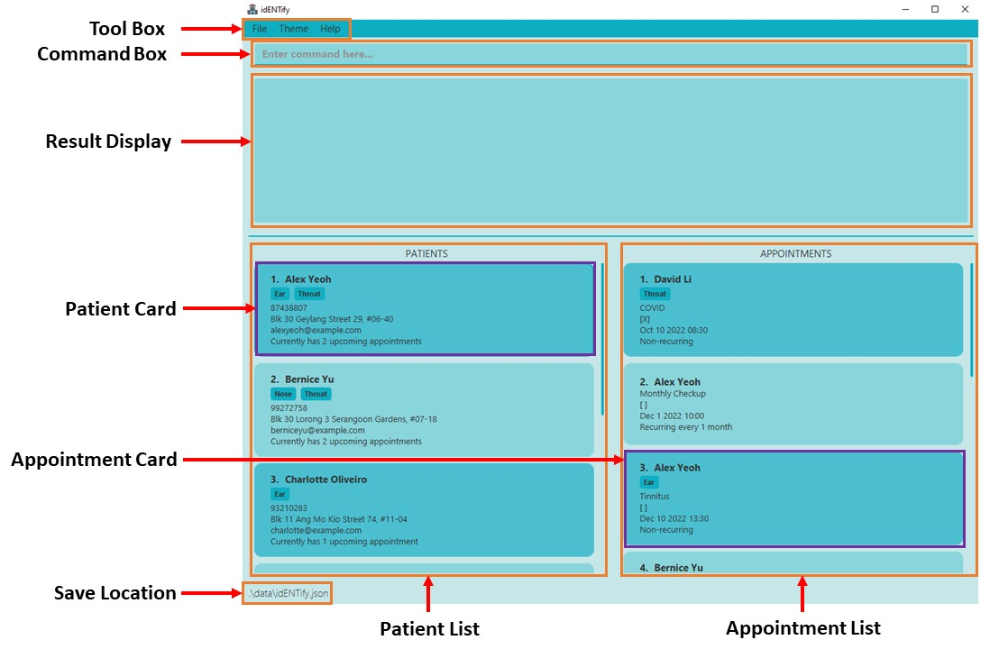
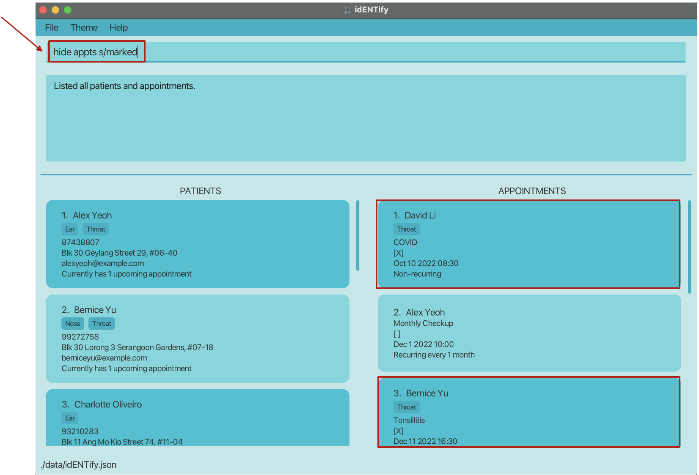
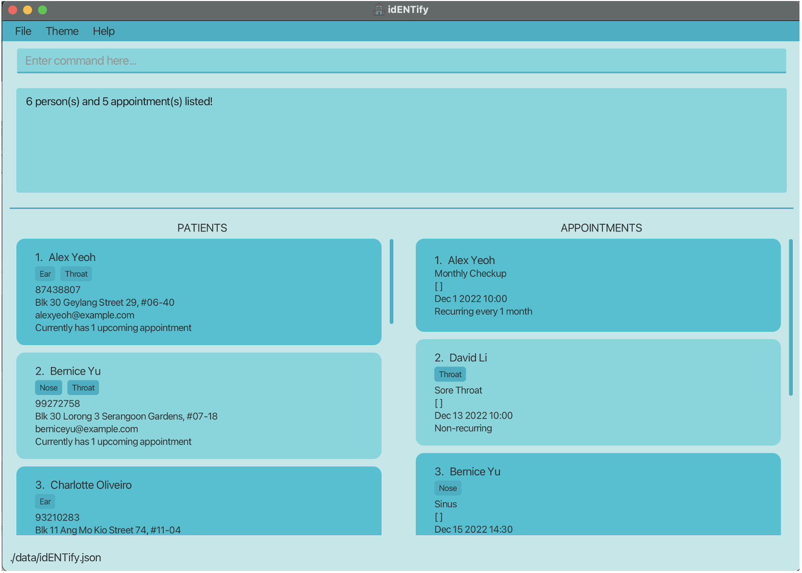

IdENTify is a **desktop app made for ENT administrative staff to manage patients' contact details and appointments, optimized for use via a Command Line Interface** (CLI) while still having the benefits of a Graphical User Interface (GUI). If you can type fast, idENTify can get your patients/appointments' management tasks done faster than traditional GUI apps.

1. Table of contents
* Table of Contents
{:toc}

## Glossary 
- **ENT**: Stands for ear, nose and throat. ENT departments of a hospital therefore handle patients whom require medical attention for issues pertaining to ear, nose or throat.
- **UI**: Stands for User Interface, it is the space where users interact with an application or website. In this case, the launching idENTify shows the UI to the user directly and the user can interact with the application by entering commands.
- **GUI**: Stands for Graphical User Interface, it is a type of user interface through which users interact with electronic devices via visual indicator representations.
- **Command Line Interface**: A command-line interface (CLI) is a text-based user interface (UI) used to run programs, manage computer files and interact with the computer.
- **Parameters**: A parameter is a kind of variable that is used to pass information or data between functions or procedures in a computer. For example, adding a patient into idENTify requires the name of the patient, and the name is a parameter.
- **Alphanumeric**: Text that consists only of letters and numbers. For example, abc12 is alphanumeric, but (O_O) is not.
- **Recurring**: Something that occurs repeatedly or periodically. For example, an appointment that repeats every 7 days is considered recurring.
- **Sort**: A process that involves arranging the data into some meaningful order to make it easier to understand, analyze or visualize. For example, sorting patients by name would arrange all patients alphabetically by name.
- **Case-sensitive**: Difference between capital and lower-case letters matters. Therefore, not case-sensitive or case-insensitive means capital and lower-case letters are treated as the same.


## Quick Start
1. Ensure you have Java `11` or above installed in your Computer.
2. Download the latest [idENTify.jar](https://github.com/AY2223S1-CS2103T-T17-4/tp/releases/tag/v1.3) from here.
3. Copy the file to your preferred folder.
4. Double-click the file to start the app. The GUI similar to the one below should appear in a few seconds. Note how the app contains some sample data.


## UI Components

* The UI is available in light mode (by default, shown above) or dark mode.

### General UI information

Component | Purpose
--------|------------------
**Tool Box** | Allows you to exit idENTify, change the theme of the UI or view help
**Command Box** | Location to enter commands
**Results Display** | Displays the result after a command is entered
**Patient List** | Displays patients
**Appointment List** | Displays appointments
**Patient Card** | Displays detailed information about a patient
**Appointment Card** | Displays detailed information about an appointment
**Save Location** | Displays the location where your idENTify data is stored


### Patient Card

* Upcoming appointments shows the total amount of unmarked appointments of the given patient.

### Appointment Card

* The status of an appointment is `[]` when uncompleted, and `[X]` when completed.
* More information about recurrence duration can be found [here](#book-an-appointment--book).

## Features

<div markdown="block" class="alert alert-info">

**:information_source: Notes about the command format:**<br>

* Words in `UPPER_CASE` are the parameters to be supplied by the user.<br>
  e.g. in `add n/NAME`, `NAME` is a parameter which can be used as `add n/John Doe`.

* Items in square brackets are optional.<br>
  e.g. `n/NAME [t/TAG]` can be used as `n/John Doe t/nose` or as `n/John Doe`.

* Items with `…`​ after them can be used multiple times including zero times.<br>
  e.g. `[t/TAG]…​` can be used as ` ` (i.e. 0 times), `t/ear`, `t/nose t/throat` etc.

* Parameters can be in any order.<br>
  e.g. if the command specifies `n/NAME p/PHONE_NUMBER`, `p/PHONE_NUMBER n/NAME` is also acceptable.

* If a parameter is expected only once in the command, but you specified it multiple times, only the last occurrence of the parameter will be taken.<br>
  e.g. if you specify `p/12341234 p/56785678`, only `p/56785678` will be taken.

* Extraneous parameters for commands that do not take in parameters (such as `help`, `exit` and `clear`) will be ignored.<br>
  e.g. if the command specifies `help 123`, it will be interpreted as `help`.
</div>


<div markdown="block" class="alert alert-info">
  
**:information_source: Notes about the command parameters:** <br>

* `NAME`
  * Can only accept alphanumeric characters i.e. "a, b, c..." & "1, 2, 3..."
* `TAG` names 
  * **Must only be from the following:** `ear`, `nose`, `throat` (not case-sensitive). <br>
    e.g. `t/sick` will cause an error message.
* `PHONE_NUMBER`
  * Must only contain integers, and it should be at least 3 digits long.
* `EMAIL`
  * Format: `local-part@domain-name`
  * Follows below constraints:
  * `local-part` must:
    * Contain alphanumeric characters and these special characters: `+`, `_`, `.`, `-`.
    * Not start or end with any special characters.
  * `domain-name` must:
    * Be at least 2 characters long.
    * Begin and end with alphanumeric characters.
    * Have both parts consist of alphanumeric characters, separated only by hyphens, if any.
  * Examples:
    * Valid
      * `John@example.com`
      * `John@example`
    * Invalid
      * `John`: Missing `@` and `domain-name`.
      * `John@^s^`: `^s^` does not start and end with alphanumeric characters.
      * `John@x`: `x` is not less than 2 characters long.
</div>


### Important Commands

#### Viewing help : `help`

Shows a message explaining how to access the help page.


Format: `help`

### Add/Remove entries

#### Adding a patient: `add`

Adds a patient into idENTify. 
* We allow duplicate names for patients, but distinct patients with the same
  names must have different phone numbers in order to identify them. So you cannot add a patient who has both the
  same name and phone number as some existing patient.

Format: `Format: add n/NAME p/PHONE_NUMBER [a/ADDRESS] [e/EMAIL] [t/TAG]…​`

<div markdown="block" class="alert alert-primary">
  
**:bulb: Tip:** <br>

* A patient can have 0 to 3 number of tags. 
  
* `TAG` names **must only be from the following:** `ear`, `nose`, `throat` (not case-sensitive). <br>

   e.g. `t/sick` will cause an error message.
  
</div>

Examples:
* `add n/John Doe p/98765432 a/John street, block 123, #01-01`
* `add n/Betsy Crowe p/88888888 a/Newgate Prison t/ear`

#### Deleting a patient : `delete`

Deletes a patient or a range of patients from idENTify.

Format: `delete INDEX [END_INDEX]`

* Deletes the patient at the specified `INDEX`.
* The index refers to the index number shown in the displayed patient list.
* The index **must be a positive integer** 1, 2, 3, …​

Examples:
* `list patients` followed by `delete 2` deletes the 2nd patient in idENTify.
* `delete 1 3` deletes the first 3 patients (index 1 to 3 inclusive) in idENTify
* `find Betsy` followed by `delete 1` deletes the 1st patient in the results of the `find` command.

#### Book an appointment:  `book`

Books an appointment for the specified patient at `INDEX` in the patient list.

Inputting a time period allows the appointment to be recurring: Automatically books a new appointment in the future 
as given by the time period when the current appointment is marked as completed.

Appointments added are sorted according to their date.

Format: `book INDEX r/REASON d/DATE [pe/TIME_PERIOD] [t/TAG]…​`

* The index refers to the index number shown in the displayed patient list.
* The index **must be a positive integer** 1, 2, 3, …​
* Dates **must be inputted** in a YYYY-MM-DD HH:MM format or HH:MM YYYY-MM-DD format.
* Input at least a Y, M or D value for the time period. Value **must be inserted in the order** Y -> M -> D. 
* Time Period Values **must be in the range of** 0-10Y, 0-12M or 0-31D to be considered as valid.
* Default time period is set to 0Y0M0D if no time period is inputted.

Examples:
* `book 2 r/Ear Infection d/2022-12-31 18:00` Books an appointment that is non-recurring as no time period is inputted.
* `book 2 r/Ear Infection d/16:30 2022-12-31 pe/1M2D` Books an appointment that is recurring every 1 month 2days.
* `book 2 r/Ear Infection d/2022-12-31 13:00 pe/1Y` Books an appointment that is recurring every year.

#### Cancel an appointment: `cancel`
Cancels a specified appointment in the appointment list. <br>

Format: ```cancel APPOINTMENT_INDEX```
- Deletes the appointment with `APPOINTMENT_INDEX` in the appointment list.
- The index refers to the index number shown in the displayed appointment list.
- The index **must be a positive integer** 1, 2, 3, …​

Examples:
* `cancel 1`

#### Clearing all entries : `clear`

Clears all entries from idENTify.

Format: `clear`

### Modify existing entries

#### Editing a patient : `edit patients`

Edits an existing patient in idENTify. 

Format: `edit patients INDEX [n/NAME] [p/PHONE] [e/EMAIL] [a/ADDRESS] [t/TAG]…​`

* Edits the patient at the specified `INDEX`. The index refers to the index number shown in the displayed patient list. The index **must be a positive integer** 1, 2, 3, …​
* At least one of the optional fields must be provided.
* Existing values will be updated to the input values.
* When editing tags, the existing tags of the patient will be removed i.e. adding of tags is not cumulative.
* You can remove all the patient’s tags by typing `t/` without
    specifying any tags after it.
* We allow duplicate names for patients, but distinct patients with the same
    names must have different phone numbers in order to identify them. So you cannot edit a patient to have both the 
  same name and phone number as some existing patient.

Examples:
*  `edit patients 1 p/91234567 e/johndoe@example.com` Edits the phone number and email address of the 1st patient to be `91234567` and `johndoe@example.com` respectively.
*  `edit patients 2 n/Betsy Crower t/` Edits the name of the 2nd patient to be `Betsy Crower` and clears all existing tags.

#### Editing an appointment: `edit appts`

Edits an existing patient's appointment in idENTify.

Format: `edit appts INDEX [r/REASON] [d/DATE] [pe/TIME_PERIOD] [t/TAG]…​`

* Edits the appointment at the specified `INDEX`. The index refers to the index number shown in the displayed appointment list. The index **must be a positive integer** 1, 2, 3, …​
* At least one of the optional fields must be provided.
* Existing values will be updated to the input values.
* When editing tags, the existing tags of the appointment will be removed i.e. adding of tags is not cumulative.
* You can remove all the appointment’s tags by typing `t/` without
  specifying any tags after it. <br>
  e.g. `edit appts 1 t/`
* You can set the appointment to be non-recurring by typing `pe/` without specifying any values after it. <br>
  e.g. `edit appts 1 pe/`

Examples:
* `edit appts 1 r/Cough d/2022-12-10 16:30` Edits the reason and date of the first appointment to be `Cough` and `2022-12-10 16:30`
respectively. Existing time period and tags will not be edited.
* `edit appts 1 pe/1Y2M` Edits the time period of the first appointment to be recurring every 1 year 2 months. Existing reason, date and tags will not be edited.

#### Mark an appointment as completed:  `mark`

Marks a specified appointment in the appointment list as complete.

If the specified appointment was set to be recurring, automatically books a new appointment in the future as given by the recurring time period of the appointment.

Format: `mark APPOINTMENT_INDEX`

* `APPOINTMENT_INDEX` refers to the index number of the appointment to be marked, as shown in the appointment list.
* `APPOINTMENT_INDEX` **must be a positive integer** 1, 2, 3, …​

Examples:
* `mark 3`

#### Unmark an appointment as incomplete:  `unmark`

Unmarks a specified appointment in the appointment list as incomplete.

Format: `unmark APPOINTMENT_INDEX`

* `APPOINTMENT_INDEX` refers to the index number of the appointment to be unmarked, as shown in the appointment list.
* `APPOINTMENT_INDEX` **must be a positive integer** 1, 2, 3, …​

Examples:
* `unmark 1`

### Organisation

#### Listing all patients/appointments : `list`

Shows a list of all patients or appointments, depending on the parameter given. Previously hidden patients and appointments will be unhidden as well.

If it is a patient list, then patients will be sorted by their names first; if there are people with the same name, they will be sorted by their 
phone numbers. 

If it is an appointment list, then appointments will be sorted by their datetime first; if there are appointments 
with the same datetime, they will be sorted by their attached patients' information.

Format:
* `list patients` - Refreshes only the patient list to show all patients, leaving the appointment list unchanged.
* `list appts` - Refreshes only the appointment list to show all appointments, leaving the patient list unchanged.
* `list all` - Refreshes both the patient and appointment lists to show all patients and appointments.

#### Grouping patients : `group patients`

Groups up patients that share the same tag(s).

For example: <br> 
* Patients with no tags will be in the same group.
* Patients with only 'ear' tag will be in the same group.
* Patients with both 'ear' and 'nose' tags will be in the same group.

Patients in the same tag group will be sorted automatically by their names in ascending order.

Format:
* `group patients`

#### Grouping appointments : `group appts`

Groups up appointments that share a similar criteria.

For example, after grouping appointments with same tags: <br>

* Appointments with no tags will be in the same group.
* Appointments with only 'ear' tag will be in the same group.
* Appointments with both 'ear' and 'nose' tags will be in the same group.

Appointments in the same group will be sorted automatically by their datetime in ascending order.


Format:
* `group appts k/KEY`

Examples:
* `group appts k/tag` (`group appts k/t`)
* `group appts k/patient` (`group appts k/p`)
* `group appts k/mark` (`group appts k/m`)

#### Ungrouping patients/ appointments : `ungroup`

Ungroups the list of patients or appointments. \
Patient entries will return to being sorted by name in alphabetical order. \
Appointment entries will return to being sorted by datetime.

Format:
* `ungroup patients`
* `ungroup appts`

#### Hiding patients by name or tag: `hide patients`

**By name:**
Filters out (hides) patients whose names contain any of the given keywords.

Format: `hide patients n/NAME [n/MORE_NAMES]...`

Examples:
* `hide patients n/John` hides `john` and `John Doe`
* `hide patients n/alex n/david` hides `Alex Yeoh`, `David Li`<br>

**By tag:**
Hides patients whose names contain any of the given tags.

Format: `hide patients t/TAG [t/MORE_TAGS]...`

* The search is **NOT** case-sensitive. e.g. `EAR` will match `ear`
* All tags of a patient are searched.

Examples:
* `hide patients t/ear t/nose` hides all patients with an ear OR nose tag.

#### Unhiding patients by name or tag: `unhide patients`

**By name:**
Shows (unhides) patients that were previously hidden whose names contain any of the given keywords.

Format: `unhide patients n/NAME [n/MORE_NAMES]...`

Examples:
* `unhide patients n/John` unhides `john` and `John Doe`
* `unhide patients n/alex n/david` unhides `Alex Yeoh`, `David Li`<br>

**By tag:**
Unhides patients that were previously hidden who contain any of the given tags.

Format: `unhide patients t/TAG [t/MORE_TAGS]...`


* The search is **NOT** case-sensitive. e.g `t/EAR` has same effect as `t/ear`

* All tags of a patient are searched.

Examples:
* `unhide patients t/nose t/ear` unhides all patients with a nose OR ear tag.

#### Hiding appointments by reason, tag, or marked status: `hide appts`

Hides appointments by the condition specified. <br>
The search for reason, tag, and status is **NOT** case-sensitive. e.g `t/EAR` has same effect as `t/ear`


**By reason:**
Hides appointments that contain at least 1 of the given keywords in the reason of appointment.

Format: `hide appts r/REASON [r/MORE_REASONS]...`

Examples:
* `hide appts r/nose` hides all appointments with "nose" in the reason.
* `hide appts r/pain r/issue` hides all appointments with "pain" or "issue" in the reason.

**By tag:**
Hides appointments which contain any of the given tags.

Format: `hide appts t/TAG [t/MORE_TAGS]...`

* All tags of an appointment are searched.

Examples:
* `hide appts t/ear t/nose` hides all appointments with a ear OR nose tag.

**By marked/unmarked status:**
Hides appointments which are marked/unmarked.

Format: `hide appts s/STATUS` <br>
Shortform: `marked` status can be shortened to `m`, `unmarked` can be shortened to `um`.

Examples:
* `hide appts s/marked` hides all appointments that has been marked.
* `hide appts s/um` hides all appointments that has been ummarked.

Visual example of hiding appointments by marked status:

Before hide: (Initially with marked appointments)


After hide: (Appointments that are marked are now hidden)


#### Unhiding appointments by reason, tag or status: `unhide appts`

**By reason:**
Unhides hidden appointments that contains `REASON` (OR `MORE_REASONS`). 

Format: `unhide appts r/REASON [r/MORE_REASONS]...`

* The reasons are **NOT** case-sensitive. e.g. `r/PAIN` has same effect as `r/pain`

Examples:
* `unhide appts r/pain` unhides all hidden appointments with "pain" as part of the reason.
* `unhide appts r/pain` r/problem' unhides all hidden appointments with "pain" or "problem" as part of the reason.

**By tag:**
Unhides hidden appointments that contains `TAG` (OR `MORE_TAGS`).

Format: `unhide appts t/TAG [t/MORE_TAGS]...`

* The search is **NOT** case-sensitive. e.g `t/EAR` has same effect as `t/ear`
* All tags of an appointment are searched.

Examples:
* `unhide appts t/nose t/ear` unhides all appointments with a nose OR ear tag.

**By marked/unmarked status:**
Unhides hidden appointments which were marked or unmarked.

Format: `unhide appts s/marked` or `unhide appts s/m` <br>
Alternative: `unhide appts s/unmarked` or `unhide appts s/um`
* The condition is **NOT** case-sensitive. e.g. `MARKed` will work in the same way as `marked`.

Examples:
* `unhide appts s/marked` unhides all appointments that has been marked.
* `unhide appts s/UNMARKED` unhides all appointments that has been unmarked.

#### Find results that satisify an input criteria: `find`
Finds patients and appointments that matches all the given criteria specified.

Format: `find [n/NAME] [p/PHONE] [e/EMAIL] [a/ADDRESS] [t/PATIENT_TAG]…​ [r/REASON] [ds/DATE_START] [de/DATE_END] [ta/APPOINTMENT_TAG]…​`

* At least 1 of the optional fields must be provided.
* The search is **NOT** case-sensitive. e.g `n/hans` has same effect as `n/Hans`

* `[n/NAME]`, `[p/PHONE]`, `[e/EMAIL]`, `[a/ADDRESS]` and `[t/PATIENT_TAG]` are fields to find information about the patient (patient criteria).
* `[r/REASON]`, `[ds/DATE_START]`, `[de/DATE_END]` and `[ta/APPOINTMENT_TAG]` are fields to find information about appointments (appointment criteria).
  * `[ds/DATE_START]` searches for appointments occurring at or after `DATE_START`.
  * `[ds/DATE_END]` searches for appointments occurring at or before `DATE_END`.
* Only currently displayed patients and appointments that satisfies all criteria will be displayed.
  * A patient must satisify all patient criteria and have at least 1 appointment that satisfies all the appointment criteria to be displayed.
  * An appointment must satisify all appointment criteria and belong to a patient that satisfies all the patient criteria to be displayed.
* All fields except `[ds/DATE_START]`, `[de/DATE_END]`, `[t/PATIENT_TAG]` and `[ta/APPOINTMENT_TAG]` supports partial match.
  * e.g When finding names, searching `John Do` can find someone named `John Doe`.
* For `[t/PATIENT_TAG]` and `[ta/APPOINTMENT_TAG]` fields, only tags with a full match will be matched
  * e.g Finding a tag `Ea` will not match a tag labelled `Ear`.
* `[ds/DATE_START]` must be a date equal to or before `[ds/DATE_END]`.

Examples:
* `find n/John p/12345` displays all patients with `John` in their names and `12345` in their phone numbers, as well as all their appointments.
* `find ds/2020-01-01 00:00` displays all appointments occuring at or after 1st of January 2020. It will also display all patients with at least one of said appointments.
* `find a/Clementi r/Sleep Apena` displays all patients whose address contains `Clementi` and has at least 1 appointment containing `Sleep Apena` as its reason. It will also only display appointments containing `Sleep Apena` of said patients.
* `find ta/Throat ta/Nose` displays all appointments with both `Throat` and `Nose` tags, and all patients with at least one of said appointments.
* `find t/throat` returns `Alex Yeoh`, `Bernice Yu` and `David Li` as they all contain the `Throat` tag. <br>
  

### Others

#### View History/Cycling of Commands

Shows the most recent 10 commands that was inputted.
Allows cycling through those commands to reduce the need of retyping similar commands fully.
The history is looped, meaning that when you reach the end, the next cycle will bring it back to the start.

<div markdown="span" class="alert alert-primary">:bulb: **Tip:** Every new valid command will reset the index back to the top of the history.
Click Down Arrow to get the most recent command immediately and Up Arrow to get the last command in the history.
</div>

Controls: 
* `Up Arrow` on keyboard: Cycle to next command
* `Down Arrow` on keyboard: Cycle to previous command
* `Control` on keyboard: Toggle history

#### Exiting the program : `exit`

Exits the program.

Format: `exit`

#### Saving the data

idENTify data are saved in the hard disk automatically after any command that changes the data. There is no need to save manually.

#### Editing the data file

idENTify data are saved as a JSON file `[JAR file location]/data/idENTify.json`. Advanced users are welcome to update data directly by editing that data file.

<div markdown="span" class="alert alert-warning">:exclamation: **Caution:**
If your changes to the data file makes its format invalid, idENTify will discard all data and start with an empty data file at the next run.
</div>

--------------------------------------------------------------------------------------------------------------------

## Command summary

Action | Format, Examples
--------|------------------
**Add** | `add n/NAME p/PHONE_NUMBER a/ADDRESS [e/EMAIL] [t/TAG]…​` <br> e.g. `add n/James Ho p/22224444 a/123, Clementi Rd, 1234665`
**Clear** | `clear`
**Delete** | `delete INDEX [END_INDEX]`<br> e.g. `delete 3`
**Find** | `find [n/NAME] [p/PHONE] [e/EMAIL] [a/ADDRESS] [t/PATIENT_TAG]…​ [r/REASON] [ds/DATE_START] [de/DATE_END] [ta/APPOINTMENT_TAG]…​`<br> e.g., `find n/Joshua e/Josh@example.com r/Tinnitus`
**Book** | `book INDEX r/REASON d/DATE [pe/TIME_PERIOD] [t/TAG]…​` <br> e.g. `book 2 r/Ear Infection d/2022-12-31 18:00 pe/1Y`
**Group Patients** | `group patients`
**Group Appointments** | `group appts k/KEY` <br> e.g. `group appts k/mark`
**Ungroup** | `ungroup patients` <br> `ungroup appts`
**Mark** | `mark APPOINTMENT_INDEX` <br> e.g. `mark 3`
**Unmark** | `unmark APPOINTMENT_INDEX` <br> e.g. `unmark 1`
**Cancel** | `cancel APPOINTMENT_INDEX` <br> e.g. `cancel 2`
**History** | Arrow keys <br> e.g. `Up Arrow` key on keyboard
**Hide Patients** | `hide patients CONDITION` <br> e.g. `hide patients t/nose`
**Hide Appointments** | `hide appts CONDITION` <br> e.g. `hide appts s/marked`
**Unhide Patients** | `unhide patients CONDITION` <br> e.g. `unhide patients t/nose`
**Unhide Appointments** | `unhide appts CONDITION` <br> e.g. `unhide appts r/pain`
**Edit Patient** | `edit patients INDEX [n/NAME] [p/PHONE] [e/EMAIL] [a/ADDRESS] [t/TAG]…​` <br> e.g. `edit patients 1 n/Bernice Yu`
**Edit Appointment** | `edit appts INDEX [r/REASON] [d/DATE] [pe/TIME_PERIOD] [t/TAG]…​` <br> e.g. `edit appts 1 r/Cough`
**List** | `list patients` <br> `list appts` <br> `list all`
**Help** | `help`
**Exit** | `exit`
