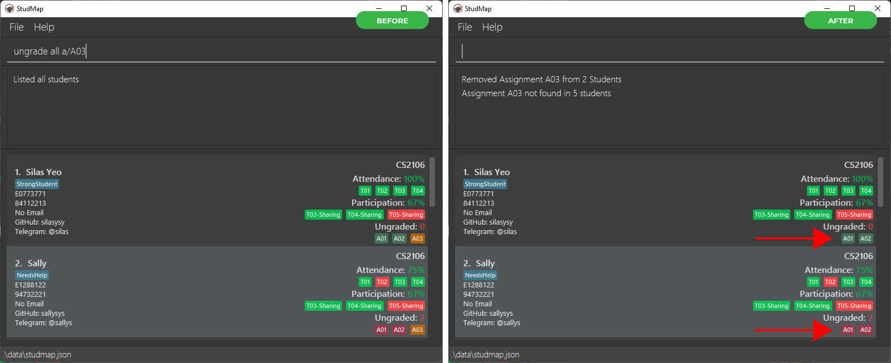

{::options toc_levels="1..2" /}
{:logo: height="200px" width="200px" style="display:block; margin-left:auto; margin-right:auto;"}

Welcome to the official user guide for StudMap! If you are a **teaching assistant (TA)** for a computing module, and you're
swamped with the **admin workload** of managing your students, this application is just for **you!**

{: logo}

# 1. Overview

StudMap is a lightweight desktop application for **managing your students** and **handling your TA
responsibilities**. With a suite of powerful features to **search and organize your students** as well as 
built-in **attendance, participation and assignment tracking**, StudMap can resolve all your TA woes and more!

Additionally, StudMap is optimized for use via a **[Command Line Interface (CLI)](#command-line-interface-cli)**: 
just type instructions to StudMap through a text box, and StudMap will do it for you — it’s like magic! 
Yet, it has all the benefits of a traditional application with a **graphical interface**: you can still see, 
at a glance, a neat overview of what you need to see. If you type fast, StudMap can get your student management tasks 
**done faster** than anything else.

This user guide aims to help you understand StudMap, so that you can make the best use of our features. You can read on to find out 
more about why StudMap is a [good fit for you](#2-why-studmap), or if you can't wait to use this application, jump straight into the
next section introducing our [user guide](#3-how-to-use-this-user-guide).

---

## 1.1 Table of Contents

* Table of Contents
{:toc}

# 2. Why StudMap?

Let’s face it — nobody loves keeping track of administrative details. It’s not the most interesting part of any job. If
you are a TA for a computing [module](#module), you probably didn’t sign up out of your love for admin work. Sadly,
administrative work is a necessary evil for TAs, so the best you can do is to make conquering it more efficient.

## 2.1 What do TAs do?

As a TA, you will find yourself juggling various tasks:

1. Grading of assignments, and managing this grading process
2. Tracking attendance of students for various classes
3. Managing your students’ progress

Managing these may be initially easy, but they can quickly pile up and become more tedious if not handled properly,
especially with the lack of tools available.

## 2.2 What tools do TAs currently use?

### Spreadsheets

One of the tools you may commonly encounter is spreadsheets, such
as [Microsoft Excel](https://www.microsoft.com/en-us/microsoft-365/excel)
or [Google Sheets](https://www.google.com/sheets/about/), often provided by
the head teaching assistant. However, when using these tools, you may notice that there are a lot of redundant features
which you don’t use, but clutter up your screen. Some features you actually want to use are instead hidden in the
stash of icons and menus that you need to painstakingly sieve through.

That’s not even the worst part! The [module](#module) you’re teaching might demand separate spreadsheets to keep track of different
items such as assignments and attendance which can be a huge hassle. Indeed, during our research, this is a point
brought up by multiple TAs.

### Note-Taking Applications

After being annoyed by all the spreadsheets, some TAs fall back to personal note-taking applications, such as Apple
Notes, Microsoft OneNote, or Notepad. If you use these, however, you realize that formatting is often difficult to do.
Useful functionalities like sorting and filtering are also difficult to access, if not non-existent.

## 2.3 The Lament of TAs

After trying all of these tools, you may start wondering: why am I wasting time on admin work when it can be better
spent doing more productive tasks for myself or my students? You’re tired, and you just want to catch up on your sleep
schedule!

Be assured that you are not alone in this endeavor. According to
an [analysis](https://johnjerrim.files.wordpress.com/2020/11/working_paper_workload_wellbeing_november_2020.pdf) done by
University College London on the Teaching and Learning International Survey, a significant portion of teachers consider
too much admin work as a source of their workload stress, which can in turn affect their mental well-being. You wouldn’t
want this to happen to you!

## 2.4 Our Solution

StudMap is our solution for you. It is a lightweight desktop app that addresses your needs as a TA. With a set of
essential yet easy-to-use features, we aim to fill the void between spreadsheets and traditional note-taking apps,
to provide you with the necessary tool to perform record keeping effectively. This user guide is a reference for you, so
that you know how to make the most out of StudMap.

---

# 3. How to use this User Guide

Thank you for choosing StudMap! This user guide will help you navigate our beloved software.

1. You can head off to [Section 4: Quick Start](#4-quick-start) section for a quick tutorial.  
2. If you’re already using StudMap, check out [Section 5: Features](#5-features) section to get in-depth information
   about each [command](#command) you can give StudMap.  
3. For advanced users, check out [Section 7: Command Summary](#7-command-summary) for an easy all-in-one record for all
   the commands.  
4. If you see any unfamiliar terms, check out the [Section 8: Glossary](#8-glossary) for more information.  
5. If you still have any other questions regarding StudMap and its usage, check
   out [Section 6: FAQ](#6-frequently-asked-questions) for answers to some frequently asked questions.  

# 3.1 User Guide Notation Overview

Throughout the guide, various types of notation are used to convey important information about its usage.

Here are some of the symbols and syntax to look out for:

| Symbol / Syntax      | Meaning                                                                                     |
|----------------------|---------------------------------------------------------------------------------------------|
| :information_source: | Information about [commands](#command) or formats that you should be aware of               |
| :exclamation:        | Warning of potential user scenarios you might face that can lead to errors                  |
| :bulb:               | Tips that can help you save time using StudMap                                              |
| `code`               | Indicates [command](#command) or [parameter](#parameters) that can be inputted into StudMap |

---

# 4. Quick Start

If you’re new to StudMap, this is the tutorial for you! Here are the steps for you to get started:

## 4.1 Installation

1. Ensure you have Java 11 or above installed in your computer. See
   [here](https://docs.oracle.com/en/java/javase/11/install/overview-jdk-installation.html) for more detailed
   installation instructions for Java.  

2. Download the latest `studmap.jar` [here](https://github.com/AY2223S1-CS2103T-W13-1/tp/releases).   

3. Create a folder where you want to use StudMap, and copy `studmap.jar` into it. This will be the home folder
   for StudMap.  

4. Double-click on `studmap.jar` to start the app. In a few seconds, you should see a new window detailed in the next
   section.  

## 4.2 Understanding the User Interface

When you first load StudMap, you will likely be greeted with a display similar to the one below, containing some sample
data.
**Don't be overwhelmed!** While there may be many fields and objects to take in at first, let's go through the User
Interface and explore each element one by one.

Take note of the three main elements of the interface:

| Element      | Purpose                                                                                                                                                    |
|--------------|------------------------------------------------------------------------------------------------------------------------------------------------------------|
| Command Box  | This is where you give instructions to StudMap, telling StudMap what you want to do. These instructions are called [Commands](#43-understanding-commands). |
| Reply Box    | This is where StudMap replies with any useful feedback, for example after running a [command](#command).                                                   |
| Student List | This is where StudMap displays the list of students, with information about each student organized into individual **student cards**.                      |

### Student Cards

As a student management tool, the core of StudMap is naturally your students. StudMap can store information about your
student,
such as personal particulars or module-related progress, and represents it in a single rectangular panel called a 
**student card**.

The **left half** of each student card contains the student's particulars. Let's zoom in and find out more:

| Element         | Purpose                                                                                                              |
|-----------------|----------------------------------------------------------------------------------------------------------------------|
| Index           | Order of the student in the list. Used to indicate which student card you want to target with a [command](#command). |
| Student Name    | Name of your student. **Is Compulsory!**                                                                             |
| Tag             | [Tag](#tag) appended to your student, providing additional information about him or her.                             |
| Student ID      | Student ID of your student, usually beginning with E. **Is Compulsory!**                                             |
| Phone Number    | Phone number of your student, if available.                                                                          |
| Email           | Email address of your student, if available.                                                                         |
| GitHub Username | GitHub username of your student, if available.                                                                       |
| Telegram Handle | Telegram handle of your student, if available.                                                                       |

The **right half** of each student card contains module information related to your TA responsibilities:

| Element                  | Purpose                                                                                                                                                                                                                                                                                                                                                                                                                                                                                                                                   |
|--------------------------|-------------------------------------------------------------------------------------------------------------------------------------------------------------------------------------------------------------------------------------------------------------------------------------------------------------------------------------------------------------------------------------------------------------------------------------------------------------------------------------------------------------------------------------------|
| Module                   | [Module](#module) you are teaching your student. **Is Compulsory!**                                                                                                                                                                                                                                                                                                                                                                                                                                                                       |
| Attendance Percentage    | Percentage of classes that your student has been marked present.                                                                                                                                                                                                                                                                                                                                                                                                                                                                          |
| Classes                  | {::nomarkdown} Detailed record of classes for your student. Each box represents one class: <ul><li>the text in the box indicates the name of the class</li><li>the colour indicates attendance status (Green for present, Red for absent)</li></ul>{:/}                                                                                                                                                                                                                                                                                   |
| Participation Percentage | Percentage of [participation components](#participation-component) that your student has qualified for.                                                                                                                                                                                                                                                                                                                                                                                                                                   |
| Participation Components | {::nomarkdown} Detailed record of participation for your student. Each box represents one component: <ul><li>the text in the box indicates the name of the component</li><li>the colour indicates participation status (Green for yes, Red for no)</li></ul>{:/}                                                                                                                                                                                                                                                                          |
| Ungraded Assignments     | Number of ungraded assignments (assignments marked as **received**) that you yet to have graded.                                                                                                                                                                                                                                                                                                                                                                                                                                          |
| Assignment Status        | {::nomarkdown} Detailed record of assignments for your student. Each box represents one assignment: <ul><li>the text in the box indicates the name of the assignment</li><li>the colour indicates assignment status</li></ul>{:/} **Note:** There are 3 assignment statuses: Graded for assignments finished grading (represented by green), Received for assignments your students have submitted and require marking (represented by red), and New for new assignments your students have not yet submitted (represented by yellow) |

:information_source: **Note 1:** Each student is uniquely identified by their **name, student ID and module** combined.
This means that two students with the same name and module are considered **distinct** if they have different student IDs.

:information_source: **Note 2:** Each student in StudMap can only be attached to **one module**. If you are tutoring a student
for more than one module, you will have to create separate entries for that student, each with a different module. This ensures
that data from one module (e.g. Attendance for CS2103T) **will not be mixed** with that from another module (e.g. Attendance for CS2040).

## 4.3 Understanding Commands

Now that you understand the User Interface of StudMap, what can you do to interact with it?

StudMap is designed around the use of a **[Command Line Interface (CLI)](#command-line-interface-cli)**. This means that accessing or modifying data on
StudMap has to be done by typing instructions, or `[commands](#command)`, that StudMap can understand and execute.

### Command Word

The format of any command is standard. The command is first identified by its **command word**, which usually describes
its main functionality. Examples of some useful commands are:

* [`list`](#535-listing-all-students-list), which **lists** the entire student list on StudMap  
* [`sort`](#537-sorting-the-students-sort), which **sorts** the student list in a certain order  
* [`grade`](#544-grading-assignment-for-student-grade), which adds information about an assignment you have **graded** for a student

### Parameters

Sometimes, you may need to include extra details about your instruction to perform a certain task (e.g. what way do you
want to `sort` the list?). You can do this by adding [**parameters**](#parameters), or extra options, behind the command word to specify
further instructions

Here's an example of how [parameters](#parameters) can be used:

* You wish to change the name of the second student to "Salad".  
* You can type the [`edit`](#541-editing-a-student-edit) command word, which will indicate to StudMap you want to edit a student  
* You can then provide two parameters: `2`, which is the index of the student to be edited, and `n/Salad`, which is the
  name you want  
* The final command will look like this: `edit 2 n/Salad`!  

:bulb: **Tip:** Confused about which commands use what parameters? Do not fret! Keying in the command word into the command box 
and pressing enter will give you all the information about the command: what it does, what parameters it takes and so on!

To learn more about parameters, do check out the section on [information about parameters](#52-information-about-parameters)!

### Example Commands

With the power of commands, you can now truly wield StudMap to organize your students and accomplish your TA
responsibilities.
Commands will allow you to add new students to the list, append assignments to be graded or attendances that have been
marked, and so much more!

Let’s try out some commands! Type or copy a command into the Command Box and press Enter to execute it.

* `list`
    * This updates the Student List with all the students you have.  
* `add n/John Doe m/CS2103T id/E1234567`
    * This adds a student named John Doe with student ID `E1234567` into StudMap, who is taking the module `CS2103T`.
      This is one of the ways you can add a new student into StudMap.  
* `mark 1 present c/Tut5`
    * This marks the 1st student currently shown in the Student List as present for the class "Tut5".  
* `delete 3`
    * This deletes the 3rd student currently shown in the Student List.  
* `clear`
    * This deletes all the students, so you can start with a clean slate!
        

This is just a short preview of the features that StudMap has to offer. The [Features](#5-features) section
will guide you through all available commands in greater detail!

## 4.4 Migrating to StudMap

You may be concerned: you’re probably already using some spreadsheet of sorts for keeping track of student data –
and you certainly don’t want to transfer all this data manually to StudMap! We’ve got you covered.

Download this [Student Information Template](files/import_template.csv). If you want a sample of how to use it, check
out this [Example Template](files/example_template.csv), or check out [Import Command](#534-importing-students-from-csv-file-import) 
for more details.

  

That’s all for the tutorial! Check out the [Features](#5-features) section for more detailed information about each
command. We hope you enjoy using StudMap!

---

# 5. Features

## 5.1 Introduction

Welcome to the Features section of StudMap. We have three categories of
features:  

* [5.3 Student List Management](#53-student-list-management)
* [5.4 Student Updating](#54-student-updating)
* [5.5 Miscellaneous](#55-miscellaneous)

Read on to learn in detail about the plethora of features that StudMap has in store for you! Worried about the learning
curve? StudMap is designed to be extremely intuitive, with in-built help messages guiding you every step of the way!

Follow the guide below, and you would be on track to mastering all the necessary [commands](#command) in no time.

## 5.2 Information about Parameters

Before we start looking at each feature in detail, let’s take note of some conventions that we will use in this guide.
This will help you understand the guide better!

**:information_source: Understanding the [command](#command) format:** 

* Words in `UPPER_CASE` are the **parameters** to be supplied by the user. 
  e.g. in `add n/NAME`, `NAME` is a parameter which can be used as `add n/John Doe`.

* Items in square brackets are **optional**. 
  e.g. `n/NAME [t/TAG]` can be used as `n/John Doe t/friend` or as `n/John Doe`.

* Items with `…`​ after them can be used **multiple times** including zero times. 
  e.g. `[t/TAG]…​` can be used as ` ` (i.e. 0 times), `t/friend`, `t/friend t/family` etc.

* Parameters can be in **any order**. 
  e.g. if the [command](#command) specifies `n/NAME p/PHONE`, `p/PHONE n/NAME` is also acceptable.

* If a parameter is expected only once in the [command](#command), but you specified it multiple times, only the **last occurrence**
  of the parameter will be taken. 
  e.g. if you specify `p/12341234 p/56785678`, only `p/56785678` will be taken.

* Extra parameters for [commands](#command) that do not take in parameters (such as `help`, `list`, `exit` and `clear`) will be
  **ignored**. 
  e.g. if the [command](#command) specifies `help 123`, it will be interpreted as `help`.

Throughout this section, you will see numerous [parameters](#parameters) being used by different [commands](#command). Here is a consolidated
summary of the parameters and any remarks (e.g. **constraints**) that might be of relevance. Don't worry if this seems **overwhelming**! 
You do not need to memorise these parameters, as they will be explained throughout the guide whenever they are used in the command!

| Parameter    | Remarks                                                                                                                                                                                       |
|--------------|-----------------------------------------------------------------------------------------------------------------------------------------------------------------------------------------------|
| INDEX        | Number used to specify the student you wish to target. Can be replaced with ALL to target all students in displayed list                                                                      |
| KEYWORD      | Used in [`filter`](#538-filtering-the-students-filter)                                                                                                                                        |
| ORDER        | Used in [`sort`](#537-sorting-the-students-sort), can take two values: asc or dsc                                                                                                             |
| STATUS       | Used to represent status of assignments (new/received/marked), attendance (present/absent) and participation (yes/no)                                                                         |
| a/ASSIGNMENT | Assignment to be recorded for your student.  **Constraint:** Must consist of [alphanumerics](#alphanumeric), spaces, dashes and underscores only                                          |
| a/ATTRIBUTE  | Attribute to be used for [`sorting`](#537-sorting-the-students-sort)                                                                                                                          |
| c/CLASS      | Class to be recorded for your student  **Constraint:** Must consist of [alphanumerics](#alphanumeric), spaces, dashes and underscores only                                                |
| e/EMAIL      | Email for your student.  **Constraint:** Must be of the format local-part@domain                                                                                                          |
| g/GITNAME    | GitHub Username for your student                                                                                                                                                              |
| h/TELEHANDLE | Telegram Handle for your student.  **Constraint:** Must have `@` before the handle e.g. @handle                                                                                           |
| id/ID        | Student ID for your student                                                                                                                                                                   |
| m/MODULE     | [Module](#module) for your student.  **Constraint:** Must follow NUS Module naming convention: letters, then 4 digits, and finally an optional letter suffix (i.e. CS2103T)               |
| n/NAME       | Name for your student                                                                                                                                                                         |
| p/COMPONENT  | [Participation Component](#participation-component) to be recorded for your student.  **Constraint:** Must consist of [alphanumerics](#alphanumeric), spaces, dashes and underscores only |
| p/PHONE      | Phone number for your student.  **Constraint:** Must consist of only numbers, and an optional `+` at the beginning. Must have at least 3 digits                                           |
| t/TAG        | [Tag](#tag) for your student  **Constraint:** Must be only [alphanumeric](#alphanumeric)                                                                                                  |

:information_source: Here are some explanations about the format constraints for certain parameters that you may 
find too restrictive.

* **PHONE:** StudMap currently only allows you to record one phone number for each student, as supporting multiple
  numbers (i.e. Home number) for your student is considered Out of Scope.

* **MODULE:** StudMap is designed as a tool for NUS TAs, and thus StudMap currently only supports the code format
  for NUS modules. Future plans for StudMap include expanding this format to more universities.

## 5.3 Student List Management

* [5.3.1 Adding a student: `add`](#531-adding-a-student-add)
* [5.3.2 Deleting a student: `delete`](#532-deleting-a-student-delete)
* [5.3.3 Clearing all entries: `clear`](#533-clearing-all-entries-clear)
* [5.3.4 Importing students from CSV file: `import`](#534-importing-students-from-csv-file-import)
* [5.3.5 Listing all students: `list`](#535-listing-all-students-list)
* [5.3.6 Locating students by name: `find`](#536-locating-students-by-name-find)
* [5.3.7 Sorting the students: `sort`](#537-sorting-the-students-sort)
* [5.3.8 Filtering the students: `filter`](#538-filtering-the-students-filter)

### 5.3.1 Adding a student: `add`

**Function:** Adds a student to StudMap.

New student attending your class? Add them into StudMap to start managing their records! This is one of the ways you can
add a student into StudMap.  

**Format:** `add n/NAME m/MODULE id/ID [p/PHONE] [e/EMAIL] [g/GITNAME] [h/TELEHANDLE] [t/TAG]…​`

:bulb: <b>Tip:</b>
A student can have any number of [tags](#tag) (including 0)

**Examples:**

* `add n/John Doe m/CS2103T id/E1234567` adds student named `John Doe` taking `CS2103T` with student id `E1234567`.  
* `add n/Betsy Crowe t/PotentialTA e/betsycrowe@example.com id/E3141592 m/CS2101 p/1234567` adds student
  named `Betsy Crowe` taking `CS2101` with student id `E3141592`, email `betsycrowe@example.com`, phone number `1234567`
  and tagged as `PotentialTA`.  
* `add n/Silos Yao t/StrongStudent g/silosyao id/E1234567 m/MA5203` adds student named `Silos Yao` taking `MA5203` with
  student id `E1234567` and tagged as `StrongStudent`.  

**See Also:**
[`import`](#534-importing-students-from-csv-file-import)

### 5.3.2 Deleting a student: `delete`

**Function:** Deletes the specified student from the StudMap.

Did your student withdraw from the module midway through the semester? You can remove them from so that your StudMap
remains clutter-free!  

:bulb: <b>Tip:</b>
You can use [`find`](#536-locating-students-by-name-find) to help locate the student you wish to delete first.  

**Format:** `delete INDEX/ALL`

* `INDEX`: You can specify the index of the student you want to delete. The index refers to the
  index number shown in the displayed student list.
  The index **must be a positive integer** 1, 2, 3, …​  
* `ALL`: You can delete all the students currently displayed.  

**Examples:**

* `list` followed by `delete 2` deletes the 2nd student in the StudMap.  
* `find Betsy` followed by `delete 1` deletes the 1st student in the results of the `find` [command](#command).  

**See Also:**
[`clear`](#533-clearing-all-entries-clear)

### 5.3.3 Clearing all entries: `clear`

**Function:** Clears all entries from the StudMap.

Need to start afresh? Delete all the entries from StudMap with this [command](#command).  

**Format:** `clear`

:exclamation: <b>Caution:</b>
This can be dangerous! Make sure you back up your data before executing this [command](#command).
See <a href="#553-backing-up-data">here</a> for more instructions. 

**See Also:**
[`delete`](#532-deleting-a-student-delete)

### 5.3.4 Importing students from CSV file: `import`

**Function:** Imports student data from a [CSV (Comma-separated Values) file](#csv-comma-separated-values-file) stored
on your computer.

Just starting out with StudMap? Simply copy and paste in the necessary details into a template, and StudMap will handle
the rest — it's like magic. For your convenience, you can find the import template
[here](files/import_template.csv).  

**Format:** `import`

* Importing student data will add students to the existing student list, and will not clear any existing students  
* Running the [command](#command) will open a file browser for you to select the CSV file to import  
* The CSV format accepted by StudMap is strict! Please use the template provided.  

:exclamation: <b>Caution:</b>
StudMap currently does not support any commas in any data field (cell) when importing a CSV file. Please avoid inputting any data
that has commas in the CSV.

**Example Use Case:** Importing a fresh batch of students as a new StudMap user

1. Remove the default list of students by typing `clear`  
2. Modify the import template using the CSV editor of your choice (e.g. Excel, Notepad)  
   
     
   _Example of a properly edited import template which you can download here: [example csv](files/example_template.csv)_
     
3. Type the `import` [command](#command) and select the CSV file you have modified  
4. If done correctly, StudMap will create the new students using the data from the CSV file uploaded  

**See Also:**
[`add`](#531-adding-a-student-add)

### 5.3.5 Listing all students: `list`

**Function:** Shows a list of all students in the StudMap.

Want to take a look at all your students? This is the [command](#command) you're looking for.  

**Format:** `list`

### 5.3.6 Locating students by name: `find`

**Function:** Finds students whose names contain any of the given keywords.

If you're searching for a student by name, this is a fast shortcut for you. If you're looking for more specific
filtering, such as by their module, see [`filter`](#538-filtering-the-students-filter).  

**Format:** `find KEYWORD [MORE_KEYWORDS]`

* The search is case-insensitive. e.g. `hans` will match `Hans`  
* The order of the keywords does not matter. e.g. `Hans Bo` will match `Bo Hans`  
* Only the name is searched.  
* Only full words will be matched e.g. `Han` will not match `Hans`.  
* Students with name matching at least one keyword will be returned (i.e. `OR` search). e.g. `Hans Bo` will
  return `Hans Gruber`, `Bo Yang`.  

**Examples:**

* `find tom` returns `Tom Aito`
  
    
* `find John` returns `john` and `John Doe`  
* `find alex david` returns `Alex Yeoh` and `David Li`  

**See Also:**
[`filter`](#538-filtering-the-students-filter)

### 5.3.7 Sorting the students: `sort`

**Function:** Sorts the list by the specified attribute in the specified order.

When managing your students, you might want to focus on a certain aspect of the module to track. For instance, you may
wish to clamp down on absenteeism and identify students who are constantly missing from class. To achieve this, you can
sort the StudMap by `ATTENDANCE`.  

**Format:** `sort ORDER a/ATTRIBUTE`

- `ORDER`: You can specify the order you wish to sort your StudMap.
    - `asc`: Sort in ascending order.
    - `dsc`: Sort in descending order.  
- `ATTRIBUTE`: You can specify the attribute which you want to sort the StudMap by. Currently, the following attributes
  are supported:
    - `NAME`
    - `MODULE`
    - `PHONE`
    - `ID`
    - `GIT`
    - `HANDLE`
    - `EMAIL`
    - `ATTENDANCE`
    - `ASSIGNMENT`
    - `PARTICIPATION`

**:information_source: Note 1:** If student has no records for the specified sorting attribute, they will be sorted to
the end of the StudMap.  

**:information_source: Note 2:** When sorting by `ASSIGNMENT`, we are actually sorting by number of marked assignments.

**:information_source: Note 3:** When sorting by `ATTENDANCE` and `PARTICIPATION`, we are sorting
by `% of classes attended` and `% of components participated` correspondingly.  

Examples:

* `sort asc a/attendance` sorts list by `ATTENDANCE` in **ascending** order  
* `sort asc a/name` sorts list by `NAME` in **ascending** order  
* `sort dsc a/phone` sorts list by `PHONE` in **descending** order  

### 5.3.8 Filtering the students: `filter`

**Function:** Filters students from the StudMap based on different categories.

If you want to check on the progress of weaker students you tagged as `NeedsMoreHelp`, for example, you can filter by
[tag](#tag) to focus on them. If you're teaching multiple modules at once, you can filter by module to focus on the module
you're currently interested in. If you want to find those assignment submissions you have yet to grade, you can filter
by assignment.  

**Formats:**

- `filter t/Keyword [MORE_KEYWORDS]`
    * Filters students specific to the category "tag" represented with the prefix `t/`  
- `filter m/Keyword [MORE_KEYWORDS]`
    * Filters students specific to the category "module" represented with the prefix `m/`  
- `filter a/Keyword [MORE_KEYWORDS]`
    * Filters students specific to the category "assignment" represented with the prefix `a/`

**:information_source: Note:** The filter [command](#command) only successfully filters if there is an exact match between the category and
the keyword provided.  
Example: `filter t/friends` will filter students who have the [tag](#tag) `friends`, but `filter t/fri` will not. 

**Example:**

* `filter t/ friends` will return a filtered list of students
  that are tagged as friends  
* `filter m/ cs2103t` will return a filtered list of students
  that are enrolled in the module `CS2103T`.  
* `filter a/ a01` will return a filtered list of students
  that are working on assignment `A01`.  
* `filter t/PotentialTA StrongStudent` will return a filtered list of
  students that are tagged as potential teaching assistants, strong students, or both.  

**See Also:**
[`find`](#536-locating-students-by-name-find)

## 5.4 Student Updating

* [5.4.1 Editing a student: `edit`](#541-editing-a-student-edit)
* [5.4.2 Marking attendance of student: `mark`](#542-marking-attendance-of-student-mark)
* [5.4.3 Unmarking attendance of student: `unmark`](#543-unmarking-attendance-of-student-unmark)
* [5.4.4 Grading assignment for student: `grade`](#544-grading-assignment-for-student-grade)
* [5.4.5 Removing assignment from student: `ungrade`](#545-removing-assignment-from-student-ungrade)
* [5.4.6 Recording participation of student: `participate`](#546-recording-participation-of-student-participate)
* [5.4.7 Removing participation of student: `unparticipate`](#547-removing-participation-of-student-unparticipate)
* [5.4.8 Adding tag to student: `tag`](#548-adding-tag-to-student-tag)
* [5.4.9 Removing tag from student: `untag`](#549-removing-tag-from-student-untag)

### 5.4.1 Editing a student: `edit`

**Function:** Edits an existing student in the StudMap.

Need to update outdated student details? You can easily edit that field without deleting and re-adding the student.  

:bulb: <b>Tip:</b>
 You can use [`find`](#536-locating-students-by-name-find) to help locate the student you wish to edit first.  

**Format:** `edit INDEX/ALL [n/NAME] [p/PHONE] [e/EMAIL] [m/MODULE] [id/ID] [g/GITNAME] [h/TELEHANDLE] [t/TAG]…​`

* `INDEX`: You can specify the index of the student you want to edit. The index refers to the index number shown in the
  displayed student list.
  The index **must be a positive integer** 1, 2, 3, …​  
* `ALL`: You can edit all students currently displayed.  
* **At least one of the optional fields** must be provided.  
* Existing values will be updated to the input values.  
* When editing tags, the existing tags of the student will be removed i.e. adding of tags is not cumulative.  
* You can remove all the student's tags by typing `t/` without specifying any tags after it.  
* You can remove the student's phone, email, GitName, TeleHandle by typing `p/`, `e/`, `g/`, `h/` respectively.  

**Examples:**

* `edit 1 p/91234567 e/johndoe@example.com` Edits the phone number and email address of the 1st student to be `91234567`
  and `johndoe@example.com` respectively.  
* `edit 2 n/Betsy Crower t/` Edits the name of the 2nd student to be `Betsy Crower` and clears all existing tags.  

### 5.4.2 Marking attendance of student: `mark`

**Function:** Marks students as present or absent for a specified class.

Need to record attendance for a class of students you just taught? Mark will help you keep track of who was present or
absent for that particular class.  

**Format:** `mark INDEX/ALL STATUS c/CLASS`

* `INDEX`: You can specify the index of the student you want to mark attendance for. The index refers to the index
  number shown in the displayed student list.
  The index **must be a positive integer** 1, 2, 3, …​  
* `ALL`: You can mark attendance for all students currently displayed.  
* Status accepts two values only: `present` and `absent`  
* Marking an **existing class** as either `present` or `absent` will **overwrite** the existing record

:exclamation: **Caution:** Class names should only consist of [alphanumerics](#alphanumeric), spaces, dashes and underscores! Using any other
  character will lead to your class name being **rejected**

**Examples:**

* `mark all present c/T01` marks all students in the list as present for class `T01`.  
  
    
* `mark 1 present c/T03` marks the first student as present for class `T03`.  
* `mark all absent c/T04` marks all students in the list as absent for class `T04`.  

**See Also:**
[`unmark`](#543-unmarking-attendance-of-student-unmark)

### 5.4.3 Unmarking attendance of student: `unmark`

**Function:** Removes the attendance record of a specific class from students.

Made a mistake with attendance tracking for a particular class? Unmark will remove any attendance records you want.  

**Format:** `unmark INDEX/ALL c/CLASS`

* `INDEX`: You can specify the index of the student you want to remove attendance record for. The index refers to the
  index number shown in the displayed student list.
  The index **must be a positive integer** 1, 2, 3, …​  
* `ALL`: You can remove attendance record for all students currently displayed.  
* StudMap allows for attendances to be removed even if the student never had any record for that class
  (i.e. StudMap will inform you that the student has not been modified)  

**Examples:**

* `unmark all c/wrongclass` removes the attendance record for class `wrongclass` from all students in the list who have
  such a record. In this case, all 7 students have the record.  
  
    
* `unmark 1 c/T01` removes the attendance record for class `T01` from the first student.  

**See Also:**
[`mark`](#542-marking-attendance-of-student-mark)

### 5.4.4 Grading assignment for student: `grade`

**Function:** Changes the grading status for a specific assignment for students.

You can change the grading status for the assignments using this [command](#command). If the record of the assignment does not yet
exist for the specified student, a new entry for the assignment will be automatically created for the student. This can
help you to better keep track of assignments that you have graded or received.

**:information_source: Note:** The name of assignments should contain only numbers and letters (all upper case). If
you include any lower case in the assignment name, it will be automatically converted to upper case.

**Format:** `grade INDEX/ALL STATUS a/ASSIGNMENT`

- `INDEX`: You can specify the index of the student you want to change the assignment grading status for. The index
  **must be a positive integer** 1, 2, 3, …​  
- `ALL`: You can modify the assignment grading status for every student in the currently displayed list.  
- `STATUS`: You can specify the grading status for the assignment. Currently, following three statuses are supported:
    - `new`: The assignment has just been assigned to the student and hence it has not been submitted nor marked yet.
    - `received`: You have received the assignment submission from the student, but you have not graded it yet.
    - `marked`: You have received and graded the assignment.  
- `ASSIGNMENT`: You can specify the assignment which you want to change the grading status for.

**Examples:**

* `grade 1 marked a/A02` changes the assignment grading status for assignment `A02` of the first student in the list
  to `marked`. Add an entry of `A02` into the first student's record if it does not exist yet. In this case, it already
  exists.  
  
    
* `grade all marked a/A02` changes the assignment grading status for assignment `A02` of every student in the list
  to `marked`.  

**See Also:**
[`ungrade`](#545-removing-assignment-from-student-ungrade)

### 5.4.5 Removing assignment from student: `ungrade`

**Function:** Removes the specified assignment from the student's record.

Made a mistake with the name of an assignment, or need to remove certain assigment records? Ungrade will remove
any assignment records you want.  

**Format:** `ungrade INDEX/ALL a/ASSIGNMENT`

- `INDEX`: You can specify index of the student remove the assignment from. The index **must be a positive integer** 1,
  2, 3, …​  
- `ALL`: You can remove the assignment for all students in the currently displayed list.  
- `ASSIGNMENT`: You can specify the record of the assignment to be removed.  

**Examples:**

* `ungrade all a/A03` removes assignment `A03` from all students in the currently displayed list, if they have it. In
  this case, only 2 students have such a record.  
  
    
* `ungrade 1 a/A01` removes assignment `A01` from the first student.  

**See Also:**
[`grade`](#544-grading-assignment-for-student-grade)

### 5.4.6 Recording participation of student: `participate`

**Function:** Records the participation of students in a given [participation component](#participation-component).

Need to record who actively volunteered to share their answers in class for participation? Participate will help you 
keep track of who participated for a [particular component](#participation-component) in your lesson.  

**Format:** `participate INDEX/ALL STATUS p/COMPONENT`

- `INDEX` could be specified or use `ALL` to record the participation component for all students in the list. The
  index **must be a positive integer** 1, 2, 3, …​  
- `ALL`: You can record the participation component for all students in the currently displayed list.  
- `STATUS` is either `yes` for participated or `no` for not participated  
- `COMPONENT` is the participation component  

**Examples:**

* `participate 2 yes p/T05-Sharing` records the second student in the list as having **participated** for participation
  component `T05-Sharing`. If the student does not have a record for the component yet, it is added. In this case, it
  already exists.  
  
    
* `participate 1 yes p/P01` records the first student in the list as having **participated** for participation
  component `P01`.  
* `participate 1 no p/P02` records the second student in the list as having **not participated** for participation
  component `P01`.  
* `participate all yes p/P03` records all students in the list as having **participated** for participation
  component `P03`.  

**See Also:**
[`unparticipate`](#547-removing-participation-of-student-unparticipate)

### 5.4.7 Removing participation of student: `unparticipate`

**Function:** Removes the record of participation for students in the given [participation component](#participation-component).

Made a mistake with the name of a [participation component](#participation-component), or need to remove certain participation records? 
Unparticipate will remove any participation records you want.  

**Format:** `unparticipate INDEX/ALL p/COMPONENT`

- `INDEX` could be specified or use `ALL` to remove specified participation component for all students in the list. The
  index **must be a positive integer** 1, 2, 3, …​  
- `ALL`: You can remove the participation component for all students in the currently displayed list.  
- `COMPONENT` is the participation component  

**Examples:**

* `unparticipate all p/wrongcomponent` removes participation component `wrongcomponent` from all students in the
  currently displayed list. In this case, 5 students have such a record.  
  
    
* `unparticipate 1 p/P01` removes participation component `P01` from the first student in the currently displayed list.  
* `unparticipate all p/P03` removes participation component `P03` from all students in the currently displayed list.  

**See Also:**
[`participate`](#546-recording-participation-of-student-participate)

### 5.4.8 Adding tag to student: `tag`

**Function:** Adds one or more [tags](#tag), or text labels, to students.

With this feature, you can keep small tidbits about your students on their entry.
This can help you better identify and keep track of them.

**:information_source: Note 1:** The tag should be short and limited to only letters and/or numbers (i.e. no spaces)
. 

**:information_source: Note 2:** The tags are case-sensitive. For example, `goodStudent` and `goodstudent` will
be recognised as different labels.

**:information_source: Note 3:** The tagging [command](#command) is cumulative, that is, new tags are simply added to the student(s)
and do not replace their previous tags. To remove tags from the student(s), see [untag](#549-removing-tag-from-student-untag)
below.  

**Format:** `tag INDEX/ALL t/TAG [t/OTHER]`

- `INDEX`: You can specify the index of the student you want to add the tag to. The index refers to the index number
  shown in the displayed student list.
  The index **must be a positive integer** 1, 2, 3, …​  
- `ALL`: You can add tag(s) to all students currently displayed.  
- `TAG`: You can specify the label to be added to the student. At least one label should be specified when you use this
  [command](#command)  
- `OTHER`: You can also specify other tags that you might also want to add to your student(s).  

**Examples:**

* `tag 1 t/goodStudent` adds the tag of "goodStudent" to the first student in the current list.  
* `tag all t/goodstudent t/potentialTA` add both `goodStudent` and `potentialTA` tag to the all student in the current
  list.  

**See Also:**
[`untag`](#549-removing-tag-from-student-untag)

### 5.4.9 Removing tag from student: `untag`

**Function:** Removes the specified [tag(s)](#tag) from the student(s).

Accidentally tagged a student wrongly, or simply don't want it there anymore? This is the [command](#command) for the job.  

**Format:** `untag INDEX/ALL t/TAG [t/OTHER]`

- `INDEX`: You can specify index of the student to remove the tag from. The index refers to the index number shown in
  the displayed student list.
  The index **must be a positive integer** 1, 2, 3, …​  
- `ALL`: You can remove the tag for all students in the currently displayed list.  
- `TAG`: You can specify the `TAG` to remove.There should be at least one label to be removed when you use this [command](#command).
  For the restrictions on the format of a `TAG`, see Note 1 for [Add tag to student](#548-adding-tag-to-student-tag).  
- `OTHER`: You can also include multiple tags to be removed from your student(s).  

**Examples:**

* `untag 1 t/needMoreTime` removes the tag of `needMoreTime `from the first student in the current list.  
* `untag all t/needMoreTime t/late` removes the tag of `needMoreTime` and `late` from all students in the current list.  

**See Also:**
[`tag`](#548-adding-tag-to-student-tag)

## 5.5 Miscellaneous

* [5.5.1 Exiting the program: `exit`](#551-exiting-the-program-exit)
* [5.5.2 Saving the data](#552-saving-the-data)
* [5.5.3 Backing up data](#553-backing-up-data)
* [5.5.4 Editing the data file](#554-editing-the-data-file)
* [5.5.5 Viewing help: `help`](#555-viewing-help-help)

### 5.5.1 Exiting the program: `exit`

**Function:** Exits the program.

**Format:** `exit`

### 5.5.2 Saving the data

StudMap data is saved in the hard disk automatically after any [command](#command) that changes the data. There is no need to save
manually.

### 5.5.3 Backing up data

StudMap data is saved as a [JSON file](#json-file) `[JAR file location]/data/studmap.json`. You can make a copy of this
file if you want to back up your data.

### 5.5.4 Editing the data file

As mentioned above, your StudMap data is saved as a [JSON file](#json-file) `[JAR file location]/data/studmap.json`. Advanced users
are welcome to update data directly by editing that data file.

:exclamation: <b>Caution:</b>
If your changes to the data file makes its format invalid, StudMap will discard all data and start with an empty data file at the next run. This means
that mistakes with manually modifying the data file can **potentially wipe all** your student data!

### 5.5.5 Viewing help: `help`

**Function:** Shows a message linking to the online User Guide.

Confused about the usage of a certain feature? Don't worry, self-help is available on the comprehensive online User
Guide, right here!  

**Format:** `help`

---

# 6. Frequently Asked Questions

**Q**: How do I transfer my data to another Computer? 
**A**: Install the app in the other computer and overwrite the empty data file it creates with the file that contains
the data of your previous StudMap home folder. See how to back up your data [here](#553-backing-up-data).
  
**Q**: How can I transfer my data from an existing spreadsheet to StudMap? 
**A**: You can use the [`import`](#534-importing-students-from-csv-file-import) feature.
  
**Q**: Do I have to pay to use StudMap? 
**A**: StudMap is completely free!
  
**Q**: Why is the list empty when I use the feature `list`? 
**A**: It is likely that you have not added/transferred any data into StudMap. Start adding students
through our [`import`](#534-importing-students-from-csv-file-import) or [`add`](#531-adding-a-student-add) feature now!
  
**Q**: Why do I need to state the student's student ID to add him/her into StudMap? 
**A**: To track a student effectively, we deem student ID as an important aspect since most assignments
require students to state their student ID.
  
**Q**: What if there are 2 student of the same given name? 
**A**: By using either `find` or `filter` feature, you will be able to search for
the specific student even if they have the same given name.

---

# 7. Command Summary

| Action                                                                           | Format, Examples                                                                                                                                                                                             |
|----------------------------------------------------------------------------------|--------------------------------------------------------------------------------------------------------------------------------------------------------------------------------------------------------------|
| **[Add](#531-adding-a-student-add)**                                             | `add n/NAME m/MODULE id/ID [p/PHONE] [e/EMAIL] [g/GITNAME] [h/TELEHANDLE] [t/TAG]…​`   e.g., `add n/John Doe p/98765432 e/johnd@example.com m/CS2103T id/E1234567 g/user1 h/@user1 t/friends t/owesMoney` |
| **[Delete](#532-deleting-a-student-delete)**                                     | `delete INDEX/ALL`  e.g., `delete 3`                                                                                                                                                                      |
| **[Clear](#533-clearing-all-entries-clear)**                                     | `clear`                                                                                                                                                                                                      |
| **[Import CSV](#534-importing-students-from-csv-file-import)**                   | `import`                                                                                                                                                                                                     |
| **[List](#535-listing-all-students-list)**                                       | `list`                                                                                                                                                                                                       |
| **[Find](#536-locating-students-by-name-find)**                                  | `find KEYWORD [MORE_KEYWORDS]`  e.g., `find James Jake`                                                                                                                                                   |
| **[Sort](#537-sorting-the-students-sort)**                                       | `sort ORDER a/ATTRIBUTE`   e.g., `sort asc a/name`                                                                                                                                                        |
| **[Filter](#538-filtering-the-students-filter)**                                 | `filter`                                                                                                                                                                                                     |
| **[Edit](#541-editing-a-student-edit)**                                          | `edit INDEX/ALL [n/NAME] [p/PHONE] [e/EMAIL] [m/MODULE] [id/ID] [g/GITNAME] [h/TELEHANDLE] [t/TAG]…​`   e.g.,`edit 1 p/91234567 e/johndoe@example.com`                                                    |
| **[Mark attendance](#542-marking-attendance-of-student-mark)**                   | `mark INDEX/ALL STATUS c/CLASS`   e.g., `mark 1 present c/T01`                                                                                                                                            |
| **[Unmark attendance](#543-unmarking-attendance-of-student-unmark)**             | `unmark INDEX/ALL c/CLASS`   e.g., `mark 1 c/T01`                                                                                                                                                         |
| **[Grade assignment](#544-grading-assignment-for-student-grade)**                | `grade INDEX/ALL STATUS a/ASSIGNMENT`   e.g., `grade 1 new a/A01`                                                                                                                                         |
| **[Remove assignment](#545-removing-assignment-from-student-ungrade)**           | `ungrade INDEX/ALL a/ASSIGNMENT`   e.g., `ungrade 1 a/A01`                                                                                                                                                |
| **[Record participation](#546-recording-participation-of-student-participate)**  | `participate INDEX/ALL STATUS p/COMPONENT`   e.g., `participate 2 yes p/C01`                                                                                                                              |
| **[Remove participation](#547-removing-participation-of-student-unparticipate)** | `unparticipate INDEX/ALL p/COMPONENT`   e.g., `unparticipate 2 p/C01`                                                                                                                                     |
| **[Add tag](#548-adding-tag-to-student-tag)**                                    | `tag INDEX/ALL t/TAG [t/OTHER]`   e.g., `tag 2 t/goodStudent`                                                                                                                                             |
| **[Remove tag](#549-removing-tag-from-student-untag)**                           | `untag INDEX/ALL t/TAG [t/OTHER]`   e.g., `untag 2 t/goodStudent`                                                                                                                                         |
| **[Exit](#551-exiting-the-program-exit)**                                        | `exit`                                                                                                                                                                                                       |
| **[Help](#555-viewing-help-help)**                                               | `help`                                                                                                                                                                                                       |

---

# 8. Glossary

### Alphanumeric

An alphanumeric character is one that is either a number (0-9) or a letter (any letter of the alphabet, lower or upper
case). An input described as alphanumeric means that all the characters of the input must follow these constraints (i.e.
composed only of letters and/or numbers).

### Command

A command is an instruction for StudMap, and the main way to interact with it! Learn more about commands by looking at the
[Understanding Commands section](#command-word), and check out the [Features](#5-features) section to see what commands are available.

### Command Line Interface (CLI)

Command Line Interface (CLI) is a method of interaction between the user and StudMap primarily through typing out instructions, or `commands`.

### CSV (Comma-separated Values) file

This is a file type that many applications use for importing and exporting data. That's why we're using it for import!

### JSON file

This is a file type that many applications use for storing data in a human-readable format. We're also using it, so that
advanced users can edit their student data easily if they wish.

### Module

Each module of study has a unique module code consisting of a two- or three-letter prefix that generally denotes the
discipline, and four digits, and sometimes a suffix. e.g. `CS2101`, `CS2103T`.

### Participation Component

This is a flexible label for any aspect of your tutorial / lab class or module that should be graded for participation.
For instance, if you want to reward those who actively share their answers in class, you can label a component called `SharedAnswers`
which reflects their class participation.

### Tag

This is a small label that you can add to student entries, enabling you to keep track of small details about your students,
and better identify them. For instance, you can tag weaker students as `Needs Help` or Macintosh users as `Mac Users`.

