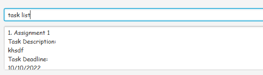

## Welcome to the TAA User Guide!

*Teaching Assistant Assistant (TAA)* is a **desktop app for Teaching Assistants (TA) to track student progress and tasks,
optimized for use via a Command Line Interface** (CLI) while still having the
benefits of a Graphical User Interface (GUI). If you can type fast, TAA can get your students and tasks management done
faster than traditional GUI apps.

### Using this guide
If you are viewing this for the first time, you may want to read the [Getting Started](#getting-started) section first.
* Check out our [Quick Start](#quick-start) section for a quick overview of setting up the app for the first time.
* If you are a new user, you may want to check out the [Command Summary](#command-summary) section 
for a quick overview of the commands.
* If you have any questions, do check out our [FAQ](#FAQ) section for answers to common quest.ons.
* If you are interested in helping to develop TAA, check out our [Developer Guide](DeveloperGuide.md).

---

* Table of Contents
{:toc}

---

## Getting Started

If you are new to TAA, this section serves as an introduction to the app and it's functionalities.

### What is TAA?
TAA is a student developed, open source desktop application for **Teaching Assistants (TA) to track students' progress
and tasks.**

### Quick Start

1. Ensure you have Java `11` or above installed in your Computer.

2. Download the latest TAA.jar from [here](https://github.com/AY2223S1-CS2103T-T13-1/tp/releases).

3. Copy the file to the folder you want to use as the home folder for your TAA.

4. Double-click the file to start the app. The GUI appear in your app should be similar as the one shown below: 

5. Type the command in the command box and press Enter or click the Send button to execute. Some example commands you can try:
   * `task add` `tn/Assignment 1 i/Due ASAP d/12/12/2022`: Creates a task called Assignment 1.
   * `task edit` `1 d/30/12/2022`: Edits the task Assignment 1 to change its deadline to 30/12/2022.
   * `task delete` `1`: Removes the task Assignment 1 from TAA.

6. Refer to the Features below for details of each command. Alternatively, you may refer to the 
[Command Summary](#Command Summary) section for a quick overview of the commands.

---

## Command Summary

This section shows a quick summary of a list of commands that are available in TAA.

### Student Management

| Action                                                                    | Format, Examples                                                                                                                                                                 |
|---------------------------------------------------------------------------|----------------------------------------------------------------------------------------------------------------------------------------------------------------------------------|
| **[Add student](#add-students)**                                          | `student add n/studentName p/phoneNumber e/email g/tutorialGroup(optional) t/tags(optional)` e.g. `student add n/James Ho p/98765432 e/a@gmail.com g/T03 t/yearTwo`              |
| **[Remove student(s)](#remove-students)**                                 | `student delete <indices>` e.g. `student delete 1 3`                                                                                                                             |
| **[Edit student](#edit-students)**                                        | `student edit <index> n/<studentName>(optional) p/<studentPhone>(optional) e/<studentEmail>(optional) g/<tutorialGroup>(optional) t/<tag>(optional)` e.g. `student edit 1 g/T05` |
| **[List students](#list-students)**                                       | `student list`                                                                                                                                                                   |

### Task Management

| Action                                                                    | Format, Examples                                                                                                                                                                 |
|---------------------------------------------------------------------------|----------------------------------------------------------------------------------------------------------------------------------------------------------------------------------|
| **[Add task](#add-new-task)**                                             | `task add tn/<taskName> i/<taskDescription> d/<taskDeadline> s/<student(s)>(optional)` e.g. `task add tn/Grade Mission 1 i/Due Tomorrow d/10/12/2022 s/James Ho`                 |
| **[Remove task(s)](#remove-task)**                                        | `task delete <indices>` e.g. `task delete 2 4`                                                                                                                                   |
| **[Edit task](#edit-task)**                                               | `task edit <index> tn/<taskName>(optional) i/<taskDescription>(optional) d/<taskDeadline>(optional) s/<student(s)>(optional)` `e.g. task edit 1 d/11/12/2020`                    |
| **[List tasks](#list-tasks)**                                             | `task list`                                                                                                                                                                      |

### Tutorial Groups

| Action                                                                    | Format, Examples                                                                                                                                                                 |
|---------------------------------------------------------------------------|----------------------------------------------------------------------------------------------------------------------------------------------------------------------------------|
| **[Add tutorial group](#add-new-tutorial-group)**                         | `tutorial add g/<tutorialGroup>` e.g. `tutorial add g/T01`                                                                                                                       |
| **[Remove tutorial group](#remove-tutorial-group)**                       | `tutorial delete g/<tutorialGroup>` e.g. `tutorial delete g/T01`                                                                                                                 |
| **[Enrol student](#enroll-a-student-into-a-group)**                       | `student enroll <index> g/<groupName>` e.g. `student enrol 1 g/T03`                                                                                                              |
| **[Expel student](#expel-a-student-from-a-group)**                        | `student expel <index> g/<groupName>` e.g. `student expel 1 g/T03`                                                                                                               |
| **[Filter students by group](#view-all-students-in-a-tutorial-group)**    | `tutorial filter g/<groupName>` e.g. `tutorial filter g/T03`                                                                                                                     |
| **[Reset filters](#reset-filters-and-show-all-students)**                 | `tutorial reset`                                                                                                                                                                 |

### Grades

| Action                                                                    | Format, Examples                                                                                                                                                                 |
|---------------------------------------------------------------------------|----------------------------------------------------------------------------------------------------------------------------------------------------------------------------------|
| **[Mark assignment as graded](#mark-assignment-as-graded-or-ungraded)**   | `grade edit <studentIndex> <taskIndex> gr/T` e.g. `grade edit 1 1 gr/T`                                                                                                          |
| **[Mark assignment as ungraded](#mark-assignment-as-graded-or-ungraded)** | `grade edit <studentIndex> <taskIndex> gr/F` e.g. `grade edit 2 1 gr/F`                                                                                                          |
| **[View assignment grading status](#display-assignment-grade-status)**    | `grade view <studentIndex> <taskIndex>` e.g. `grade view 3 7`                                                                                                                    |

### General

| Action                                                                    | Format, Examples                                                                                                                                                                 |
|---------------------------------------------------------------------------|----------------------------------------------------------------------------------------------------------------------------------------------------------------------------------|
| **[Display the user guide URL](#display-user-guide-url)**                 | `help me`                                                                                                                                                                        |
| **[Exit the app](#exit-the-app)**                                         | `bye bye`                                                                                                                                                                        |

---

## Features
This section will explain in detail the functionality of each command in TAA.

Before we start, here are some definitions that will be used in this section:

**:information_source: Notes about the command format:** 

* Words surrounded in angled brackets (`< >`), e.g. `<taskName>` are the parameters to be supplied by the user. 
  e.g. in `tutorial add g/<tutorialGroup>`, `<tutorialGroup>` is a parameter which can be used as `tutorial add g/T03`.

* Optional parameters are indicated with `(optional)`. 
  e.g. `task add tn/<taskName> i/<taskDescription> d/<taskDeadline> s/<student(s)>(optional)`
  can be used as
  * `task add tn/Assignment 6 i/Recursion d/31/12/2023` or
  * `task add tn/Assignment 6 i/Recursion d/31/12/2021 s/Thomas Edison` or
  * `task add tn/Assignment 6 i/Recursion d/31/12/2021 s/Thomas Edison s/George Washington`

* Arguments with `(s)` after them can be used multiple times including zero times. 
  e.g. See the above example regarding `s/<student(s)>`.

* Parameters can be specified in any order. 
  e.g. if the command specifies `group expel g/<groupName> s/<studentName>`, both of the following commands are equivalent:
  * `group expel g/T03 s/Billy Boy`
  * `group expel s/Billy Boy g/T03`

* If a parameter is expected only once in the command, but you specified it multiple times, only the last occurrence of the parameter will be taken. 
  e.g. if you specify `p/80000000 p/88888888`, only `p/88888888` will be taken.

* Extraneous parameters for commands that do not take in parameters (such as `help me`, `bye bye`) will be ignored. 
  e.g. if you enter `help me pretty p/lease`, it will be interpreted as `help me`.

- For commands that take an index, you can parse multiple indexes at once to do the action for multiple items at once.
  * You can remove multiple students at once by separating the indices with a space. e.g. `student delete 1 2 3`

### Student Management
#### Add students

Adds a student with the given phone number, email, tutorial group, and tags to the list of students

- Command `student add n/studentName p/phoneNumber e/email g/tutorialGroup(optional) t/tags(optional)`

E.g. `student add n/James Ho p/98765432 e/a@gmail.com g/T03 t/yearTwo`

**:information_source: Notes:** 

- `<studentName>` should be alphanumeric and should not be blank
- `<phoneNumber>` should only contain numbers, and it should be at least 3 digits long
- `<email>` should contain in the format: local-part@domain
  - local-part should only contain alphanumerics and these special characters, excluding the parentheses, (+_.-)
  - local-part should not start or end with any special characters
  - domain should be at least 2 characters long
- `<tutorialGroup>` should follow the format Txx, where x is a numeric value, and it should not be blank
- `<tags>` should be alphanumeric with no white space

#### Remove students

Removes the indexed students(s) from the list of students

- Command `student delete <indices>`

E.g. `student delete 1 3`

**:information_source: Notes:** 

- Each `index` must be a positive integer which corresponds to an existing student
- You can delete multiple students at once by separating the indices with a space. e.g. `student delete 1 2 3`

#### Edit students

Edits the student by its given index with at least 1 variable specified to change.

- Command: `student edit <index> n/<studentName>(optional) p/<studentPhone>(optional) e/<studentEmail>(optional) g/<tutorialGroup>(optional) t/<tag>(optional)`

E.g. `student edit 1 g/T05`

**:information_source: Notes:** 

- `index` must be a positive integer and must correspond to an existing student.
- `<studentName>` should be alphanumeric and should not be blank
- `<phoneNumber>` should only contain numbers, and it should be at least 3 digits long
- `<email>` should contain in the format: local-part@domain
  - local-part should only contain alphanumerics and these special characters, excluding the parentheses, (+_.-)
  - local-part should not start or end with any special characters
  - domain should be at least 2 characters long
- `<tutorialGroup>` should follow the format Txx, where x is a numeric value, and it should not be blank
- `<tags>` should be alphanumeric with no white space
- For commands that take an index, you can parse multiple indexes at once to do the action for multiple items at once.
  - You can edit multiple students at once by separating the indices with a space. e.g. `student edit 1 2 3 g/T03`

#### List students

Shows a list of all students

- Command: `student list`

### Task Management

#### Add new task
Adds a task to the list of tasks

The task is initially assigned to no students if no student variable is entered
- Command: `task add tn/<taskName> i/<taskDescription> d/<taskDeadline> s/<student(s)>(optional)`

E.g. `task add tn/Grade Mission 1 i/Due Tomorrow d/10/12/2022 s/James Ho`

**:information_source: Notes:** 

- `taskName` should only contain alphanumeric characters and spaces, and it should not be blank
- `taskDescription` should not be blank
- `taskDeadline` should be in the format of DD/MM/YYYY with its days and months within range
- `student(s)`, referenced by their name, should exist

#### Remove task

Removes the indexed task(s) from the list of tasks
- Command: `task delete <indices>`

E.g. `task delete 2 4`

**:information_source: Notes:** 

- Each `index` must be a positive integer which corresponds to an existing task
- You can delete multiple tasks at once by separating the indices with a space. e.g. `task delete 1 2 3`

#### Edit task

Edits the task by its given index with at least 1 variable specified to change.

- Command: `task edit <index> tn/<taskName>(optional) i/<taskDescription>(optional) d/<taskDeadline>(optional) s/<student(s)>(optional)`

E.g. `task edit 1 d/11/12/2020`

**:information_source: Notes:** 

- `index` must be a positive integer and valid
- `taskName` should only contain alphanumeric characters and spaces, and it should not be blank
- `taskDescription` should not be blank
- `taskDeadline` should be in the format of DD/MM/YYYY with its days and months within range
- `student(s)`, referenced by their name, should exist

#### List tasks

Shows a list of tasks

- Command: `task list`

### Tutorial Groups

#### Add new tutorial group

Adds the tutorial group with the name `tutorialGroup`

- Command: `tutorial add g/<tutorialGroup>`

E.g. `tutorial add g/T01`

**:information_source: Notes:** 

- `tutorialGroup` should follow the format Txx, where x is a numeric value, and it should not be blank

#### List tutorial groups

Shows a list of tutorial groups

- Command: `tutorial list`

#### Remove tutorial group

Removes the tutorial group at the specified `index`

- Command: `tutorial delete <index>`

E.g. `tutorial delete 1`

**:information_source: Notes:** 

- `tutorialGroup` should follow the format Txx, where x is a numeric value, and it should not be blank

**:bulb: Tips:** 

- do a `tutorial list` command first, to see which index the tutorial group is at

#### Enroll a student into a group

Enrolls the student at index i to the group named `groupName`

- Command: `student enroll <index> g/<groupName>`

E.g. `student enrol 1 g/T03`

**:information_source: Notes:** 

- `tutorialGroup` must follow the format Txx, where x is a numeric value, and it should not be blank

#### Expel a student from a group

Removes the student at index i from the group `groupName`.

- Command: `student expel <index> g/<groupName>`

E.g. `student expel 1 g/T03`

**:information_source: Notes:** 

- `tutorialGroup` must follow the format Txx, where x is a numeric value, and it should not be blank

#### View all students in a tutorial group

Displays only students from the group `groupName` in the GUI.

- Command: `tutorial filter g/<groupName>`

E.g. tutorial filter g/T01

**:information_source: Notes:** 

- `tutorialGroup` must follow the format Txx, where x is a numeric value, and it should not be blank

#### Reset filters and show all students

Undoes the `tutorial filter` command and displays all students in the GUI.

- Command: `student unfilter`

### Grades

#### Mark assignment as graded or ungraded

Marks the specified student's assignment as graded (`T`) or ungraded (`F`)

- Command: `grade edit <studentIndex> <taskIndex> gr/<T or F>`

E.g. `grade edit 1 1 gr/T`

**:information_source: Notes:** 

- `index` must be a positive integer and valid

#### Display assignment grade status

Shows the grade status of the specified student's assignment

- Command: `grade view <studentIndex> <taskIndex>`

E.g. `grade view 3 7`

**:information_source: Notes:** 

- `index` must be a positive integer and valid

### General
#### Display user guide url

Shows a popup with the user guide url in it

- Command: `help me`

#### Exit the app

Exit and close the app

- Command: `bye bye`

---

## FAQ

#### What if I forget the command format?
- You can click on the help button to view the commands.

#### Why can't I add a student?
- Check the format of your add command. You can refer to the pop-up message or the help page for the command format.
- Check if the name of the new student belongs to another student.

#### Why can't I enroll a student to a tutorial group?
- Check whether the specified student and tutorial group exists.
- Check if you have entered the correct student name.
