

  * Table of Contents
  {:toc}

--------------------------------------------------------------------------------------------------------------------
## 1. Introduction to WorkBook

Are you a Computing student that finds it really hard to collate and manage all your internship progress together?
Do you find it really hard to get an internship because you do not know how to prepare for the different interview stages? Fret not  

WorkBook is just the right tool for you! :wave:   WorkBook is an **internship application tracker** that helps Computing students **prepare sufficiently** for their upcoming interviews to **secure** that internship.
We also ensure that you never miss an interview or an application deadline ever again! 
Workbook is optimized for fast typists and utilizes a **Command Line Interface (CLI)** style while still having the benefits of a 
**Graphical User Interface (GUI)**.    So what are you waiting for? Transform your internship hunt with WorkBook today!

--------------------------------------------------------------------------------------------------------------------

## 2. Getting started

1. Ensure you have [Java 11 or above](https://www.oracle.com/sg/java/technologies/downloads/#java11) installed on your Computer.

2. Download the latest `WorkBook.jar` from [here](https://github.com/AY2223S1-CS2103T-T10-3/tp/releases/).

3. Copy the file to a folder of your choice to store data from your WorkBook.

4. Using your command terminal, navigate to the folder where you placed your WorkBook at and fire it up by inputting: `java -jar WorkBook.jar` in your terminal.   The GUI with sample data as shown below should appear in a few seconds. 
   

5. You can tell WorkBook what you want by typing your command in `Enter command here...` at the top of the application and pressing <kbd>⏎ Enter</kbd> to execute.  
   Some example commands you can try:

   * `add c/Meta d/18-Oct-2022 12:00 e/hrmonkey@example.com r/Frontend` : Adds an internship application from `Meta` to the WorkBook.

   * `delete 3` : Deletes the 3rd internship shown in the current list.

   * **`help`** : Displays the help window for easy reference to the list of commands.

   * **`exit`** : Exits the app.

6. You can jump straight to [here](#6-what-you-can-do) for a summary of the commands.

--------------------------------------------------------------------------------------------------------------------
## 3. About this guide

This guide serves to: 

1. Educate new users on how to get started with WorkBook.
2. Explain the purpose and how to use each and every command.
3. Display a summary of all the commands you can utilize.

--------------------------------------------------------------------------------------------------------------------
## 4. Exploring our guide

**Information Box**

**:information_source: Info:** Provides extra information that is useful

**Warning Box**

**:exclamation: Warning: Important messages**

**Tip Box**

**:bulb: Tip:** Provides pointers to enhance your experience using the application

**Highlights**  
`commands` or `PARAMETERS`

**Keyboard Inputs** 

<button>enter</button>   <button>&uarr;</button>   <button>&darr;</button>

--------------------------------------------------------------------------------------------------------------------

## 5. Things to note

**:information_source: Notes about the command format:** 

* Words in `UPPER_CASE` are the parameters to be supplied by the user. 
  e.g. in `add c/COMPANY`, `COMPANY` is a parameter which can be used as `add c/Meta`.

* Items in square brackets are optional. 
  e.g `c/COMPANY [t/TAG]` can be used as `c/Meta t/unattainable` or as `c/Meta`.

* Items with `…`​ after them can be used multiple times including zero times. 
  e.g. `[t/TAG]…​` can be omitted, used once: `t/unattainable`, or multiple times: `t/unattainable t/AWS`.

* Parameters can be in any order. 
  e.g. if the command specifies `c/COMPANY s/STAGE`, `s/STAGE c/COMPANY` is also acceptable.

* If a parameter is expected only once in the command, but you specified it multiple times, only the last occurrence of the parameter will be taken. 
  e.g. if you specify `r/Frontend r/Backend`, only `r/Backend` will be taken.

* Extraneous parameters for commands that do not take in parameters (such as `help`, `list`, `exit` and `clear`) will be ignored. 
  e.g. if the command specifies `help 123`, it will be interpreted as `help`.

#### Parameter-specific behaviour

* Whenever `[d/DATETIME]` is specified as a parameter, you should input it in the format `dd-MMM-yyy hh:mm` where `y` is year, `M` is month, `d` is day, `h` is hour in the 24-hour format and `m` is minutes.  
  e.g. October 2 2022 5:00pm should be input as `02-Oct-2022 17:00`.
  * Month is not case-sensitive

#### Behaviour of sorted internship applications

* The list of applications are sorted downwards from the closest upcoming application to furthest.
* Those with no `DATETIME` attached to it will be placed below those with upcoming dates.
* Applications in the past (i.e. `DATETIME` is past current time) will be placed at the bottom of the list, sorted downwards as well from the most recently passed.
* An example is shown below:
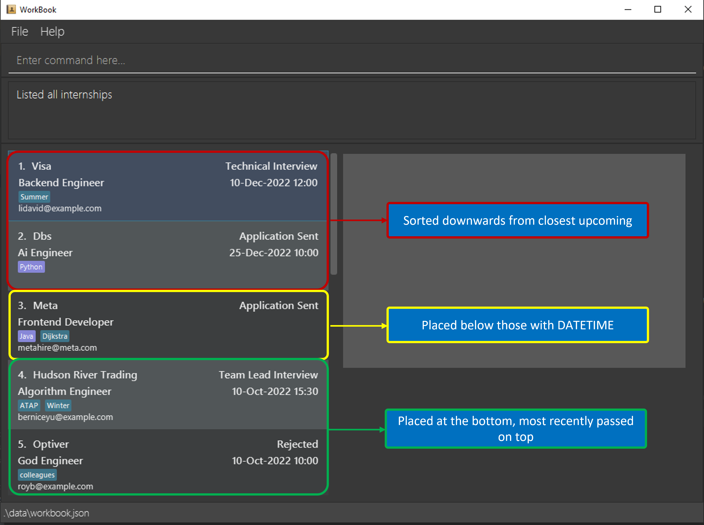

## 6. What you can do

| Action     | Command format   e.g. `Example command`                                                                                                                                                                |
|------------|-----------------------------------------------------------------------------------------------------------------------------------------------------------------------------------------------------------|
| **Add**    | `add c/COMPANY r/ROLE s/STAGE [d/DATETIME] [e/COMPANY_EMAIL] [l/LANGUAGE TAG]… [t/TAG]…​`   e.g., `add c/Bytedance r/Backend Engineer s/Online Assessment d/24-Sep-2022 15:00 t/high pay l/Javascript` |
| **Edit**   | `edit INDEX [c/COMPANY] [d/DATETIME] [e/COMPANY_EMAIL] [r/ROLE] [l/LANGUAGE TAG]… [t/TAG]…​​`  e.g.,`edit 2 c/Meta e/hr@meta.com`                                                                      |
| **Find**   | `find [c/COMPANY] [r/ROLE] [s/STAGE]`  e.g., `find c/Meta`                                                                                                                                             |
| **Delete** | `delete INDEX`  e.g., `delete 3`                                                                                                                                                                       |
| **List**   | `list`                                                                                                                                                                                                    |
| **Undo**   | `undo`                                                                                                                                                                                                    |
| **Redo**   | `redo`                                                                                                                                                                                                    |
| **Clear**  | `clear`                                                                                                                                                                                                   |
| **Help**   | `help`                                                                                                                                                                                                    |
| **Exit**   | `exit`                                                                                                                                                                                                    |

**:information_source: Note:** 
* Commands without examples are considered trivial and can be executed by inputting the command without additional parameters.
* Commands are **case-sensitive**!

### 6.1. Adding your internship application:

Congrats! You have already done the hard work - applying for that internship you've always wanted. 
Now, simply add the details into WorkBook and we can begin tracking your application!

Format: `add c/COMPANY r/ROLE s/STAGE [d/DATETIME] [e/COMPANY_EMAIL] [l/LANGUAGE TAG] [t/TAG]…​`

**:bulb: Tip:** The date and time you provide could represent multiple things: 
  * The date and time it happened
  * The deadline of the corresponding `Stage`

Examples:
* `add c/Meta r/Frontend Engineer s/Application Sent d/29-Oct-2022 12:00 e/hrmonkey@example.com`
* `add c/Bytedance r/Backend Engineer s/Online Assessment d/24-Sep-2022 15:00 t/high pay l/Java l/Python`

### 6.2. Editing your internship application:

Good job! You've passed the Resume Screening and have been invited to complete an Online Assessment for your internship application.
Now's a good time to use this command to update the application so that WorkBook can continue to give you relevant tips and reminders!

Format: `edit INDEX [c/COMPANY] [r/ROLE] [s/STAGE] [d/DATETIME] [e/COMPANY_EMAIL] [l/LANGUAGE TAG] [t/TAG]…​`

* Edits the internship at the specified `INDEX`. The index refers to the index number shown in the displayed internships list. The index **must be a positive integer** 1, 2, 3, …​
* At least one of the optional fields must be provided.
* Existing values will be updated to the input values.
* When editing tags, the existing tags of the internship will be removed i.e adding of tags is not cumulative.
* You can remove all the internship’s tags by typing `t/` without
    specifying any tags after it.

**:bulb: Tip:** You can edit any number of attributes with the edit command.

Examples:
* `edit 1 s/Behavioural Interview e/hr@meta.com` Edits the stage and email address of the first internship to be `Behavioural Interview` and `hr@meta.com` respectively.
* `edit 2 l/golang t/` Adds `golang` as the only language tag for the second internship and clears all existing tags.

### 6.3. Listing all existing internship applications: 

Lists all of your internship applications in WorkBook in a [sorted order](#3-things-to-note).

**:bulb: Tip:** Your most recent upcoming internship application will be at the top of the list!

Format: `list`

### 6.4. Finding your internships:

If you wanted to view all your internship applications corresponding to a particular company, stage or role,
then this command is for you!  

It can find internships whose company, role or stage names contain all the respective keywords.

Format: `find c/COMPANY | r/ROLE | s/STAGE`

* Displays a list of internships that match all the keywords.

**:bulb: Tip:**  
* Case does not matter e.g. `meta` will match `Meta`.
* Order of the keywords does not matter e.g. `Jane Street` will match `Street Jane`.

**:exclamation: Caution**  
* Only full words will be matched e.g. `met` will not match `Meta`.
* Exactly one attribute can be searched for either Company, Role or Stage.

Examples:
* `find r/Engineer` returns `Software Engineer` and `Backend Engineer`.
* `find s/Interview` returns `Technical Interview` and `Behavioural Interview`.

### 6.5. Deleting your internship application:

If you wanted to remove an internship application then this command
deletes the specified internship application from WorkBook.

Format: `delete INDEX`

* Deletes the internship application at the specified `INDEX`.
* The index refers to the index number shown in the displayed internship application list.
* The index **must be a positive integer** 1, 2, 3, …​

**:exclamation: Caution:** The command will only be executed if the index provided corresponds to an internship application.

Examples:
* `list` followed by `delete 2` deletes the 2nd internship application in WorkBook.
* `find Meta` followed by `delete 1` deletes the 1st internship application within the results of the `find` command.

### 6.6. Clearing your existing internship applications:

It's a new cycle of summer internship applications and that means it's time for some spring-cleaning! 
Use this command to clear all the applications you've previously saved in WorkBook!

Format: `clear`

Example:
* `clear` removes all internship applications in the WorkBook.

**:bulb: Tip:** If you cleared your internship applications by mistake, fret not as you can easily undo this!

### 6.7. Undoing your previous command:

What if you accidentally made a mistake and performed a wrong <em>undoable</em> command?
Workbook can help you to undo your changes after performing an undesirable <em>undoable</em> command! 
Workbook will restore itself to the version before you performed the previous <em>undoable</em> command!

WorkBook keeps track of all your previous <em>undoable</em> commands and its current version, allowing you to `undo` as many times
to restore any desired state of your WorkBook.

Format: `undo`
* Undo the previous <em>undoable</em> command.
* You can perform the `undo` command as many times as the number of tracked Workbook versions
i.e. stacking 2 undo commands sequentially will revert the WorkBook back 2
versions ago, assuming you performed at least 2 <em>undoable</em> commands previously!
* When you perform an <em>undoable</em> command, it will be stacked on top of the
previous <em>undoable</em> command in the stack. The `undo` command will undo the first <em>undoable</em> command at the
top of the stack.

* If you have not executed an <em>undoable</em> command previously, the WorkBook will remain in its current version
and return an error message: "No previous changes to undo!". 

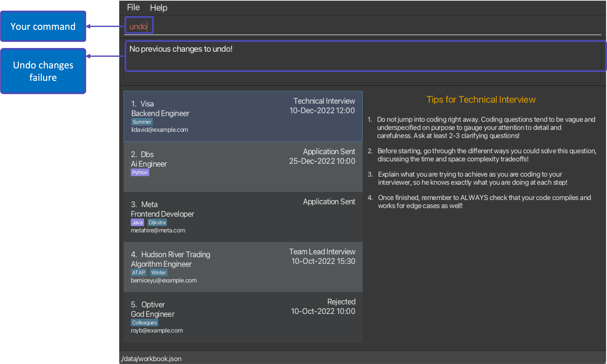

Examples:
* `add c/Meta r/Frontend Engineer s/Application Sent d/29-Oct-2022 12:00 e/hrmonkey@example.com` followed by `undo` will
return the WorkBook version without the added internship.
* `edit 1 s/Behavioural Interview e/hr@meta.com` followed by `clear` and then `undo` will undo the 
clearing of the Workbook. The edited stage and email address of the first internship will remain in the 
returned WorkBook version. 

Workbook version before `undo`:
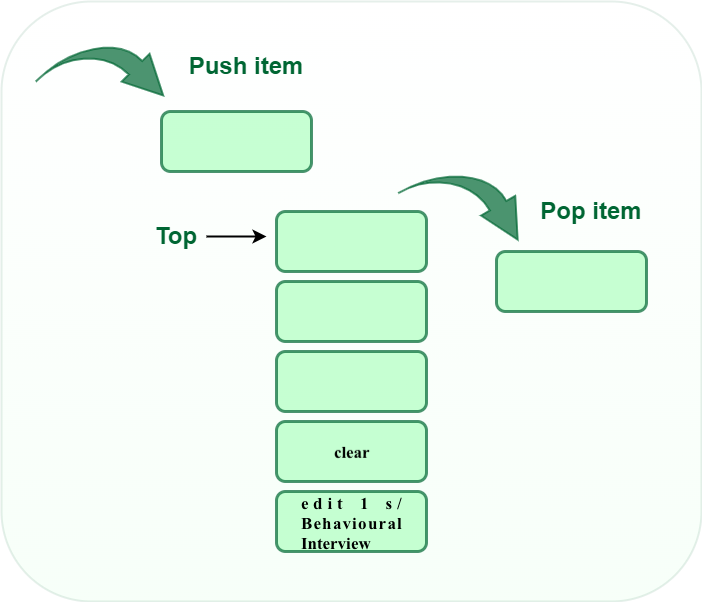

Workbook version after `undo`:
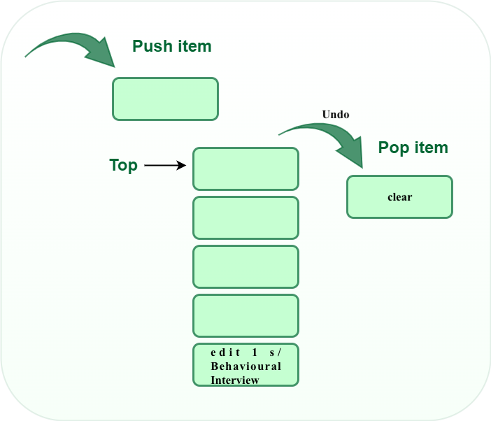

* `delete 2` followed by `list` and then `undo` will restore the WorkBook to its version prior to the 
`delete 2` command as the `list` command is not an <em>undoable</em> command and does not create a new
version of the WorkBook.
* `edit 2 l/golang t/` followed by `delete 1` and then 2 consecutive `undo` commands will first restore the
WorkBook to its version before the `delete 1` command, and then the version before the `edit` command.

Before executing command: `edit 2 l/golang t/`
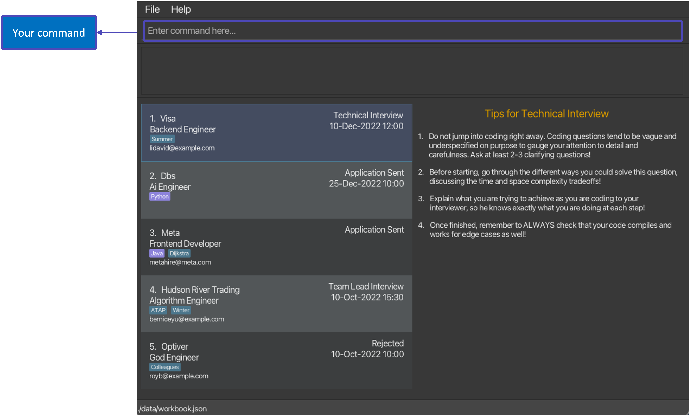

After executing command: `edit 2 l/golang t/`
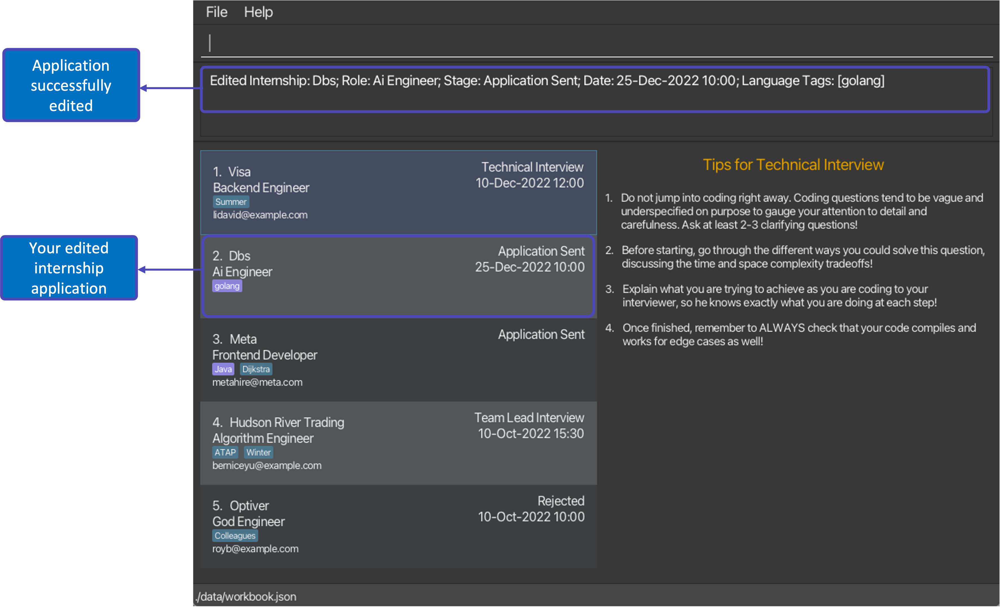

After executing command: `delete 1`

After executing command: `undo`
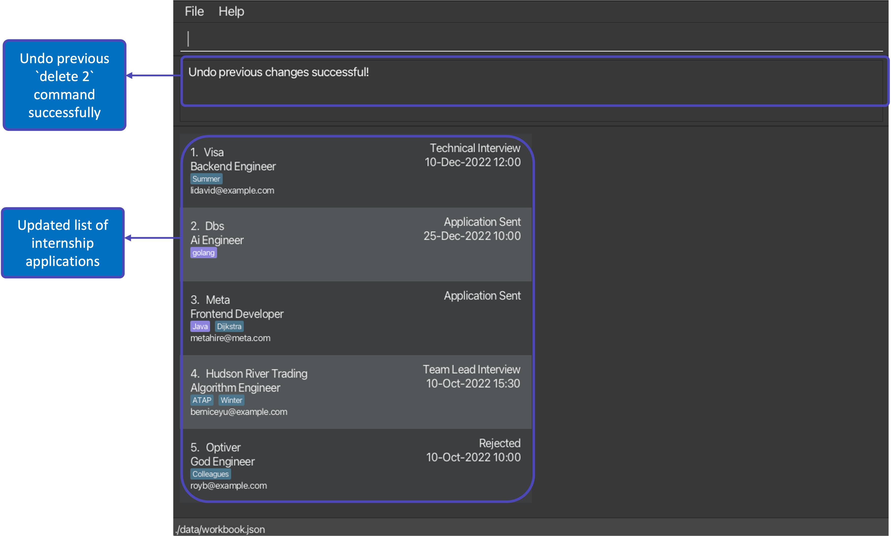

After executing command: `undo`
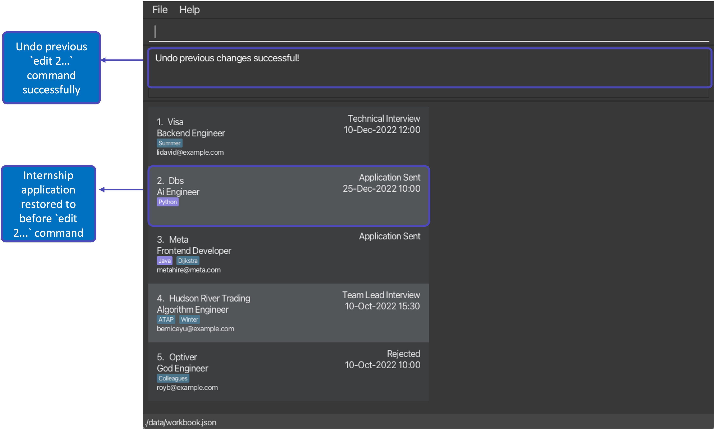

**:information_source: Note:** 
You can only undo <em>undoable</em> commands!
* `add`
* `edit`
* `delete`
* `clear`
* `redo`

**:bulb: Tip:**  
* If you have undone your previous undoable command by mistake, fret not as you can easily redo this 
to reapply the initial changes!
* Performing multiple `undo` commands may confuse you as to which <em>undoable</em> command you are
undoing and how your WorkBook currently looks like!

### 6.8. Redoing your previous command:

Now, what if you mistakenly performed an `undo` command?
Workbook can help you to redo your changes after performing an undesirable `undo` command!
Workbook will reverse the previous `undo` command and restore itself to the version before that!

WorkBook keeps track of all your previous <em>undoable</em> commands and its current version,
allowing the `redo` command to be performed as many times to reverse the
`undo` commands you have performed!

Format: `redo`
* Redo the previous `undo` command.
* You can perform the redo command as many times as the number of undone versions in the Workbook's tracked versions
i.e. stacking 2 redo commands sequentially will revert the WorkBook back to its version 2
  `undo` commands ago, assuming that you performed at least 2 `undo` commands previously.
* When you perform an `undo` command, it will be stacked on top of the 
previous `undo` command in the stack. The `redo` command will redo the first `undo` command at the
top of the stack.
* If you have not executed a previous `undo` command, the WorkBook will remain in its current state
  and return an error message: "No more commands to redo!".

Examples:
* `add c/Meta r/Frontend Engineer s/Application Sent d/29-Oct-2022 12:00 e/hrmonkey@example.com` followed by `undo` 
and then `redo` will restore the WorkBook version with the added internship.

Workbook version before `redo`:
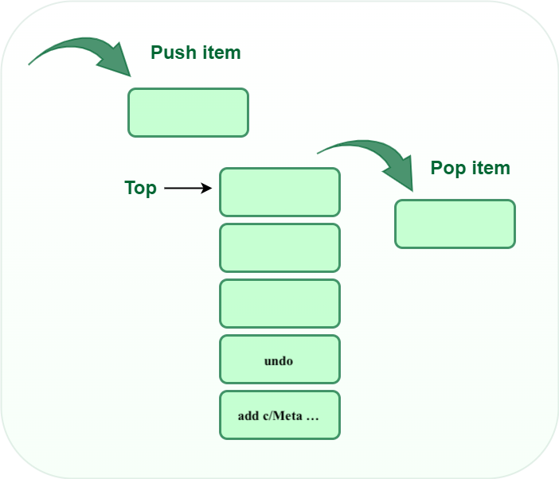

Workbook version after `redo`:
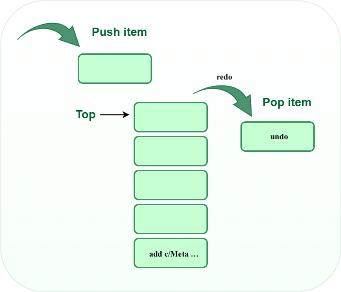

* `edit 1 s/Behavioural Interview e/hr@visa.com` followed by `clear` will create 2 new WorkBook versions. 
If you perform 2 consecutive `undo` commands, the WorkBook will be restored to the version before both
`edit` and `clear` commands. When you perform a `redo` command now,
the WorkBook version will contain the edited stage and email for the first internship.

After you perform command: `edit 1 s/Behavioural Interview e/hr@visa.com`
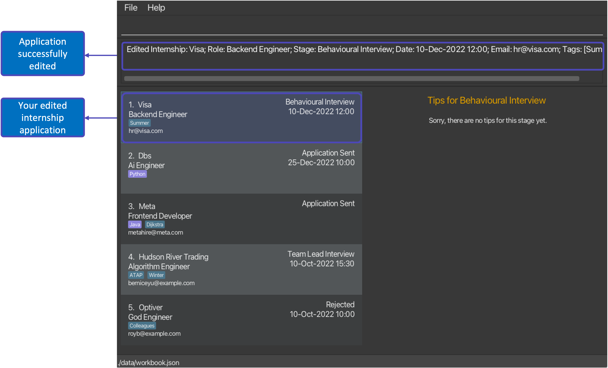

After you perform command: `clear`
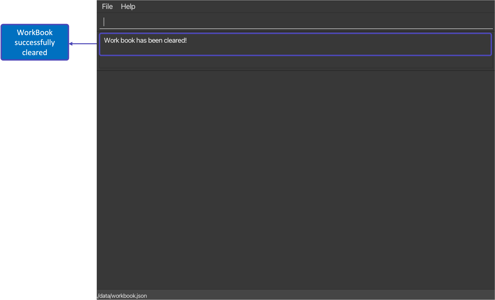

After you perform command: `undo`

After you perform command: `undo`
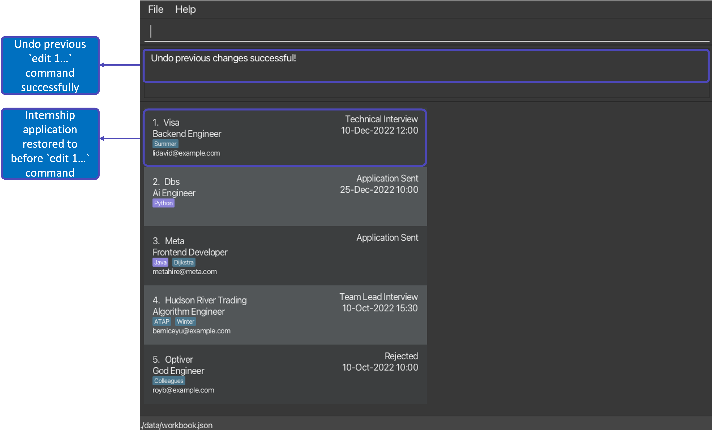

After you perform command: `redo`

**:bulb: Tip:**  
* If you have redone your previous undo command by mistake, fret not as you can easily undo this again
to remove the initial changes!
* Performing multiple `redo` commands may confuse you as to which `undo` command you are
redoing and how your WorkBook currently looks like!

### 6.9. Viewing help:

Shows a summary of the commands as well as a link to this User Guide.

Format: `help`

### 6.10. Exiting the program:

Exits the program.

Format: `exit`

### 6.11. Viewing daily tips

_Details coming soon ..._

--------------------------------------------------------------------------------------------------------------------

## 7. Managing your data

### 7.1. Saving

Conveniently, any inputted command that changes any part of your internship application is **automatically saved**!
Hence, you need not worry about pressing `ctrl` and `s` everytime you update your list of internship applications.

### 7.2. Editing

All your internship applications are saved in a JSON file under the `data` subfolder. 
You are free to update any internship application directly by editing that JSON file.

**:information_source: JSON?:** 
* JSON stands for JavaScript Object Notation, learn how to edit the file [here](https://www.softwaretestinghelp.com/how-to-open-a-json-file/)!

:exclamation: **Caution:**
If your changes to the data file makes its format invalid, WorkBook will discard all data and start with an empty data file at the next run.

--------------------------------------------------------------------------------------------------------------------

## 8. Frequently asked questions

**Q**: How do I transfer my data to another Computer? 
**A**: [Install](#2-get-started) the app in the other computer, copy and override the JSON file in the new `data` subfolder, and you are done!

**Q**: How do I change the theme of WorkBook? 
**A**: It is not possible as of now, but will be coming soon!

--------------------------------------------------------------------------------------------------------------------

## 9. Prefix Summary

| Prefix | Symbolize    |
|--------|--------------|
| **n/** | Company Name |
| **s/** | Stage        |
| **r/** | Role         |
| **d/** | DateTime     |
| **e/** | Email        |
| **l/** | Language Tag |
| **t/** | Tag          |

--------------------------------------------------------------------------------------------------------------------

## 10. Glossary

| Term                           | Description                                                                                                                                        |
|--------------------------------|----------------------------------------------------------------------------------------------------------------------------------------------------|
| Graphical User Interface (GUI) | GUI allows user to interact with an application through graphics such as icons, menu, etc.                                                         |
| Command Line Interface (CLI)   | CLI allows user to use text as commands to be executed by an application.                                                                          |
| Command                        | Instruction typed by the user for WorkBook to execute.                                                                                             |
| Parameter                      | A component of a command for the user to input information. For WorkBook's context, this refers to the internship application details.             |
| Prefix                         | An abbreviation for the name of the parameter. Prefix should be entered before the actual parameter in a command and always ends with a slash (/). |
| Alphanumeric                   | Characters that are either a number or a letter.                                                                                                   |

