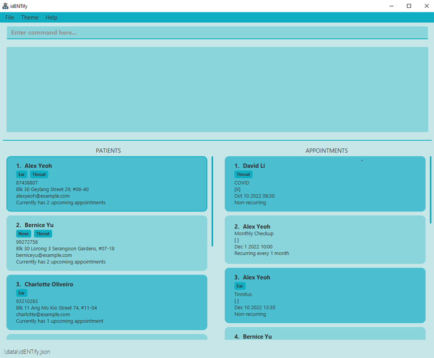

* Table of Contents
{:toc}

--------------------------------------------------------------------------------------------------------------------

## Introduction
myStudent is **a desktop app for managing students of a tuition center, optimized for use via a Command Line Interface 
(CLI)** while still having the benefits of a Graphical User Interface (GUI). If you can type fast, myStudent can get 
your student management tasks done faster than traditional GUI apps.

---
## About
This user guide provides a detailed documentation of how to install and use myStudent. It provides explanations of how 
to use and what it does for all the features available in myStudent. 

:information_source: Notes about the command format:

* Prefixes are user inputs that consist of a character followed by a slash  
  e.g. `n/` or `p/`

* `< >` - represent parameters that are supplied by the user.  
  e.g. `add n/<name>, where <name>` is just the name of the parameter and users can input `add n/John Doe`.  

* `[ ]` - represent parameters that are optional.  
        e.g `n/<name> [#/<tag>]`, users can input `add n/John Doe` or `n/John Doe #/male`.

* Users can input parameters of prefixes in any order.  
  e.g. `nok <index> n/<name> p/<phone>`, users can either input `nok 2 n/John Doe p/91234567` or `nok 2 n/John Doe p/91234567`.  
  However, `nok n/John Doe p/91234567 2` where <index> is at the end of the input, is not a valid.

* Extra input from the user for commands that do not take in parameters will be ignored.  
  e.g. the clear command does not have any other parameters, thus the user input clear asdfghjkl is logically the same as if the user typed in clear.

Below is a quick guide on how to get started.

---

## Quick Start
1. Ensure you have Java 11 or above installed in your Computer.
2. Download the latest `myStudent.jar` from [here](https://github.com/AY2223S1-CS2103T-F12-4/tp/releases).
3. Copy the file to the folder you want to use as the home folder for the application.
4. Double-click the file to start the app. The GUI similar to the below should appear in a few seconds. 

  

:pencil2: **Configuring the app**  
Users can change the default configurations of the app in the `preference.json` file located in the same place where they download the app into.  
A `preference.json` file will be created when you first run the application. Users can then edit the file to suit their needs.  

**What users can change:**
* The size of the window such as its height and width (in pixels).
* At which part of the screen the app will be displayed.
* The default theme.
* Where data will be loaded from and stored into.

| Settings 	                            | Default Value 	                       |
|---------------------------------------|---------------------------------------|
| Window Width 	                        | 670px 	                               |
| Window Height 	                       | 950px 	                               |
| Window Coordinates 	                  | null 	                                |
| Theme 	                               | Light Theme 	                         |
| Student Address Book Location 	       | data\\\studentaddressbook.json 	      |
| Tutor Address Book Location 	         | data\\\tutoraddressbook.json 	        |
| Tuition Class Address Book Location 	 | data\\\tuitionclassaddressbook.json 	 |

---

## Layout

### 1. Command Box

This is where you key in commands. After typing the commands, simply press <kbd>enter</kbd> on your keyboard to execute them. 

### 2. Feedback Box

This is where the feedback information would be displayed after you execute a command. For example, after you keyed in an invalid command, the feedback “Invalid format” would be shown in the box for your reference.

### 3. List Display Panel

This is where the current list of entities is shown. Only one of the three entities, student, tutor and class will be shown at one time.
In student and tutor lists, you could click at the student or tutor cards to show their description in the description panel.

### 4. List Tabs

There are three list tabs: Student, Tutor and Class indicating the current displayed list showing in the list display panel.
You could click at the list tabs to switch to different lists.

### 5. Description Panel

This is where the description of a specified student or tutor is shown. When there is no person on display, the line “No Person Displayed” would be shown.

### 6. Toolbar 

#### File
The ` File`  menu contains `Export` and `Exit`.
`Export` allows you to export your data into a `.csv` file. 
`Exit` allows the software to exit after three seconds of pause.

#### Help
`Help` allows you to view the help information regarding the software.

#### Theme
 `Theme` allows you to change the color scheme of the software. There are four themes provided: `Light Theme`, `Dark Theme`,  `Green Theme` and `Pink Theme`.

---

## Features

### Viewing help: `help`

Shows help information that will be useful to you.

Format: `help [<command>]`

* To view all the commands, type `help` and press <kbd>Enter</kbd>.
* To view information regarding a specific command, type `help` followed by said command and press <kbd>Enter</kbd>.

Examples:
* `help add`
* `help edit`

### Exiting the software: `exit`

Plays a neat animation before exiting myStudent.

Format: `exit`

### Adding a person: `add`

Adds a person to the myStudent database.

Formats:

`add student n/<name> p/<phone> e/<email> a/<address> s/<school> l/<level> [#/<tag>]…`

`add tutor n/<name> p/<phone> e/<email> a/<address> q/<qualification> i/<institution> [#/<tag>]…`

* All fields as per the kind of person being added must be present, except for the optional `<tag>` field.
* If a specific field is repeated, the last occurrence in the input is taken. The `<tag>` field is an exception as multiple tags are allowed.
* Generally,
  * `<name>` field should only contain alphanumeric characters and spaces, and should not be left blank.
  * `<phone>` field should only contain numbers, and it should be between 7 and 15 digits long.
  * `<email>` field should be of the format local-part@domain and adhere to the following constraints:
    1. The local-part should only contain alphanumeric characters and these special characters, excluding the parentheses, (+_.-). The local-part may not start or end with any special characters.
    2. This is followed by a '@' and then a domain name. The domain name is made up of domain labels separated by periods.
       The domain name must:
       - end with a domain label at least 2 characters long
       - have each domain label start and end with alphanumeric characters
       - have each domain label consist of alphanumeric characters, separated only by hyphens, if any.
  * `<address>` field can take any values but should not be left blank.
  * `<tag>` fields should only contain alphanumeric characters. No spaces are allowed.
* For students,
  * `<school>` field should only contain alphanumeric characters and spaces, and should not be left blank.
* For tutors,
  * `<quallification>` field should only contain alphanumeric characters, commas and spaces, and should not be left blank.
  * `<institution>` field should only contain alphanumeric characters and spaces, and should not be left blank.
  
Examples:
* `add student n/John Doe p/98765432 e/johndoe@example.com a/John Street, Block 123, #01-01 s/Example Primary School l/Primary 3 #/goodBoy`
* `add tutor n/Betsy Crowe p/87654321 e/betsycrowe@example.com a/Newgate Street, Block 123, #01-01 q/MSc, Master of Science i/National University of Singapore #/mostLiked`

### Adding a class: `add`

Adds a class to the myStudent database.

Format: `add class n/<name> s/<subject> l/<level> d/<day> t/<time> [#/<tag>]…`

* All fields must be present , except for the optional `<tag>` field.
* If a specific field is repeated, the last occurrence in the input is taken. The `<tag>` field is an exception as multiple tags are allowed.
* Generally,
  * `<name>` field should only contain alphanumeric characters and spaces, and should not be left blank.
  * `<subject>` field should only contain alphabetical characters, and should be one of the valid subjects spelt out in full.
    The valid subjects are:
    1. English
    2. Mathematics
    3. Physics
    4. Chemistry
    5. Biology
    6. Elementary Mathematics
    7. Additional Mathematics
  * `<level>` field should be one of the valid academic levels.
    The valid academic levels are:
      1. Primary 1 to 6
      2. Secondary 1 to 4
  * `<day>` field should be a valid day of the week.
  * `<time>` field should be separated by a dash, a space or "to", and adhere to the following constraints:
    1. Timings must be in either 12-hour or 24-hour formats. When using the 12-hour format, AM/PM must be specified while minutes can be omitted. For both, the colon and initial zero may be omitted.
    2. Start and end timings specified must respect chronology. The end time cannot occur before the start time. 
    Note that all timings are considered to be on the same day.
       Some valid examples are:
        - 12pm - 3pm
        - 1:00pm 2:00pm
        - 2200 to 2330
  * `<tag>` fields should only contain alphanumeric characters. No spaces are allowed.

Examples:
* `add class n/P2MATHF12 s/Math l/Primary 2 d/Friday t/12:00 - 14:00`
* `add class n/S1ENGT10 s/Math l/Secondary 1 d/Thursday t/10am to 12pm`

### Editing an entity: `edit`

Edits an entity in the myStudent database. 

Formats:

`edit <index> [n/<name>] [p/<phone>] [e/<email>] [a/<address>] [s/<school>] [l/<level>] [#/<tag>]…`

`edit <index> [n/<name>] [p/<phone>] [e/<email>] [a/<address>] [q/<qualification>] [i/<institution>] [#/<tag>]…`

`edit <index> [n/<name>] [s/<subject>] [l/<level>] [d/<day>] [t/<time>] [#/<tag>]…`

* The index refers to the index number shown in the displayed list.
* The index must be a positive integer 1, 2, 3, …
* All fields are optional except for the `<index>` field; however, at least one optional field must be present at all times. Fields present will overwrite the existing values.
* Fields must be valid in correspondence to the entity list being displayed currently. For example, when a student list is displayed, specifying a qualification when executing the edit command is disallowed.
* If a specific optional field is repeated, the last occurrence in the input is taken. The `<tag>` field is an exception as multiple tags are allowed.
* The constraints of each optional field must be followed. They are:
  * `<name>` field should only contain alphanumeric characters and spaces, and should not be left blank.
  * `<phone>` field should only contain numbers, and it should be between 7 and 15 digits long.
  * `<email>` field should be of the format local-part@domain and adhere to the following constraints:
      1. The local-part should only contain alphanumeric characters and these special characters, excluding the parentheses, (+_.-). The local-part may not start or end with any special characters.
      2. This is followed by a '@' and then a domain name. The domain name is made up of domain labels separated by periods.
         The domain name must:
          - end with a domain label at least 2 characters long
          - have each domain label start and end with alphanumeric characters
          - have each domain label consist of alphanumeric characters, separated only by hyphens, if any.
  * `<address>` field can take any values but should not be left blank.
  * `<tag>` fields should only contain alphanumeric characters. No spaces are allowed.
  * `<school>` field should only contain alphanumeric characters and spaces, and should not be left blank.
  * `<level>` field should be one of the valid academic levels.
    The valid academic levels are:
      1. Primary 1 to 6
      2. Secondary 1 to 4
  * `<quallification>` field should only contain alphanumeric characters, commas and spaces, and should not be left blank.
  * `<institution>` field should only contain alphanumeric characters and spaces, and should not be left blank.
  * `<subject>` field should only contain alphabetical characters, and should be one of the valid subjects spelt out in full.
    The valid subjects are:
      1. English
      2. Mathematics
      3. Physics
      4. Chemistry
      5. Biology
      6. Elementary Mathematics
      7. Additional Mathematics
  * `<day>` field should be a valid day of the week.
  * `<time>` field should be separated by a dash, a space or "to", and adhere to the following constraints:
      1. Timings must be in either 12-hour or 24-hour formats. When using the 12-hour format, AM/PM must be specified while minutes can be omitted. For both, the colon and initial zero may be omitted.
      2. Start and end timings specified must respect chronology. The end time cannot occur before the start time.
         Note that all timings are considered to be on the same day.
         Some valid examples are:
          - 12pm - 3pm
          - 1:00pm 2:00pm
          - 2200 to 2330t
  * `<tag>` fields should only contain alphanumeric characters. No spaces are allowed.

Examples:
* edit 1 n/Tom Doe
* edit 2 l/Primary 5 d/Monday

### Listing all entities : `list`

Shows a list of the specified entity type in the myStudent database.

Format: `list <entity>`
* The valid entity types are:
  1. student
  2. tutor
  3. class
* The lists of each entity type can be displayed by clicking any of the tabs above the current displayed list.

Examples:
* `list student`
* `list class`

### Deleting an entity: `delete`

Deletes an entity from the myStudent database.

Format: `delete <index>`

* The index refers to the index number shown in the displayed list. For example, when displaying a student list, the command `delete 2` will delete the 2nd student on that list from the entire database.
* The index must be a positive integer 1, 2, 3, …

Examples:
* `delete 2`

### Clears list: `clear`

Clears either the student, the tutor or the class list.

Format: `clear`

* Please note the list you are clearing as this action is **irreversible**. This can be identified by the tabs above the displayed list.

### Sort list: `sort`

Sorts the current list chronologically, alphabetically, or in reverse order.

Format: `sort [default/alpha/reverse]`

* **default**: sorts the list in order of entries added from oldest to newest.
* **alpha**: sorts the list alphabetically with reference to the name.
* **reverse**: sorts the list in reverse order.

### Searching by multiple fields: `find`

Finds entities from the current list based on multiple fields such that the fields of the entity specified contains the respective keywords.

Format: `find PREFIX/KEYWORD [MORE PREFIX/KEYWORD]...`

**Find students** 
Format: `find [n/<name>] [p/<phone>] [e/<email>] [a/<address>] [s/<school>] [l/<level>] [#/<tag>]`

**Find tutors** 
Format: `find [n/<name>] [p/<phone>] [e/<email>] [a/<address>] [q/<qualification>] [i/<institution>] [#/<tag>]`

**Find classes** 
Format: `find [n/<name>] [s/<subject>] [l/<level>] [d/day] [t/time] [#/<tag>]`

* All fields are optional, but at least one pair of `PREFIX/KEYWORD` must be specified.
* The input `PREFIX` is case-sensitive and must be in lowercase. e.g. `n/hans e/notgmail.com`
* The input `KEYWORD` is case-insensitive. e.g. `n/hans` will match a student named “Hans”
* Partial `KEYWORDS` will be matched e.g. `n/Ha` will match a student named “Hans Jones”
* The order of the `PREFIX/KEYWORD` pair does not matter. e.g. `n/Alice p/12345678` vs `p/12345678 n/Alice`
* `KEYWORDS` must not contain the `/` character.
* If there are repeated `PREFIXES`, only the latest one will be taken.

Examples:
(insert screenshot of the current list being the student list)

* `find n/john s/evergarden` returns the students, `Johnny` and `John Doe`, from “Evergarden Secondary School” in the student list.

(insert screenshot of the current list being the class list)

* `find a/clementi e/example.com i/nus` returns the tutors who live in Clementi, have emails with domain name “example.com” and graduated from NUS.

(insert screenshot of the current list being the class list)

* `find n/p1math d/sunday #/difficult` returns all classes whose names contain “p1math”, conducted on Sundays and have the tag “difficult”.

### Assign class to a person: `assign`

Assign an existing tuition class to a specified student/tutor.

Format: `assign INDEX n/<class name>`

* `assign` command only works when the displayed list is a student or tutor list.
* The index refers to the index number shown in the displayed list.
* The index must be a positive integer 1, 2, 3, …
* Class name must be the name of a tuition class that already exists in the tuition class list.
* The tuition class to be assigned to the specified student/tutor must not have been assigned beforehand.
* The class name is case-sensitive.

Examples:
* `assign 1 n/P3 maths`

### Unassign class from a person: `unassign`

Unassign an existing tuition class from a specified student/tutor.

Format: `unassign INDEX n/<class name>`

* `unassign` command only works when the displayed list is a student or tutor list.
* The index refers to the index number shown in the displayed list.
* The index must be a positive integer 1, 2, 3, …
* Class name must be the name of a tuition class that already exists in the tuition class list.
* The tuition class to be unassigned from the specified student/tutor must have been assigned to the 
student/tutor beforehand.
* The class name is case-sensitive.

Examples:
* `unassign 1 n/P3 maths`

### Showing the details of a person: `show`

In the student and tutor list, the details of the persons are hidden due to security concerns. You could access the person’s details by executing the show command.

Format: `show [index]` 
*`show 1` shows the description of the first student in the list

Note that `show` is an invalid command for class list since the details of classes are already in the class list, thus when you are in the class list.
*`show 2` is an invalid command 

### Add next of kin to a student: `nok`

Adds the next of kin to an existing student.

Formats: 

`nok <index>`

`nok <index> n/<name> p/<phone> e/<email> a/<address> r/<relationship> [#/tag]…`

* The current displayed list when executing this command must be a list of students.
* The index refers to the index number shown in the displayed list.
* The index must be a positive integer 1, 2, 3, …
* When adding a next of kin, all fields must be present, except for the optional `<tag>` field.
* If a specific field is repeated, the last occurrence in the input is taken. The `<tag>` field is an exception as multiple tags are allowed.
* If no fields are present after the required `index` field, the next of kin from the student of that index will be removed.
* The constraints of each field must be followed. They are:
  * `<name>` field should only contain alphanumeric characters and spaces, and should not be left blank.
  * `<phone>` field should only contain numbers, and it should be between 7 and 15 digits long.
  * `<email>` field should be of the format local-part@domain and adhere to the following constraints:
      1. The local-part should only contain alphanumeric characters and these special characters, excluding the parentheses, (+_.-). The local-part may not start or end with any special characters.
      2. This is followed by a '@' and then a domain name. The domain name is made up of domain labels separated by periods.
         The domain name must:
          - end with a domain label at least 2 characters long
          - have each domain label start and end with alphanumeric characters
          - have each domain label consist of alphanumeric characters, separated only by hyphens, if any.
  * `<address>` field can take any values but should not be left blank.
  * `<relationship>` should only contain letters, and should be spelt out in full. The valid relationships are:
    1. Father
    2. Mother
    3. Brother 
    4. Sister 
    5. Guardian
  * `<tag>` fields should only contain alphanumeric characters. No spaces are allowed.

Examples:

* `nok 1 n/Mama Doe p/87654321 e/mamadoe@example.com a/John street, block 123, #01-01 r/Mother #/bestMomAward`
* `nok 2`

### Exporting address books to csv

Export Students, Tutors, and TuitionClasses address books into their own .csv files to be used in other programs.

Format: Click on the "*File*" tab at the top left hand corner of `myStudent` and click on "*Export*" in the dropdown menu.

* The csv files will be saved in the same location as the .json files as specified in `preferences.json`.
* The default location is in a folder named `data` in the same location where you downloaded the myStudent.jar file.

---

### FAQs
**Q:** Does myStudent need an Internet connection?

**A:** No, myStudent is an offline software that does not need Internet connection to use.

**Q:** Can I move myStudent from one computer to another without loss of data?

**A:** Yes, by copying the home folder containing myStudent.jar to another computer, you could resume your work on another computer without loss of data.

---

### Troubleshooting

Warnings issued when Mac users are trying to open the software by double-clicking the icon.
“myStudent.jar” cannot be opened because it is from an unidentified developer.
Instead of double-clicking the software icon, you may want to right-click the icon and choose `Open`, then click `Open` in the pop-up window. Note that you only need to do this for the first time. For future usage, simply double-click the icon to launch the software.

Still unable to launch the software?
Make sure that you have installed `Java 11` or above by doing the following checking:

For Mac Users:
Open your terminal and type `java -version` and press <kbd>enter</kbd>. Information returned should show the current version of Java installed on your computer.

For Windows Users:
Open the command prompt and type `java -version` and press <kbd>enter</kbd>. Information returned should show the current version of Java installed on your computer.

If you do not have `Java 11` or above installed, please install from [here](https://www.oracle.com/sg/java/technologies/downloads/).
