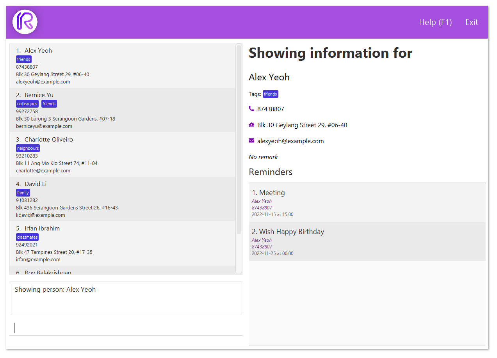
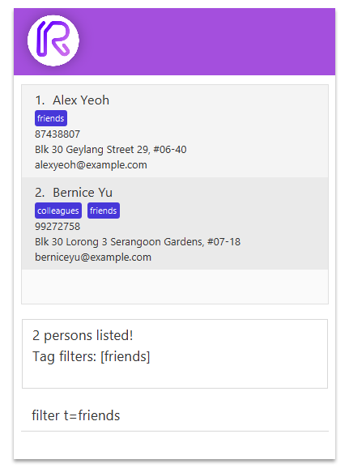
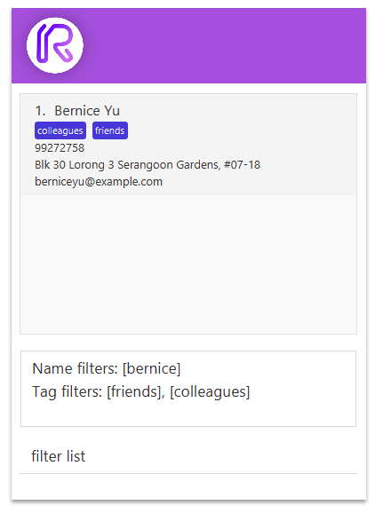
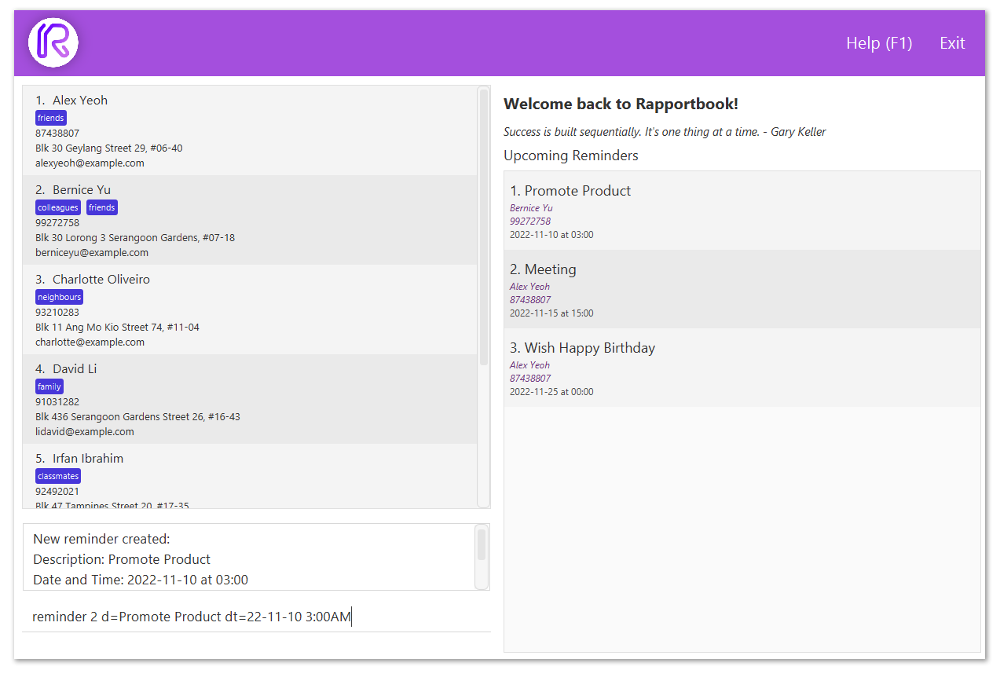
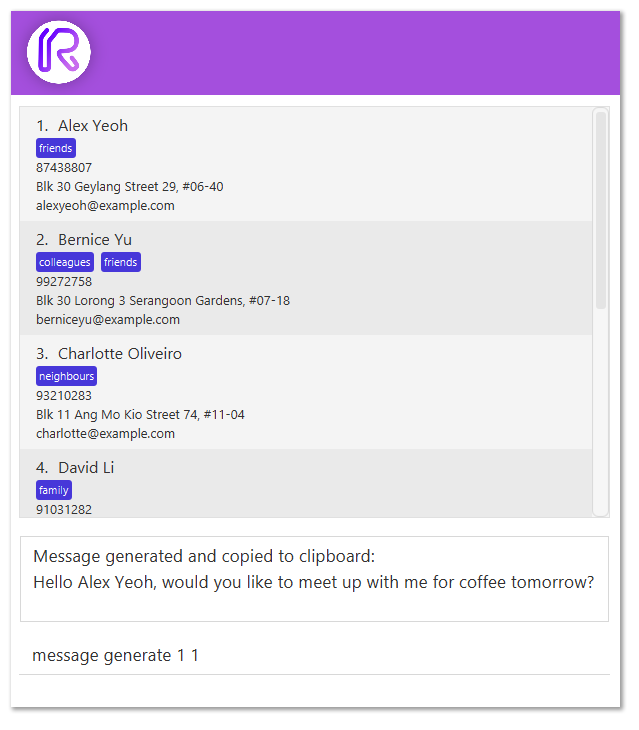

<h1>Rapportbook User Guide</h1>

Welcome to the Rapportbook user guide!

{:refdef: style="text-align: center;"}

{: refdef}

Rapportbook is a **desktop app for managing client information for your financial advising needs, optimized for use via a Command Line Interface** (CLI) while still having the benefits of a Graphical User Interface (GUI).

#### Using this guide
If this is the first time you are using this user guide, it is highly recommended for you to read the section on [Rapportbook 101](#rapportbook-101-everything-you-need-to-know). Otherwise,

* If you are just setting up, please take a look at our [quick start guide](#quick-start).
* If you are unsure of how to use Rapportbook, the [command summary](#command-summary) table is a good starting point, additionally, there is a [command aliases](#command-aliases) table for abbreviated commands.
* If you are a developer and want to help out, please take a look at the [developer guide](DeveloperGuide.html).

Table of Contents
  {:toc}

--------------------------------------------------------------------------------------------------------------------
## Rapportbook 101: Everything you need to know

Whether you’re new to Rapportbook, or just want to learn more about the details -- this section has you covered. This section will provide an overview of Rapporbook and explain key concepts in simple terms.

### What is Rapportbook?
Rapportbook is a free, and open-source application designed for financial advisors for client information management.

If you’re working with a lot of people, you’ll eventually have too much information to stay on top of. For example, what appointments do you have tomorrow? Which client should you prioritize? How should you approach this client? What are his contacts?

Rapportbook is designed specifically to improve your workflow, and helps you manage all this information and “understand” your clients better. It can be used to offload information, categorize them more meaningfully, and set reminders so you don’t ever miss an appointment.

### Glossary
In the user guide, you might come across some terms you might not understand. The following table hopes to provide clarification of the terms commonly used in Rapportbook.

| Term                 | Description                                                                                                                                                                                                                                                   |
|----------------------|---------------------------------------------------------------------------------------------------------------------------------------------------------------------------------------------------------------------------------------------------------------|
| **Client / contact** | A client or a contact is an information entry Rapportbook. You can add a client with the `add` command.                                                                                                                                                       |
| **Command**          | A command is a specific instruction you can give to Rapportbook to perform an action.                                                                                                                                                                         |
| **Command box**      | The command box is the text box on the bottom left of Rapportbook for you to enter your commands in.                                                                                                                                                          |
| **Panel**            | Rapportbook is split into a left and right panel. The left panel contains information about clients, and the right panel contains auxiliary information based on the command issued                                                                           |
| **Filter**           | A filter is a search condition you are looking for.                                                                                                                                                                                                           |
| **Tag**              | A tag is a label that can be assigned to clients.                                                                                                                                                                                                             |
| **Integer**          | An integer is a round, whole number. For example, `1` and `9` are integers but `1.5` and `hello` are not.                                                                                                                                                     |
| **Open-source**      | This means that the source code is made freely available online. If you are interested in contributing to Rapportbook, you can take a look at our [code repository](https://github.com/AY2223S1-CS2103T-T13-2/tp) and [developer guide](DeveloperGuide.html). |

## Quick start

1. Ensure you have Java `11` or above installed in your Computer.

   - If you are unable to launch the application because you do not have Java `11` or above installed, install it from [this page.](https://www.oracle.com/java/technologies/downloads/#java11)

2. Download the latest `rapportbook.jar` from [here](https://github.com/AY2223S1-CS2103T-T13-2/tp/releases).

3. Copy the file to the folder you want to use as the _home folder_ for your copy of Rapportbook.

4. Double-click the file to start the app. The GUI similar to the below should appear in a few seconds. Note how the app contains some sample data. 
   

5. Refer to the [Features](#features) below for details of each command.

--------------------------------------------------------------------------------------------------------------------

## Features

**:information_source: Notes about the command format:** 

* Words in `UPPER_CASE` are the parameters to be supplied by the user. 
  e.g. in `add n=NAME`, `NAME` is a parameter which can be used as `add n=Homer`.

* Items in square brackets are optional. 
  e.g `tag create TAG1 [TAG2]` can be used as `tag create potential` or as `tag create potential highPriority`.

* Parameters can be in any order. 
  e.g. if the command specifies `n=NAME p=PHONE_NUMBER`, `p=PHONE_NUMBER n=NAME` is also acceptable.

* If a parameter is expected only once in the command but you specified it multiple times, only the last occurrence of the parameter will be taken. 
  e.g. if you specify `p=12341234 p=56785678`, only `p=56785678` will be taken.

* Extraneous parameters for commands that do not take in parameters (such as `help`, `list`, `exit` and `clear`) will be ignored. 
  e.g. if the command specifies `help 123`, it will be interpreted as `help`.

### Viewing help : `help`

Shows a message explaning how to access the help page. Can also be acessed with the `F1` hotkey.

Format: `help`

You can then either click on the link to open it in your default browser, or click on the `Copy URL` button to copy the link to your clipboard.

### Adding a client : `add`

Adds the information of a client to Rapportbook.

Format: `add n=NAME p=PHONE_NUMBER e=EMAIL a=ADDRESS [r=REMARKS] [t=TAG]​`

:bulb: **Recap:**
Fields in square brackets `[]` (i.e. `[r=REMARKS]`) is an optional field.

Examples:

* `add n=Bob p=95788172 e=bob@gmail.com a=Jurong East Jejantas r=Janitor`
* `add n=Laufey p=98980184 e=laufey@u.nus.edu a=123,Clementi t=friend`
* `add n=Laufey p=98980184 e=laufey@u.nus.edu a=123,Clementi`

### Deleting of a client : `delete`

Deletes a client within Rapportbook.

* Deletes the client at the specified `INDEX`, the number shown in the displayed client list.

Format: `delete INDEX`

Examples:

* `delete 1`

### Viewing the information of a client : `show`

Displays information of a client at the specified `INDEX` in a separate panel. This feature allows faster modification to the client information as other commands such as [edit](#editing-of-client-information--edit), [tag](#tagging-clients--tag) and [reminder](#creating-reminders--reminders) do not have to specify an INDEX.

Format: `show INDEX​`

Examples:

* `show 1`

### Editing of client information : `edit`

Edits the information of a client within Rapportbook.

* Edits the client at the specified `INDEX`, the number shown in the displayed client list.
* The index can be left out if the client to edit is the target client from the [show](#viewing-the-information-of-a-client--show) command.

Format: `edit [INDEX] [n=NAME] [p=PHONE] [e=EMAIL] [a=ADDRESS] [r=REMARKS] [t=TAG]`

* Edits the person at the specified `INDEX`. The index refers to the index number shown in the displayed person list. The index **must be a positive integer** (i.e. 1, 2, 3, …​)
* At least one of the optional fields must be provided.
* Existing values will be updated to the input values.

:exclamation: **Caution:**
If you choose to edit the tag, note that all tags the client had previously will be replaced.

Examples:

* `edit 1 n=Laufey p=0162626003 r=Bluebirds in the spring` Edits the first client entry to have the name `Laufey`, have the phone number `0162626003` and have the remarks `Bluebirds in the spring`.
* `edit 2 n=Homer e=homer@simp.com a=742 Evergreen Terrace` Edits the second client entry to have the name `Homer`, have the email address `homer@simp.com` and sets the address to `742 Evergreen Terrace`.

### Creating a tag : `tag create`

Creates a tag to categorise client entries. Creation of a tag must happen first before the usage of tags.

Format: `tag create TAG [TAG2] [TAG3] … [TAGN]`

:bulb: **Tip:**
You can create multiple tags at once by just separating the different tag names with spaces.

Examples:

* `tag create potential` Creates a tag called `potential`
* `tag create potential highPriority lowPriority` Creates 3 tags called `potential`, `highPriority` and `lowPriority`.

### Tagging clients : `tag`

Tags a client entry for categorising purposes.

* Tags the client at the specified `INDEX`, the number shown in the displayed client list.
* The index can be left out if the client to tag is the target client from the [show](#viewing-the-information-of-a-client--show) command.
* The tag name must be specified.

Format: `tag [INDEX] TAG [TAG2] [TAG3] … [TAGN]`

:bulb: **Tip:**
You can assign multiple tags to a client at once by separating the different tag names with spaces after the client index.

Example:

* `tag 5 potential` Assigns the `potential` tag to the client entry at index 5.
* `tag 5 potential highPriority` Assigns the `potential` and `highPriority` tags to the client entry at index 5.

### Listing tags : `tag list`

View all available tags.

Format: `tag list`

### Removing tags from clients : `tag remove`

Removes a tag from a client entry if required.

Format: `tag remove [INDEX] TAG [TAG2] [TAG3] … [TAGN]`

:bulb: **Tip:**
Like assignment of tags, you can also remove multiple tags from a client at once by separating the different tag names with spaces after the client index.

Example:

* `tag remove 5 potential` Removes the `potential` tag from the client entry at index 5.
* `tag remove 5 potential highPriority` Removes the `potential` and `highPriority` tags from the client entry at index 5.

### Deleting a tag : `tag delete`

Deletes a tag from the address book.

Format: `tag delete TAG [TAG2] [TAG3] … [TAGN]`

:bulb: **Tip:** Again, you can delete multiple tags.

Example:

- `tag delete potential` Deletes the `potential` tag from the address book.
- `tag delete potential highPriority` Deletes the `potential` and `highPriority` tags from address book.

### Filtering client entries : `filter`

Filter clients by their name or the tags assigned to client entries.

Format: `filter [n=NAME] [t=TAG]`

* The name search is case-insensitive. (e.g `n=laufey` will match `Laufey`)
* Multiple names or tags can be searched by separating the different names/tags with commas (i.e. `n=homer,laufey` to search for both `homer` and `laufey`)
* Search results will fulfill **both** of the search parameters. (e.g. searching `n=homer,laufey t=potential,highPrirority` will bring up client entries with names `homer` or `laufey`, with tags `potential` or `highPrirority`)

Examples:

* `filter n=Laufey` Shows clients with `Laufey` as name.
* `filter n=Homer,Laufey` Shows all clients with `Homer` **or** `Laufey` as name.
* `filter t=highPriority` Shows clients with the `highPriority` tag.
* `filter t=highPriority,potential` Shows all clients with the `highPriority` tag **or** `potential` tag.
* `filter n=Homer t=potential` Shows all clients with the name `Homer` **and** the `potential` tag.
* `filter n=Homer,Laufey t=potential,highPotential` Shows all clients with names, `Homer` or `Laufey`, **and** with either the `potential` or `highPrirority` tags.

### Clearing filters : `filter clear`

Clear filters that are currently in effect.

Format: `filter clear [n=NAME] [t=TAG]`

Example:

* `filter clear` Clear ALL filters.
* `filter clear t=potential` Remove the `potential` tag filter.
* `filter clear n=homer,laufey t=potential,friend` Remove `homer` and `laufey` name filters and  the `potential` and `friend` tag filters.

### Lists the filter parameters : `filter list`

Shows the list of filters (name and tags) that are currently applied.

Format: `filter list`

### Creating reminders : `reminder`

Creates a reminder for a specific client. The description, date and time of the reminder must be specified. The index can be left out if the reminder is meant for the target client from the [show](#viewing-the-information-of-a-client--show) command.

Format: `reminder [INDEX] d=description dt=YY-M-D H:m`

Example:

* `reminder 5 d=Zoom meeting dt=22-11-20 11:00` Creates a reminder for the client entry at index 5, with a description of `Zoom meeting`, a date of `20 November 2022` and time of `11:00 AM`.

Possible date time formats:

* Date of `20 November 2022` and time of `3:00 PM`
  * `dt=2022-11-20 3:00PM`
  * `dt=22-11-20 15:00`
  * `dt=2022-Nov-20 3:00 PM`
* Date of `8 November 2022` and time of `12:00 AM`
  * `dt=22-11-8 0:00`
  * `dt=2022-11-8 12:00AM`
  * `dt=22-nov-08 00:00`

### Deleting reminders : `reminder delete`

Deletes a reminder from the displayed reminder list using the reminder index.

Format: `reminder delete INDEX`

Example:

* `reminder delete 3` deletes a reminder at index 3 of the reminder list on display.

:bulb: **Tip:**
Clear reminders only for a specific client by using `show INDEX` then `reminder clear`.

### Clearing reminders : `reminder clear`

Clears all reminders from the displayed reminder list.

Format: `reminder clear`

:exclamation:
Do take note that expired reminders will be marked as red and will not be automatically deleted
You will have to delete them manually.

### Creating a message template : `message create`

Creates a message template, which can then be used to generate personalized messages for clients.

Format: `message create MESSAGE`

:bulb: **Tip:**
All instances of `{name}` will be replaced with the client's name.

Examples:

- `message create Hello {name}, would you like to meet up with me for coffee tomorrow?`
- `message create Long time no see {name}! I have something exciting to share with you! `

### Listing message templates : `message list`

Lists your message templates.

Format: `message list`

### Generating messages : `message generate`

Generates a message using the message template and the person's name.

- All instances of `{name}` in the message template will be replaced with the person's name.
- The person and message indicated by `PERSON_INDEX` and `MESSAGE_INDEX` must exist.

Format: `message generate PERSON_INDEX MESSAGE_INDEX`

Example:

- `message generate 1 4` Generates a personalized message for the 1st client using the 4th message template

### Deleting message templates : `message delete`

Delete a message template

Format: `message delete INDEX`

Example:

- `message delete 1`

### Return home : `home`

Resets the view back to the homepage, where quote of the day and all reminders will be shown.

Format: `home`

### Exiting the program : `exit`

Exits the program.

Format: `exit`

### Saving the data

Rapportbook data is saved in the hard disk automatically after any command that changes the data. There is no need to save manually.

### Editing the data file

Rapportbook data is saved as a JSON file `[JAR file location]/data/rapportbook.json`. Advanced users are welcome to update data directly by editing that data file.

:exclamation: **Caution:**
If your changes to the data file makes its format invalid, Rapportbook will discard all data and start with an empty data file at the next run.

<!-- ### Archiving data files `[coming in v2.0]`

_Details coming soon ..._ -->

### Command aliases

Frequently used commands have aliases that are short so that you can perform actions quickly.

| Action                                                               | Command            | Alias |
|----------------------------------------------------------------------|--------------------|-------|
| **[Home](#return-home--home)**                                       | `home`             | h     |
| **[Show](#viewing-the-information-of-a-client--show)**               | `show`             | s     |
| **[Add](#adding-a-client--add)**                                     | `add`              | a     |
| **[Delete](#deleting-of-a-client--delete)**                          | `delete`           | d     |
| **[Edit](#editing-of-client-information--edit)**                     | `edit`             | e     |
| **[Tag](#tagging-clients--tag)**                                     | `tag`              | t     |
| **[Tag creation](#creating-a-tag--tag-create)**                      | `tag create`       | t c   |
| **[Tag list](#listing-tags--tag-list)**                              | `tag list`         | t l   |
| **[Untag](#removing-tags-from-clients--tag-remove)**                 | `tag remove`       | t r   |
| **[Tag deletion](#deleting-a-tag--tag-delete)**                      | `tag delete `      | t d   |
| **[Filter](#filtering-client-entries--filter)**                      | `filter`           | f     |
| **[Filter clear](#clearing-filters--filter-clear)**                  | `filter clear`     | f c   |
| **[Filter list](#lists-the-filter-parameters--filter-list)**         | `filter list`      | f l   |
| **[Reminder creation](#creating-reminders--reminder)**               | `reminder`         | r     |
| **[Reminder deletion](#deleting-reminders--reminder-delete)**        | `reminder delete`  | r d   |
| **[Reminder clear](#clearing-reminders--reminder-clear)**            | `reminder clear`   | r c   |
| **[Message creation](#creating-a-message-template--message-create)** | `message create`   | m c   |
| **[Message list](#listing-message-templates--message-list)**         | `message list`     | m l   |
| **[Message generation](#generating-messages--message-generate)**     | `message generate` | m g   |
| **[Message deletion](#deleting-message-templates--message-delete)**  | `message delete`   | m d   |

--------------------------------------------------------------------------------------------------------------------

## FAQ

**Q**: How do I transfer my data to another Computer? 
**A**: Install the app in the other computer and overwrite the empty data file it creates with the file that contains the data of your previous Rapportbook home folder.

--------------------------------------------------------------------------------------------------------------------

## Command summary

| Action                                                               | Format                                                                                                                      |
|----------------------------------------------------------------------|-----------------------------------------------------------------------------------------------------------------------------|
| **[Home](#return-home--home)**                                       | `home`                                                                                                                      |
| **[Show](#viewing-the-information-of-a-client--show)**               | `show INDEX`                                                                                                                |
| **[Add](#adding-a-client--add)**                                     | `add n=NAME p=PHONE e=EMAIL a=ADDRESS [r=REMARKS] [t=TAGS]`                                                                 |
| **[Delete](#deleting-of-a-client--delete)**                          | `delete INDEX`                                                                                                              |
| **[Edit](#editing-of-client-information--edit)**                     | `edit [INDEX] [n=NAME] [p=PHONE] [e=EMAIL] [a=ADDRESS] [r=REMARKS]`                                                         |
| **[Tag](#tagging-clients--tag)**                                     | `tag [INDEX] TAG`                                                                                                           |
| **[Tag creation](#creating-a-tag--tag-create)**                      | `tag create TAG1 [TAG2] … [TAGN]`                                                                                           |
| **[Tag list](#listing-tags--tag-list)**                              | `tag list`                                                                                                                  |
| **[Untag](#removing-tags-from-clients--tag-remove)**                 | `tag remove [INDEX] TAG1 [TAG2] … [TAGN]`                                                                                   |
| **[Tag deletion](#deleting-a-tag--tag-delete)**                      | `tag delete TAG1 [TAG2] … [TAGN]`                                                                                           |
| **[Filter](#filtering-client-entries--filter)**                      | `filter n=NAME1,[NAME2],…,[NAMEN] [t=TAG1,[TAG2],…,[TAGN]]`  `filter [n=NAME1,[NAME2],…,[NAMEN]] t=TAG1,[TAG2],…,[TAGN]` |
| **[Filter clear](#clearing-filters--filter-clear)**                  | `filter clear [n=NAME1,[NAME2],…,[NAMEN]] [t=TAG1,[TAG2],…,[TAGN]]`                                                         |
| **[Filter list](#lists-the-filter-parameters--filter-list)**         | `filter list`                                                                                                               |
| **[Reminder creation](#creating-reminders--reminder)**               | `reminder [INDEX] d=DESCRIPTION dt=YY-M-D H:m`                                                                              |
| **[Reminder deletion](#deleting-reminders--reminder-delete)**        | `reminder delete INDEX`                                                                                                 |
| **[Reminder clear](#clearing-reminders--reminder-clear)**            | `reminder clear`                                                                                                            |
| **[Message creation](#creating-a-message-template--message-create)** | `message create MESSAGE`                                                                                                    |
| **[Message list](#listing-message-templates--message-list)**         | `message list`                                                                                                              |
| **[Message generation](#generating-messages--message-generate)**     | `message generate PERSON_INDEX MESSAGE_INDEX`                                                                               |
| **[Message deletion](#deleting-message-templates--message-delete)**  | `message delete INDEX`                                                                                                      |
| **[Help](#viewing-help--help)**                                      | `help`                                                                                                                      |
| **[Exit](#exiting-the-program--exit)**                               | `exit`                                                                                                                      |
