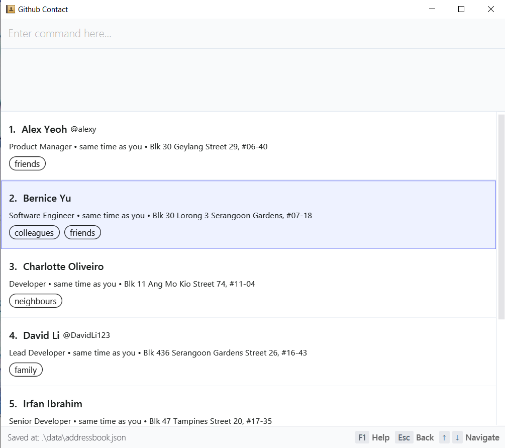

GithubContact is an address book **integrated with Github's Public API**, targeted at software engineering project
managers to help them communicate and collaborate with their teams smoothly.

This guide contains all you need to get started on working with GithubContact.

--------------------------------------------------------------------------------------------------------------------

## Table of Contents
1. [Getting Started](#getting-started)
2. [Command Summary](#command-summary)
3. [Features](#features)
   1. [Add a person](#add-a-person--add)
   2. [Remove a person](#delete-a-person--delete)
   3. [Find a person](#find-a-person--find)
   4. [Sort people](#sort-the-list-of-persons--sort)
   5. [Reset the persons list](#reset-the-list-of-persons-reset)
   6. [Show a person's details](#show-a-persons-details--enter-or-double-click)
   7. [Set a person's details](#set-a-persons-details--set)
   8. [Delete a person's details](#delete-a-persons-details-delete)
   9. [Return to previous page](#return-to-previous-page--back-or-esc)
   10. [Show help page](#show-help-page--help-or-f1)
4. [FAQ](#faq)
5. [Prefix Aliases](#prefix-aliases)
6. [Parameter Input Formats](#parameter-input-formats)

--------------------------------------------------------------------------------------------------------------------

## Getting Started

1. Ensure you have Java `11` or above installed in your Computer.

2. Download the latest GithubContact.jar from [here](https://github.com/AY2223S1-CS2103T-W08-2/tp/releases).

3. Copy the file to the folder you want to use as the home folder for your GithubContact.

4. Double-click the file to start the app. The Graphical User Interface (GUI) similar to the above should appear in a few seconds. Note how the app contains some sample data.

5. Type the command in the command box and press Enter to execute it. e.g. typing **`help`** and pressing Enter will open the help window. 
   Some example commands you can try:

   * **`help`** : Displays the help page.

   * **`add`**`name/John Doe phone/98765432 email/johnd@example.com address/John street, block 123, #01-01` : Adds a contact named `John Doe` to the Address Book.

   * **`clear`** : Deletes all contacts.

   * **`exit`** : Exits the app.

6. Refer to the [Features](#features) below for details of each command.

--------------------------------------------------------------------------------------------------------------------

## Command summary

**:information_source: Notes about the command format:** 

* Words in `UPPER_CASE` are the parameters to be supplied by the user. The input formats for each attribute can be found [here](#parameter-input-formats)  
  e.g. in `add name/NAME`, `NAME` is a parameter which can be used as `add name/John Doe`.

* Items in square brackets are optional. 
  e.g `name/NAME [tag/TAG]` can be used as `name/John Doe tag/friend` or as `name/John Doe`.

* Items with `…`​ after them can be used multiple times including zero times. 
  e.g. `[tag/TAG]…​` can be used as ` ` (i.e. 0 times), `tag/friend`, `tag/friend tag/family` etc.

* Parameters can be in any order. 
  e.g. if the command specifies `name/NAME phone/PHONE_NUMBER`, `phone/PHONE_NUMBER name/NAME` is also acceptable.

* If a parameter is expected only once in the command but you specified it multiple times, only the last occurrence of the parameter will be taken. 
  e.g. if you specify `phone/12341234 phone/56785678`, only `phone/56785678` will be taken.

* Extraneous parameters for commands that do not take in parameters (such as `help`, `list`, `exit` and `clear`) will be ignored. 
  e.g. if the command specifies `help 123`, it will be interpreted as `help`.

* Each attribute prefix can be replaced with its **alias**.
  e.g. instead of using `add name/John Doe address/Clementi`, `add n/John Doe a/Clementi` will fulfill the same function.
  The full list of prefix aliases can be found [here](#prefix-aliases).

| Action               | Format, Examples                                                                                                                                                                                         |
|----------------------|----------------------------------------------------------------------------------------------------------------------------------------------------------------------------------------------------------|
| **add**              | `add [name/NAME] [github/GITHUB] [address/ADDRESS] [role/ROLE] [timezone/TIMEZONE] [phone/PHONE] [email/EMAIL] [slack/SLACK] [telegram/TELEGRAM] [tag/TAG] `  `add name/John Doe address/27 Clementi` |
| **delete person**    | `delete INDEX`   `delete 1`, `delete 2`                                                                                                                                                               |
| **delete attribute** | `delete ATTRIBUTE`   `delete name`, `delete slack`, `delete twitter`                                                                                                                                  |
| **set**              | `set [name/NAME] [address/ADDRESS] [role/ROLE] [timezone/TIMEZONE] [phone/PHONE] [email/EMAIL] [slack/SLACK] [telegram/TELEGRAM] [tag/TAG]`  `set name/Tex address/Clementi`                          |
| **sort**             | `sort`   `sort name`, `sort name/desc`                                                                                                                                                                |
| **find**             | `find KEYWORD`   `find Tex`, `find Engineer`                                                                                                                                                          |
| **reset**            | `reset`                                                                                                                                                                                                  |
| **back**             | `back` or `<ESC>` key                                                                                                                                                                                    |
| **help**             | `help` or `<F1>` key   `help`, `help add`                                                                                                                                                             |

--------------------------------------------------------------------------------------------------------------------

## Features

#### Add a person : `add`

Adds a person to the list.

Format: `add [name/NAME] [github/GITHUB] [address/ADDRESS] [role/ROLE] [timezone/TIMEZONE] [phone/PHONE] [email/EMAIL] [slack/SLACK] [telegram/TELEGRAM] [tag/TAG] `

- At least one of `NAME` or `GITHUB` must be provided.
- The input formats for each attribute can be found [here](#parameter-input-formats)

Example:
- `add github/johndoe`
- `add github/johndoe name/John Doe`
- `add name/John Doe address/27 Clementi`
- `add name/Alex address/22 Clementi phone/86609830 email/alex@gmail.com`
- `add name/Mike github/mikelim address/21 Clementi phone/86609831 email/mike@gmail.com slack/mike123 telegram/@mike123 tag/friend timezone/+8 role/Frontend`

Before the command is executed:

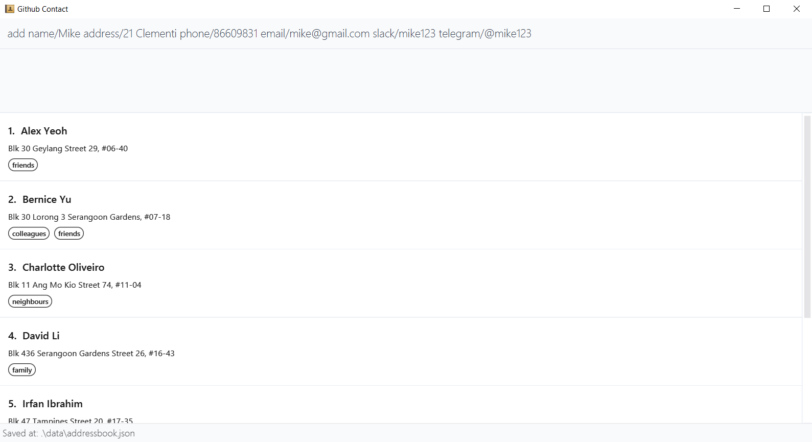

After the command is executed:

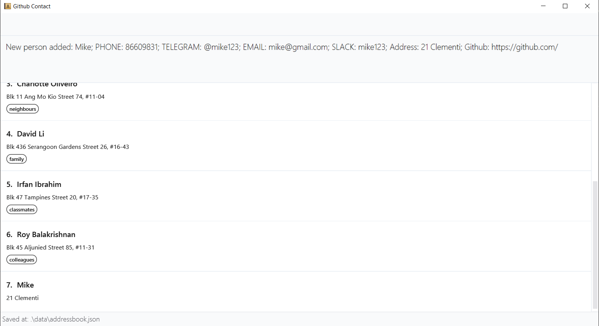

#### Delete a Person : `delete`

Delete the specified person from the address book.

Format: `delete INDEX`

- This command can only be run in the main page.
- The index refers to the index number shown in the person list.
- The index must be a **positive integer** (e.g. 1, 2, 3...)

Example:
- Delete the person at index 1: `delete 1`
- Delete the person at index 7: `delete 7`

Before the command is executed:

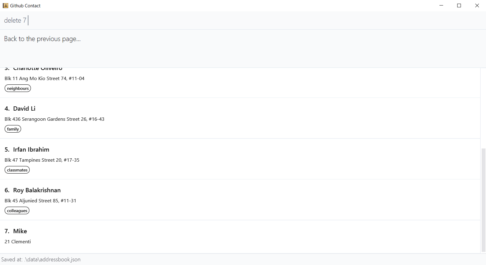

After the command is executed:

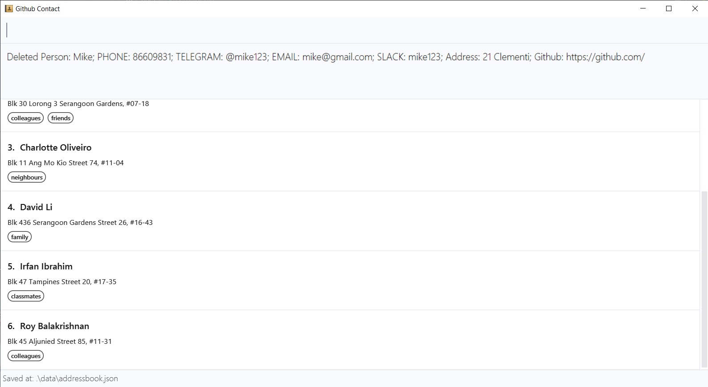

#### Find a Person : `find`

Displays the persons that match a given keyword. Keyword could be any of the following
attributes of the person :
- `name`
- `address`
- `role`
- `github user`
- `tags`

A fuzzy search is done to display the results. The keyword can have minor spelling errors
, and still return correct results. It is also case-insensitive.

Format: `find KEYWORD`

Example:
- Find all the people with role SWE: `find SWE`
- Find all the people with tag friends: `find friends`
- Find all the people named David: `find david`

Before the command is executed:

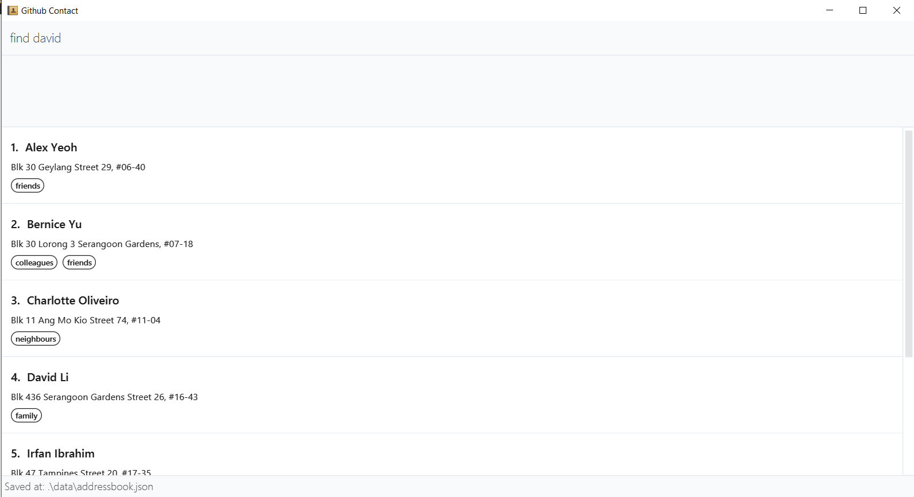

After the command is executed:

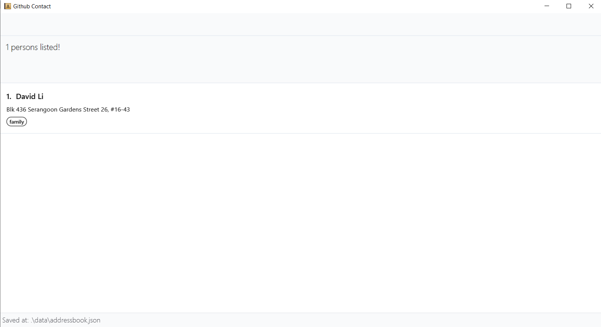

#### Sort the list of Persons : `sort`

Sort persons in the list.

Format: `sort [name|address|role][/desc]`

Example:

- Sort by role in ascending order: `sort role`
- Sort by name in descending order: `sort name/desc`

Before the command is executed:

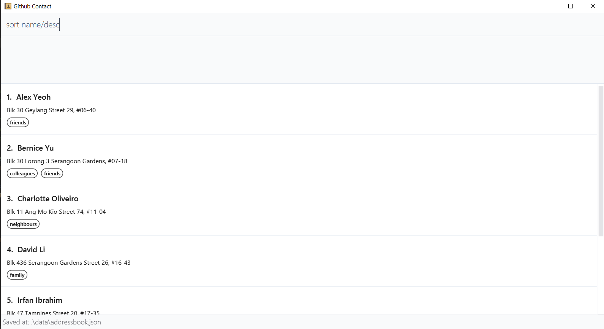

After the command is executed:

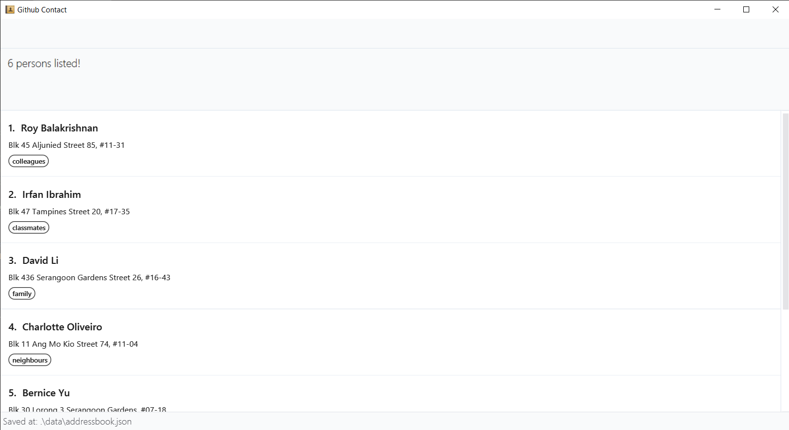

#### Reset the list of persons: `reset`

Resets the persons list.

Performs the following two functions:
- Resets the search condition, causing the original list of persons to be displayed.
- Resets the sorting condition, causing the list of persons to return to its default ordering (by name in ascending order.)

Format: `reset`

Example:

After executing a [`find`](#find-a-person--find) command:

After `reset` is executed:

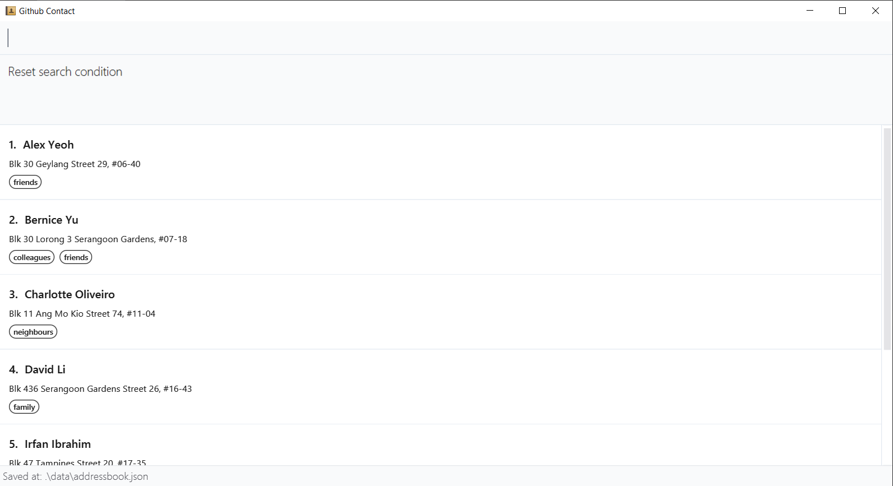

#### Show a Person's Details : `<ENTER>` or double click

Shows person details in another page.

There are two ways to show person details

1. Keyboard-friendly way

   1. Use the arrow keys to navigate to the desired person.

   2. Press `<ENTER>` to show the person's details.

2. General usage

   1. Double-click on the person card in the list of persons.

Keyboard usage example:

Step 1: Navigate to the desired person using the arrow keys.

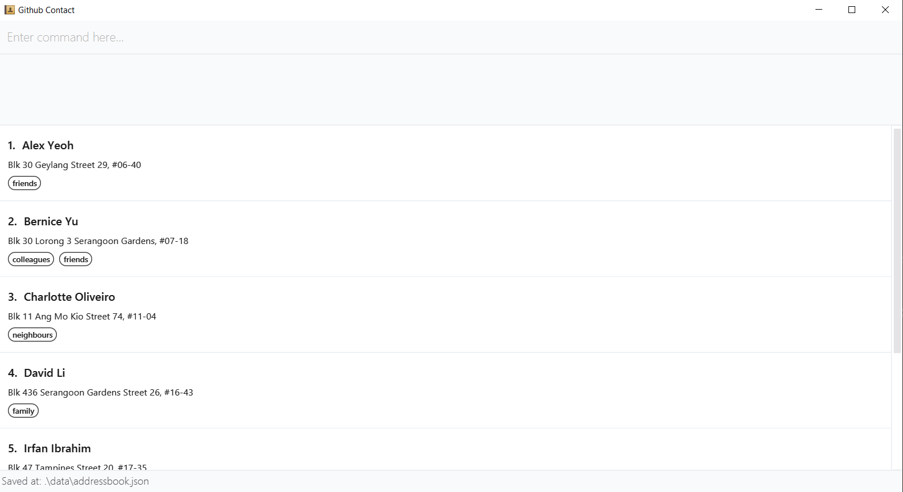

Step 2: Press `<ENTER>` to enter the detail page.

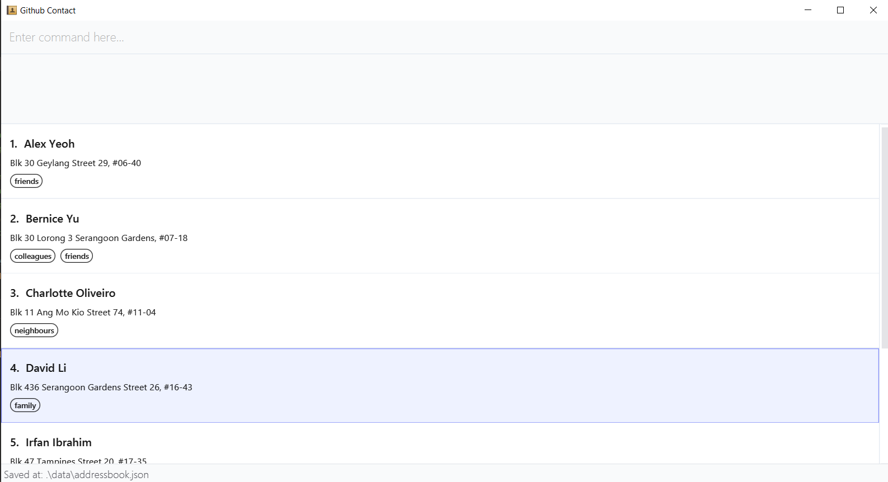

#### Set a Person's Details : `set`

Sets the attributes of a person.

Format `set [name/NAME] [github/GITHUB] [address/ADDRESS] [role/ROLE] [timezone/TIMEZONE] [phone/PHONE] [email/EMAIL] [slack/SLACK] [telegram/TELEGRAM] [tag/TAG] `

- You can only run this command in a person's detail page. Please refer to [Show Person Details](#show-a-persons-details--enter-or-double-click) to enter person details page.
- At least one optional attribute must be provided.
- If an inputted attribute does not exist yet, it will be added.
- If an inputted attribute already exists, its value will be updated to the given value.
- The input formats for each attribute can be found [here](#parameter-input-formats)

Example:
- `set name/Mike github/mikelim address/21 Clementi phone/86609831 email/mike@gmail.com slack/mike123 telegram/@mike123 tag/friend timezone/+8 role/Frontend`
- `set name/David Lee telegram/@davidlee123 slack/davidlee123`

Before the command is executed:

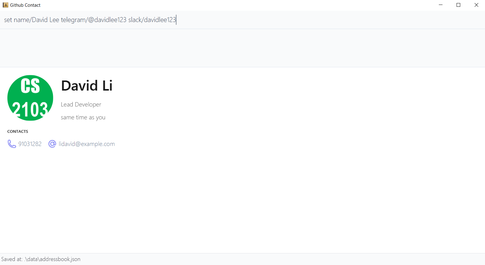

After the command is executed:

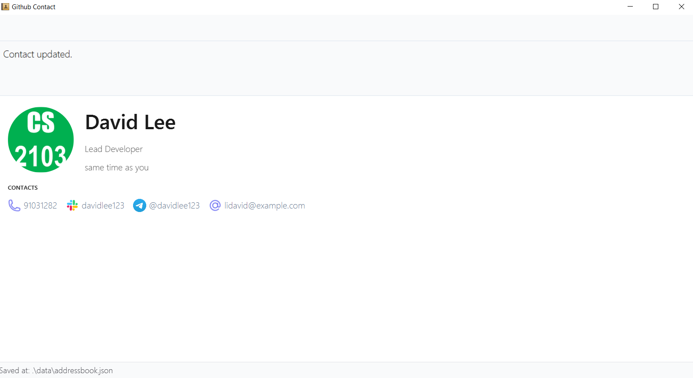

#### Delete a Person's Details: `delete`

Delete attribute of a person.

Format: `delete ATTRIBUTE_NAME`

- You can only run this command in a person's detail page. Please refer to [Show Person Details](#show-a-persons-details--enter-or-double-click) to enter person details page.
- `name` cannot be deleted as it is a required attribute.
- You only can delete one attribute at one time.

Attributes (`ATTRIBUTE_NAME`) that can be deleted:
- `role`
- `timezone`
- `email`
- `phone`
- `slack`
- `telegram`

Example:
- `delete telegram`
- `delete email`

Before the command is executed, inside a person's contact detail page:

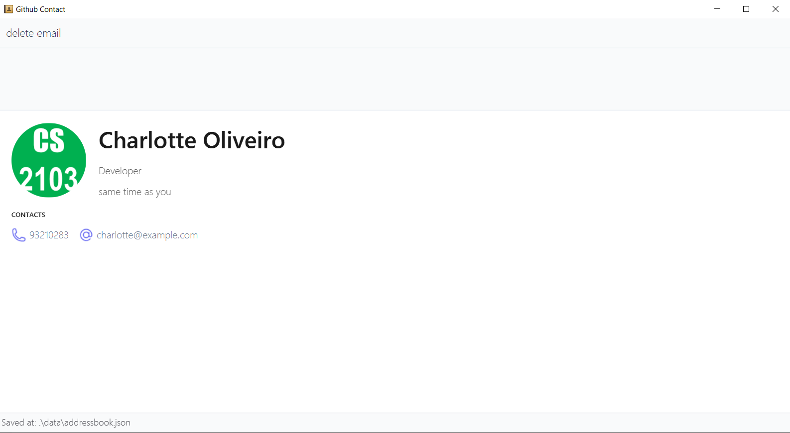

After the command is executed:

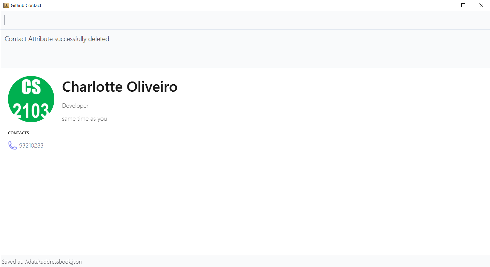

#### Return to previous page : `back` or `<ESC>`

Returns to the previously selected page.

Format: `back` or `<ESC>`

Example uses:
- Returning to the main page from the help page.
- Returning to the main page from the contact detail page.
- Returning to the contact detail page from the detail help page.

Before the command is executed, in the detail help page:

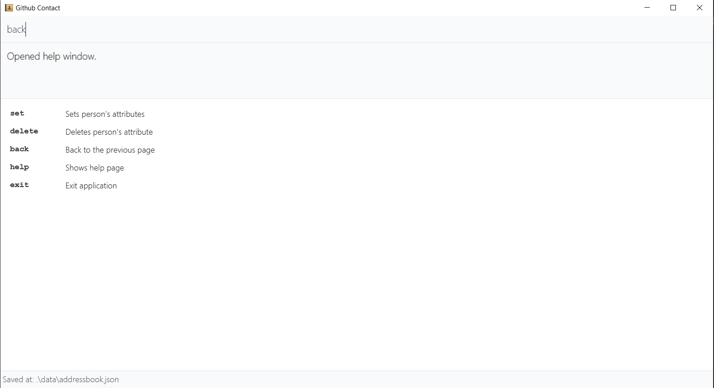

After the command is executed:

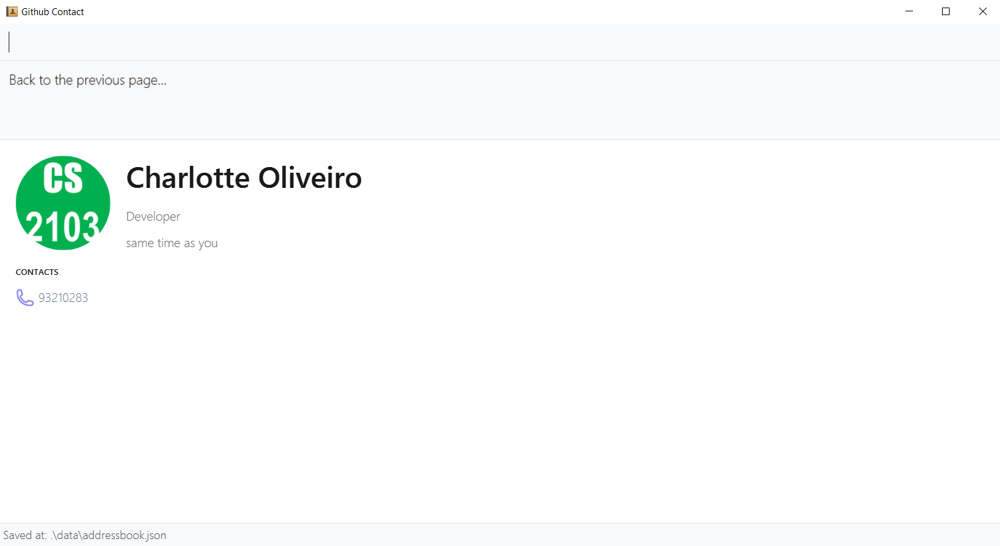

#### Show help page : `help` or `<F1>`

Shows the help page or usage instruction of specified command.

If executed without arguments, for the given page, show:
- The commands that can be executed at that page
- The descriptions of each command

If executed with a given command, e.g. `help delete`, show:
- The description of the command
- Its parameters
- An example usage

Format: `help [add|back|clear|delete|exit|find|help|reset|set|sort]`

Main page help:

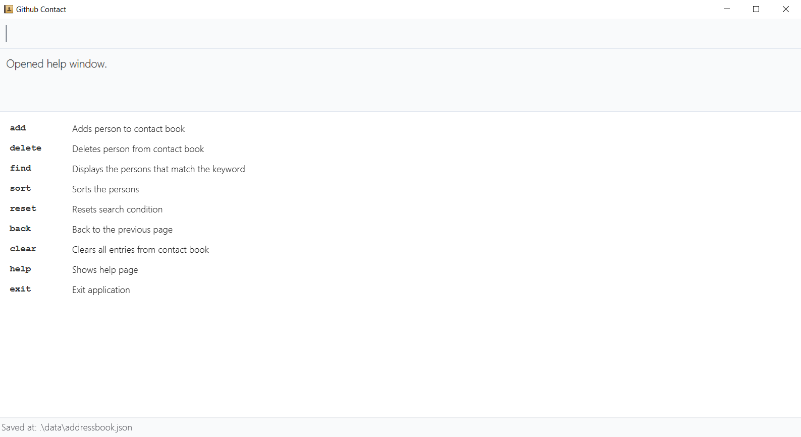

Detail page help:

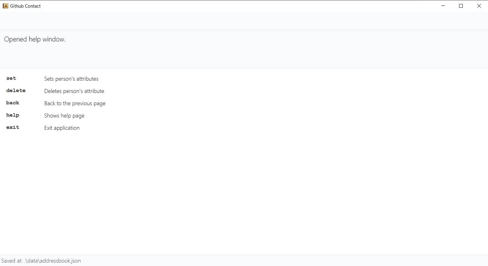

After executing `help delete`:

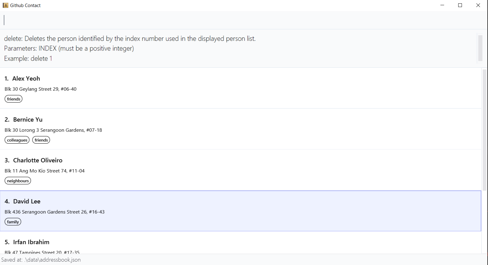

--------------------------------------------------------------------------------------------------------------------

## FAQ

**Q**: How do I transfer my data to another Computer? 
**A**: Install the app in the other computer and overwrite the empty data file it creates with the file that contains the data of your previous GithubContact home folder.

--------------------------------------------------------------------------------------------------------------------

## Prefix Aliases

| Prefix   | Aliases              |
|----------|----------------------|
| Name     | `name/`, `n/`        |
| Address  | `address/`, `a/`     |
| Tag      | `tag/`, `t/`         |
| Email    | `email/`, `@/`       |
| Phone    | `phone/`, `+/`       |
| Slack    | `slack/`, `sk/`      |
| Telegram | `telegram/`, `tele/` |
| Role     | `role/`, `r/`        |
| Timezone | `timezone/`, `tz/`   |

## Parameter Input Formats
| Attribute | Input Format                                                                                                                                                                                                                                                                                                                 |
|-----------|------------------------------------------------------------------------------------------------------------------------------------------------------------------------------------------------------------------------------------------------------------------------------------------------------------------------------|
| Name      | Should only contain alphanumeric characters, spaces or dashes, and it should not be blank.                                                                                                                                                                                                                                   |
| Address   | Can contain any character but should not be blank.                                                                                                                                                                                                                                                                           |
| Role      | Starts with a letter, and contains only alphanumeric characters and space.                                                                                                                                                                                                                                                   |
| Timezone  | Should be a number with a sign(+18 to -18) and should not be blank                                                                                                                                                                                                                                                           |
| Phone     | Should only contain numbers and should be 3 digits long                                                                                                                                                                                                                                                                      |
| Email     | Should be of the format <LOCALPART>@<DOMAIN>. The LOCALPART should have only alphanumeric characters, "+", "_", ".", and "-". The DOMAIN is made up of domain labels separated by periods(.), each one starting and ending with alphanumeric characters. The DOMAIN must end with a domain label at least 2 characters long. |
| Slack     | Should contain only numbers, underscores(_), and lowercase letters. Must be between 1 and 20 characters in length                                                                                                                                                                                                            |
| Telegram  | Should be of the format @<USERNAME>. USERNAME should be between 5 and 32 characters long, with only alphanumeric characters and underscores. It cannot start or end with an underscore nor have consecutive underscores.                                                                                                     |
| Tag       | Should be alphanumeric                                                                                                                                                                                                                                                                                                       |
| Github    | Should contain only alphanumeric characters or dashes. It cannot start or end with a hyphen nor have consecutive hyphens. Its maximum length is 39 characters.                                                                                                                                                               | 
