**Teacher’s Pet** is an all-in-one desktop application for private 1-to-1 tutors to manage the details of students,
payment and scheduling of classes. **Teacher's Pet** combines the tasks you would typically need to do when you use 
Microsoft Excel, calendar, your phone contacts and your notes application into one application, reducing the need for
context switching. With short commands and an intuitive design, **Teacher's Pet** reduces time needed 
for tedious administrative work, allowing you to focus on your students.

In order to help speed up your workflow, we have created commands for tasks you would usually need to do as a tutor.

| Task                                                                                 | Command                                                                                         |
|--------------------------------------------------------------------------------------|-------------------------------------------------------------------------------------------------|
| Add a new student                                                                    | [`add` command](#adding-a-student-add)                                                          |
| Edit a student's details (phone number, address for example)                         | [`edit` command](#editing-student-details-edit)                                                 |
| Mark a student's attendance and remind yourself to collect payment from the student. | [`mark` command](#marking-a-student-mark)                                                       |
| Receive money from a student                                                          | [`pay` command](#receiving-money-from-a-student-pay)                                            |
| Know the students you have                                                           | [`list` command](#viewing-all-students-list)                                                    |
| Search for student's information                                                     | [`find` command](#finding-a-student-find) / [`sort` command](#sort-the-displayed-students-sort) |
| Find next available class for student                                                | [`avail` command](#next-available-class-avail)                                                  |
| Set a student's next class                                                           | [`edit` command](#editing-student-details-edit)                                                 |
| Taking notes                                                                         | [`edit` command](#editing-student-details-edit)                                                 | 
| Remove a student as he is no longer a student                                        | [`delete` command](#deleting-students-delete)                                                                              |

Before you get started, you may want to know [how to navigate this User Guide](#reading-the-user-guide).

To get started with using the application, jump straight to the [Quick Start](#quick-start) section.

For a full list of commands and detailed instructions, head to the [Features](#features) section.

💡 **Tip:** If you ever need clarification on certain terms, you 
can simplify head down to the bottom of the screen and refer to the  
<a href="#glossary">glossary</a> section, <a href="#command-summary">command summary</a> for the summary of the 
commands and <a href="#prefix-summary">prefix summary</a> for summary of prefixes!

## Table of contents
* [Quick Start](#quick-start)
* [Overview of User Interface](#ui-overview)
* [Reading the User Guide](#reading-the-user-guide)
    * [Command format](#notes-about-the-command-format)
    * [Callouts](#callouts)
* [Features](#features)
    * [Viewing help: `help`](#viewing-help-help)
    * [Adding a student: `add`](#adding-a-student-add)
    * [Editing student details: `edit`](#editing-student-details-edit)
    * [Marking a student: `mark`](#marking-a-student-mark)
    * [Receiving money from a student: `pay`](#receiving-money-from-a-student-pay)
    * [Viewing all students: `list`](#viewing-all-students-list)
    * [Finding a student: `find`](#finding-a-student-find)
      * [Find by Name](#find-by-name)
      * [Find by Email](#find-by-email)
      * [Find by Address](#find-by-address)
      * [Find by Student's Contact Number](#find-by-students-contact-number)
      * [Find by Next of Kin's Contact Number](#find-by-next-of-kins-contact-number)
      * [Find by Class Date](#find-by-class-date)
      * [Find by Tag](#find-by-tag)
    * [Next available class:](#next-available-class-avail)
    * [Sort displayed students: `sort`](#sort-the-displayed-students-sort)
      * [Sort by Name](#sort-by-name)
      * [Sort by Class](#sort-by-class-date)
      * [Sort by Money Owed](#sort-by-money-owed)
    * [Deleting a student: `delete`](#deleting-students-delete)
    * [Clearing all student: `clear`](#clearing-all-student-clear)
    * [Undo a command: `undo`](#undo-the-last-command-undo)
    * [Exiting the program : `exit`](#exiting-the-program-exit)
    * [Saving the data](#saving-the-data)
    * [Editing the data file](#editing-the-data-file)
* [FAQ](#faq)
* [Glossary](#glossary)
* [Command Summary](#command-summary)
* [Prefix Summary](#prefix-summary)

--------------------------------------------------------------------------------------------------------------------

## Quick start

There are a couple of things that need to be set up first before you start using **Teacher's Pet** for the first time. This will
ensure that the application works as expected and runs smoothly on your computer.

### Step 1: Ensure you have Java `11` or above installed in your Computer
To check if you have Java `11` or above installed, follow the steps for your operating system
##### If you are using Windows:
1. Press the Start button, type *cmd* and press Enter on your keyboard.
2. Once you have Command Prompt running, type `java --version` and if you have Java installed properly, you should
  see an output like the following.
  
##### If you are using Mac:
1. Open up terminal by hitting Command + Space bar on your keyboard and typing *terminal* then press the return 
  button on your keyboard. 
2. Once you have terminal running, type `java --version` and if you have Java installed properly, you should see
  an output like the following.
  
#### If you do not see an output like the one above, it means that you do not have Java `11` installed 
  Follow the instructions in the video link below for your operating system for the installation of Java `11`
  - [Windows Link](https://www.youtube.com/watch?v=1ZbHHLobt8A)
  - [Mac Link](https://www.youtube.com/watch?v=pxi3iIy4F5A)

### Step 2: Install `teacherspet.jar`
- Once you have completed step 1, download the latest `teacherspet.jar` from [here](https://github.com/AY2223S1-CS2103T-T09-4/tp/releases).
- Copy the file to the folder you want to use which will become the *home folder* for your application.
- Double-click the file to start the app. The GUI as seen below should appear in a few seconds.
   In this case, **Teacher's Pet** contains some sample data.

---

## UI Overview

**Teacher's Pet** is divided into 5 areas to maximise productivity:

1. Command Input - The dialog box where you will input your desired commands.
2. Command Result - A short answer whether **Teacher's Pet** has executed the command, or an error message if the
  **Teacher's Pet** did not understand the command.
3. Student List - A window that will display the details of the student(s).
4. Statistics Window - A window that shows all the statistics of the tutor, such as the number of students and
the money collected/owed.
5. Schedule List - A scroll window which shows the schedule for the day, sorted by time.

Basic Instructions:
1. Type the following command in the [Command Input](#ui-overview) section, and press Enter on your keyboard to execute it. For 
   example, typing `help` and pressing Enter will open the help window. Below are some example commands you can start with:
    - `list`: Lists all students.
    - `add n/John Doe p/98765432 np/81239090 e/johnd@example.com a/John street, block 123, #01-01`: Adds a student named
      `John Doe` to the student list.
    - `edit 1 dt/2022-11-30 0800-0900`: Edit John to have a class on 2022-11-30 0800-0900
    - `mark 1`: Mark John's attendance
    - `avail 0800-1500 60`: Finds the first available slot in the range of 0800-1500 which has a duration of 60 minutes. 
    - `delete 3`: Deletes the 3rd student shown in the current list.
    - `exit`: Exits the app.
2. Refer to the [Features](#features) section below for details of each command.

[↑ Back to top](#table-of-contents)

---

## Reading the User Guide

💡 **Tip:** We recommend reading the features section of our 
application from top to bottom as the illustrations added follow a sequential order.  

### Notes about the command format:

| Format                                                                                                                                                                                              | Example                                                                                                                                                                                                                                               |
|-----------------------------------------------------------------------------------------------------------------------------------------------------------------------------------------------------|-------------------------------------------------------------------------------------------------------------------------------------------------------------------------------------------------------------------------------------------------------|
| Words in `UPPER_CASE` are parameters supplied by you                                                                                                                                                | Given the following format, `add n/NAME`. In this case, `NAME` is a parameter which can be replaced by `John Doe` as `add n/John Doe`                                                                                                                 |
| Items in square brackets are optional                                                                                                                                                               | Given `n/NAME [t/TAG]`, since `t/TAG` is in square brackets, you can type either `n/John Doe t/python` or `n/John Doe` if no tag is required                                                                                                          |
| Items with `…` after them can be used 0 or more times                                                                                                                                               | Given `[t/TAG]…`, you can choose to not type anything, `t/python` for one tag, `t/javascript t/react` for two tags and etc.                                                                                                                           |
| Parameters with a [prefix](#prefix-summary) can be in any order                                                                                                                                     | `n/NAME p/CONTACT_NUMBER` or `p/CONTACT_NUMBER n/NAME` are acceptable                                                                                                                                                                                 |
| A parameter expected once will have only it's last occurrence taken despite being specified multiple times                                                                                          | If you specify `p/12341234 p/56785678`, only `p/56785678` will be accepted by **Teacher's Pet**.                                                                                                                                                      |
| Extraneous parameters for commands that do not take in parameters (such as `help`, `list`, `exit` and `clear`) will be ignored                                                                      | If the you type `help 123`, the command will be interpreted as `help`.                                                                                                                                                                                |
| An index will be [`INDEX-S`](#glossary) if the command requries information from the [Schedule List](#ui-overview) and will be `INDEX` if it requires information from [Student List](#ui-overview) | Under [mark command](#marking-a-student-mark), `mark 1` will mark the 1st student in the [Schedule List](#ui-overview). Under [delete command](#deleting-students-delete), `delete 1` will remove the first student from [Student List](#ui-overview) |

### Callouts:

The callouts icons below will be useful when you are reading this user guide.

| Icon | Definition                                                                                                                |
|------|---------------------------------------------------------------------------------------------------------------------------|
| ℹ️   | Indicates additional information that can help you to gain a better understanding. They are good to know but not crucial. |
| 💡   | Indicates tips and solutions for potential problems you may encounter.                                                    |
| ❗    | Indicates information that are important to know so as to minimise confusion.                                             |
| ⚠️   | Indicates a warning to ensure you will proceed with care.                                                                 |

[↑ Back to top](#table-of-contents)

---

## Features
These are the main features of **Teacher's Pet**:

| Task                                                                                 | Command                                                                                         |
|--------------------------------------------------------------------------------------|-------------------------------------------------------------------------------------------------|
| Add a new student                                                                    | [`add` command](#adding-a-student-add)                                                          |
| Edit a student's details (phone number, address for example)                         | [`edit` command](#editing-student-details-edit)                                                 |
| Mark a student's attendance and remind yourself to collect payment from the student. | [`mark` command](#marking-a-student-mark)                                                       |
| Receive money from a student                                                          | [`pay` command](#receiving-money-from-a-student-pay)                                            |
| Know the students you have                                                           | [`list` command](#viewing-all-students-list)                                                    |
| Search for student's information                                                     | [`find` command](#finding-a-student-find) / [`sort` command](#sort-the-displayed-students-sort) |
| Find next available class for student                                                | [`avail` command](#next-available-class-avail)                                                  |
| Set a student's next class                                                           | [`edit` command](#editing-student-details-edit)                                                 |
| Taking notes                                                                         | [`edit` command](#editing-student-details-edit)                                                 | 
| Remove a student as he is no longer a student                                        | [`delete` command](#deleting-students-delete)                                                                              |

### Viewing help: `help`

If you need to gain access to this user guide, you can use this command which will provide a link to the website 
containing this user guide.

Format: `help`

[↑ Back to top](#table-of-contents)

---

### Adding a student: `add`

The `add` command adds a student to **Teacher’s Pet**.

The following are the fields accepted by the `add` command and their relevant conditions which need to be met for the
command to work as expected.

##### Student’s Name:
    - Student’s Name must not be empty.
    - Student’s Name must only contain alphanumeric characters.
    

ℹ **Note:** Multiple students may share the same name.

##### Student’s Contact Number:
- Student’s contact number must not be empty. 
- Student’s contact number must only contain numerical digits between `0` and `9`.
- Student's contact number must begin with `6`, `8` or `9`.

ℹ **Note:** Contact number must contain exactly 8 digits. Contact number must be unique.

##### Next of Kin’s Contact Number:
- Next of Kin’s contact number must not be empty.
- Next of Kin’s contact number must only contain numerical digits 
  between `0` and `9`.
- Next of Kin’s contact number must begin with `6`, `8` or `9`.

ℹ **Note:** Next of Kin’s contact number must contain exactly 8 digits.

##### Address:
- Address must not be empty.
- Address may contain any kinds of character.

ℹ **Note:** Address cannot be empty. It must contain at least 1 character.

##### Email:

- Email must not be empty. 
- Email should be in the format of `local@domain`, where:
  - Local address should only contain alphanumeric characters and these special 
    characters `+_.-`.
  - Consecutive special characters are not supported.
  - The domain name must:
    1. End with a domain label at least 2 characters long.
    2. Have each domain label start and end with alphanumeric characters.
    3. Have each domain label consist of alphanumeric characters, separated
       only by hyphens, if any.

##### Tags:
- Tags are optional.
- A student can have any number of tags (including 0).
- Tags must only contain alphanumeric characters.
    

ℹ **Note:** Tags must contain at least 1 alphanumeric character, cannot contain spacings and limited to `40` characters long.

Format: 
- `add n/NAME p/CONTACT_NUMBER np/NEXT_OF_KIN_CONTACT_NUMBER e/EMAIL a/ADDRESS [t/TAG]…`

Example:
Type `add n/Ben Tan p/87201223 np/90125012 e/BenTan@gmail.com a/Avenue 712` in the [Command Input](#ui-overview),
a student named Ben Tan will be added to the bottom of the [Student List](#ui-overview). 

ℹ **Note:** Amount paid, Amount owed, Rates per Class, and Additional notes fields are to be updated via `edit` command.

[↑ Back to top](#table-of-contents)

---

### Editing student details: `edit`

The `edit` command edits an existing student under [Student List](#ui-overview). You can edit the following fields 
under a student.

- Student’s Name
- Student's Contact Number
- Next of Kin’s Contact Number
- Address
- Email
- Class Date
- Amount Paid
- Amount Owed
- Rates per Class
- Additional Notes
- Tag

The following are the fields accepted by the `edit` command and their relevant conditions which need to be met for the
command to work as expected.

##### Student's Name, Student's Contact Number, Next of Kin’s Contact Number, Email, Address and Tag follow the same convention as [adding a student](#adding-a-student-add).

##### Class Date:
- Class date can be left empty.
- Formats: `dt/` must be followed by either one of the below options.
    1. `yyyy-MM-dd 0000-2359`
    2. `Day-of-Week 0000-2359`
- End time must be after the start time.
- If the Day-of-Week is today, executing `edit INDEX dt/Day-of-Week 0000-2359` will set the date to today only
  if the start time of the class is later than the current time. Else, the date will be set to the specified Day-of-Week
  in the following week.
- Examples: `2022-10-09 1100-1230`, `MON 1100-1230`, `Mon 1100-1230`
- Invalid inputs: `2022-10-9 1100-1230`, `2022-10-09 1100-1000`

❗ **Caution:** If a chosen date is occupied by another student, a class conflict error will arise.

##### Amount Paid:
- Amount Paid stands for the amount that has been paid by the Student.
- Format: `paid/` must be followed by an integer.
- Amount paid can only be an integer.
- Amount paid must be non-negative.

##### Amount Owed:
- Amount Owed stands for the amount that has been owed by the Student.
- Format: `owed/` must be followed by an integer.
- Amount owed can only be an integer.
- Amount owed must be non-negative.

##### Rates per Class:
- Rates per Class stands for the amount of charge per Class for the Student.
- Format: `rate/` must be followed by an integer.
- Rates per Class can only be an integer.
- Rates per Class must be non-negative.

##### Additional Notes:
- Additional notes can be left empty.
- Additional notes can take in any types of character.
- Use `nt/` to set the additional notes.
- Use `nt-a/` to append the additional notes.

❗ **Caution:** Using both nt/ and nt-a/ in a single command will set
the content under Additional Notes to the content passed after the nt/ and nt-a/ prefixes.

❗ **Caution:** At least one of these fields must exist in order to make the edit command valid.

Format: `edit INDEX [n/NAME] [p/CONTACT_NUMBER] [np/NEXT_OF_KIN_CONTACT_NUMBER] [e/EMAIL] [dt/CLASS_DATE] [a/ADDRESS]
[paid/AMOUNT_PAID] [owed/AMOUNT_OWED] [rate/RATES_PER_CLASS] [nt/ADDITIONAL_NOTES] [nt-a/ADDITIONAL_NOTES_APPEND] [t/TAG]…`

Examples:

- Type `edit 7 e/Ben2022@gmail.com` in the [Command Input](#ui-overview). The index 7 student of the
  [Student List](#ui-overview) will have his or her email updated to `Ben2022@gmail.com`.

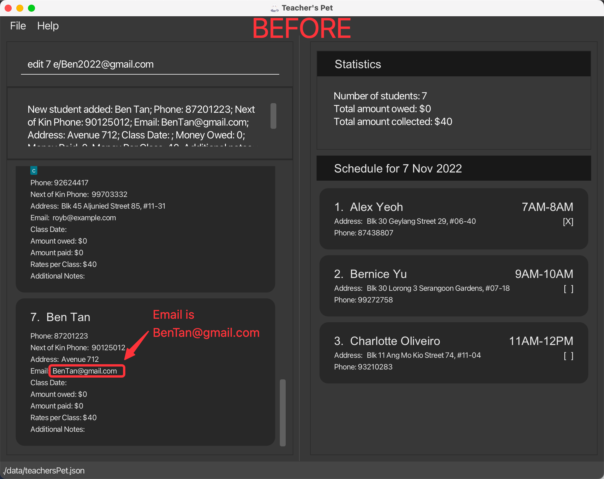
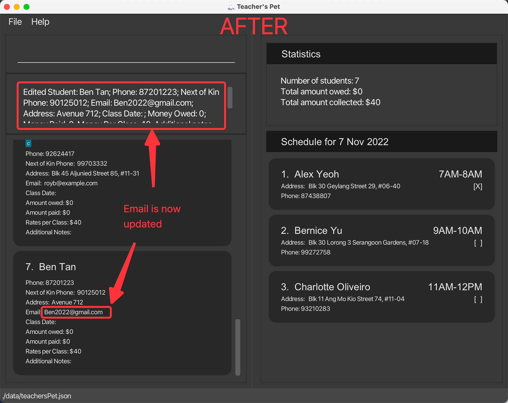

- Type `edit 7 dt/2022-11-07 1200-1300` in the [Command Input](#ui-overview). The index 1 student of the
  [Student List](#ui-overview) will have his or her class date updated to `2022-10-30 1100-1200` 
  in this case. Notice that the [Schedule List](#ui-overview) has now been updated.

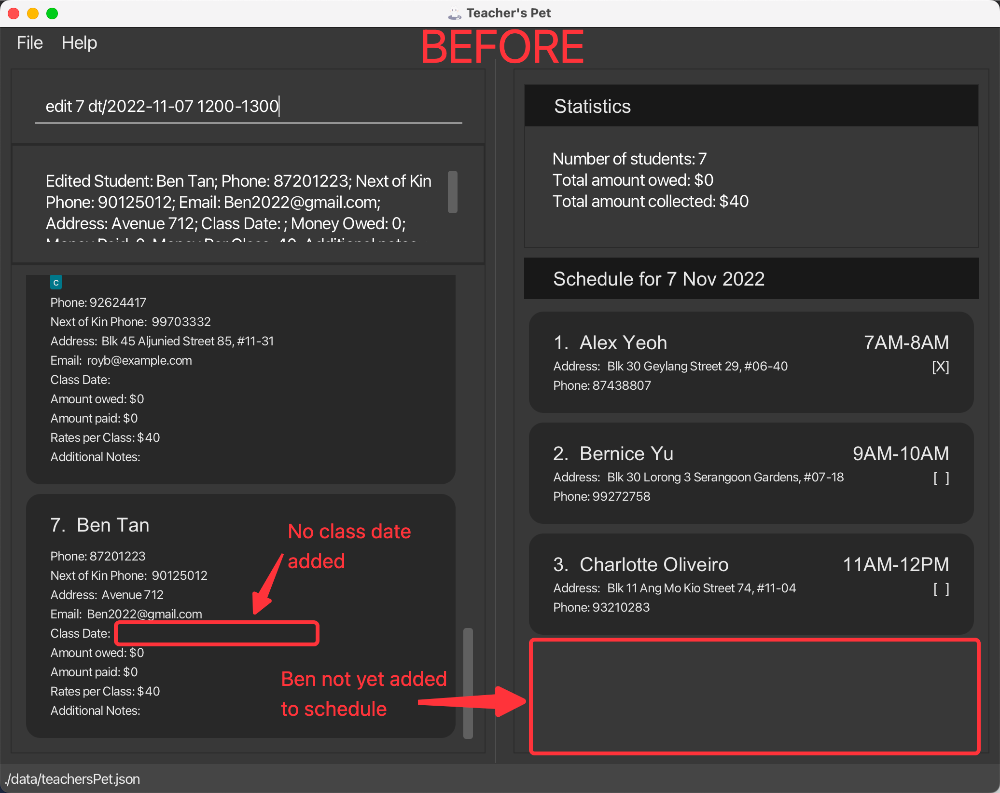
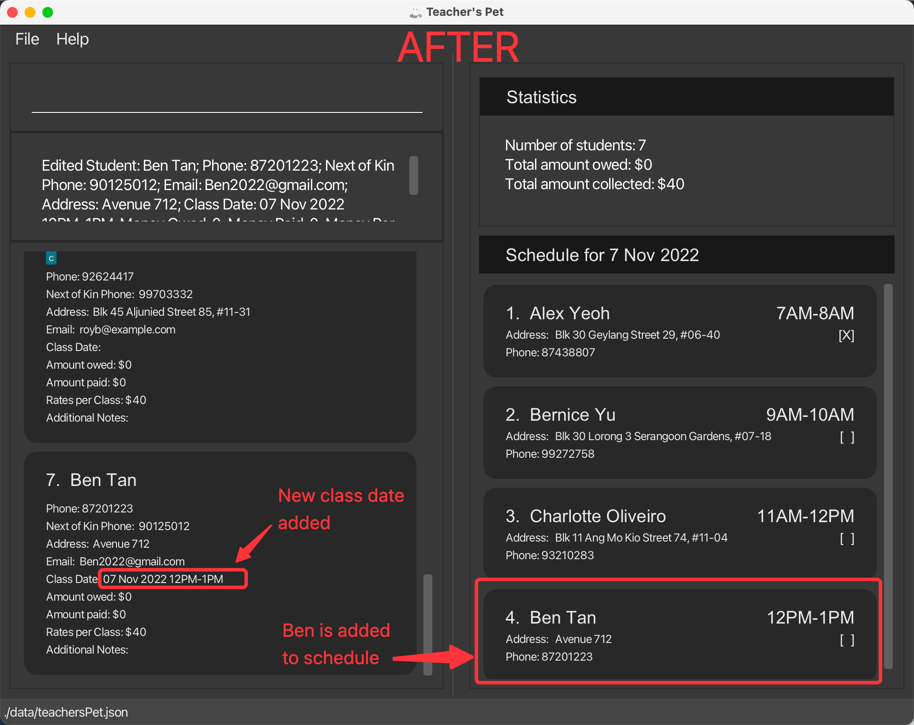

[↑ Back to top](#table-of-contents)

---

### Marking a student: `mark`

The `mark` command marks an existing student under [Schedule List](#ui-overview) as present for a class and track 
the money owed. You can do so by indicating [`INDEX-S`](#glossary), which refers to the index of the student under the 
[Schedule List](#ui-overview) (the right panel of the screen). 

When a student has been `mark`ed, a couple of things will happen.
1. **Teacher's Pet** will increase the student's owed amount by the rates per class.
2. A cross will be displayed beside the student's name indicating that the student has attended the class.

Format: `mark INDEX-s`

- Marks the student as present based on [`INDEX-s`](#glossary) which is the index on the right panel.
- The index refers to the index number shown in [Schedule List](#ui-overview).
- The index must be a positive integer. e.g., `1, 2, 3, ...`.

Example:
- Type `mark 1` in the [Command Input](#ui-overview). The index 1 student of the 
  [Schedule List](#ui-overview) will have his or her attendance marked. Notice that an X is now present between 
  the [ ] and his name is highlighted red since he has yet to pay $40.

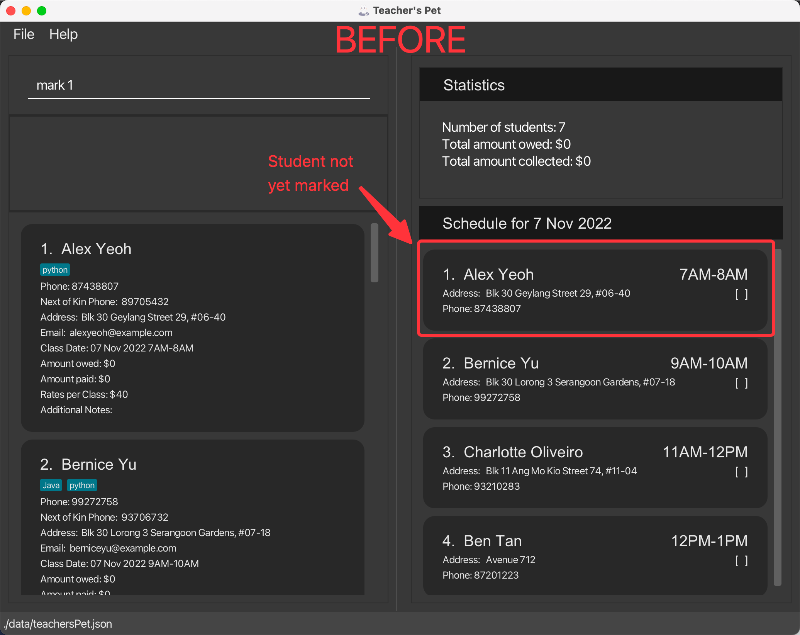
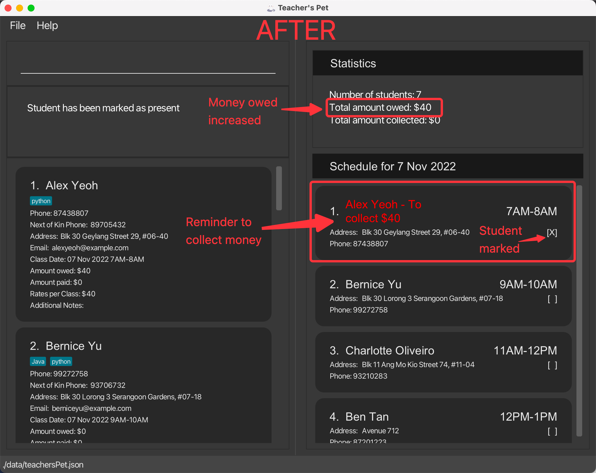

[↑ Back to top](#table-of-contents)

---

### Receiving money from a student: `pay`

The `pay` command indicates that a student has paid a certain amount of money.

**Teacher's Pet** will reduce the student's owed amount by the amount paid.

Format: `pay INDEX-s AMOUNT_PAID`

- Indicates that the student at a specified `INDEX-s` has paid.
- The index refers to the index number shown in the [Schedule List](#ui-overview) (bottom right).
- The index must be a positive integer. e.g., `1, 2, 3, ...`.
- The amount paid must be an integer and cannot be negative. e.g., `0, 1, 2, ...`.

Example:
- Type `pay 1 40` in the [Command Input](#ui-overview). The index 1 student of the
  [Schedule List](#ui-overview) now has paid his money and therefore his name is no longer highlighted in red as he no longer owes $40.

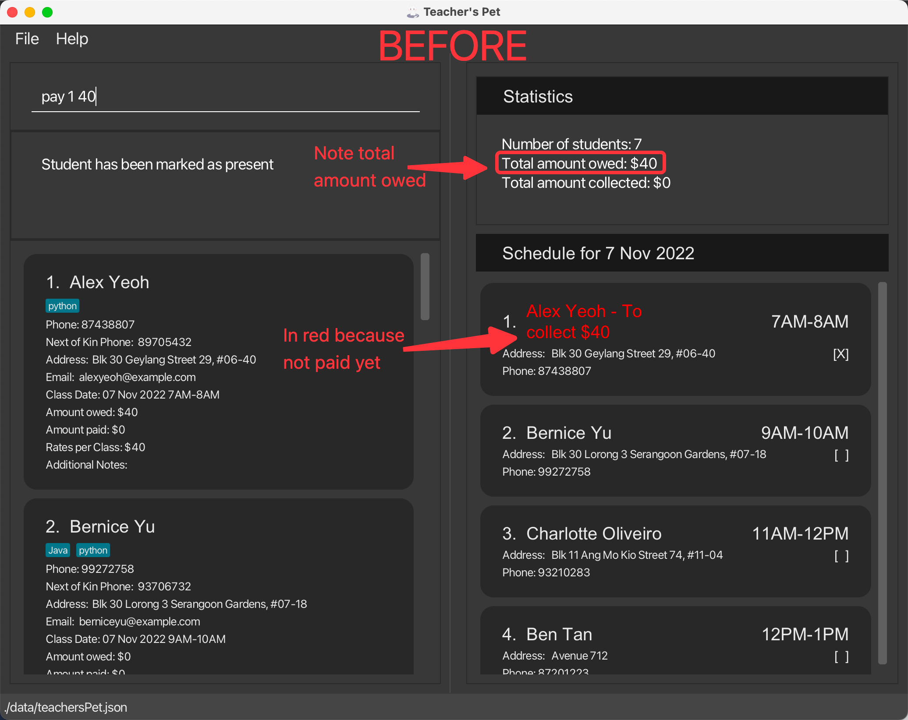
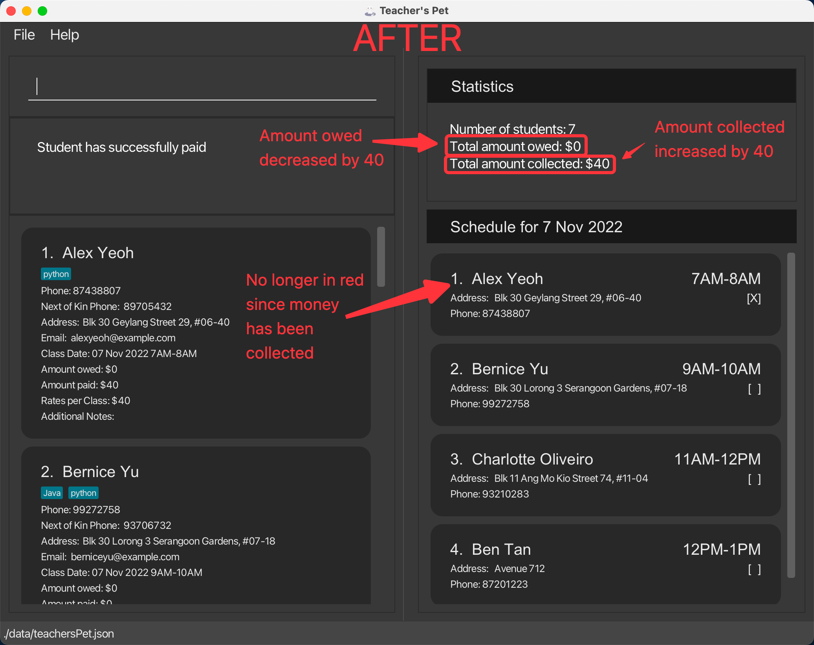

ℹ **Note:** The student cannot pay more than what he/she owes. There is also a maximum cap of
  $2147483647 for every payment.

[↑ Back to top](#table-of-contents)

---

### Viewing all students: `list`

The `list` command allows you to view your students and their information under [Student List](#ui-overview) which
includes the following:

- Contact Number
- Next of Kin’s Number
- Address
- Email
- Class Date
- Amount Paid
- Amount Owed
- Rates Per Class
- Additional Notes
- Tag

Format: `list`

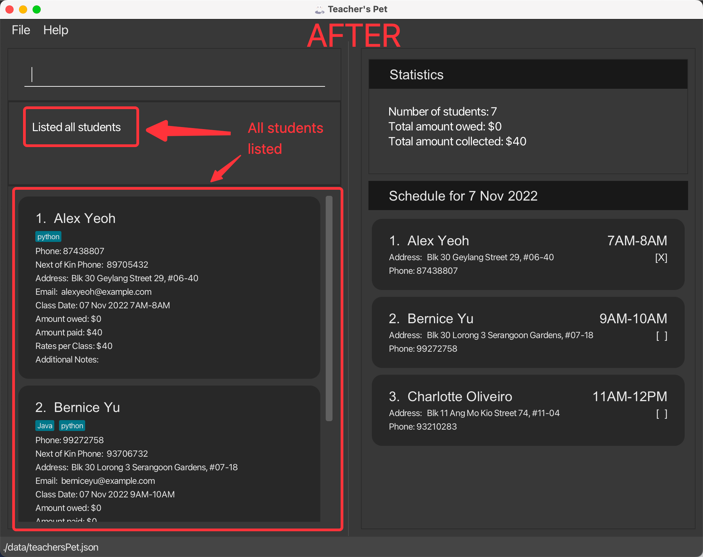

[↑ Back to top](#table-of-contents)

---

### Finding a student: `find`

The `find` command allows you to find a student based on certain conditions. The following are fields supported by the
`find` command and their corresponding prefixes (e.g. Name field has `n/` prefix):

- [Name `n/`](#find-by-name)
- [Email `e/`](#find-by-email)
- [Address `a/`](#find-by-address)
- [Student's Contact Number `p/`](#find-by-students-contact-number)
- [Next of Kin's Contact number `np/`](#find-by-next-of-kins-contact-number)
- [Class Date `dt/`](#find-by-class-date)
- [Tag `t/`](#find-by-tag)

❗ **Caution:** Only one field can be searched at once.

#### Find by Name:

Finds all students with names matching the keywords.

Format: `find n/KEYWORD [MORE_KEYWORDS]`

- The search is case-insensitive. e.g., `alex` will match `Alex`.
- The order of the keywords does not matter. e.g. `Yeoh Alex` will match `Alex Yeoh`.
- Only full words will be matched e.g., `Han` will not match `Hans`.
- Students matching at least one keyword will be returned. e.g., `Hans Bo` will return `Hans Gruber`, `Bo Yang`.

Example:

`find n/alex` returns `Alex Yeoh`.

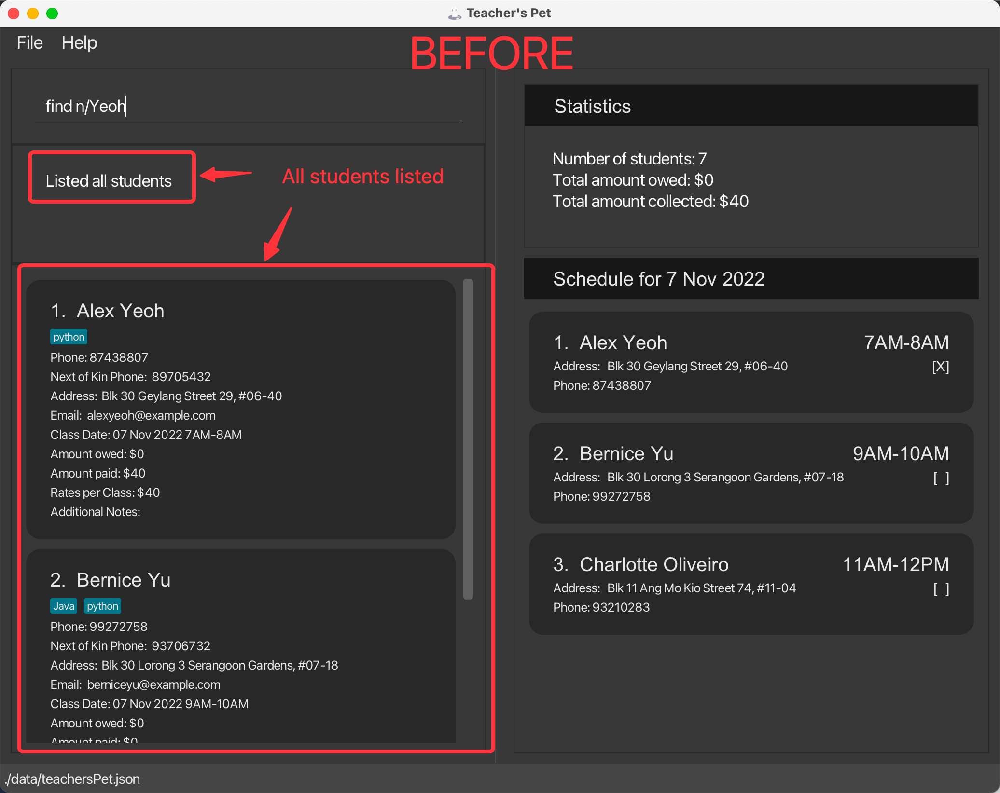
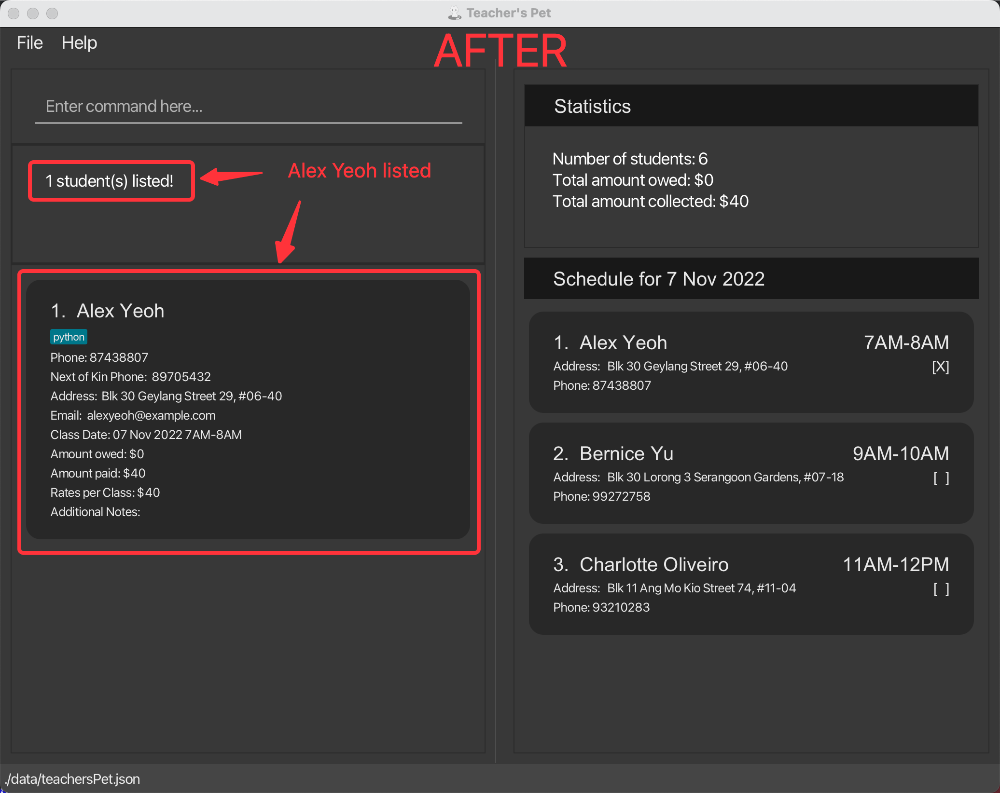

#### Find by Email:

Finds all students with a particular email.

Format: `find e/EMAIL`

- The search is case-insensitive. e.g., `ghost@woods.com` will match `ghoSt@woOds.com`.
- Only one email can be searched at each time.
- Full email must be used for corresponding student to be found e.g., `ghost` will not match `ghost@woods.com`.

❗ **Caution:** Do not include more than one email such as find e/jonsnow@winterfell.com ghost@woods.com as the .

Example:

`find e/jonsnow@winterfell.com` returns all students with email set as `jonsnow@winterfell.com`.

#### Find by Address:

Finds all students with addresses matching the keywords.

Format: `find a/KEYWORD [MORE_KEYWORDS]`

- The search is case-insensitive. e.g., `Labrador` will match `LABRADOR`.
- The order of the keywords does not matter. e.g., `Bukit Timah` will match `Timah Bukit`.
- Students matching at least one keyword will be returned. e.g., `Bukit Timah` will return `Bukit Batok`, `Timah Hill`.
- Only full words will be matched e.g., `Labra` will not match `Labrador`.

Example:

`find a/street` returns `Bukit Timah Street 3` and `Labrador Street 27`.

#### Find by Student's Contact Number:

Finds student with the matching contact number.

Format: `find p/CONTACT_NUMBER`

- Only full numbers will be matched e.g., `8123` will not match `81234567`.

Example:

`find p/81234567` returns the student with the contact number set as `81234567`.

#### Find by Next of Kin's Contact Number:

Finds all students with a particular next of kin's contact number.

Format: `find np/NEXT_OF_KIN_CONTACT_NUMBER`

- Only one contact number can be searched at each time.

❗ **Caution:** Do not include more than one contact number such as find np/91232323 81231232.

Example:

`find np/91232323` returns all students with the next of kin's contact number set as `91232323`.

[↑ Back to top](#table-of-contents)

#### Find by Class Date:

Finds all students with classes on a particular date.

Formats:
    1. `find dt/yyyy-MM-dd`
    2. `find dt/Day-of-Week`

- Only the date is searched.

❗ **Caution:** Do not include class timing.

Examples:

`find dt/2022-10-15` returns all students with classes on 15 October 2022.
`find dt/Mon` returns all students with classes on the coming monday.

[↑ Back to top](#table-of-contents)

#### Find by Tag:

Finds all students with a particular [tag](#tags).

Format: `find t/TAG_NAME`

- Only one tag can be searched at each time.

❗ **Caution:** Do not include more than one tag such as find t/python java.

Examples:

`find t/python` returns all students who have python as a tag, including students who have other tags on top of the
python tag.
`find dt/javascript` returns all students with javascript as a tag and other tags besides javascript.

[↑ Back to top](#table-of-contents)

---
### Next available class:

While there is no available command at the moment, you can find the next available class through a series of steps. 

1. Use [find command](#finding-a-student-find), to find a specific day: `find dt/2022-11-07` will find the students 
who have classes on `2022-11-07`
2. Use [sort command](#sort-the-displayed-students-sort), to sort by class: `sort class asc`.
3. View each class for the student under the [Student List](#ui-overview) until you find the slot you want.

[↑ Back to top](#table-of-contents)

---

### Sort the displayed students: `sort`

The `sort` command sorts the list of students in the [Student List](#ui-overview) by the specified `TYPE` and `ORDER`.

Format: `sort TYPE [ORDER]`

- `TYPE` must be followed by either one of the below options:
  - `NAME`
  - `CLASS`
  - `OWED`
- `ORDER`, if present, must be followed by either one of the below options:
  - `ASC`
  - `DESC`
  - If it is left as blank, it will follow the default order based on the specified `TYPE`.
- The default order for `NAME` and `CLASS` is `ASC` while for `OWED`, the default order is `DESC`.
- The parameters `TYPE` and `ORDER` are case-insensitive.
- When two students are **in a tie** for the compared `TYPE`, they will be sorted according to their **names** in **ascending** order by default.

[↑ Back to top](#table-of-contents)

#### Sort by Name

Sorts the list of students in the [Student List](#ui-overview) by `name` and given `ORDER`.

If `ORDER` is left blank, it will be `asc` by default.

Examples:

- `list` followed by `sort name` will list all the students according to their names in ascending order.
- `list` followed by `sort name asc` will list all the students according to their names in ascending order.
- `list` followed by `sort name desc` will list all the students according to their names in descending order.

[↑ Back to top](#table-of-contents)

#### Sort by Class Date

Sorts the list of students in the [Student List](#ui-overview) by `CLASS` and given `ORDER`.

If `ORDER` is left blank, it will be `ASC` by default.

Examples:

- `list` followed by `sort class` will list all the students according to their upcoming classes in ascending order.
- `list` followed by `sort class asc` will list all the students according to their upcoming classes in ascending order.
- `list` followed by `sort class desc` will list all the students according to their upcoming classes in descending order.

[↑ Back to top](#table-of-contents)

#### Sort by Money Owed

Sorts the list of students in the [Student List](#ui-overview) by `OWED`(Amount of Money Owed) and given `ORDER`.

If `ORDER` is left blank, it will be `DESC` by default.

Examples:

- `list` followed by `sort OWED` will list all the students according to how much money they owe in **descending** order.
- `list` followed by `sort OWED ASC` will list all the students according to how much money they owe in ascending order.
- `list` followed by `sort OWED DESC` will list all the students according to how much money they owe in descending order.

[↑ Back to top](#table-of-contents)

---

### Deleting student(s): `delete`

Deletes the specified student(s) from the student list.

⚠️ **Warning:** Proceed with care! The deletion is permanent the moment you exit the application.
But you can always undo the deletion with the undo command.

Format: `delete INDEX [MORE_INDEXES]`

- Deletes the student(s) at the specified `INDEX(ES)`.
- The index(es) refers to the index numbers shown in the [Student List](#ui-overview) (bottom left section of the display).
- The index(es) must be found on the displayed student list. e.g., `1, 2, 3, ...`.

Examples:
- `list` followed by `delete 1 2` deletes the 1st and 2nd student in the [Student List](#ui-overview).
- `find Betsy` followed by `delete 1` deletes the 1st student in the [Student List](#ui-overview).

💡 **Tip:** Deleting a student by mistake can be reversed by 
<a href="#undo-the-last-command-undo">undo</a> command!

[↑ Back to top](#table-of-contents)

---

### Clearing all student: `clear`

The `clear` command clears all students and their details from [Student List](#ui-overview).

Format: `clear`

💡 **Tip:** Clearing all students by mistake can be reversed by 
<a href="#undo-the-last-command-undo">undo</a> command!

[↑ Back to top](#table-of-contents)

---

### Undo the last command: `undo`

The `undo` command undoes the most recent command executed and restores the **Teacher's Pet** to the previous state.

💡 **Tip:** You can undo more than once!

Format: `undo`

[↑ Back to top](#table-of-contents)

---

### Exiting the program: `exit`

The `exit` command exits the program.

Format: `exit`

[↑ Back to top](#table-of-contents)

---

### Saving the data

Teacher’s Pet data is saved in the hard disk automatically after any command which changes the data is executed. There 
is no need to save manually.

[↑ Back to top](#table-of-contents)

---

### Editing the data file

Students' data is saved as a JSON file `[JAR file location]/data/teachersPet.json`. Advanced users are welcome to edit the data file.

⚠️ **Warning:** Proceed with care! If your changes to the data file makes its format invalid,
Teacher’s Pet will discard all data and start with an empty data file at the next run!

[↑ Back to top](#table-of-contents)

---

## FAQ

Q: How do I transfer my data to another Computer?

A: Install the app in the other computer and overwrite the empty data file it creates with the file that contains the data of your previous **Teacher's Pet** home folder.

[↑ Back to top](#table-of-contents)

---
## Glossary

| Terms       | Definition                                                  |
|-------------|-------------------------------------------------------------|
| Class Date  | The 1-1 tutoring time slot of a student                     |
| Day-of-Week | 3-letter Abbreviation; case-insensitive e.g., Mon, MON      |
| INDEX       | The index number shown in the [Student List](#ui-overview)  |
| INDEX-s     | The index number shown in the [Schedule List](#ui-overview) |
| Prefix      | e.g., `n/`, `p/`, `np/`                                     |
| Parameter   | e.g., `NAME`, `EMAIL`, `ADDRESS`                            |

[↑ Back to top](#table-of-contents)

## Command Summary

| Action                                                                 | Format, Examples                                                                                                                                                                                                                                        |
|------------------------------------------------------------------------|---------------------------------------------------------------------------------------------------------------------------------------------------------------------------------------------------------------------------------------------------------|
| [Get help](#viewing-help-help)                                         | `help`                                                                                                                                                                                                                                                  |
| [Add a student](#adding-a-student-add)                                 | add n/NAME p/CONTACT_NUMBER np/NEXT_OF_KIN_CONTACT_NUMBER a/ADDRESS e/EMAIL [t/TAG]... e.g., `add n/John Doe p/98765432 np/90123291 a/Street ABC e/johnd@example.com t/python t/beginner`                                                               |
| [Edit a student](#editing-student-details-edit)                        | edit INDEX [n/NAME] [p/CONTACT_NUMBER] [np/NEXT_OF_KIN_CONTACT_NUMBER] [a/ADDRESS] [e/EMAIL] [dt/CLASS_DATE] [paid/AMOUNT_PAID] [owed/AMOUNT_OWED] [rate/RATES_PER_CLASS] [nt/ADDITIONAL_NOTES] [nt-a/ADDITIONAL_NOTES_APPEND] e.g., `edit 2 p/98765431` |
| [Mark a student](#marking-a-student-mark)                              | mark INDEX-s e.g., `mark 2`                                                                                                                                                                                                                             |
| [Receive money from a student](#receiving-money-from-a-student-pay)    | pay INDEX-s AMOUNT_PAID e.g., `pay 2 300`                                                                                                                                                                                                               |
| [List all students](#viewing-all-students-list)                        | `list`                                                                                                                                                                                                                                                  |
| [Find a student](#finding-a-student-find)                              | find n/NAME e.g., `find n/John Doe` or other supported fields                                                                                                                                                                                           |
| [Find available time slots](#next-available-class)                     | refer to link under Action                                                                                                                                                                                                                              |
| [Sort students in particular order](#sort-the-displayed-students-sort) | sort TYPE [ORDER] e.g., `sort NAME ASC`                                                                                                                                                                                                                 |
| [Delete a student](#deleting-students-delete)                          | delete INDEX e.g., `delete 2`                                                                                                                                                                                                                           |
| [Clear all students](#clearing-all-student-clear)                      | `clear`                                                                                                                                                                                                                                                 |
| [Undo a command](#undo-the-last-command-undo)                          | `undo`                                                                                                                                                                                                                                                  |
| [Exit **Teacher's Pet**](#exiting-the-program-exit)                    | `exit`                                                                                                                                                                                                                                                  |

[↑ Back to top](#table-of-contents)

## Prefix Summary

| Prefix | Meaning                                             | Examples                                             |
|:-------|-----------------------------------------------------|------------------------------------------------------|
| n/     | Name of student                                     | `n/Alice`                                            |
| p/     | Phone number of student                             | `p/81234567`                                         |
| np/    | Next of Kin Phone number                            | `np/65432109`                                        |
| e/     | Email of student                                    | `e/alice@email.com`                                  |
| dt/    | Date and time of student's class                    | `dt/2022-10-27 1300-1400`                            |
| a/     | Address of student                                  | `a/15 Bukit Timah Road, Singapore 155203`            |
| paid/  | Amount paid by student                              | `paid/300`                                           |
| owed/  | Amount owed by student                              | `owed/200`                                           |
| rate/  | Rates per Class                                     | `rate/100`                                           |
| nt/    | Additional notes of student (create new notes)      | `nt/I have created new notes for Alice`              |
| nt-a/  | Additional notes of student (append existing notes) | `nt-a/I have added more notes to the existing notes` |
| t/     | Tags of student                                     | `t/python`                                           |

[↑ Back to top](#table-of-contents)
