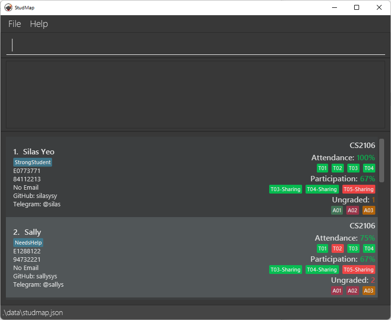

**StudMap (SM) is a desktop app for managing your students, optimized for use via a Command Line Interface (CLI) while still having the benefits of a Graphical User Interface (GUI).** If you can type fast, SM can get your student management tasks done faster than traditional GUI apps.

* If you are interested in using StudMap, head over to the [_Quick Start_ section of the **User Guide**](UserGuide.html#quick-start).
* If you are interested about developing StudMap, the [**Developer Guide**](DeveloperGuide.html) is a good place to start.

**Acknowledgements**

* Libraries used: [JavaFX](https://openjfx.io/), [Jackson](https://github.com/FasterXML/jackson), [JUnit5](https://github.com/junit-team/junit5)
