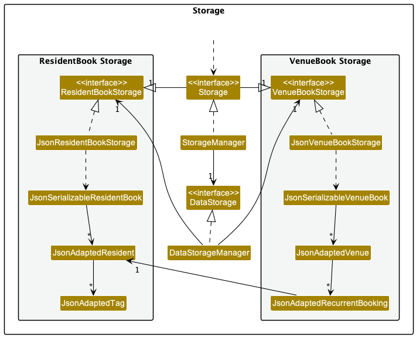

## Overview

RC4HDB is a desktop application which streamlines the daily workflow of RC4 housing management staff, by providing specialised features which solve their resident & venue management needs.

Below is a summary of my key contributions over the course of tP.  
You may view these contributions in more detail at [this link](https://nus-cs2103-ay2223s1.github.io/tp-dashboard/?search=alvinjiang1&breakdown=true).

### Project Management:
Contributions as documentation ic:
* Review documentation and give guidance for Milestone submissions
* Create workflow for updating documentation
* Participate in weekly scrum meeting

### Code contributions:

* Enhancements to new and existing features:
  * Refactor `Person` to `Resident` and include more `Resident` related fields ([#58](https://github.com/AY2223S1-CS2103T-W12-3/tp/pull/58), [#74](https://github.com/AY2223S1-CS2103T-W12-3/tp/pull/74))
    * Made contributions to `Resident`, `BookingDescriptor`, `Name`, `Email`, `Phone`,`Room`, `House`, `Gender`, `MatricNumber`etc.
  * Write initial logic to Venue Booking system ([#123](https://github.com/AY2223S1-CS2103T-W12-3/tp/pull/123))
    * Made decisions regarding the data structures required to implement a `Booking` system.
    * Made contributions to `BookCommand`, `BookCommandParser`, `Venue`, `ParserUtil`, `Day`, `Hour` etc.

* Code Testing:
  * Refactor existing test cases to make use of `Resident`s.([#74](https://github.com/AY2223S1-CS2103T-W12-3/tp/pull/74))
    * Notable contributions made to `ResidentBuilder`, `ParserUtilTest`, `AddCommandParserTest`, `EditCommandTest` etc.
  * Code tests for `Venue` related commands under`Logic` module ([#294](https://github.com/AY2223S1-CS2103T-W12-3/tp/pull/294))
    * Creation of unit tests for `BookCommand` was challenging due to complex logic behind the component and model stubs were made use of.
    * Notable contributions made to `VenueAddCommandTest`, `VenueDeleteCommandTest`, `BookCommandTest`, `BookingBuilder`, `BookingDescriptionBuilder` etc.

### Documentation

* User Guide
  * Manage readability and format
  * Refactor UG to single page and fix formatting ([#257](https://github.com/AY2223S1-CS2103T-W12-3/tp/pull/257))
  * Update application screenshots and markups ([#198](https://github.com/AY2223S1-CS2103T-W12-3/tp/pull/198), [#314](https://github.com/AY2223S1-CS2103T-W12-3/tp/pull/314))
  * Identify and fix UG bugs

* Developer Guide
  * Design Section([#55](https://github.com/AY2223S1-CS2103T-W12-3/tp/pull/55))
  * Resident Class under Implementation Section([#126](https://github.com/AY2223S1-CS2103T-W12-3/tp/pull/126))
  * Added section on manual testing for venue management

In particular, I added/updated the following UML diagrams:
1. [Architecture Sequence Diagram](#contributions-to-the-developer-guide)
2. [Delete Sequence Diagram](#contributions-to-the-developer-guide)
3. [Venue Storage Class Diagram](#contributions-to-the-developer-guide)

<!-- Provide links to the diagrams in the appendix at the bottom of the page -->

### Review/mentoring contributions:

I reviewed the following pull requests:
* Reviewed [25 pull requests](https://github.com/AY2223S1-CS2103T-W12-3/tp/pulls?q=is%3Apr+is%3Aclosed+reviewed-by%3Aalvinjiang1), most notably ([#30](https://github.com/AY2223S1-CS2103T-W12-3/tp/pull/30), [#312](https://github.com/AY2223S1-CS2103T-W12-3/tp/pull/312))
* Surfaced [4 potential bugs and suggestions](https://github.com/alvinjiang1/ped/issues) during PE-D.

## Appendix

### Contributions to the Developer Guide:

UML Diagrams added/updated for DG:

<!-- Embed the diagrams here -->
