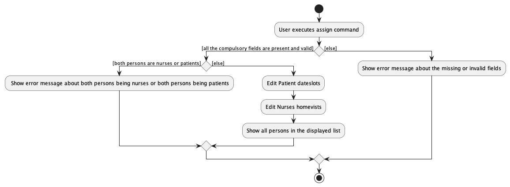

### Project: HealthCare Xpress

HealthCare Xpress is a desktop application that is to be used by medical administrator for managing patients that require home-visits and nurses. It helps medical administrators manage nurses, patients, their next of kin and attending physicians.The user interacts with it using a CLI, and it has a GUI created with JavaFX. It is written in Java, and has 10042 lines of code.

Given below are my contributions to the project.

- **New Features**:

  1.  Uid

  - What it does:
    - Unique Id and the manager to manage operations associated with the uid.
  - Justification:
    - Uid solves the issue whereby the medical administrator may enter very similar persons into Healthcare Xpress.
    - Uid helps to differentiate between these individuals.
  - Highlights:
    - Implementing a unique set of uid was challenging.
       

  1. Delete Command

  - What it does:
    - Deletes the person based on their uid.
  - Justification:
    - The delete command is an essential command so that the medical administrator can remove persons who are no longer relevant.
       

  3. Check Similar Command

  - What it does:
    - Deletes the person based on their uid.
  - Justification:
    - The delete command is an essential command so that the medical administrator can remove persons who are no longer relevant.
       

- **Code contributed**: [RepoSense link](https://nus-cs2103-ay2223s1.github.io/tp-dashboard/?search=ay2223s1-cs2103-f13-4&sort=groupTitle&sortWithin=title&timeframe=commit&mergegroup=&groupSelect=groupByRepos&breakdown=true&checkedFileTypes=docs~functional-code~test-code~other&since=2022-09-16&tabOpen=true&tabType=authorship&tabAuthor=johnbenedictyan&tabRepo=AY2223S1-CS2103-F13-4%2Ftp%5Bmaster%5D&authorshipIsMergeGroup=false&authorshipFileTypes=docs~functional-code~test-code&authorshipIsBinaryFileTypeChecked=false&authorshipIsIgnoredFilesChecked=false)

- **Project management**:

  - Assigned teammates to different issues and kept track of their progress
     

- **Enhancements to existing features**:

  - Refactor code to use streams and optional.
  - Refactor code to increase SLAP [#126](https://github.com/AY2223S1-CS2103-F13-4/tp/pull/126) [#224](https://github.com/AY2223S1-CS2103-F13-4/tp/pull/224)
  - Improve List Parser to account for commonly misspelt words [#111](https://github.com/AY2223S1-CS2103-F13-4/tp/pull/111)
     

- **Documentation**:

  - User Guide:
    - Delete Command
    - Other miscellaneous parts and proofreading
  - Developer Guide:
    - Target user profile
    - Value proposition
    - User stories
    - Delete command implementation
    - Unique ID implementation
    - Assign Command
    - Deassign Command
    - Other miscellaneous parts and proofreading
       

- **Contributions to the Developer Guide**
    ### Assign Feature

    #### Motivation:

    - The assign feature is necessary so that the medical administrator can visually see which nurse is attending which patient's home visit.

    #### Implementation:

    

    Step 1. The user executes `assign id/3 id/2`

    Step 2. `HealthcareXpressParser` creates an `AssignCommandParser` to parse the arguments.

    Step 3. `AssignCommandParser` checks validity of the given arguments and creates an `AssignCommand`.

    Step 4. The `AssignCommand` is executed, and a new `InternalEditor` is created.

    Step 5. `AssignCommand` calls the `InternalEditor`'s methods of `editPatient` and `editNurse`.

    Step 6. `Model` updates the database, and displays all the persons.

    The activity diagram below summarises exception handling of AssignCommand:

    
     

    #### Design considerations:

    - **Aspect: How the parse interprets the order of uids**
    - **Alternative 1:** Fix the order of the uid, so patient then nurse
        - Pros: There will be less checking needed to deduce the class of the persons involved.
        - Cons: The user experience will suffer as the medical administrator might not be able to accurately remember which uid corresponding to which person, the nurse or the patient.
         
    - **Alternative 2:** Have no fix order, as long as one nurse uid and one patient uid is inputted
        - Pros: The user experience will be better as there will be more leeway.
        - Cons: Harder to implement and more testing is required.
         
