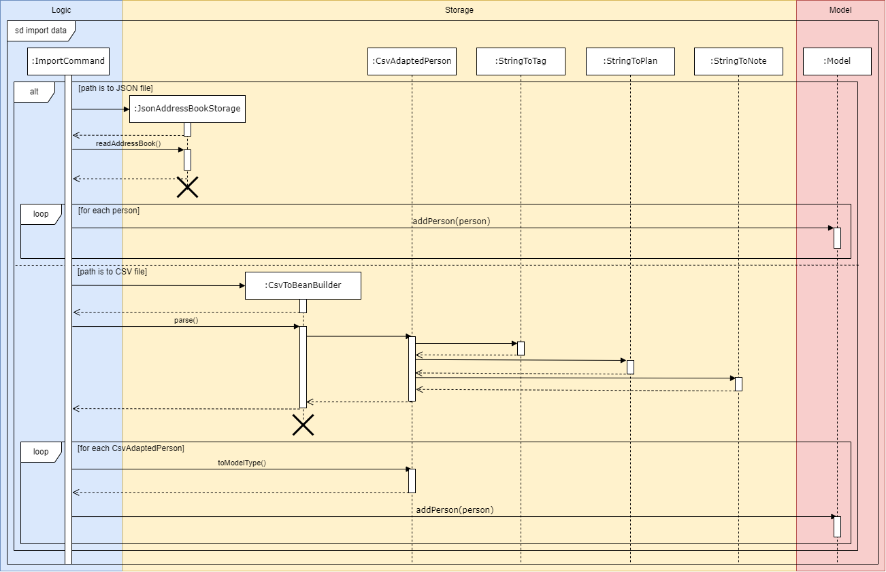
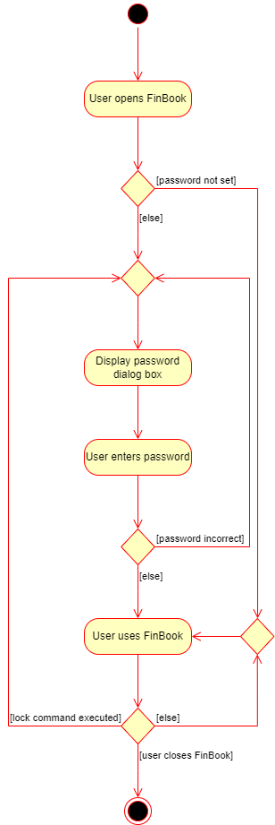

### Project: FinBook

FinBook is a desktop app for Financial Assistant (FA) to manage their client details and ensure that your data is
secured. With FinBook, you can set a unique password, manage and view client's details, meetings and portfolio as well
as many other features to make your daily workflow much more efficient!

### Overview

FinBook is optimized for use via a Command Line Interface (CLI), which means most of our commands are done by typing.

### Summary of Contributions

* **Code
  contributed**: [RepoSense link](https://nus-cs2103-ay2223s1.github.io/tp-dashboard/?search=leecaregene&breakdown=true)

* **Enhancements implemented**:
    * **New feature**: Import command
        * What it does: Allows the user to import data from a JSON or CSV file.
        * Justification: Lets the user add multiple clients at once from an external source, saving them time as they do not have to reinsert the clients one by one. It also lets the user move their data between devices easily.
        * Highlights:
            * Works seamlessly in conjunction with the export command. The user can import data that has been exported using the export command.
        * Credits: Uses [OpenCSV](https://opencsv.sourceforge.net/) for reading from CSV files.
    * **New feature**: Export command
        * What it does: Allows the user to export data to a CSV file.
        * Justification: Lets the user edit their data using other applications. This is particularly useful when there are a lot of (>100) clients stored in FinBook, as is easier to edit this data using spreadsheet software like Excel.
        * Highlights:
            * Works seamlessly in conjunction with the import command. The user can export data, optionally edit the data, and reimport it using the import command.
        * Credits: Uses [OpenCSV](https://opencsv.sourceforge.net/) for writing to CSV files.
    * **New feature**: Lock command
        * What it does: Allows the user to lock FinBook. A password dialog box asking for the user's password is displayed, and the user can resume using FinBook after entering the correct password.
        * Justification: Prevents unauthorised parties from using FinBook without permission from the user, enhancing the privacy of the user's data.
        * Highlights:
            * Works seamlessly in conjunction with the password command. The user can lock FinBook after setting a password using the password command.
            * If a password is set, the password dialog box is displayed on startup of FinBook.
        * Credits: Uses [Password4j](https://password4j.com/) for password verification.
    * **New feature**: Password command
        * What it does: Allows the user to set or update their FinBook password. The user will receive feedback on their chosen password.
        * Justification: Lets the user set a password for FinBook, enhancing the privacy of the user's data. It also discourages the user from choosing a weak password.
        * Highlights:
            * Works seamlessly in conjunction with the lock command. The user can set a password before locking FinBook using the lock command.
            * The estimated strength of the password is displayed. If it is weak, warnings and suggestions on how to improve the password are provided to the user.
        * Credits: Uses [Password4j](https://password4j.com/) for password hashing, and [zxcvbn4j](https://github.com/nulab/zxcvbn4j) for password strength estimation.

* **Contributions to the UG**:
    * Added documentation for these features: import command, export command, lock command, password command
    * Added the above commands to the command summary.
    * Added section on password resetting.
    * Added new terms (JSON, CSV, path) to the glossary.
    * Helped to fix bugs such as inconsistent formatting, broken links and outdated carryovers from AB3.

* **Contributions to the DG**:
    * Updated the acknowledgements section.
    * Updated the storage component section.
    * Added implementation details of the following: import command, lock feature
    * Updated user stories
    * Updated use cases
    * Updated glossary
    * Helped to fix bugs such as inconsistent formatting, broken links and outdated carryovers from AB3.

* **Contributions to team-based tasks**:
    * Set up the GitHub team organization.
    * Set up the GitHub team repository.
    * Set up the issue tracker.
    * Set up GitHub Project Boards to manage user stories and issues.
    * Set up master branch protection rules.
    * Maintained the issue tracker and milestones.
    * Made sure there were no outdated references to AB3 in the codebase.
    * Integrated the following third party libraries into the project: [OpenCSV](https://opencsv.sourceforge.net/), [Password4j](https://password4j.com/), [zxcvbn4j](https://github.com/nulab/zxcvbn4j)

* **Review/mentoring contributions**:
    * Reviewed the following pull requests: [#43](https://github.com/AY2223S1-CS2103T-F11-3/tp/pull/43), [#49](https://github.com/AY2223S1-CS2103T-F11-3/tp/pull/49), [#81](https://github.com/AY2223S1-CS2103T-F11-3/tp/pull/81), [#87](https://github.com/AY2223S1-CS2103T-F11-3/tp/pull/87), [#94](https://github.com/AY2223S1-CS2103T-F11-3/tp/pull/94), [#185](https://github.com/AY2223S1-CS2103T-F11-3/tp/pull/185)
    * Helped a teammate resolve an issue with failing test cases: [Link to PR](https://github.com/shaniceng/tp/pull/1)

* **Contributions beyond the project team**:
    * Evidence of helping others
        * Reported bugs for other teams in the class: [Example 1](https://github.com/AY2223S1-CS2103T-T15-3/tp/issues/206), [Example 2](https://github.com/AY2223S1-CS2103T-T15-3/tp/issues/234), [Example 3](https://github.com/AY2223S1-CS2103T-T15-3/tp/issues/246)

### Contributions to the Developer Guide (Extracts)

Created the following diagrams:

### Contributions to the User Guide (Extracts)

---

### 4.2.1. Locking the application : `lock`

Locks the application.

Format: `lock`

The following dialog box will be displayed:

**:information_source: Notes:**

* If a password has not been set, leave the password field empty to unlock the application.

:exclamation: **Caution:**
The lock feature only serves to prevent unauthorized usage of FinBook. Anyone with access to your PC is still able to view and edit the `JSON` files containing your data.

---

### 4.3.3. Importing data : `import`

Imports data from a `JSON` or `CSV` file.

* `JSON` files must be saved by the latest version of FinBook
* `CSV` files must be formatted correctly as follows:
    * The first line of the file must contain these headers in any order:
        * `name`
        * `phone`
        * `email`
        * `address`
        * `income`
        * `meeting date`
        * `tags`
        * `risk`
        * `plans`
        * The data in each corresponding column must be valid
            * `tags` must be separated by commas `,` without spaces (e.g. `VIPPClient,YuFamily`)
            * `plans` must be separated by commas `,` without spaces (
              e.g. `prudential income,NTUC income,prudential health`)

Format: `import PATH`

* Imports data from the file at the specified `PATH`
* `PATH` can be a relative or full path
* `PATH` must end in `.json` or `.csv`

Examples:

* `import ./data.json` imports data from the file `data.json` which is located in the same directory as the FinBook
  executable
* `import ../data.csv` imports data from the file `data.csv` which is located one level outside the directory of the
  FinBook executable
