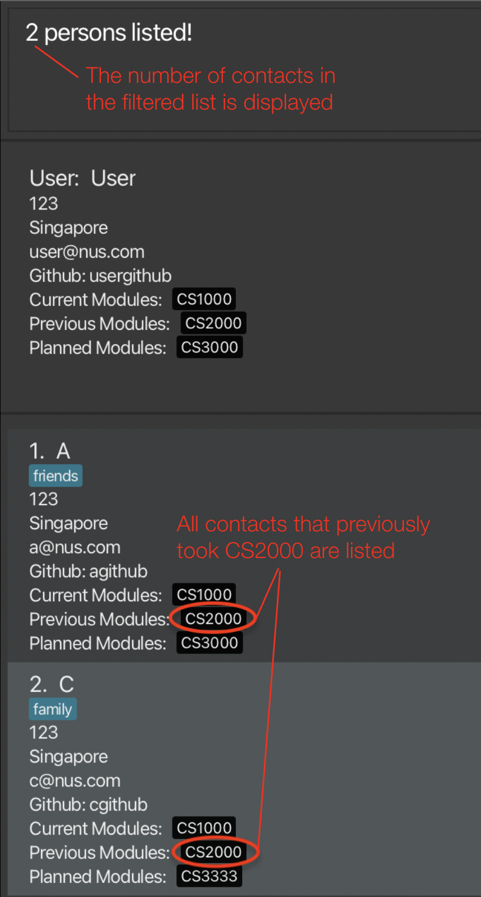
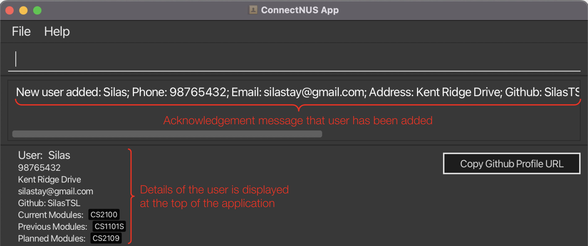

# Project: ConnectNUS

## Overview
ConnectNUS is a desktop address book application used for NUS CS students to keep track of their own modules,
and their friend's modules and contacts as well.

## Contributions
Given below are my contributions to the project.

* **New Feature**: Filter Contacts by Tag(s).
  * What it does: Lists out all persons in the contact list that have the tag(s) specified by the user.
  * Justification: To allow you to quickly find all the people belonging to a specific category.
  * Highlights:

  

* **New Feature**: Filter Contacts by Current Module(s).
  * What it does: Lists out all persons in the contact list that have the current module(s) specified by the user in
    their current modules list.
  * Justification: To allow you to quickly find all the people taking specific module(s).
  * Highlights:

  

* **New Feature**: Filter Contacts by Previous Module(s).
  * What it does: Lists out all persons in the contact list that have the previous module(s) specified by the user in
  * their previous modules list.
  * Justification: To allow you to quickly find all the people who have taken specific module(s).
  * Highlights:

  

* **New Feature**: Filter Contacts by Planned Module(s).
  * What it does: Lists out all persons in the contact list that have the planned module(s) specified by the user in
  * their planned modules list.
  * Justification: To allow you to quickly find all the people who are planning to take specific module(s).
  * Highlights:

  

* **New Feature**: Refreshing User and all Persons in the contact list when a New Semester starts.
  * What it does: Moves all the current modules in the current module lists of both the user and all persons in the user's
    contact list into their previous modules list.
  * Justification: To allow user's to update their ConnectNUS app a new semester starts by clearing all modules from the
    current module lists of the user and their contacts, such that they are able to add new current modules that they
    and their contacts will be taking in the upcoming semester to their app.
  * Highlights:

  

* **Code contributed**: [RepoSense link](https://nus-cs2103-ay2223s1.github.io/tp-dashboard/?search=leehuiyulaura&breakdown=true&sort=groupTitle&sortWithin=title&since=2022-09-16&timeframe=commit&mergegroup=&groupSelect=groupByRepos&checkedFileTypes=docs~functional-code~test-code~other)

* **Enhancements to existing features**: Update UI to display the user's profile.
  * Highlights:

  

* **Enhancements to existing features**: Update UI to display current, previous and planned modules for user and all persons in the contact list.
  * Highlights:

  

* **Documentation**:
  * User Guide:
    * Added documentation for the `nextsem` feature [#107](https://github.com/AY2223S1-CS2103T-T14-4/tp/pull/107)
    * Added documentation for the `filterTag`, `filterCurrMod`, `filterPrevMod` and `filterPlanMod` features [#107](https://github.com/AY2223S1-CS2103T-T14-4/tp/pull/107)
    * Updated the Table of Contents and Command Summary table to include the `nextsem`, `filterTag`, `filterCurrMod`, `filterPrevMod` and `filterPlanMod` features [#107](https://github.com/AY2223S1-CS2103T-T14-4/tp/pull/107)
    * Did cosmetic tweaks to existing documentation of the `nextsem`, `filterTag`, `filterCurrMod`, `filterPrevMod` and `filterPlanMod` features [#172](https://github.com/AY2223S1-CS2103T-T14-4/tp/pull/172)
    * Added annotated images for the `nextsem`, `filterTag`, `filterCurrMod`, `filterPrevMod` and `filterPlanMod` features [#172](https://github.com/AY2223S1-CS2103T-T14-4/tp/pull/172)
  * Developer Guide:
    * Added proposed implementation details for the `nextsem` and `filter` features [#80](https://github.com/AY2223S1-CS2103T-T14-4/tp/pull/80)
    * Edited the Ui Class Diagram to include a User Profile [#80](https://github.com/AY2223S1-CS2103T-T14-4/tp/pull/80)

* **Community**:
  * To Be Added

* **Tools**:
  * To Be Added

* _{you can add/remove categories in the list above}_
