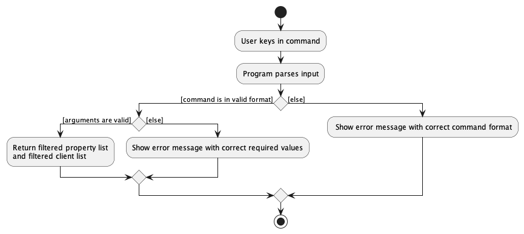
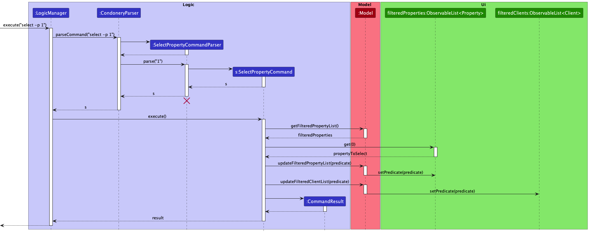

### Project: Condonery

Condonery is a desktop app made for property agents primarily used for managing client contacts and condo listings.
It is optimized for use via a Command Line Interface (CLI) while still having the benefits of a Graphical User Interface (GUI).
If you can type fast, Condonery can get your contact management tasks done faster than traditional GUI apps.

Given below are my contributions to the project.

* **New Feature**: Added the ability to select a single property or client, thus seeing its details as well as its interested clients or properties, respectively
  * Users can add interested clients to a property, or interested properties to a client
  * This feature faciliates easy viewing of a property's interested clients, or a client's interested properties
  * As the select command changes the property list and client list on the GUI, it helps with workflows involving a property's interested clients or a client's interested properties
    * For example, a user could submit a `select -p 1` command to select the first displayed property, before submitting an `edit -c 2` command to edit that property's second interested client

* **Code contributed**:
  * [RepoSense report](https://nus-cs2103-ay2223s1.github.io/tp-dashboard/?search=lkwlkww&breakdown=true&sort=groupTitle&sortWithin=title&since=2022-09-16&timeframe=commit&mergegroup=&groupSelect=groupByRepos&checkedFileTypes=docs~functional-code~test-code~other)

* **Enhancements implemented**:
  * Created the initial classes required for a Property
  * Refactored commands into two subclasses: `PropertyCommand` and `ClientCommand`
  * Added the `interestedClients` attribute to the `Property` class, and the `interestedProperties` attribute to the `Client` class

* **Contibutions to User Guide**:
  * Added explanations for property and client attributes
    * Includes each attribute's associated prefix, which will be used in the `add` and `edit` commands
  * Contributed to the description for the client directory features

* **Contributions to Developer Guide**:
  * Contributed to the Glossary section for key terms worth defining
  * Added implementation details for the select property/client feature

* **Contributions to team-based tasks**:
  * Setting up of documents to track meeting discussions
  * Organisation of bugs in the issues tracker into different priorities

* **Review/mentoring contributions**:
  * [Example 1](https://github.com/AY2223S1-CS2103-W14-1/tp/pull/209)
  * [Example 2](https://github.com/AY2223S1-CS2103-W14-1/tp/pull/206)

<div style="page-break-after: always;"></div>

### Contributions to the Developer Guide (Extracts)
#### Glossary

* **Mainstream OS**: Windows, Linux, Unix, OS-X
* **Property**: A listed unit of a property
* **Command**: A text input keyed in by the user, in the command box of the GUI.
  * A command must have a keyword (e.g. `select`, `clear`)
  * A command might require a flag, and/or a parameter(s)
* **Flag**: A flag denoting if a command is for properties or clients, i.e., `-p` and `-c`
* **Parameter**: A combination of a prefix and an argument(s) that functions as inputs to a command
  * Examples: `n/Samuel` is a name parameter; `a/Woodlands` is an address parameter
* **Prefix**: The symbol used in a parameter to indicate which parameter it is for
  * Examples: `n/` is the prefix for the name parameter; `a/` is the prefix for the address parameter
* **Argument**: The user-defined inputs for parameters
  * Examples: "Jaime" could be an argument for the name parameter; "Sembawang" could be an argument for the addresss parameter

#### Select feature
##### High-level details
* The select feature is meant to expand on either a `Property` or a `Client` to display its details in the GUI.
* Importantly, a `Property` can hold a list of interested clients and a `Client` can hold a list of properties that the client is interested in.
* Depending on if a `Property` or `Client` is selected, the GUI changes to show just the selected `Property` or `Client` in its respective tab, and its interested clients or intersted properties - respectively - in the other tab.
* The select command is as follows, where `select -p [INDEX]` is used to select a property under the property directory, and `select -c [INDEX]` is used to select a client under the client directory:

  ```
  select -[pc] [INDEX]
  ```

  * The compulsory input `INDEX` would correspond to the current displayed list in the GUi.
* Examples of usage:
  * `select -p 2`
  * `select -c 10`

##### Technical details
* The implementation of the select feature mainly revolves around two classes each for a `Property` and a `Client`: `SelectPropertyCommand`, `SelectPropertyCommandParser`, `SelectClientCommand` and `SelectClientCommandParser`.
  * The `SelectPropertyCommand` and `SelectClientCommand` classes handle the backend execution of the command, such as changing the list of Properties or Clients to be displayed on the GUI (See the UML diagrams below for a detailed breakdown).
  * The `SelectPropertyCommandParser` and `SelectClientCommandParser` classes handle the parsing of the arguments that have been supplied with the `select -[pc]` command (See the UML diagrams below for a detailed breakdown).
    * The user is supposed to only provide a valid `[INDEX]` as an argument. If invalid arguments have been provided, the parser classes throw a `ParseException` and display a message on the GUI to inform the user of the error.

##### UML Diagrams
The diagrams below are for `SelectPropertyCommand` and `SelectPropertyCommandParser`.

This activity diagram models the workflow when a `select -p 1` input is given by the user.

Importantly, errors that might be thrown are modeled in this diagram.



This sequence diagram shows the interactions between the `Logic`, `Model`, and `Ui` classes when a `select -p 1` input is given by the user.



The logic for `SelectClientCommand` and `SelectClientCommandParser` are similar and derivable from the diagrams too.

<div style="page-break-after: always;"></div>

### Contributions to the User Guide (Extracts)
#### Prefix list

| Prefix | Associated Parameter    | Definition                                                                                                                            | Examples                          | Remarks                                                                                                                                                                                                                                                                                            |
|--------|-------------------------|---------------------------------------------------------------------------------------------------------------------------------------|-----------------------------------|----------------------------------------------------------------------------------------------------------------------------------------------------------------------------------------------------------------------------------------------------------------------------------------------------|
| `n/`   | `NAME`                  | Refers to the name of a property or client.<br>                                                                                       | `n/PINNACLE@DUXTON`<br>`n/Walter` | Each property or client can only have one name.                                                                                                                                                                                                                                                    |
| `a/`   | `ADDRESS`               | Refers to the address of a property or client.                                                                                        | `a/Cantonment Rd, #1G, 085301`    | Each property or client can only have one address.                                                                                                                                                                                                                                                 |
| `t/`   | `TAG`                   | Refers to a tag of a property or client.<br> Can be used for labelling important details.                                             | `t/High-end`, `t/Friend`          | Tags must be alphanumerical<br> Each property or client can have multiple tags.                                                                                                                                                                                                                    |
| `-i`   | `IMAGE`                 | Refers to the image for a property or client.<br> User will be prompted to select an image in a separate window upon invoking prefix. | NIL                               | Each property or client can only have one image.                                                                                                                                                                                                                                                   |
| `p/`   | `PRICE`                 | Refers to property price.<br>                                                                                                         | `p/1,000,000`                     | Each property can only have one price.<br> Accepts positive integers only.<br> Max input price is `2,147,483,647`.<br> Use of commas to separate digits allowed, except when commas is in front of leading digit (`,100`), comma not between digits (`100,`) or using consecutive commas (`10,,0`) |
| `h/`   | `PROPERTY_TYPE`         | Refers to type of housing<br>Must be one of CONDO, HDB, or LANDED                                                                     | `h/HDB`, `h/Condo`, `h/landed`    | Each property can only have one property type.<br> Valid property types: `HDB`, `CONDO`, `LANDED`<br> Arguments for this parameter are case-insensitive.                                                                                                                                           |
| `s/`   | `PROPERTY_STATUS`       | Refers to availability of property<br>Must be one of AVAILABLE, SOLD, or PENDING                                                      | `s/AVAILABLE`, `s/PENDING`        | Each property can only have one property status.<br> Valid property statuses: `AVAILABLE`, `SOLD`, `PENDING`<br> Arguments for this parameter are case-insensitive.                                                                                                                                |
| `ic/`  | `INTERESTED_CLIENTS`    | Refers to list of clients who are considering to purchase a particular property.                                                      | `ic/Samuel`                       | Each property can have multiple clients interested in it.<br>                                                                                                                                                                                                                                      |
| `ip/`  | `INTERESTED_PROPERTIES` | Refers to list of properties that a client is interested in.                                                                          | `ip/duxton`                       | Each client can be interested in multiple properties.<br>                                                                                                                                                                                                                                          |

