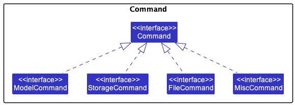

### Overview
**RC4 Housing Database** offers a convenient and intuitive interface for RC4 housing management staff to streamline their daily operations.
### Code contribution:
#### Enhancements to new and existing features
I contributed code to the following modules/classes:
1. Created a new filter feature to filter residents according to the fields by adding classes `AttributesMatchAllKeywordsPredicate`, `AttributesMatchAnyKeywordsPredicate`, `FilterCommand`, , `FilterCommandParser` and `Rc4hdbParser` classes.
2. Enhanced the filter feature to filter with different specifiers for multiple types of filters by adding `ResidentStringDescriptor` and `Specifier` classes and also modifying the above classes.
3. Added a remove command to delete multiple residents according to filters indicated by users by adding classes `RemoveCommand` and `RemoveCommandParser`.
#### Testing
1. Testing for Filter and Remove Command Classes mentioned above.
2. Testing for Venue Commands
You may view these contributions in more detail at [this link](https://nus-cs2103-ay2223s1.github.io/tp-dashboard/?search=nareus&breakdown=true).
### Contributions to the UG:
I contributed to the following sections of the user guide:
1. Added the filter and remove command sections for the user guide.
2. Fixed UG bugs in file commands section and field details.
### Contributions to the DG:
I contributed to the following sections of the developer guide:
<<<<<<< HEAD
1. Add use cases for venue add delete view book unbook.
2. Add Manual Testing for Modifying residents: add, delete, remove, edit
3. Modified Storage and Logic components
4. Added filter implementation in the implementation section

In particular, I added/updated the following UML diagrams:
[FilterCommandSequenceDiagram](../images/FilterCommandSequenceDiagram.png), 
[StorageClassDiagram](../images/StorageClassDiagram.png), [LogicClassDiagram](../images/LogicClassDiagram.png), 
[CommandDiagram](../images/CommandDiagram.png), [DeleteSequenceDiagram](../images/DeleteSequenceDiagram.png)
### Community and Project Management: 
- Reviewed 22 pull requests including major changes such as [#57](https://github.com/AY2223S1-CS2103T-W12-3/tp/pull/57), [#124](https://github.com/AY2223S1-CS2103T-W12-3/tp/pull/124) and [#55](https://github.com/AY2223S1-CS2103T-W12-3/tp/pull/55). 
- Surfaced [8 potential bugs & suggestions](https://github.com/nareus/ped/issues) for other teams during PE-D.
- Supported and handled test workload for the team according to the progress and expectations of the project.

### Contributions to the Developer Guide:

