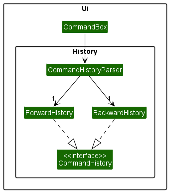
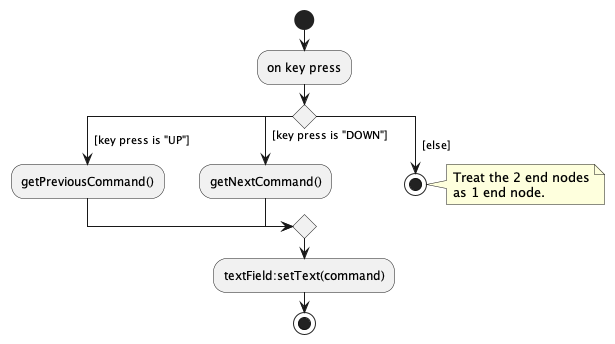

## Overview

**RC4 Housing Database** offers a convenient and intuitive interface for RC4 housing management staff to streamline their daily operations.
## Summary of Contributions

### Code contributed:

I contributed code to the following modules/classes:
1. Ui components (MainWindow, CommandBox, ResidentTableView, HelpWindow)
2. Quality-of-life components (CommandHistory, ForwardHistory, BackwardHistory)
3. Storage unit tests (DataStorageManager, StorageManager, JsonAdaptedVenue etc.)
4. Sample residents, venues and bookings (SampleData)

The above are my more notable contributions. You may view them and my other contributions [here](https://nus-cs2103-ay2223s1.github.io/tp-dashboard/?search=nealetham&breakdown=true).

### Enhancements implemented:

I made the following enhancements to our product:
1. Reworked the Ui to comply with our specifications and user's needs.
2. Reworked `find` to perform substring search.
3. Implemented all quality-of-life functionalities. You may view them [here](https://ay2223s1-cs2103t-w12-3.github.io/tp/UserGuide.html#quality-of-life).

### Contributions to the UG:

I contributed to the following sections of the user guide:
1. Ported the UG from `AB3` to `RC4HDB`, which include modifying the description and formatting of all features.
2. Re-organized UG into their respective sections i.e. file management, venue management etc.
3. Included all [Quality-of-life](../ug-pages/quality-of-life.md) functionalities.
4. Updated `find` command section to comply with our new implementation.

Other contributions include, updating the table-of-contents, command summary table, and adding a back-to-top hyperlink following each section.

### Contributions to the DG:

I contributed to the following sections of the developer guide:
1. Ported the DG from `AB3` to `RC4HDB`. Elaboration in the `Appendix: Requirements` section.
2. Added section on the implementation of our GUI, and command history functionality.
3. Added section on manual testing for quality-of-life functionalities, and `help`, `exit` commands.

In particular, I added/updated the following UML diagrams: *You may refer to the appendix for the diagrams.*
1. [Ui Component Diagram](../images/UiClassDiagram.png)
2. [Command History Class Diagram](../images/CommandHistoryClassDiagram.png)
3. [Command History Activity Diagram](../images/CommandHistoryActivityDiagram.png)

### Contributions to team-based tasks:

I contributed to the following team-based tasks:
1. Setting up the GitHub team organization, repository, Codecov and Gradle.
2. Ported `AB3` to `RC4HDB`, which includes, renaming and changing product icon.
3. Administrative tasks such as meeting minutes and work delegation in the weekly scrum meeting.

### Review/mentoring contributions:

I reviewed the following pull requests:
1. [Groundwork for Venue feature](https://github.com/AY2223S1-CS2103T-W12-3/tp/pull/110)
2. [Update List command](https://github.com/AY2223S1-CS2103T-W12-3/tp/pull/76)
3. [Venue booking feature](https://github.com/AY2223S1-CS2103T-W12-3/tp/pull/114)

To view all of my reviews, refer to [here](https://github.com/AY2223S1-CS2103T-W12-3/tp/pulls?q=is%3Apr+is%3Aclosed+reviewed-by%3A%40me)

### Contributions beyond the project team:

Beyond the project team, I also participated actively in the forum.

These are some threads in which I offered help to my classmates:
1. [Discussion on association, composition, aggregation](https://github.com/nus-cs2103-AY2223S1/forum/issues/86#issuecomment-1229400456)
2. [Failing codecov/patch check](https://github.com/nus-cs2103-AY2223S1/forum/issues/330)
3. [Bug: Wrong activity diagram](https://github.com/nus-cs2103-AY2223S1/forum/issues/338)

For the practical examination, I surfaced ***12*** bugs in the other team's product. You may view all of them [here](https://github.com/nealetham/ped/issues?q=is%3Aopen+is%3Aissue).

Some examples of these are:
1. [Non-functioning theme switcher](https://github.com/nealetham/ped/issues/4)
2. [Missing target-user and value proposition](https://github.com/nealetham/ped/issues/10)
3. [Validity checks in commands](https://github.com/nealetham/ped/issues/12)

## Appendix

### Contributions to the Developer Guide:

These are the UML diagrams I have updated/added to the DG.

