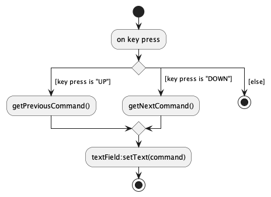

### RC4HDB

RC4HDB is a desktop application which streamlines the daily workflow of RC4 housing management staff, by providing specialised features which solve their resident & venue management needs.

Given below is a summary of my notable contributions to the project. You can find my full contribution [here](https://nus-cs2103-ay2223s1.github.io/tp-dashboard/?search=nealetham&breakdown=true).

### Project management
* Setting up the GitHub team organization, repository, Codecov & Gradle.
* Renaming the product & changing product icon.
* Administrative tasks such as meeting minutes & work delegation in the weekly scrum meeting.

### Code contribution
* Enhancements to new & existing features
  * Reworked the Ui to comply with our specifications & user's needs. ([#65](https://github.com/AY2223S1-CS2103T-W12-3/tp/pull/65), [#66](https://github.com/AY2223S1-CS2103T-W12-3/tp/pull/66), [#86](https://github.com/AY2223S1-CS2103T-W12-3/tp/pull/86), [#101](https://github.com/AY2223S1-CS2103T-W12-3/tp/pull/104), [#141](https://github.com/AY2223S1-CS2103T-W12-3/tp/pull/144), [#192](https://github.com/AY2223S1-CS2103T-W12-3/tp/pull/192))
  * Reworked `find` to perform substring search ([#31](https://github.com/AY2223S1-CS2103T-W12-3/tp/pull/31)).
  * Implemented all [quality-of-life](https://ay2223s1-cs2103t-w12-3.github.io/tp/UserGuide.html#quality-of-life) functionalities. ([#104](https://github.com/AY2223S1-CS2103T-W12-3/tp/pull/104)).
* Miscellaneous contributions
  * Storage unit tests ([#201](https://github.com/AY2223S1-CS2103T-W12-3/tp/pull/201), [#276](https://github.com/AY2223S1-CS2103T-W12-3/tp/pull/276)).
  * Model Manager unit tests ([#298](https://github.com/AY2223S1-CS2103T-W12-3/tp/pull/298)).
  * Sample residents, venues & bookings ([#182](https://github.com/AY2223S1-CS2103T-W12-3/tp/pull/182)).

### Documentation
* User Guide
  * Ported from `AB3` to `RC4HDB` to meet our specifications. Crafted the introduction, value proposition and target audience.
  * Re-organized UG into distinct sections i.e. file management, venue management etc. ([#132](https://github.com/AY2223S1-CS2103T-W12-3/tp/pull/132)) 
  * Added/Modified the [quality-of-life](https://ay2223s1-cs2103t-w12-3.github.io/tp/UserGuide.html#quality-of-life) & find command sections.
  * Enhanced user experience by adding notification callouts, and expanded the FAQ ([#312](https://github.com/AY2223S1-CS2103T-W12-3/tp/pull/312)).
* Developer Guide
  * Ported the DG from `AB3` to `RC4HDB`. Contributions to the Non-functional requirements section.
  * Added section on the implementation of our GUI, & quality-of-life functionalities ([#266](https://github.com/AY2223S1-CS2103T-W12-3/tp/pull/266), [#295](https://github.com/AY2223S1-CS2103T-W12-3/tp/pull/295/files)). 
  * Added section on manual testing for quality-of-life functionalities, & `help`, `exit` commands ([#266](https://github.com/AY2223S1-CS2103T-W12-3/tp/pull/266)). 
  * Updated the user stories section with relevant user stories, and formatting ([#312](https://github.com/AY2223S1-CS2103T-W12-3/tp/pull/312)).
  * Updated/Added the [Ui Component Diagram](https://github.com/AY2223S1-CS2103T-W12-3/tp/blob/master/docs/images/UiClassDiagram.png), [Command History Class Diagram](https://github.com/AY2223S1-CS2103T-W12-3/tp/blob/master/docs/images/CommandHistoryClassDiagram.png), & [Command History Activity Diagram](https://github.com/AY2223S1-CS2103T-W12-3/tp/blob/master/docs/images/CommandHistoryActivityDiagram.png)

### Community
* Reviewed [***38*** pull requests](https://github.com/AY2223S1-CS2103T-W12-3/tp/pulls?q=is%3Apr+is%3Aclosed+reviewed-by%3Anealetham). Many had non-trivial review comments, such as [#110](https://github.com/AY2223S1-CS2103T-W12-3/tp/pull/110), [#257](https://github.com/AY2223S1-CS2103T-W12-3/tp/pull/257) & [#76](https://github.com/AY2223S1-CS2103T-W12-3/tp/pull/110). Discussions also took place offline.
* Contributed to ***4*** forum discussions, such as [differences between association, composition, aggregation](https://github.com/nus-cs2103-AY2223S1/forum/issues/86#issuecomment-1229400456) & [failing Codecov/patch check](https://github.com/nus-cs2103-AY2223S1/forum/issues/330). Others include [#338](https://github.com/nus-cs2103-AY2223S1/forum/issues/338#issuecomment-1273258711), [#401](https://github.com/nus-cs2103-AY2223S1/forum/issues/401).
* Surfaced [***12*** potential bugs & suggestions](https://github.com/nealetham/ped/issues?q=is%3Aopen+is%3Aissue) for other teams during PE-D. These include [non-functioning theme switcher](https://github.com/nealetham/ped/issues/4) & [missing target-user & value proposition](https://github.com/nealetham/ped/issues/10).

## Appendix

### Contributions to the Developer Guide:

These are the UML diagrams I have updated/added to the DG.

