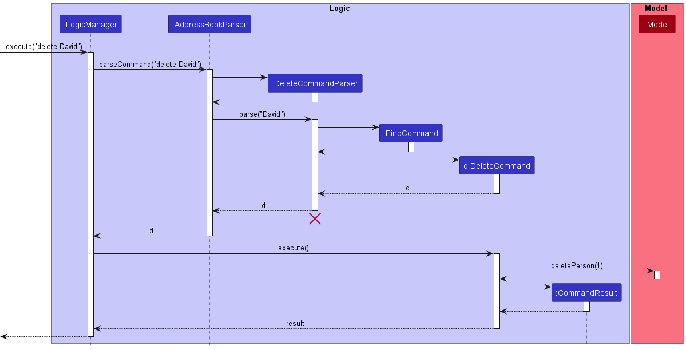

### Project: SectresBook

Sectresbook helps secretaries to maintain all the information of the members of their club by collating a list
of identifiable information, past records and future tasks.

Given below are my contributions to the project.

### New Features Implemented

---------------------------------
1. Delete by Name
   * What it does: Allows user to delete a contact from the Sectresbook by name rather than index.
   * Justification: A secretary/treasurer might remember people by name rather than their indexes in the Sectresbook, hence might have a preference for deleting by name. Catering to that improves user experience.
   * Highlights: Requires understanding of parser, ensuring that checks are done well when implementing the delete command. Difficult to ensure that a wrong person is not accidentally deleted and the number and name format does not overlap with each other.
   * Credits: Neethesh [(Link to own PR)](https://github.com/AY2223S1-CS2103T-W12-2/tp/pull/57)

2. Create Loan History
   * What it does: Allows users to keep track of the changes in their loan amount and the reason for those changes.
   * Justification: As a treasurer/secretary it is important to be able to keep track of the changes in the loan amount of people in their committee and the reasons for these changes for auditing purposes.
   * Highlights: Difficult task as it requires full understanding of the code and its structure. Having to understand how the data is stored in `JsonSerializableAddressBook`. Required the modification/creation of over 20 files. Ensuring test cases aligned to the creation of the new field of a person as well.
   * Credits: Neethesh [(Link to own PR)](https://github.com/AY2223S1-CS2103T-W12-2/tp/pull/99)
   
3. Edit Loan command
   * What it does: Allows the user to change the loan amounts by X amount with a reason.
   * Justification: As a secretary/treasurer, the loan amounts of specific people will change often due to the usage and returning of funds of the committee. Hence, it is important to be able to change these amounts with the respective reasons for the changes being tracked.
   * Highlights: Have to ensure that the inputs for the editLoan command for the amount to be changed is an integer that fits, and the reason is alphanumeric characters.
   * Credits: Neethesh [(Link to own PR)](https://github.com/AY2223S1-CS2103T-W12-2/tp/pull/99)

### Code contributed

-----------------------------------

[RepoSense link](https://nus-cs2103-ay2223s1.github.io/tp-dashboard/?search=w12-2&sort=groupTitle&sortWithin=title&timeframe=commit&mergegroup=&groupSelect=groupByRepos&breakdown=true&checkedFileTypes=docs~functional-code~test-code~other&since=2022-09-16&tabOpen=true&tabType=authorship&zFR=false&tabAuthor=Neethesh26&tabRepo=AY2223S1-CS2103T-W12-2%2Ftp%5Bmaster%5D&authorshipIsMergeGroup=false&authorshipFileTypes=docs~functional-code~test-code&authorshipIsBinaryFileTypeChecked=false&authorshipIsIgnoredFilesChecked=false)

### Project management

-----------------------------------

* Ensured meetings at stipulated timings.
* Approved PRs.
* Facilitated discussion and teamwork during meetings.
* Advocated asking for help when stuck with code.

### Contributions to the UG

----------------------------------

* Added description for `delete` command to include delete by name.
* Added `editLoan` command description.
* Compiled and formatted the Summary portion for the commands.

### Contributions to the DG

-----------------------------------

* Added the sequence diagram for `Delete` command, updating the description to include delete by name.

* Added the section, description and sequence diagram for the editLoan command.
   

* Compiled and added the use cases.

* Compiled the `Appendix: Instructions for manual testing` section, adding the commands for testing and the description for majority of the features.

### Team based contributions

--------------------------------

* Necessary implementation of Loan and Loan History feature, which is the biggest selling point of our product, where secretaries/treasurers are able to keep track of the individual amounts and changes.
* Updated parts of UG/DG not specific to a feature.
* Recognised and fixed bugs relating to features implemented and other features(Including UG bugs)

