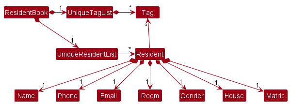

## Overview

**RC4 Housing Database** offers a convenient and intuitive interface for RC4 housing management staff to 
streamline their daily operations.

## Summary of Contributions

### Code contributed:

#### Functional code:

I contributed **functional** code to the following modules/classes:

For refactoring `Person` into a `Resident`,

1. `ResidentField.java`, and its subclasses:

    1a. `Gender.java`

    1b. `House.java`

    1c. `MatricNumber.java`

    1d. `Name.java`

    1e. `Phone.java`

    1f. `Room.java`

For the `showonly`, `hideonly` and `reset` commands,

2. `ListCommand.java`
   
3. `ColumnManipulatorCommand.java`, and its subclasses: 
   
   3a. `ShowOnlyCommand.java`
   
   3b. `HideOnlyCommand.java`
   
4. `ColumnManipulatorCommandParser.java`, and its subclasses:
   
   4a. `ShowOnlyCommandParser.java`
   
   4b. `HideOnlyCommandParser.java`

5. `ResetCommand.java`

6. `Rc4hdbParser.java`

7. `Model.java`, and its subclass `ModelManager.java`

8. `Logic.java`, and its subclass `LogicManager.java`

9. `ResidentTableView.java`

10. `MainWindow.java`

For the venue booking feature,
   
11. `Venue.java`
   
12. `Booking.java`, and its subclass `RecurrentBooking.java`

13. `MainWindow.java`

 

#### Test code:

I contributed **test** code to the following modules/classes:

For testing the `showonly`, `hideonly` and `reset` components, 

1. `ListCommandTest.java`
   
2. `ColumnManipulatorCommandTest.java`, and:
   
   2a. `ShowOnlyCommandTest.java`
   
   2b. `HideOnlyCommandTest.java`
   
3. `ColumnManipulatorCommandParserTest.java`, and:
   
   3a. `ShowOnlyCommandParserTest.java`
   
   3b. `HideOnlyCommandParserTest.java`
   
4. `ResetCommandTest.java`
   
5. `Rc4hdbParserTest.java`

For testing the venue booking components,
  
6. `VenueTest.java`

7. `VenueBookTest.java`   

8. `UniqueVenueListTest.java`

9. `RecurrentBookingTest.java`

10. `DailyScheduleTest.java`

For adding testing utility,

11. `BookingDescriptor.java`

12. `TypicalColumnManipulatorInputs.java`

13. `TypicalFieldLists.java`

14. `TypicalVenues.java`

15. `VenueBuilder.java`

You may view these contributions in more detail at [this link](https://nus-cs2103-ay2223s1.github.io/tp-dashboard/?search=nseah21&breakdown=true).

 

### Enhancements implemented:

I made the following enhancements to our product:

1. Reworked the UI to use `TableView` instead of `ListView`

    * This improved the layout of the resident data, which was more convenient (and more condense) to view. 
      
    * This also allowed the hiding of fields to behave as intended (as opposed to having gaps in the `ListView`)

2. Reworked the UI to wrap `ResidentTableView` and `VenueTableView` in a `Tab` 
   
    * This allowed users to switch between both tables easily using `CTRL-TAB`.
    
3. Added the feature for users to hide unwanted columns 
   
    * This helped users to de-clutter their screen, so that they could focus on only the required data in the table.
    
    * This also allowed users to modify the table columns without affecting the list of residents displayed.
    
4. Contributed to the `Venue` and `Booking` features

    * This helped users to manage RC4 venues and venue bookings by residents through our application, 
      instead of manually updating a spreadsheet. 

5. Added the option for users to include or exclude table columns when listing (removed in v1.4)

    * This helped users to de-clutter their screen when listing, but was ultimately only an intermediate feature 
      that was implemented as part of iterative development.

 

### Contributions to the UG:

I contributed to the following sections of the user guide:

1. [Listing all residents : `list`](https://ay2223s1-cs2103t-w12-3.github.io/tp/UserGuide.html#listing-all-residents--list)
   
2. [Showing resident fields : `showonly`](https://ay2223s1-cs2103t-w12-3.github.io/tp/UserGuide.html#showing-only-some-columns--showonly)
   
3. [Hiding resident fields : `hideonly`](https://ay2223s1-cs2103t-w12-3.github.io/tp/UserGuide.html#hiding-only-some-columns--hideonly)
   
4. [Resetting hidden resident fields : `reset`](https://ay2223s1-cs2103t-w12-3.github.io/tp/u#resetting-hidden-columns--reset)
   
5. [Locating residents by name : `find`](https://ay2223s1-cs2103t-w12-3.github.io/tp/UserGuide.html#locating-residents-by-name--find)
   
6. [Filtering residents by field : `filter`](https://ay2223s1-cs2103t-w12-3.github.io/tp/UserGuide.html#filtering-residents-by-field--filter)
   
7. [FAQ](https://ay2223s1-cs2103t-w12-3.github.io/tp/UserGuide.html#faq)
   
8. [Glossary of terms](https://ay2223s1-cs2103t-w12-3.github.io/tp/UserGuide.html#glossary-of-terms)
   
9. [Quality-of-life](https://ay2223s1-cs2103t-w12-3.github.io/tp/UserGuide.html#quality-of-life)
   
10. [Authors](https://ay2223s1-cs2103t-w12-3.github.io/tp/UserGuide.html#authors)

 

### Contributions to the DG:

I contributed to the following sections of the developer guide:

1. [Acknowledgements](https://ay2223s1-cs2103t-w12-3.github.io/tp/DeveloperGuide.html#acknowledgements)

2. [Tip on colour coding under design section](https://ay2223s1-cs2103t-w12-3.github.io/tp/DeveloperGuide.html#design)
   
3. [Design for Model component](https://ay2223s1-cs2103t-w12-3.github.io/tp/DeveloperGuide.html#model-component)
   
4. [Implementation of column hiding feature](https://ay2223s1-cs2103t-w12-3.github.io/tp/DeveloperGuide.html#showhide-feature-for-resident-fields)
   
5. [Use cases](https://ay2223s1-cs2103t-w12-3.github.io/tp/DeveloperGuide.html#use-cases)
   
6. [User stories](https://ay2223s1-cs2103t-w12-3.github.io/tp/DeveloperGuide.html#user-stories)

7. [Manual testing section for viewing residents](https://ay2223s1-cs2103t-w12-3.github.io/tp/DeveloperGuide.html#viewing-residents)

In particular, I added/updated the following UML diagrams:

1. [Colour coding guide](../images/ColorCoding.png)

2. [Class diagram for Model component](../images/LatestModelClassDiagram.png)
   
3. [Class diagram for possible extension of Model component with better OOP](../images/UpdatedBetterModelClassDiagram.png)
   
4. [Diagram illustrating the reference relationships of MainWindow and its subclasses](../images/MainWindowRelationships.png)

 

<!-- Provide links to the diagrams in the appendix at the bottom of the page -->

### Contributions to team-based tasks:

I contributed to the following team-based tasks:

1. Added the skeletal project portfolio page for my team
   
2. Created the UI mockup for RC4HDB
   
3. Completed the demonstrations for both v1.2 and v1.3. The demonstrations can be found [here](https://docs.google.com/presentation/d/1Rn9v81qwurx_IT_5V9oPZOge1VDZUPD1IxE3DUWkpYg/edit?usp=sharing).

 

### Review/mentoring contributions:

I reviewed and **commented extensively** on the following pull requests, listed in reverse-chronological order:

1. [Add Sample Data #182](https://github.com/AY2223S1-CS2103T-W12-3/tp/pull/182)

2. [UG reorganisation #132](https://github.com/AY2223S1-CS2103T-W12-3/tp/pull/132)
   
3. [Implement command history #122](https://github.com/AY2223S1-CS2103T-W12-3/tp/pull/122)

4. [Add Venue booking feature #114](https://github.com/AY2223S1-CS2103T-W12-3/tp/pull/114)

5. [Implement file commands #98](https://github.com/AY2223S1-CS2103T-W12-3/tp/pull/98)

6. [Remove person logic #73](https://github.com/AY2223S1-CS2103T-W12-3/tp/pull/73)

7. [Add resident field #72](https://github.com/AY2223S1-CS2103T-W12-3/tp/pull/72)
   
8. [Classify commands into subtypes #57](https://github.com/AY2223S1-CS2103T-W12-3/tp/pull/57)

9. [Update Use Cases and DG Format #55](https://github.com/AY2223S1-CS2103T-W12-3/tp/pull/55)

10. [Update UG and DG #30](https://github.com/AY2223S1-CS2103T-W12-3/tp/pull/30)

I also reviewed and left comments on the following pull requests, listed in reverse-chronological order:

11. [Enable assertions in build.gradle #112](https://github.com/AY2223S1-CS2103T-W12-3/tp/pull/112)

12. [Updated UG & Test for FindCommand #71](https://github.com/AY2223S1-CS2103T-W12-3/tp/pull/71)

13. [UI rework #66](https://github.com/AY2223S1-CS2103T-W12-3/tp/pull/66)

14. [Add user stories table to DG #41](https://github.com/AY2223S1-CS2103T-W12-3/tp/pull/41)

15. [Add individual PPPs #40](https://github.com/AY2223S1-CS2103T-W12-3/tp/pull/40)

16. [Add support for find command to perform substring search #31](https://github.com/AY2223S1-CS2103T-W12-3/tp/pull/31)

17. [Add Neale's info #20](https://github.com/AY2223S1-CS2103T-W12-3/tp/pull/20)

  

I also gave guidance to my team by:

1. Providing feedback and enforcing internal code quality standards within our team

2. Highlighting and correcting logical errors in our code 

    * For example, `List::equals` returns true if the elements at the same index in both lists are equal. 
     To correctly compare two lists, we needed to use `List::containsAll`, as well as the fact that a
     bi-directional subset relationship implied list equality.
      
3. Giving advice on how to use streams in our code (in order to make our code more declarative)
     
 

### Contributions beyond the project team:

Beyond the project team, I also participated actively in the forum.

These are some threads in which I clarified my doubts:

1. [Dropping (half) a feature #401](https://github.com/nus-cs2103-AY2223S1/forum/issues/401)

2. [Do reducing or adding more constraints on user input allowed in v1.4? #383](https://github.com/nus-cs2103-AY2223S1/forum/issues/383)

<!-- Provide links to the threads here -->

For the practical examination dry run, I also surfaced critical bugs in the other team's product.

Some examples of these are:

1. [Unable to add patients with duplicate name #328](https://github.com/AY2223S1-CS2103T-T12-4/tp/issues/328)

2. [Adding a patient task with invalid time for description turns out to be successful #315](https://github.com/AY2223S1-CS2103T-T12-4/tp/issues/315)

3. [Able to add patients with duplicate phone numbers #310](https://github.com/AY2223S1-CS2103T-T12-4/tp/issues/310)

## Appendix for UML diagrams

### Contributions to the Developer Guide:

#### Colour coding guide

 

#### Class diagram for Model component

 

#### Class diagram for possible extension of Model component with better OOP

 

#### Diagram illustrating the reference relationships of MainWindow and its subclasses

 

<!-- Embed the diagrams here -->

[comment]: <> (### Contributions to the User Guide:)

<!-- Embed the diagrams here -->
