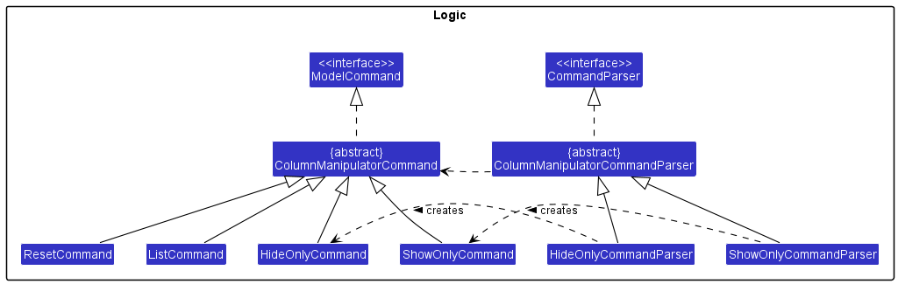
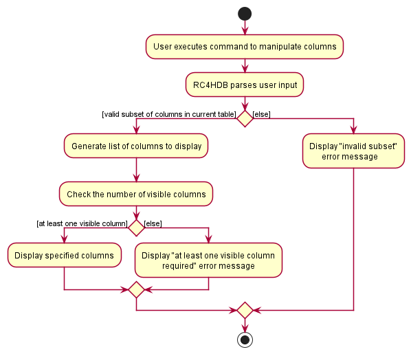

#### Project: RC4HDB

RC4HDB is a desktop application that offers a convenient and intuitive interface for housing management staff to streamline their resident and venue management operations.

Given below are my contributions to the project. You may view the full code here: [RepoSense link](https://nus-cs2103-ay2223s1.github.io/tp-dashboard/?search=nseah21&breakdown=true&sort=groupTitle&sortWithin=title&since=2022-09-16&timeframe=commit&mergegroup=&groupSelect=groupByRepos&checkedFileTypes=docs~functional-code~test-code~other&tabOpen=true&tabType=authorship&tabAuthor=nseah21&tabRepo=AY2223S1-CS2103T-W12-3%2Ftp%5Bmaster%5D&authorshipIsMergeGroup=false&authorshipFileTypes=docs~functional-code~test-code~other&authorshipIsBinaryFileTypeChecked=false&authorshipIsIgnoredFilesChecked=false)

* **New Feature**: Added the ability to show, hide, and reset table columns
    * *What it does*: allows the user to hide any number of unwanted columns in the table. Columns that have been hidden can be restored by using the reset command.
    * *How it benefits the user*: This feature improves the product significantly because a user can de-clutter their screen and only focus on the information relevant to their job, boosting their productivity during work.
    * *Highlights*: This enhancement affects the UI directly and had to be implemented carefully to minimise coupling between components. I was able to apply the Observer pattern in developing this feature.
    * *Completeness*: We consider this feature to be complete. This feature is the second iteration of our column hiding feature, and many [design considerations and modifications](https://ay2223s1-cs2103t-w12-3.github.io/tp/DeveloperGuide.html#manipulating-table-columns-using-showonly-and-hideonly) have gone into improving the initial implementation.
    
* **New Feature**: Contributed to the venue booking feature which allows the user to manage recurrent venue bookings
    * *How it benefits the user*: This feature improves the product significantly as low-level operations such as clearing expired bookings and checking for booking clashes are handled for the user by RC4HDB. The user can focus solely on adding and removing bookings for residents.
    * *Highlights*: This feature was difficult to implement as `Venue` and `Booking` are two new entity types, each of similar complexity to `Person` in AddressBook-Level3.

* **Enhancements to existing features**:
    * Updated the GUI to use a TableView so that users could view resident data in a more convenient and condensed layout (Pull request [\#76](https://github.com/AY2223S1-CS2103T-W12-3/tp/pull/76))
    * Updated the GUI to use a TabPane so that users could use `CTRL-TAB` to switch tables between residents and venues easily (Pull request [\#110](https://github.com/AY2223S1-CS2103T-W12-3/tp/pull/110))
    * Wrote additional tests for both new and existing features to increase coverage (Pull requests [\#127](https://github.com/AY2223S1-CS2103T-W12-3/tp/pull/127), [\#152](https://github.com/AY2223S1-CS2103T-W12-3/tp/pull/152), [\#196](https://github.com/AY2223S1-CS2103T-W12-3/tp/pull/196))
    * Overloaded the list command to allow users to include or exclude specified columns when listing (removed in v1.4 as this was an intermediate feature) (Pull requests [\#76](https://github.com/AY2223S1-CS2103T-W12-3/tp/pull/76))

  

* **Project management**:
    * Refactored and renamed AddressBook-Level3 to RC4HDB
    * Opened and assigned issues to the team during our weekly project meetings
    * Created the skeletal project portfolio page for my team
    * Created the [UI mockup](https://drive.google.com/file/d/1W8m0SWCyVR849i6FcgitcHIZaWRen2Ip/view?usp=share_link) for RC4HDB
    * Completed the product [demonstrations](https://docs.google.com/presentation/d/1Rn9v81qwurx_IT_5V9oPZOge1VDZUPD1IxE3DUWkpYg/edit?usp=sharing) for both v1.2 and v1.3
    

* **Mentoring contributions:**
    * Provided feedback and enforced internal code quality standards within my team
    * Guided my team on the use of streams to make our code more declarative
    * Suggested the use of abstract classes for our [command history feature](https://github.com/AY2223S1-CS2103T-W12-3/tp/pull/122)

* **Documentation**:
    * User Guide:
        * Added documentation for the commands `list`, `showonly`, `hideonly`, `reset` and `find`. You can view them [here](https://ay2223s1-cs2103t-w12-3.github.io/tp/UserGuide.html#viewing-residents)
        * Added documentation for the [FAQ](https://ay2223s1-cs2103t-w12-3.github.io/tp/UserGuide.html#faq), [glossary-of-terms](https://ay2223s1-cs2103t-w12-3.github.io/tp/UserGuide.html#glossary-of-terms), [quality-of-life](https://ay2223s1-cs2103t-w12-3.github.io/tp/UserGuide.html#quality-of-life), [authors](https://ay2223s1-cs2103t-w12-3.github.io/tp/UserGuide.html#authors) and [command summary](https://nseah21.github.io/tp/UserGuide.html#command-summary) sections
    * Developer Guide:
        * Updated the [acknowledgements section](https://ay2223s1-cs2103t-w12-3.github.io/tp/DeveloperGuide.html#acknowledgements) 
        * Updated the [Design section for the Model component](https://ay2223s1-cs2103t-w12-3.github.io/tp/DeveloperGuide.html#model-component)
            * Added a class diagram for the Model component in this section
            * Added two other class diagrams that were removed after the addition of the venue feature
        * Added [details to the Implementation section](https://ay2223s1-cs2103t-w12-3.github.io/tp/DeveloperGuide.html#manipulating-table-columns-using-showonly-and-hideonly) for the `showonly`, `hideonly` and `reset` features
            * Added a class diagram illustrating the reference relationships between MainWindow and the other components
            * Added a class diagram showing the inheritance relationships for the classes used in manipulating columns
            * Added an activity diagram modelling the intended behaviour of RC4HDB in response to a column manipulating command
        * Added [use cases](https://ay2223s1-cs2103t-w12-3.github.io/tp/DeveloperGuide.html#use-cases) and [user stories](https://ay2223s1-cs2103t-w12-3.github.io/tp/DeveloperGuide.html#user-stories) for RC4HDB
        * Added a sequential testing guide to the [manual testing section](https://ay2223s1-cs2103t-w12-3.github.io/tp/DeveloperGuide.html#viewing-residents) for the `list`, `showonly`, `hideonly`, and `reset` commands
        * Refer to the [appendix](#appendix-for-uml-diagrams-added-to-the-developer-guide) for the diagrams mentioned in this section
    

* **Community**:
    * Reviewed [32 PRs](https://github.com/AY2223S1-CS2103T-W12-3/tp/pulls?q=is%3Apr+reviewed-by%3Anseah21). Many had non-trivial review comments: [\#30](https://github.com/AY2223S1-CS2103T-W12-3/tp/pull/30), [\#55](https://github.com/AY2223S1-CS2103T-W12-3/tp/pull/55), [\#57](https://github.com/AY2223S1-CS2103T-W12-3/tp/pull/57), [\#72](https://github.com/AY2223S1-CS2103T-W12-3/tp/pull/72), [\#73](https://github.com/AY2223S1-CS2103T-W12-3/tp/pull/73), [\#98](https://github.com/AY2223S1-CS2103T-W12-3/tp/pull/98), [\#114](https://github.com/AY2223S1-CS2103T-W12-3/tp/pull/114), [\#122](https://github.com/AY2223S1-CS2103T-W12-3/tp/pull/122), [\#132](https://github.com/AY2223S1-CS2103T-W12-3/tp/pull/132), [\#182](https://github.com/AY2223S1-CS2103T-W12-3/tp/pull/182), [\#292](https://github.com/AY2223S1-CS2103T-W12-3/tp/pull/292), [\#299](https://github.com/AY2223S1-CS2103T-W12-3/tp/pull/299), [\#303](https://github.com/AY2223S1-CS2103T-W12-3/tp/pull/303) 
    * Participated in discussions on the forum. Examples include: [\#383](https://github.com/nus-cs2103-AY2223S1/forum/issues/383), [\#401](https://github.com/nus-cs2103-AY2223S1/forum/issues/401)
    * Reported [15 potential bugs and suggestions](https://github.com/nseah21/ped/issues) for other teams during the PE dry run. Examples include: [\#310](https://github.com/AY2223S1-CS2103T-T12-4/tp/issues/310), [\#315](https://github.com/AY2223S1-CS2103T-T12-4/tp/issues/315), [\#328](https://github.com/AY2223S1-CS2103T-T12-4/tp/issues/328), [\#332](https://github.com/AY2223S1-CS2103T-T12-4/tp/issues/332), [\#362](https://github.com/AY2223S1-CS2103T-T12-4/tp/issues/362)

#### Appendix for UML diagrams added to the Developer Guide

* **Class diagram for Model component:**

 

* **Diagram illustrating the reference relationships between MainWindow and other relevant components:**

 

* **UML diagram showing the inheritance relationships for the classes used in manipulating columns:**

 

* **Activity diagram modelling the intended behaviour of RC4HDB in response to a column manipulating command:**

 

* **Class diagram for the Model component before the venue feature was added:**

This diagram was removed from the DG to reduce clutter, but was present in the DG prior to addition of the venue feature.

 

* **Class diagram for `ResidentBook` (but with better OOP):**

This diagram was removed from the DG to reduce clutter, but was present in the DG prior to addition of the venue feature.

 
