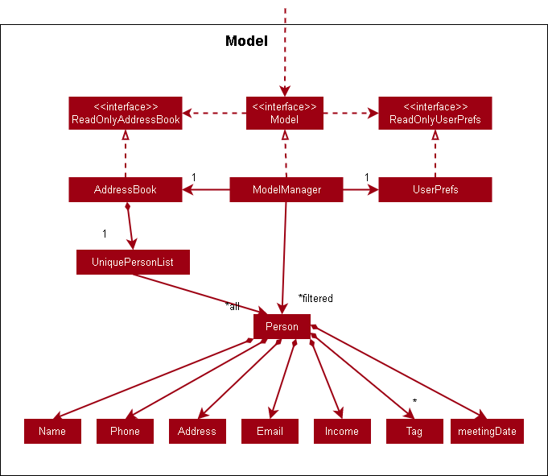

### Project: RC4HDB

RC4HDB is a housing database that offers a convenient and intuitive interface for housing management staff to streamline their daily operations. 

Given below are my contributions to the project.

* **New Feature**: Added the ability to show/hide table columns. 
    * What it does: allows the user to hide any number of unwanted columns in the table. Columns that have been hidden can be restored by using the reset command.
    * Justification: This feature improves the product significantly because a user can de-clutter their screen and only focus on the information that they require, saving them time and effort in their work.
    * Highlights: This enhancement affects the UI directly and had to be implemented carefully to minimise coupling between components. I was able to apply the observer pattern in developing this feature.

* **New Feature**: Added the venue booking feature that allows the user to manage recurrent venue bookings.
    * Justification: This feature improves the product significantly as low-level operations such as clearing expired bookings and checking for booking clashes are handled for the user by RC4HDB.

* **Code contributed**: [RepoSense link](https://nus-cs2103-ay2223s1.github.io/tp-dashboard/?search=nseah21&breakdown=true)

* **Project management**:
    * Completed the product [demonstrations](https://docs.google.com/presentation/d/1Rn9v81qwurx_IT_5V9oPZOge1VDZUPD1IxE3DUWkpYg/edit?usp=sharing) for both v1.2 and v1.3.
    * Created the skeletal project portfolio page for my team
    * Created the [UI mockup](https://drive.google.com/file/d/1W8m0SWCyVR849i6FcgitcHIZaWRen2Ip/view?usp=share_link) for RC4HDB

* **Enhancements to existing features**:
    * Updated the GUI to use a TableView so that users could view resident data in a more convenient and condensed layout (Pull requests [\#76](https://github.com/AY2223S1-CS2103T-W12-3/tp/pull/76))
    * Updated the GUI to use a TabPane so that users could use `CTRL-TAB` to switch tables between residents and venues easily (Pull requests [\#110](https://github.com/AY2223S1-CS2103T-W12-3/tp/pull/110))
    * Wrote additional tests for existing features to increase coverage (Pull requests [\#114](https://github.com/AY2223S1-CS2103T-W12-3/tp/pull/114), [\#127](https://github.com/AY2223S1-CS2103T-W12-3/tp/pull/127), [\#152](https://github.com/AY2223S1-CS2103T-W12-3/tp/pull/152), [\#196](https://github.com/AY2223S1-CS2103T-W12-3/tp/pull/196))
    * Overloaded the list command to allow users to include or exclude specified columns when listing (removed in v1.4 as this was an intermediate feature) (Pull requests [\#76](https://github.com/AY2223S1-CS2103T-W12-3/tp/pull/76))

* **Documentation**:
    * User Guide:
        * Added documentation for the features `list`, `showonly`, `hideonly`, `reset` and `find`. You can view them [here](https://ay2223s1-cs2103t-w12-3.github.io/tp/UserGuide.html#viewing-residents).
        * Added documentation to the [FAQ](https://ay2223s1-cs2103t-w12-3.github.io/tp/UserGuide.html#faq), [glossary-of-terms](https://ay2223s1-cs2103t-w12-3.github.io/tp/UserGuide.html#glossary-of-terms), [quality-of-life](https://ay2223s1-cs2103t-w12-3.github.io/tp/UserGuide.html#quality-of-life) and [authors](https://ay2223s1-cs2103t-w12-3.github.io/tp/UserGuide.html#authors) sections. 
    * Developer Guide:
        * Updated the [acknowledgements section](https://ay2223s1-cs2103t-w12-3.github.io/tp/DeveloperGuide.html#acknowledgements) 
        * Updated the [design section for the Model component](https://ay2223s1-cs2103t-w12-3.github.io/tp/DeveloperGuide.html#model-component), and added [two UML diagrams](#appendix-for-uml-diagrams-added-for-documentation) for this section
        * Added [implementation details](https://ay2223s1-cs2103t-w12-3.github.io/tp/DeveloperGuide.html#showhide-feature-for-resident-fields) for the `showonly`, `hideonly` and `reset` features, and added [a diagram illustrating the reference relationships for MainWindow](#appendix-for-uml-diagrams-added-for-documentation) for this section
        * Added [use cases](https://ay2223s1-cs2103t-w12-3.github.io/tp/DeveloperGuide.html#user-cases) and [user stories](https://ay2223s1-cs2103t-w12-3.github.io/tp/DeveloperGuide.html#user-stories) for RC4HDB
        * Added test cases to the [manual testing section](https://ay2223s1-cs2103t-w12-3.github.io/tp/DeveloperGuide.html#viewing-residents) for `list`, `showonly`, `hideonly`, and `reset`

* **Community**:
    * PRs reviewed (with non-trivial review comments): [\#30](https://github.com/AY2223S1-CS2103T-W12-3/tp/pull/30), [\#55](https://github.com/AY2223S1-CS2103T-W12-3/tp/pull/55), [\#57](https://github.com/AY2223S1-CS2103T-W12-3/tp/pull/57), [\#72](https://github.com/AY2223S1-CS2103T-W12-3/tp/pull/72), [\#73](https://github.com/AY2223S1-CS2103T-W12-3/tp/pull/73), [\#98](https://github.com/AY2223S1-CS2103T-W12-3/tp/pull/98), [\#114](https://github.com/AY2223S1-CS2103T-W12-3/tp/pull/114), [\#122](https://github.com/AY2223S1-CS2103T-W12-3/tp/pull/122), [\#132](https://github.com/AY2223S1-CS2103T-W12-3/tp/pull/132), [\#182](https://github.com/AY2223S1-CS2103T-W12-3/tp/pull/182)
    * Participated in forum discussions (examples: [\#383](https://github.com/nus-cs2103-AY2223S1/forum/issues/383), [\#401](https://github.com/nus-cs2103-AY2223S1/forum/issues/401))
    * Reported bugs and suggestions for other teams in the class (examples: [\#310](https://github.com/AY2223S1-CS2103T-T12-4/tp/issues/310), [\#315](https://github.com/AY2223S1-CS2103T-T12-4/tp/issues/315), [\#328](https://github.com/AY2223S1-CS2103T-T12-4/tp/issues/328), [\#332](https://github.com/AY2223S1-CS2103T-T12-4/tp/issues/332), [\#362](https://github.com/AY2223S1-CS2103T-T12-4/tp/issues/362))
    
#### Appendix for UML diagrams added for documentation

* **Class diagram for Model component:**

* **Class diagram for possible extension of Model component with better OOP:**

* **Diagram illustrating the reference relationships of MainWindow and its subclasses:**

