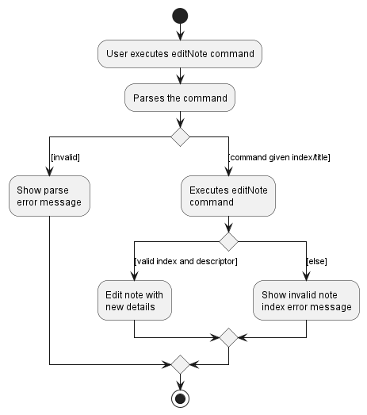

### Project: SectresBook

SectresBook helps secretaries to maintain all the information of the members of their club by collating a list of identifiable information, past records and future tasks.

Given below are my contributions to the project.

## New Features Implemented
1\. **_Notes model_**
* **What it does**: Adds the structure of Notes in model. Notes contain a unique title and its content. Notes are contained in a `NoteBook`.
* **Justification**: A treasurer/secretary may require keeping notes on his/her tasks.
* **Highlights**: Difficult to implement as Notes interact with many parts of the code which requires full understanding of the code and its structure.(From `AddressBook`, `Model`, `ModelManger`, to how data is stored in `JsonSerializableAddressBook`). Required the modification/creation of over 15 classes.
* **Credits**: Pinran [(Link to own PR)](https://github.com/AY2223S1-CS2103T-W12-2/tp/pull/54)

   

2\. **_Add Note command_**
* **What it does**: Allows the adding of notes into SectresBook by specifying a title and content using their respective prefixes. (tags are optional)
* **Justification**: A command is needed to allow the user to add a note into SectresBook to be kept track of.
* **Highlights**: A note's title had to accommodate special characters which made the regex tricky. Selection of prefixes were tricky as many prefixes were already in use.
* **Credits**: Pinran [(Link to own PR)](https://github.com/AY2223S1-CS2103T-W12-2/tp/pull/54) , Tags(Ryan)

   

3\. **_Delete Note command_**
* **What it does**: Allows the deleting of notes in SectresBook by specifying an index in the notes listed.
* **Justification**: A delete command is needed to allow users to delete notes that are no longer relevant or needed to be kept track of.
* **Highlights**:  Making sure the specified index matches the index shown in the list, thus, making sure the correct note was being deleted was tricky as it needed good understanding of `Index` class (One-based compared to zero-based)
* **Credits**: Pinran [(Link to own PR)](https://github.com/AY2223S1-CS2103T-W12-2/tp/pull/54)

   

4\. **_List Note command_**
* **What it does**: Lists all the notes that is being kept track of.
* **Justification**: A list command is needed to allow users at any point to view the full list of notes and reset the list to show all notes.
* **Highlights**: GUI (Interface) was only updated to support notes in the later iterations, therefore, this implementation had to change from initially displaying the notes as a message to the users to incorporating with the GUI.
* **Credits**: Pinran [(Link to own PR)](https://github.com/AY2223S1-CS2103T-W12-2/tp/pull/54)

   

5\. **_Edit Note command_**
* **What it does**: Edits the note specified by index/name in the list of notes being kept track of. Notes can be edited by any combinations of `Title`, `Content` or `Tag` (At least one).
* **Justification**: An edit command is important to allow users to change a certain property of a note (In the event that a mistake was made when adding a note or a note's property changed) without the need of deleting the note and re-adding it.
* **Highlights**: Editing of notes was difficult as the properties of a Note cannot be directly accessed and modified, thus, a system needed to be in place in creating a new `Note` that needed to replace the `Note` to be edited. This new `Note` had to retain properties of the old `Note` that were not modified.
* **Credits**: Pinran [(Link to own PR)](https://github.com/AY2223S1-CS2103T-W12-2/tp/pull/81), Editing by title(Rui han)

   

6\. **_Find Note command_**
* **What it does**: Allow the user to find a note in the list of notes kept in SectresBook that matches the keyword specified.
* **Justification**: A find command for notes is important to allow users to filter through the current list of notes to magnify and search for the note that might be of interest to the user. This is important especially in the case that they are many notes currently being kept track of. This allows for convenience for the users.
* **Highlights**: Searching by keywords that matches words in the `Title` of a `Note` was tricky and gruelling as `Title` contain special characters (ASCII). Thus, many design considerations were needed in deciding what should and should not be allowed to be keyed in as the keywords for the command. Keywords are also made to ignore the special characters, thus, special and tricky`String` manipulation was needed to allow for a correct search. 
* **Credits**: Pinran [(Link to own PR)](https://github.com/AY2223S1-CS2103T-W12-2/tp/pull/81)

   

## Code contributed:

[RepoSense link](https://nus-cs2103-ay2223s1.github.io/tp-dashboard/?search=pinran-j&breakdown=true)

   

## Project management:
* Initiated meetings 
* Approved a majority of PRs (42 pull requests)
* Facilitated and encouraged discussion during meetings.
* Ensure that project deadlines are met timely.

   

## Enhancements implemented:
* Wrote test cases for all note features/commands to increase coverage by ***+2.38%***, from ***65.96%*** to ***68.34%***
  * Pull requests [#100](https://github.com/AY2223S1-CS2103T-W12-2/tp/pull/100), Code coverage report [here](https://app.codecov.io/gh/AY2223S1-CS2103T-W12-2/tp/commit/2591db4951ad72aca890421c00da739c76e687ee)
* **Justificaton**: After adding 5 new commands for `Note` and implementation of `Note` itself, code coverage fell as many new classes were created.
* **Highlights**: Since notes are a completely new implementation, tedious work was required to set up `TypicalNotes`, an example of a typical note used for testing with. Extra utility classes were also needed to be created for the new notes.
* **Credits**: Pinran

   

## Contributions to team-based tasks:

* Created milestones (skeleton)
* Necessary implementations of entire Note features.
  * Structure of Notes, its integration and all of its related commands.
* Updated parts of UG/DG not specific to a feature.
* Fixed bugs(including UG bugs) related to implementation of notes.
* Changed version of JavaFx (11 to 11.0.2)

   

## Review/mentoring contributions:

* Reviewed contributions/pull requests by other group members
  * Reading and checking of pull requests by other members, subsequently approving them
  * Approved a majority of PRs (42 pull requests approved total)
* Gave comments and helped correct bugs brought up in PRs
  * Wrote the probable source of bug
  * Directed to exact location of bug in a comment
  * Example of such cases [here](https://github.com/AY2223S1-CS2103T-W12-2/tp/pull/75#pullrequestreview-1158333153)

   

## Contributions beyond the project team:

* During PE-D, bugs were thoroughly sieved and detected. Feedbacks regarding bugs found were organised neatly into `small description of feature` and `problem found`. Feedbacks were accompanied by screenshots for better clarity and documenting.
  * Suggestions were also made to strive and improve quality of product.

-------------------
[Link to section]()

## Contributions to the UG:
1. Added section on `Introduction to SectresBook` (***not specific to feature***)
   1. [Link to section](https://ay2223s1-cs2103t-w12-2.github.io/tp/UserGuide.html#introduction-to-sectresbook)
2. Added section on `Using this guide` (***not specific to feature***)
   1. [Link to section](https://ay2223s1-cs2103t-w12-2.github.io/tp/UserGuide.html#using-this-guide)
3. Added sections on `Note Features`
   1. Including the following sections [(All of which can be found here)](https://ay2223s1-cs2103t-w12-2.github.io/tp/UserGuide.html#note-features)
      1. `Adding Notes: addNote`
      2. `Editing Notes: editNote`
      3. `Deleting Notes: deleteNote`
      4. `Locating a note by title: findNote`
      5. `Listing Notes: listNote`
4. Added some questions under `FAQ`
   1. [Link to section](https://ay2223s1-cs2103t-w12-2.github.io/tp/UserGuide.html#faq)

## Contributions to the DG:
1. **Helped implemented Model class diagram**
   1. 

2. **Added entire section on `Notes Features`**
   1. Added section on `addNote feature`
      1. Includes : implementation, example scenario and design considerations 
      2. Includes the following sequence diagram (using PlantUML)
         1. 
      
   2. Added section on `deleteNote feature`
      1. Includes : implementation, example scenario and design considerations
      2. Includes the following sequence diagram (using PlantUML)
         1. 
   
   3. Added section on `editNote feature`
      1. Includes : implementation, example scenario and design considerations
      2. Includes the following sequence diagram (using PlantUML)
         1. 
      3. Includes the following activity diagram (using PlantUML)
         1. 
3. **Added User stories**
   1. Added all user stories in the table.

> Link to DG can be found [here](https://ay2223s1-cs2103t-w12-2.github.io/tp/DeveloperGuide.html)

   
