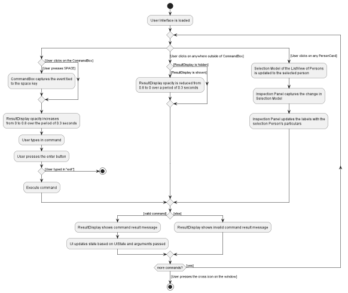

## Project: SectresBook

SectresBook helps secretaries to maintain all the information of the members of their club by collating a list of identifiable information, past loan records and future tasks.

Given below are my contributions to the project.

### New Features Implemented
1\. **_Loan Property of a Person_**
* **What it does**: Implements the ability to track monetary amounts that are represented as loaned amounts. This property is used to keep track of a history of transactions.
* **Justification**: A treasurer requires the need to keep track of details of monetary transactions.
* **Highlights**: If the amount is positive, the amount is to be paid _by_ the person. If the amount is negative, the amount is to be paid _to_ the person.

2\. **_User Interface Design_**
* **What it does**: Remodels the user interface as shown in the landing page. It contains 4 main sections, the command text field, the horizontal person card list, the vertical notes list and the inspection panel. Various small icons, images, alignment details and transitions are also applied for visual enhancement.
* **Justification**: The previous UI design did not look appealing, so a more visually appealing design was created
* **Highlights**: When combined with the Loans History, containing the records of increments and UI Inspect section of loan history, the loan object can be represented to show monetary amounts. Other features I implemented work on top of the same UI that I designed.

3\. **_Inspect command_**
* **What it does**: Inspects a person in the person's list. Inspection is a UI-centric command that updates the UI values shown. It does not mutate any data in the model. This is also equivalent to just click on the person card, which does exactly the same thing. Inspection can be performed using NAME or INDEX.
* **Justification**: The UI requires more flexibility when coupled with the CLI, there shouldn't be things that the GUI can do that the CLI cannot, so the `inspect` command was created.
* **Highlights**: `inspect Alex` or `inspect 1` where Alex is at the first index will populate the Inspection Panel with data of the person, such as name, phone number, birthday, etc.

4\. **_Hide Notes Panel Command_**
* **What it does**: Hides the notes panel by applying a translational transition with a fade transition to the StackPane containing the notes panel. 
* **Justification**: It is difficult to view more than 6 people in the list at the same time especially if working on a monitor with a smaller resolution. By hiding the notes panel, the people panel becomes wider, allowing for the use of more screen real estate.
* **Highlights**: The transition effect looks nice. All other elements maintain its aspect through ratio instead of absolute values. The inspect panel is also maintains equal division between the basic information and the loan history by a ratio. `hideNotes` to hide the notes panel.

5\. **_Show Notes Panel Command_**
* **What it does**: The opposite of hiding the notes panel. Fades the notes panel in while translating the vertical anchor to the left from 1.0 to 0.6 to slide the notes panel in.
* **Justification**: If this did not exist, short of restarting the program, there is no way to bring the notes panel back. This provides the inverse functionality of hiding the notes panel.
* **Highlights**: The transition effect looks nice. `showNotes` to show the notes panel.

6\. **Edit By Name**
* **What it does**: Adding onto the ability to edit by index, I implemented an ability to edit by any keyword of the person's name. This makes it more convenient to specify edit operations without checking for name
* **Justificaton**: It is easier to recall a person's name than to read the index from the list.
* **Highlights**: `edit NAME ` + any field specifier and change of property will edit by name just as easily as edit by index. The concept introduced to create this ability is ricocheted in many other features authored by other members, which now also include the ability to perform operations by name.

### Code contributed:

[RepoSense link](https://nus-cs2103-ay2223s1.github.io/tp-dashboard/?search=w12&sort=groupTitle&sortWithin=title&timeframe=commit&mergegroup=&groupSelect=groupByRepos&breakdown=true&checkedFileTypes=docs~functional-code~test-code~other&since=2022-09-16&tabOpen=true&tabType=authorship&tabAuthor=rui-han-crh&tabRepo=AY2223S1-CS2103T-W12-2%2Ftp%5Bmaster%5D&authorshipIsMergeGroup=false&authorshipFileTypes=docs~functional-code&authorshipIsBinaryFileTypeChecked=false&authorshipIsIgnoredFilesChecked=false)

### Project management:
* Called meetings to discuss plans.
* Provided feedback on Github PRs and organised issues with tags.
* Created milestones and description of milestones.

### Contributions to team-based tasks:

* Setting up the GitHub team org/repo
* Changed the product icon to the current version (ledger with pen) using GIMP
* Managed the usage of fonts (Bender and MinionPro)
* Maintaining the issue tracker, marked duplicate bugs after the PE-D, separated true bugs from feature flaws, and trimmed the bug count to related to unique issues only.
* Released version v1.3.1 for PE-D and fixed 16 bugs after PE-D

### Review/mentoring contributions:

* Reviewed contributions by other group members, giving suggestions for improvement
  * Correcting regex expressions
  * Suggesting a better way to provide the same functionality by refactoring code
  * Suggesting the usage of streams over declarative loops to increase readability
* Gave comments on suggestions for bug fixes in the issues tab
  * Wrote the probable cause of bug issues and the suggested fix for bug issues
  * Tested for bugs and published issues based on bugs found in the issues sections.

### Contributions beyond the project team:

* Frequently posted in the forums during the month of September to help other on iP related issues, such as setting the background, smoke testing and basic feature development.
* During the PE-D, authored issues based on the structure of `Description`, `Steps to reproduce` and `Suggestion`, making the issues clear and reproducible and providing a starting point for any potential fixes.

-------------------

### Contributions to the UG:

1\. Added images and icons (UI image, person card image, note card image, icons used throughout the program and the filtered icon)

2\. Added the User Interface section of the UG with pointers to which part corresponds to what function and usage. [Link to UI section](#https://ay2223s1-cs2103t-w12-2.github.io/tp/UserGuide.html#user-interface)

3\. Added description of properties for both people and notes in the UG. The entire section can be found [here](#https://ay2223s1-cs2103t-w12-2.github.io/tp/UserGuide.html#properties)

4\. Added description of command [`inspect`](https://ay2223s1-cs2103t-w12-2.github.io/tp/UserGuide.html#inspecting-a-person--inspect), [`hideNotes`](https://ay2223s1-cs2103t-w12-2.github.io/tp/UserGuide.html#hiding-notes-panel--hidenotes) and [`showNotes`](https://ay2223s1-cs2103t-w12-2.github.io/tp/UserGuide.html#showing-notes-panel--shownotes) (links to document section included).

5\. Improved description and detail of the UG by writing more complete sentences

6\. Corrected some English terms

7\. Added [Glossary](https://ay2223s1-cs2103t-w12-2.github.io/tp/UserGuide.html#glossary) terms.

### Contributions to the DG:

1\. Added Edit sequence diagram involving either searching by index or by name

2\. Added Sequence diagram for the `inspect` command

3\. Wrote the section involving [UI design](https://ay2223s1-cs2103t-w12-2.github.io/tp/DeveloperGuide.html#ui-features)

4\. Wrote the section involving implementation of [`inspect`](https://ay2223s1-cs2103t-w12-2.github.io/tp/DeveloperGuide.html#inspect-feature), [`showNotes` and `hideNotes`](https://ay2223s1-cs2103t-w12-2.github.io/tp/DeveloperGuide.html#showing-and-hiding-the-notes-panel-feature)

5\. UI activity diagram that describes how a user would interact with the UI

6\. Updated the UI Class Diagram to reflect the current state of the UI organisation.

7\. Updated the Person Class Diagram by adding the loans property to the Person Class Diagram

