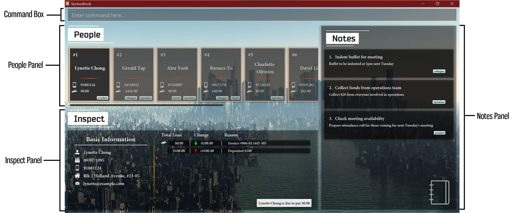
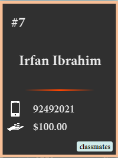
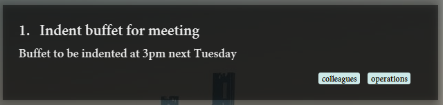
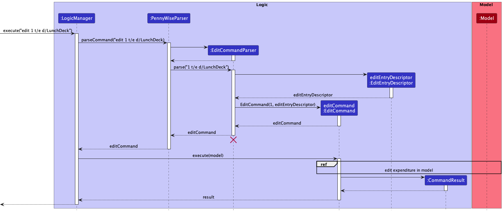
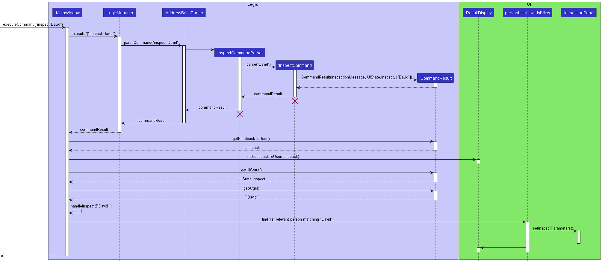
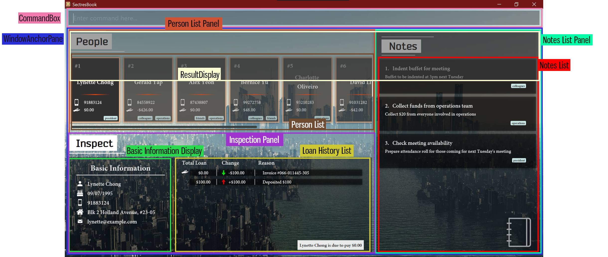

# Project: SectresBook

SectresBook helps secretaries to maintain all the information of the members of their club by collating a list of identifiable information, past loan records and future tasks.

Given below are my contributions to the project.

## New Features Implemented
1. **_Loan Property of a Person_**
   * **What it does**: Implements the ability to track monetary amounts that are represented as loaned amounts. If the amount is positive, the amount is to be paid _by_ the person. If the amount is negative, the amount is to be paid _to_ the person.
   * **Justification**: A treasurer requires the need to keep track of details of monetary transactions.
   * **Highlights**: When combined with the Loans History, containing the records of increments and UI Inspect section of loan history, the loan object can be represented to show monetary amounts. 
   * **Credits**: Loan (Rui Han), Loan Histories (Neethesh), Loan Inspection in UI (Rui Han)
  
   

2. **_User Interface Design_**
   * **What it does**: Remodels the user interface as shown in the landing page. It contains 4 main section, the text field, the horizontal person card list, the vertical notes list and the inspection panel which updates based on the person inspected. Various small icons, images, alignment details and transitions are also applied for visual enhancement.
   * **Justification**: The previous UI design did not look appealing, so a more visually appealing design was created
   * **Highlights**: When combined with the Loans History, containing the records of increments and UI Inspect section of loan history, the loan object can be represented to show monetary amounts. Other features I implemented work on top of the same UI that I designed.
   * **Credits**: Rui Han

   

3. **_Inspect command_**
   * **What it does**: Inspects a person in the person's list. Inspection is a UI-centric command that updates the UI values shown. It does not mutate any data in the model. This is also equivalent to just click on the person card, which does exactly the same thing. Inspection can be performed using NAME or INDEX.
   * **Justification**: The UI requires more flexibility when coupled with the CLI, there shouldn't be things that the GUI can do that the CLI cannot, so the `inspect` command was created.
   * **Highlights**: `inspect Alex` or `inspect 1` where Alex is at the first index will populate the Inspection Panel with data of the person, such as name, phone number, birthday, etc.
   * **Credits**: Rui Han

   

4. **_Hide Notes Panel Command_**
   * **What it does**: Hides the notes panel by applying a translational transition with a fade transition to the StackPane containing the notes panel. The UI uses anchor pane with a Vertical anchor point and a horizontal anchor point shared by all 3 components of the UI (People List, Inspect Panel and Notes Panel). The translation is applied through interpolating the vertical anchor point from 0.6 to 1 such that it moves from the original position to the right side of the screen. This pushes the notes panel to the right side and, at the same time, elongates and pulls the people panel and inspect panel to the right. 
 To maintain the aspect of the panel, a difference in initial left and right anchor point of the Notes Stackpane is calculated and maintained through the translation. The fade transition simply reduces the opacity of the entire pane to zero. This creates the effect of hiding the panel.
   * **Justification**: Because the person panel is horizontally scrolling, it is difficult to view more than 6 people in the list at the same time especially if working on a monitor with a smaller resolution. By hiding the notes panel and pulling the vertical anchor to the right, the people panel becomes wider, allowing for the use of more relevant screen real estate. The inspect panel is also elongated but is also an anchorpane itself, so it maintains equal division between the basic information and the loan history by a ratio.
   * **Highlights**: The transition effect looks nice. All other elements maintain its aspect through ratio instead of absolute values. `hideNotes` to hide the notes panel
   * **Credits**: Rui Han

   

5. **_Show Notes Panel Command_**
   * **What it does**: The opposite of hiding the notes panel. Fades the notes panel in while translating the vertical anchor to the left from 1.0 to 0.6 to slide the notes panel in.
   * **Justification**: If this did not exist, short of restarting the program, there is no way to bring the notes panel back. This provides the inverse functionality of hiding the notes panel.
   * **Highlights**: The transition effect looks nice. `showNotes` to show the notes panel.
   * **Credits**: Rui Han
     
   

## Code contributed: 

[RepoSense link](https://nus-cs2103-ay2223s1.github.io/tp-dashboard/?search=w12&sort=groupTitle&sortWithin=title&timeframe=commit&mergegroup=&groupSelect=groupByRepos&breakdown=true&checkedFileTypes=docs~functional-code~test-code~other&since=2022-09-16&tabOpen=true&tabType=authorship&tabAuthor=rui-han-crh&tabRepo=AY2223S1-CS2103T-W12-2%2Ftp%5Bmaster%5D&authorshipIsMergeGroup=false&authorshipFileTypes=docs~functional-code&authorshipIsBinaryFileTypeChecked=false&authorshipIsIgnoredFilesChecked=false)

   

## Project management:
  * Called meetings to discuss plans. 
  * Provided feedback on Github PRs.
  * Organised issues and distributed them to group members.
  * Created milestones and description of milestones.
  * Applied strong version control through the use of Pull Requests and merging into an upstream repo.

   

## Enhancements implemented:
  * **Feature**: Edit By Name
  * What it does: Adding onto the ability to edit by index, I implemented an ability to edit by any keyword of the person's name. This uses the `FindCommand` to first find by name and ensure that only 1 person exists from the result of finding the keyword. After this, the first index is fetched, which must correspond to a unique person found. Otherwise, if more than 1 person is found or no persons are found, the edit command will halt its operation, display the filtered list of persons returned and feedbacks to the user the people found.
  * Justificaton: It is easier to recall a person's name than to read the index from the list.
  * Highlights: `edit NAME ` + any field specifier and change of property will edit by name just as easily as edit by index. The concept introduced to create this ability is ricocheted in many other features authored by other members, which now also include the ability to perform operations by name.
  * Credits: Rui Han

   

## Contributions to team-based tasks:

* Setting up the GitHub team org/repo
* Changed the product icon to the current version (ledger with pen) using GIMP
* Managed the usage of fonts (Bender and MinionPro)
* Maintaining the issue tracker, marked duplicate bugs after the PE-D, separated true bugs from feature flaws, and trimmed the bug count to related to unique issues only.
* Released version v1.3.1 for PE-D
* Fixed 16 bugs after PE-D

   

## Review/mentoring contributions:

* Reviewed contributions by other group members, giving suggestions for improvement
    * Correcting regex expressions
    * Suggesting a better way to provide the same functionality by refactoring code
    * Suggesting the usage of streams over declarative loops to increase readability
* Gave comments on suggestions for bug fixes in the issues tab
    * Wrote the probable cause of bug issues
    * Wrote the suggested fix for bug issues
    * Tested for bugs myself, using the ideas for the same bugs found during the PE-D test for another group, and published issues based on bugs found in the issues sections (not opening on Ubuntu 22.04, double parsing issue for values greater than or equals to 1.0E^7)

   

* **Contributions beyond the project team**:
* Frequently posted in the forums during the month of September to help other on iP related issues, such as setting the background, smoke testing and basic feature development.
* During the PE-D, authored issues based on the structure of `Description`, `Steps to reproduce` and `Suggestion`, making the issues clear and reproducible and providing a starting point for any potential fixes.

-------------------

## Contributions to the UG:

1. Added images and icons (UI image, person card image, note card image, icons used throughout the program and the filtered icon)

2. Added the User Interface section of the UG with pointers to which part corresponds to what function and usage. [Link to UI section](#https://ay2223s1-cs2103t-w12-2.github.io/tp/UserGuide.html#user-interface)

Text Extract:

------

## User Interface

Here is an overview of the User Interface (UI) components.

The UI comprises four sections:

### Command Box

The Command Box is where you type in your command inputs. For more information on command inputs, refer to Features below.

Once the command box is selected, a results display will appear to report the status of the program to you. Error messages and success messages will be shown in this box. Click anywhere else on the screen, or press the `ESC` key to exit the command box and hide the results display.

  

Results Display.

 

:bulb: **Tip:**
You may activate the command box by simply pressing the spacebar on your keyboard. There is no need to use your mouse to click on the bar.

:bulb: **Tip:**
Similarly, you may press the `ESC` key on your keyboard to exit out of the command box and hide the results display.

### People Panel

The People Panel contains all the club and organisation members you have registered in this book. They are laid out horizontally. You can scroll the list by hovering your mouse over the People Panel and scrolling the mouse-wheel, or by clicking on and dragging the horizontal scroll bar to scroll.

Each card represents a person and displays their name, phone number and total present loan amount. The loan amount may be positive to indicate an amount owed by the person, or negative to indicate an amount due to be paid to the person.

  

A person card.

The index of the person only applies to the currently displayed list, it is **not** tied to the person itself.

Check Person Features to learn more about the commands you can execute related to people.

### Inspect Panel

The Inspect Panel is related to the People Panel and shows the basic information of the currently inspected person. A person can be inspected by either clicking on his or her card, or by using the `inspect` command.

The left side of the Inspect Panel shows the basic information, while the right side shows the history of loan transactions.

Note that the transaction record next to the icon of the hand holding coins is the most recent, and the earlier transactions are listed below.

The total amount of the loans is also stated in the right of this panel, describing in fuller detail if the sum is owed by or to be paid to the person.

### Notes Panel

This Notes Panel stores all the information related to notes and tasks that the user may want to keep track of.

Each note contains an index, a title, contents and tags.

  

A note card.

The index of the notes only applies to the currently displayed list, it **is not** tied to the note itself.

Both the People Panel and Notes Panel share a pool of tags to more easily relate a group of people to a specific note.

Check Notes Features to learn more about the commands you can execute related to notes.

--------------

 

3. Added description of properties for both people and notes in the UG.

This section is too long to be reproduced in entirety. Here is an example of the person property `email` extracted. The entire section can be found [here](#https://ay2223s1-cs2103t-w12-2.github.io/tp/UserGuide.html#properties)

Text extract:

-------

### Email

This pertains to the email address of the person to be recorded in the SectresBook. It serves mainly as a point of information regarding the person, but has no additional features tied to it.

This property can be identified from the GUI by the icon of an envelope.

- Identified by the prefix `email`.
- Emails should be of the format `local-part@domain` and adhere to the following constraints:

Part    | Constraint |
|---------|----------|
Local part |                                                                              The local-part should only contain alphanumeric characters and these special characters `_`, `.`, `+` and `-`.   The local-part may not start or end with any special characters and special characters may not be adjacent to each other.
Domain name |The domain name is made up of domain labels separated by periods. The domain name must:
 - end with a domain label at least 2 characters long  - have each domain label start and end with alphanumeric characters   - have each domain label consist of alphanumeric characters, separated only by hyphens, if any.

The local part and domain part **must** be connected by a `@` symbol.

 

4. Added description of command [`inspect`](https://ay2223s1-cs2103t-w12-2.github.io/tp/UserGuide.html#inspecting-a-person--inspect), [`hideNotes`](https://ay2223s1-cs2103t-w12-2.github.io/tp/UserGuide.html#hiding-notes-panel--hidenotes) and [`showNotes`](https://ay2223s1-cs2103t-w12-2.github.io/tp/UserGuide.html#showing-notes-panel--shownotes) (links to document section included).

`inspect` text extracted (images removed):

-------

#### Inspecting a person : `inspect`

Updates the Inspect Panel with the basic information and loan history of the person inspected.

Inspection is a UI-centric command that operates on the current filtered person’s list, so you may only inspect those that are presently listed.

If you wish to view the properties of anyone in the full list, please remember to specify `list` to clear the filter.

:information_source: **Note:**
If there are multiple people in the list satisfying the keywords given, it will, by default, inspect the first person that matches the keywords.

You may wish to use more unique keywords to reduce ambiguity, or inspect by an index.

Format: `inspect INDEX <OR> NAME`

Examples:
* `inspect 2` inspects the second person in the list of people
* `inspect Lynette` will attempt to find the first person called `Lynette` in the currently **filtered** persons' list and update the Inspect Panel with her information.

------

The text for `showNotes` and `hideNotes` are not remarkable enough to be extracted here.

5. Improved description and detail of the UG by writing more complete sentences 
6. Corrected some English terms
7. Added Glossary terms

Glossary text extracted:

------

Word | Definition
--------|------------------
**Command Line Interface (CLI)** | A text-based interface that recieves typed commands as input and returns textual feedback as output.
**Graphical User Interface (GUI)** | An image-based interface that is more visually appealing than a command-line interface and encapsulates information through the use icons and images.
**Loan** | An amount of money that is borrowed by or owed to a person. A positive value signifies an amount owed by the person and a negative value signifies an amount to be paid to that person.
**Parameter** | A value passed as a section of a command, typically following a prefix.
**Prefix** | A signposting word that indicates the kind of property (i.e. name, email, address, etc), which typically follows immediately after the prefix, that is to be passed as a parameter.
**Property** | An identifiable feature a person or object has that sufficiently distinguishes it from other objects of the same kind.
**Secretary** | A person that manages the tasks and events related to the operations of an organisation.
**Tag** | A label that groups related people together, such that they can be referred to as a single encapsulated entity specified by the tag.
**Treasurer** | A person that manages the finances and monetary transactions related to the operations of an organisation.

</blockquote>

----------------------------------------
   

### Contributions to the DG:

1. Added Edit sequence diagram involving either searching by index or by name

2. Added Sequence diagram for the `inspect` command

3. Wrote the section involving UI design

----------------------

### General UI Design and Mechanism

#### Implementation

During the creation of the new UI, a lot of the FXML structure and the relationships between containers of the UI had to be refactored.

The UI is divided into 2 major sections - one occupied by the `CommandBox` and another occupied by the `WindowAnchorPane`.

The `WindowAnchorPane` consists of an StackPane.
- The `ResultDisplay` is in the first layer
  - The `PersonListPanel`, `InspectionPanel` and the `NotesListPanel` are in the second layer below.

The `ResultDisplay` is _click-through_ (does not capture any mouse clicks) and normally has an opacity of 0, so it is effectively hidden.

The `InspectionPanel` is another anchor pane divided into two left and right elements:
- A basic information `HBox` on the left
  - A loan history list view display on the right

These two elements in the `InspectionPanel` will always maintain the same ratio, basic information to loan history list view, of 2:3.

When the user clicks the `CommandBox` or presses the `SPACE` key, this triggers an event on the `CommandBox` that invokes a transition to the `ResultDisplay` to show the display. As it is on the first layer, the `ResultDisplay` will partially cover the elements below it.

Note that the `ResultsDisplay` never reach full opacity, instead an opacity of 0.8 allows the elements below to be partially visible.

Here are the anchor points of the three major panes within the second layer of `WindowAnchorPane`:

- The `PersonListPanel` has a left anchor of `0`, top anchor of `0`, right anchor of `0.6` with respect to window width (starting from left) and bottom anchor of `0.45` with respect to window height (starting from top).
  - The `InspectionPanel` has a left anchor of `0`, top anchor of `0.45`, right anchor of `0.6` with respect to window width (starting from left) and bottom anchor of `0` with respect to window height (starting from top).
  - The `NotesListPanel` has a left anchor of `0.6`, top anchor of `0`, right anchor of `0` with respect to window width (starting from left) and bottom anchor of `0` with respect to window height (starting from top).

The arbitrary values above are actually boundaries shared by the three panels and may be manipulated to change the view of the three major elements together. We may imagine the `PersonListPanel` to be glued to the `NotesListPanel` on its right and the `InspectionPanel` below, likewise for the other two elements. This allows the ratios to be adjusted together by simply change the vertical anchor or horizontal anchors.

The Observer Pattern is prevalent throughout the UI design in order to update other components in response to any change to the UI. One such example is the [`inspect` command](#inspect-feature).

#### Design Considerations

As the main window of the application is resizable, the ratio of the anchors maintains the aspect of each panel with respect to the window size (unlike constant values which will not change according to window size).

The resizing is handled through the _Observer Pattern_, thankfully existing by default in JavaFX, which updates the proportions of the components upon any change to the height or width of the window.

The main problem came from estimating the correct current space allocated by the window size.

As the three main components are within the `WindowAnchorPane`, and the `WindowAnchorPane` shares its space with an unnamed `StackPane` described by the structure above, this meant that the `WindowAnchorPane` has less space than the actual window size. To make things worse, JavaFX overestimates the actual scene proportions in relation to the window size.

A padding of around 200px was used to help `WindowAnchorPane` displace it's top height to the true position it is at and a bottom padding of 20px was added to give some room from the bottom of the window. The height and width passed into function resizing the anchor panes must always be adjusted according the scene size and the offsets.

A visual defect exists when the screen size exceeds 1080p, as the Inspection Panel is no longer able to stay attached to the anchor point at the bottom of the screen. This defect worsens as the window gets taller.

---------------------

 

4. UI activity diagram that describes how a user would interact with the UI

5. Updated the UI Class Diagram to reflect the current state of the UI organisation.

7. Updated the Person Class Diagram by adding the loans property to the Person Class Diagram

7. Wrote the section involving `inspect`, `showNotes` and `hideNotes`

-------------------------

### Inspect Feature

#### Implementation

The inspect command is a UI-Centric command that controls which person's details are currently shown in the inspection panel.

This is functionally similar to clicking on a person's card, which also updates the information in the inspection panel.

This features uses an Observer on the `SelectionModel` of the `ListView` of persons, updating the `InspectionPanel` whenever a new person is selected.

Step 1. The user executes `'inspect David'` command to view the details of David.

Step 2. An `InspectCommandParser` is parsed with `David`.

Step 3. The `InspectCommand` is created containing a keyword `David`.

Step 4. The `InspectCommand` is executed and a `CommandResult` is created with the `UiState` `inspect` and arguments `David`.

Step 5. The `MainWindow` is receives the `CommandResult` and reads the `UiState` part of the result. This directs it to update the inspect panel.

Step 6. The Person List is retrieved from the `MainWindow` and its selection model is accessed. From here, if the given argument is a number, we will index the person through the order in the list. Otherwise, we will search through the entire list until first person matching the keywords is returned.

Step 7. The Inspection Panel is retrieved from the main window and has its properties updated from the person's information that was returned.

The following sequence diagram shows how the find command works:

:information_source: **Note:** The lifeline for `InspectCommandSequence` and `InspectCommand` should end at the destroy marker (X) but due to a limitation of PlantUML, the lifeline reaches the end of diagram.

#### Design considerations:

**Aspect: How find to design a UI command**

Unlike other command, this command does not mutate any underlying data. One challenge is that the execution flow is different from other commands which mutate data, making the implementation less direct.

We had to find a good insertion point where the information carried from the user input could be used in the program without the need for major refactoring. We realised that the user's input is first taken in through the `MainWindow` class, and through following the function calls, would be used in `MainWindow::executeCommand`. So the inspection operation is effectively added at the end of the executeCommand just before it terminates.

The procedures for `handleExit` and `handleHelp` were changed by refactoring `CommandResult` to carry an ideal state that the UI is expected to be in by the end of the execution. A switch statement was added to the bottom of the `executeCommand` function, much like how the normal commands are parsed, to deal with UI-Centric commands like `help`, `exit` and `inspect`.

### Showing and Hiding the Notes Panel Feature

#### Implementation

Here are the anchor points of the three major panes within the `WindowAnchorPane`:

- The `PersonListPanel` has a left anchor of `0`, top anchor of `0`, right anchor of `0.6` with respect to window width (starting from left) and bottom anchor of `0.45` with respect to window height (starting from top).
- The `InspectionPanel` has a left anchor of `0`, top anchor of `0.45`, right anchor of `0.6` with respect to window width (starting from left) and bottom anchor of `0` with respect to window height (starting from top).
- The `NotesListPanel` has a left anchor of `0.6`, top anchor of `0`, right anchor of `0` with respect to window width (starting from left) and bottom anchor of `0` with respect to window height (starting from top).

Notice that the `PersonListPanel` and `InspectionPanel` share a boundary of the ratio `0.45` with respect to the window height and the both of them share a boundary of `0.6` with respect to screen width with the `NotesListPanel`.

The command `hideNotes` is effectively accomplished by interpolating the ratios smoothly over time to create a sliding effect. To maintain the aspect ratio of the notes panel and prevent deformities, the right anchor interpolates from 0 to `0.6 - 1 = -0.4`, as the left anchor interpolates from `0.6` to `1`.

This maintains the constant size of `x0.4` with respect to window size during the transition.

A fading transition is applied across the same time to smoothly reduce the opacity of the panel.

The time interval set for this transition is `0.3` seconds.

The `showNotes` implementation is exactly the inverse of the `hideNotes` implementation across time.

#### Design considerations:

**Aspect: Challenges related to resizing**

Because hiding the notes panel will also pull the inspection panel longer, and that the inspection panel is divided into two parts itself, the `InspectionPanel` is also further another anchor pane that maintains the ratio of the width between the basic information display and the loans history property.

This concept was only implemented after the implementation of hideNotes, where visual inconsistencoes will start appearing due to disobeying the original ratio.

The padding of the `InspectionPanel` also causes an issue if the right anchor of the pane is not manipulated with the left anchor, as the padding will snap the left anchor to the right of the right anchor. This causes the `InspectionPanel` to be pulled through the entire width of the `NotesListPanel` cause the entire `WindowAnchorPane` to overflow its allocated width. The consideration to slide the right anchor at a constant difference with respect to the left anchor was introduced to combat this issue.

---------------------

   
