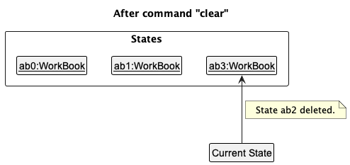
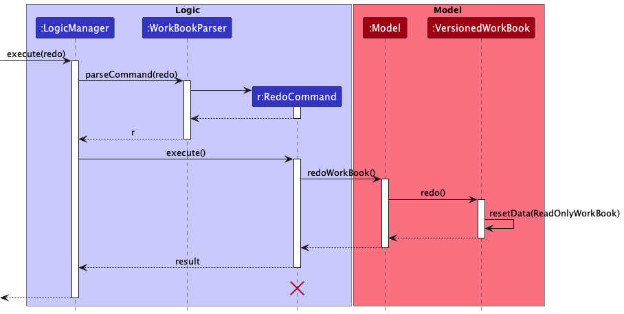

## Project: Workbook

### Overview

WorkBook is an internship application tracker that helps Computing students prepare sufficiently 
for their upcoming interviews to secure that internship. We also ensure that you never miss an 
interview or an application deadline ever again! 
Workbook is optimized for fast typists and utilizes a Command Line Interface (CLI) style while 
still having the benefits of a Graphical User Interface (GUI).

### Summary of Contributions

#### Code contributed
[View my contributions](https://nus-cs2103-ay2223s1.github.io/tp-dashboard/?search=tienyu2000&breakdown=true&sort=groupTitle&sortWithin=title&since=2022-09-16&timeframe=commit&mergegroup=&groupSelect=groupByRepos&checkedFileTypes=docs~functional-code~test-code~other)

#### Enhancements implemented

- Major enhancement: added the ability to `undo` previous <em>undoable</em> command
  - What it does: allows the user to undo previous <em>undoable</em> commands one at a time.
  - Justification: This feature significantly improves the product by providing the user with a convenient way to rectify mistakes in commands.
  - Highlights: This enhancement affected existing commands and was challenging to implement as it required changes to existing commands.

- Major enhancement: added the ability to `redo` previous `undo` command
  - What it does: allows the user to redo previous undo commands one at a time.
  - Justification: This feature significantly improves the product by providing the user with a convenient way to rectify mistakes in undo commands.
  
- Minor enhancement: added a delete command 
  - What it does: allow the user to delete an existing internship application
  - Justification: This feature allows the user to remove an existing internship application from the WorkBook.
    

#### Contributions to User Guide
- What you can do
  - Deleting your internship application:
  - Undoing your previous command:
  - Redoing your previous command:

#### Contributions to Developer Guide
- Design
  - Architecture
  - UI component
  - Logic component
  - Model component
  - Storage component
  - Common classes
- Implementation
  - Undo/Redo feature
- User Stories
  - As a student who constantly changes my mind, I want to redo an undone command so that I can revert
  back the changes I had originally made.
- Use cases
  - UC06 - Redo a command
- UML diagrams added/updated
  - Architecture diagram
  - Better model class diagram
  - Logic class diagram
  - Model class diagram
  - Storage class diagram
  - UI class diagram
  - Architecture sequence diagram
  - Undo sequence diagram
  - Redo sequence diagram
  - Delete sequence diagram
  - Parser classes
  - Commit activity diagram
  - Undo redo state 0
  - Undo redo state 1
  - Undo redo state 2
  - Undo redo state 3
  - Undo redo state 4
  - Undo redo state 5
  - Undo redo state 6

#### Contributions to team-based tasks 
- Added stage specific tips 
  - Application Sent
  - Application Rejected

#### Review/mentoring contributions 

#### Contributions beyond the project team
[Bugs reported in other team's products](https://github.com/tienyu2000/ped/issues)

#### Contributions to User Guide (Extracts)

#### Contributions to Developer Guide (Extracts)

1. Feature 
    #### Undo/Redo feature

    The undo feature allows for users to revert back to their previous undone state in the Workbook.
The redo feature complements the undo feature by allowing users to restore to its previous changed state following an undo command.

2. Implementation 
    #### Implementation

    The undo/redo mechanism is facilitated by `VersionedWorkBook`. It extends `WorkBook` with an undo/redo history, stored internally as an `workBookStateList` and `currentStatePointer`. Additionally, it implements the following operations:

   * `VersionedWorkBook#commit()` — Saves the current work book state in its history.
   * `VersionedWorkBook#undo()` — Restores the previous work book state from its history.
   * `VersionedWorkBook#redo()` — Restores a previously undone work book state from its history.

    These operations are exposed in the `Model` interface as `Model#commitWorkBook()`, `Model#undoWorkBook()` and `Model#redoWorkBook()` respectively.  

    Given below is an example usage scenario and how the undo/redo mechanism behaves at each step.  

    Step 1. The user launches the application for the first time. The `VersionedWorkBook` will be initialized with the initial work book state, and the `currentStatePointer` pointing to that single work book state.  

    Step 2. The user executes `delete 5` command to delete the 5th internship in the work book. The `delete` command calls `Model#commitWorkBook()`, causing the modified state of the work book after the `delete 5` command executes to be saved in the `workBookStateList`, and the `currentStatePointer` is shifted to the newly inserted work book state.  

    Step 3. The user executes `add c/COMPANY …​` to add a new internship. The `add` command also calls `Model#commitWorkBook()`, causing another modified work book state to be saved into the `workBookStateList`.   

    Step 4. The user now decides that adding the internship was a mistake, and decides to undo that action by executing the `undo` command. The `undo` command will call `Model#undoWorkBook()`, which will shift the `currentStatePointer` once to the left, pointing it to the previous work book state, and restores the work book to that state.  

    Step 5. The user now decides that undoing the added internship was a mistake, and decides to redo that action by executing the `redo` command. The `redo` command will call `Model#redoWorkBook()`, which will shift the `currentStatePointer` once to the right, pointing it to the previous undone work book state, and restores the work book to that state.  

    Step 6. The user then decides to execute the command `list`. Commands that do not modify the work book, such as `list`, will usually not call `Model#commitWorkBook()`, `Model#undoWorkBook()` or `Model#redoWorkBook()`. Thus, the `workBookStateList` remains unchanged.  

    Step 7. The user executes `clear`, which calls `Model#commitWorkBook()`. Since the `currentStatePointer` is not pointing at the end of the `workBookStateList`, all work book states after the `currentStatePointer` will be purged. Reason: It no longer makes sense to redo the `add c/COMPANY …​` command. This is the behavior that most modern desktop applications follow.  

    #### Design considerations:

    **Aspect: How undo & redo executes:**

   * **Alternative 1 (current choice):** Saves the entire work book.
     * Pros: Easy to implement.
     * Cons: May have performance issues in terms of memory usage.

   * **Alternative 2:** Individual command knows how to undo/redo by
     itself.
     * Pros: Will use less memory (e.g. for `delete`, just save the internship being deleted).
     * Cons: We must ensure that the implementation of each individual command are correct.

3. UML diagrams

