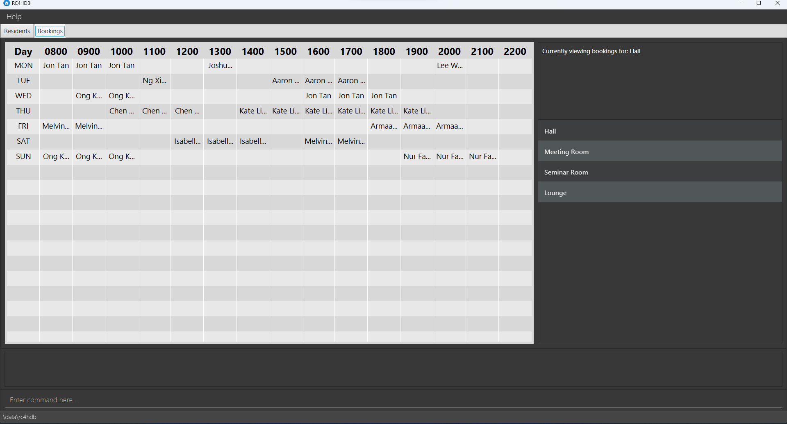

#### ← [Back to Menu](../UserGuide.md)

Along with the ability to manage residents, we have also provided you with the ability to manage
the venues in **RC4HDB** through a booking system. This will allow you to add, remove available venues, as well as
add, remove bookings for those venues.

---

### Viewing the bookings

To view the bookings, you will have to click on the tab labelled as bookings.

As you perform the booking commands, the table will automatically update to reflect the changes you have made.

:bulb: **Tip:**
If you are currently viewing a certain venue, and you have added a booking to another venue, or removed a booking
from another venue, the table will automatically switch to that venue's booking.
Alternatively, you can use the `venue view VENUE_NAME` command to switch manually.

---

:information_source: **Note:**
Before proceeding to learn more about venue commands, it would be good to have a quick read about the **venue fields**, which will
be used in the commands.

The venue fields can be found [here](#format-for-venue-fields).

[↑ Back to Top](#back-to-menu)

---

### Adding a venue : `venue add`

Adds a venue to the database.

Format: `venue add VENUE_NAME`

Examples:
* `venue add Meeting Room 3`
* `venue add Multi-purpose Hall `

[↑ Back to Top](#back-to-menu)

---

### Deleting a venue : `venue delete`

Deletes a venue from the database.

Format: `venue delete VENUE_NAME`

Examples:
* `venue delete Meeting Room`
* `venue delete Hall`

[↑ Back to Top](#back-to-menu)

---

### Viewing a venue : `venue view`

Displays all bookings for the specified venue.

Format: `venue view VENUE_NAME`

Examples:
* `venue view Meeting Room`
* `venue view Hall`

[↑ Back to Top](#back-to-menu)

---

### Adding a booking: `venue book`

Adds a booking to the specified venue, time period and day.

Format: `venue book INDEX v/VENUE_NAME tp/TIME_PERIOD d/DAY`

* Adds a booking under the resident specified at `INDEX`, at the specified `VENUE_NAME`, `TIME_PERIOD` and `DAY`.
* The index refers to the index number shown in the displayed residents list.
* The index **must be a positive integer** 1, 2, 3, …​

Examples:
* `venue book 2 v/Meeting Room tp/8-9 d/TUE`
* `venue book 1 v/Hall tp/13-14 d/WED`

[↑ Back to Top](#back-to-menu)

---

### Deleting a booking: `venue unbook`

Deletes a booking from the specified venue, time period and day.

Format: `venue unbook v/VENUE_NAME tp/TIME_PERIOD d/DAY`

Examples:
* `venue unbook v/Meeting Room tp/8-9 d/TUE`
* `venue unbook v/Hall tp/13-18 d/WED`

[↑ Back to Top](#back-to-menu)

---

### Format for Venue fields

`v/VENUE_NAME`
* The name displayed for the venue will be the exactly identical to the one specified in `VENUE_NAME`
* Can contain alphanumeric characters and whitespaces i.e. `m 3 3 t i n g r o o m` is valid
* Case-insensitive i.e. venues `Meeting Room` and `meeting room` are identical

`tp/TIME_PERIOD`
* The start time and end time must be separated by a hyphen *i.e. 8 to 9 must be indicated as `8-9`*
* Must begin and end on the hour *i.e. `1230-13` will not be accepted*
* Operates on a 24-hour format *i.e. `4p.m.` must be indicated as `16`*
* Valid booking hours are from `8` to `22`
* Blocks of time are allowed *i.e. `18-21` is accepted*
* The start time must be earlier than end time

`d/DAY`
* Must be the first three characters of a day *i.e. Monday must be indicated as mon*
* Case-insensitive *i.e. tUe, TUE, tue are all valid*

[↑ Back to Top](#back-to-menu)

---
