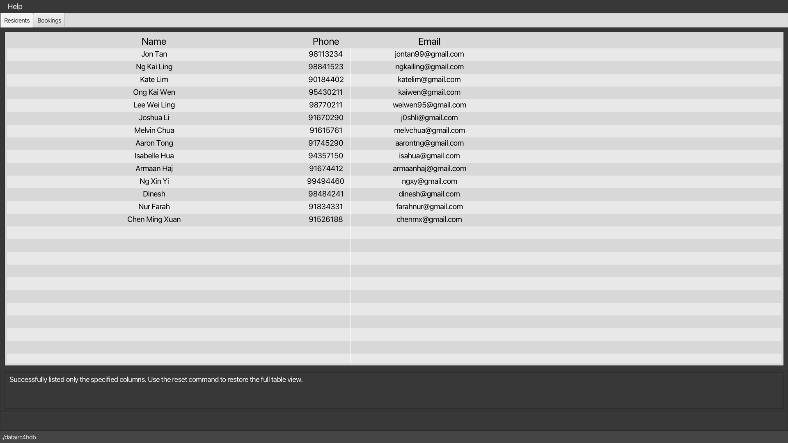
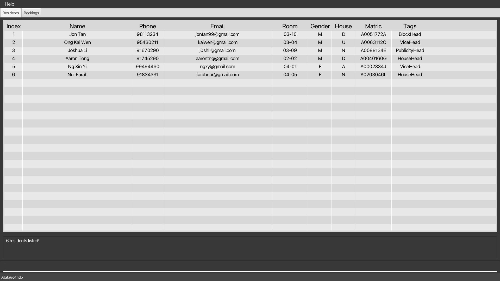

#### [Back to Menu](../UserGuide.md)

You might find yourself overloaded with information. These commands can help to include, and exclude
fields from being seen, find specific residents, and search residents whose fields match a specific keyword.

### Listing all residents : `list`

Lists *all* the residents in the **RC4HDB** database. If the table view is showing a filtered portion of the residents,
calling `list` will restore and display the full list of residents.

Additionally, you can specify fields (represented as columns) to be **included** or **excluded** as well!

This can be done using `list /i` or `list /e`.

Format:

- `list` to display *all* residents from the database with *all* columns included in the table.

   Calling `list` on our sample data will produce the following result:
   

- `list /i LETTER [MORE_LETTERS]` to display *all* residents in **RC4HDB** while **including** only the fields
   corresponding to the specified letters

- `list /e LETTER [MORE_LETTERS]` to display *all* residents in **RC4HDB** while **excluding** only the fields
   corresponding to the specified letters

  Calling `list /i n p e` or `list /e i r g h m t` would both produce the following result:

Examples:

- `list` returns a table of *all* residents from the database with *all* fields included in the view
- `list /i n p e` returns a table with only the *name*, *phone* and *email* fields included in the view
- `list /e r g h` returns a table with all fields except *room*, *gender* and *house* included in the view

Note:

- Each field to be included or excluded from the table should be entered as a *single letter*, that is,
  the first letter of the corresponding field name.
- The relative order of each letter *does not matter*, and the letters can be in either upper or lower case.
  Duplicate letters are ignored.
- Only letters corresponding to the first letter of a valid field in the table can be specified,
  *any other letter will be considered invalid*.
- Letters *must* be separated by a single whitespace.
- There needs to be at least one field (and hence column) included in the table view at all times.

:bulb: **Tip:**
*(For advanced users!)* The `list` command, as well as the `list /i` and `list /e` extensions, are 
[*idempotent*](glossary.md#idempotent) and [*state-independent*](glossary.md#state-independent). This means that
using the `list` command with a set of *(optional)* letters will return the same result regardless of what the current 
table looks like. Calling the same command again will not change the table view any further.

[↑ Back to Top](#back-to-menu)

 

---

### Showing only some columns : `showonly`

Shows only the specified columns in the **current** table view.

If your screen is too cluttered, you may use `showonly` to show only the columns you need! 
This command works similar to `list /i`, with two key differences:

1. You can only use `showonly` on existing columns in the current table view, and
2. The `showonly` command does not modify the list of residents being displayed. Filtered residents stay filtered!

Format: `showonly LETTER [MORE_LETTERS]`

Calling `filter g/M` (click [here](#filtering-residents-by-field--filter) to learn about `filter`) followed by `showonly n g h` will produce the following result:

As you can see,`showonly` works with a list of residents that have passed the filter! This is one way you can use our commands in conjunction with one another.

Examples **(sequential)**:

- `showonly n p e` on a full table returns a table with only the *name*, *phone* and *email* columns shown.
- Calling `showonly r g h` on the table from the previous point is **invalid** as the *room*, *gender* and 
  *house* columns are not shown in the present table.
- However, calling `showonly n e` on said table is **valid**, and will return a table with only the *name* and 
  *email* columns shown.

 
Note:

- Like in `list`, each column to be shown should be entered as a single letter that corresponds to the first 
  letter of the column to be shown.
- The relative order of each letter does not matter, and the letters can be in either upper or lower case. 
  Duplicate letters are ignored.
- Similarly, letters *must* be separated by a single whitespace.
- Only valid letters can be specified, and there needs to be at least one column shown in the table at all times.
- You can always `reset` the table to the full, default view at any time!

:bulb: **Tip:**
*(For advanced users!)* Notice that `showonly`, unlike `list /i`, is dependent on the state of the current table.
Hence, some calls to `showonly` may be invalid if the specified columns are not present in the current table view.

[↑ Back to Top](#back-to-menu)

 

---

### Hiding only some columns : `hideonly`

Hides only the specified columns in the **current** table view.

Use `hideonly` if there are more columns to show than hide. Like `showonly`, `hideonly` differs from `list` in the 
following ways:

1. You can only use `hideonly` on existing columns in the current table view, and
2. The `hideonly` command does not modify the list of residents being displayed. Residents found using `find` stay 
   displayed in the table!

Format: `hideonly LETTER [MORE_LETTERS]`

Examples **(sequential)**:

- `hideonly n p e m t` on a full table returns a table with only the *name*, *phone*, *email*, *matric* and *tags* 
  columns hidden. In other words, we get a table showing only the *index*, *room*, *gender* and *house* columns.
- Calling `hideonly n e` on the table from the previous point is **invalid** as the *name* and *email* columns are not 
  currently shown in the present table.
- However, calling `hideonly i h` on said table is **valid**, and will return a table with only the *room* and *gender*
  columns shown, as the *index* and *house* columns have been hidden.

Note:

- Like in `list`, each column to be hidden should be entered as a single letter that corresponds to the first letter 
  of the column to be shown.
- The relative order of each letter does not matter, and the letters can be in either upper or lower case. 
  Duplicate letters are ignored.
- Similarly, letters *must* be separated by a single whitespace.
- Only valid letters can be specified, and there needs to be at least one column shown in the table at all times.
- You can always `reset` the table to the full, default view at any time!

:bulb: **Tip:**
*(For advanced users!)* Notice that `hideonly`, unlike `list /i`, is dependent on the state of the current table. 
Hence, some calls to `hideonly` may be invalid if the specified columns are not present in the current table view.

[↑ Back to Top](#back-to-menu)

 

---

### Resetting hidden columns : `reset`

Resets the columns in the table to the default view with *all* columns visible.

Use this when you have called `showonly` or `hideonly` multiple times!

Format: `reset`

Note:
- Any input entered after the `reset` command will be ignored.
- This command is different from the `list` command in that it does not affect the list of residents being displayed.

[↑ Back to Top](#back-to-menu)

 

---

### Locating residents by name : `find`

Finds residents whose names contain any of the given keywords.

Format: `find NAME [ADDITIONAL_NAMES]`

* The search is case-insensitive. e.g `hans` will match `Hans`
* The order of the keywords does not matter. e.g. `Hans Bo` will match `Bo Hans`
* Only the name is searched.
* Full and partial words will be matched e.g. `Han` will match `Hans`
* Residents matching at least one keyword will be returned (i.e. `OR` search).
  e.g. `Hans Bo` will return `Hans Gruber`, `Bo Yang`

Calling `find mel` on our sample data will produce the following result:

As you can see, the resident with the name "Melvin" contains the string "mel", and thus would appear as one a result of the `find` command.

Examples:
* `find John` returns `john` and `John Doe`
* `find alex david` returns `Alex Yeoh`, `David Li`
* `find char li` returns `Charlotte Oliveiro`, `David Li` 
  <!---  --->

[↑ Back to Top](#back-to-menu)

 

---

### Filtering residents by field : `filter`

Shows a list of residents whose fields match the input keywords.

Format: `filter /SPECIFIER KEY/VALUE [ADDITIONAL_KEYS/ADDITIONAL_VALUES]`
* Filters will be applied based on the given `SPECIFIER` as well as `KEY/VALUE` pairs.
* `SPECIFIER`s will either be `/all` or `/any`. In the event that there are multiple `KEY/VALUE` pairs, 
  filters with the `all` specifier will only return results that satisfy **all** the keywords, while filters with the
  `any` specifier will return results that satisfy **any** of the keywords present.
* Valid keys are those included [here](./modifying-resident-data.md#format-for-resident-fields), and any additional tags.

Calling `filter /all t/Head` on our sample data will produce the following result:

As you can see, 

Examples:
* `filter /all h/D g/M` returns residents who are in Draco house, **and** are Male.
* `filter /any g/M t/Head` returns residents who have a tag corresponding to a head, **or** are male.

[↑ Back to Top](#back-to-menu)

---
