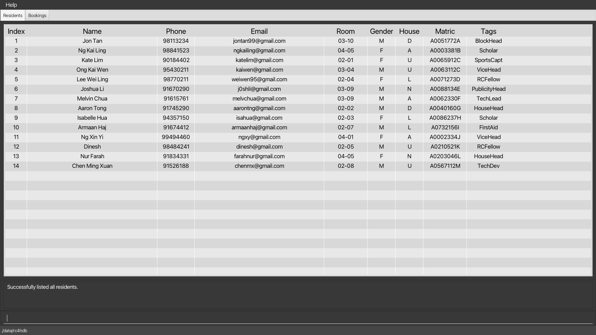
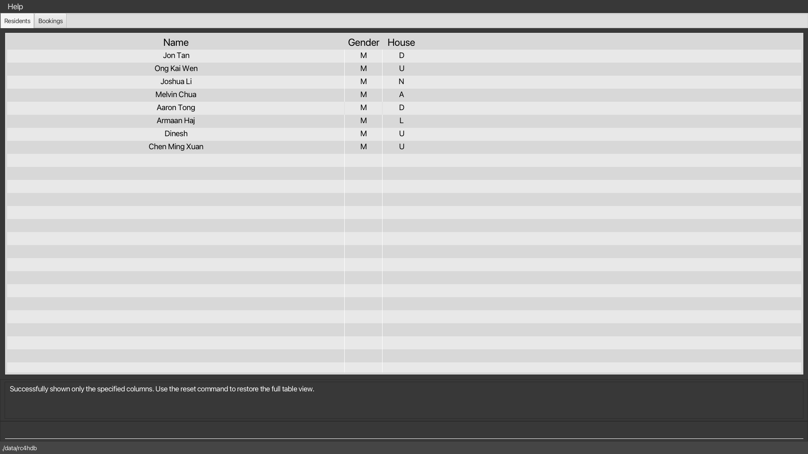
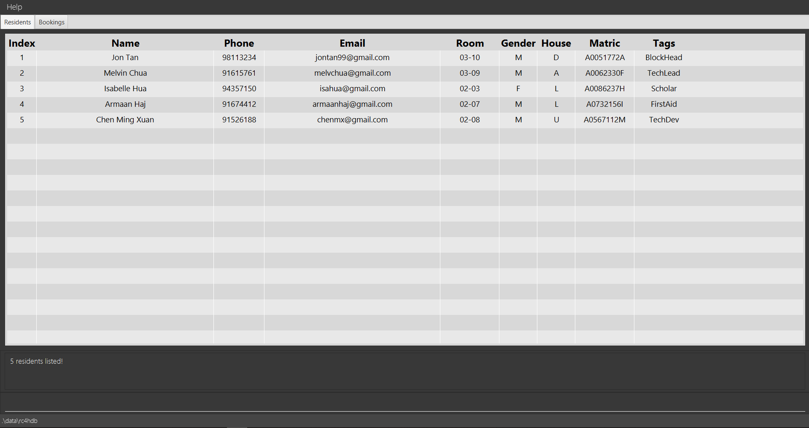

#### ← [Back to Menu](../UserGuide.md)

You might find yourself overloaded with information. These commands can help to include, and exclude
fields from being seen, find specific residents, and search residents whose fields match a specific keyword.

### Listing all residents : `list`

Lists *all* the residents in the **RC4HDB** database. If the table view is showing a filtered portion of the residents,
calling `list` will restore and display the full list of residents.

[comment]: <> (Additionally, you can specify fields &#40;represented as columns&#41; to be **included** or **excluded** as well!)

[comment]: <> (This can be done using `list /i` or `list /e`.)

Format:

- `list` to display *all* residents from the database with *all* columns included in the table.

   Calling `list` on our sample data will produce the following result:
   

[comment]: <> (- `list /i LETTER [MORE_LETTERS]` to display *all* residents in **RC4HDB** while **including** only the fields)

[comment]: <> (   corresponding to the specified letters)

[comment]: <> (- `list /e LETTER [MORE_LETTERS]` to display *all* residents in **RC4HDB** while **excluding** only the fields)

[comment]: <> (   corresponding to the specified letters)

[comment]: <> (  Calling `list /i n p e` or `list /e i r g h m t` would both produce the following result:)

[comment]: <> (![list command]&#40;../images/ug-photos/list_i_list_e_command.png&#41;)

Examples:

- `list` returns a table of *all* residents from the database with *all* fields included in the view

[comment]: <> (- `list /i n p e` returns a table with only the *name*, *phone* and *email* fields included in the view)

[comment]: <> (- `list /e r g h` returns a table with all fields except *room*, *gender* and *house* included in the view)

Note:

- Any input entered after the `list` command will be ignored.

[comment]: <> (- Each field to be included or excluded from the table should be entered as a *single letter*, that is, )

[comment]: <> (  the first letter of the corresponding field name.)

[comment]: <> (- The relative order of each letter *does not matter*, and the letters can be in either upper or lower case. )

[comment]: <> (  Duplicate letters are ignored.)

[comment]: <> (- Only letters corresponding to the first letter of a valid field in the table can be specified, )

[comment]: <> (  *any other letter will be considered invalid*.)

[comment]: <> (- Letters *must* be separated by a single whitespace. )

[comment]: <> (- There needs to be at least one field &#40;and hence column&#41; included in the table view at all times.)

[comment]: <> (
:bulb: **Tip:**)

[comment]: <> (*&#40;For advanced users!&#41;* The `list` command, as well as the `list /i` and `list /e` extensions, are )

[comment]: <> ([*idempotent*]&#40;glossary.md#idempotent&#41; and [*state-independent*]&#40;glossary.md#state-independent&#41;. This means that)

[comment]: <> (using the `list` command with a set of *&#40;optional&#41;* letters will return the same result regardless of what the current )

[comment]: <> (table looks like. Calling the same command again will not change the table view any further.)

[comment]: <> (
)

[↑ Back to Top](#back-to-menu)

 

---

### Showing only some columns : `showonly`

Shows only the specified columns in the **current** table view.

If your screen is too cluttered, you may use `showonly` to show only the columns you need! 
Take note that:

1. You can only use `showonly` on existing columns in the current table view, and
2. The `showonly` command does not modify the list of residents being displayed. Filtered residents stay filtered!

Format: `showonly LETTER [MORE_LETTERS]`

Calling `filter g/M` (click [here](#filtering-residents-by-field--filter) to learn about `filter`) followed by `showonly n g h` will produce the following result:

As you can see,`showonly` works with a list of residents that have passed the filter! This is one way you can use our commands in conjunction with one another.

Examples **(sequential)**:

- `showonly n p e` on a full table returns a table with only the *name*, *phone* and *email* columns shown.
- Calling `showonly r g h` on the table from the previous point is **invalid** as the *room*, *gender* and 
  *house* columns are not shown in the present table.
- However, calling `showonly n e` on said table is **valid**, and will return a table with only the *name* and 
  *email* columns shown.

 
Note:

- Each column to be shown should be entered as a single letter, e.g. `n p e` that corresponds to the first 
  letter of the field in the column. This is in contrast to the prefixes, e.g. `n/`, `p/`, used in `add` or `filter`.
- The relative order of each letter does not matter, and the letters can be in either upper or lower case. 
  Duplicate letters are ignored.
- Similarly, letters *must* be separated by a single whitespace.
- Only valid letters can be specified, and there needs to be at least one column shown in the table at all times.
- You can always `reset` the table to the full, default view at any time!

[comment]: <> (
:bulb: **Tip:**)

[comment]: <> (*&#40;For advanced users!&#41;* Notice that `showonly`, unlike `list /i`, is dependent on the state of the current table.)

[comment]: <> (Hence, some calls to `showonly` may be invalid if the specified columns are not present in the current table view.)

[comment]: <> (
)

[↑ Back to Top](#back-to-menu)

 

---

### Hiding only some columns : `hideonly`

Hides only the specified columns in the **current** table view.

Use `hideonly` if there are more columns to show than hide. 
As with `showonly`, take note that:

1. You can only use `hideonly` on existing columns in the current table view, and
2. The `hideonly` command does not modify the list of residents being displayed. Residents found using `find` stay 
   displayed in the table!

Format: `hideonly LETTER [MORE_LETTERS]`

Examples **(sequential)**:

- `hideonly n p e m t` on a full table returns a table with only the *name*, *phone*, *email*, *matric* and *tags* 
  columns hidden. In other words, we get a table showing only the *index*, *room*, *gender* and *house* columns.
- Calling `hideonly n e` on the table from the previous point is **invalid** as the *name* and *email* columns are not 
  currently shown in the present table.
- However, calling `hideonly i h` on said table is **valid**, and will return a table with only the *room* and *gender*
  columns shown, as the *index* and *house* columns have been hidden.

Note:

- Each column to be hidden should be entered as a single letter, e.g. `r m g h` that corresponds to the first
  letter of the field in the column. This is in contrast to the prefixes, e.g. `r/`, `h/`, used in `edit` or `filter`.
- The relative order of each letter does not matter, and the letters can be in either upper or lower case. 
  Duplicate letters are ignored.
- Similarly, letters *must* be separated by a single whitespace.
- Only valid letters can be specified, and there needs to be at least one column shown in the table at all times.
- You can always `reset` the table to the full, default view at any time!

[comment]: <> (
:bulb: **Tip:**)

[comment]: <> (*&#40;For advanced users!&#41;* Notice that `hideonly`, unlike `list /i`, is dependent on the state of the current table. )

[comment]: <> (Hence, some calls to `hideonly` may be invalid if the specified columns are not present in the current table view.)

[comment]: <> (
)

[↑ Back to Top](#back-to-menu)

 

---

### Resetting hidden columns : `reset`

Resets the columns in the table to the default view with *all* columns visible.

Use this when you have called `showonly` or `hideonly` multiple times!

Format: `reset`

Note:
- Any input entered after the `reset` command will be ignored.
- This command is different from the `list` command in that it does not affect the list of residents being displayed.
However, both commands cause the full set of resident fields to be displayed in the table.

[↑ Back to Top](#back-to-menu)

 

---

### Locating residents by name : `find`

Finds residents whose names contain any of the given keywords.

Format: `find NAME [ADDITIONAL_NAMES]`

* The search is case-insensitive. e.g `hans` will match `Hans`
* The order of the keywords does not matter. e.g. `Hans Bo` will match `Bo Hans`
* Only the name is searched.
* Full and partial words will be matched e.g. `Han` will match `Hans`
* Residents matching at least one keyword will be returned (i.e. `OR` search).
  e.g. `Hans Bo` will return `Hans Gruber`, `Bo Yang`

Calling `find mel` on our sample data will produce the following result:

As you can see, the resident with the name "Melvin" contains the string "mel", and thus would appear as one a result of the `find` command.

Examples:
* `find John` returns `john` and `John Doe`
* `find alex david` returns `Alex Yeoh`, `David Li`
* `find char li` returns `Charlotte Oliveiro`, `David Li` 
  <!---  --->

[↑ Back to Top](#back-to-menu)

 

---

### Filtering residents by field : `filter`
Shows a list of residents whose fields match the input keywords.

Format: `filter [/SPECIFIER] KEY/VALUE [ADDITIONAL_KEYS/ADDITIONAL_VALUES]`

* The default specifier, if not specified by the user is `/all`.
* A specifier is required in order for the command to work. If not it is an invalid command format
* Currently, only two specifiers are supported:
  * `/all` returns a resident if it fulfills **all** of the specified keywords.
  * `/any` returns a resident if it fulfills **any** of the specified keywords.
* Repeated keys are not permitted for `/all` specifier, e.g. `filter /all h/D h/A` will not work.
* Repeated keys are not permitted for both specifiers, e.g. `filter /all h/D h/A` will not work.
* However, tags can be repeated in the command e.g. `filter /all t/exhange t/fresher`
* Valid keys are those included [here](#format-for-resident-fields), and any additional tags.

Examples:
* `filter /all h/D g/M` returns residents who are in Draco house, **and** are Male.
* `filter /any h/D h/A` returns residents belonging to either `Draco` **or** `Aquila` house.
* `filter g/M` returns residents who are male.

[↑ Back to Top](#back-to-menu)

---
